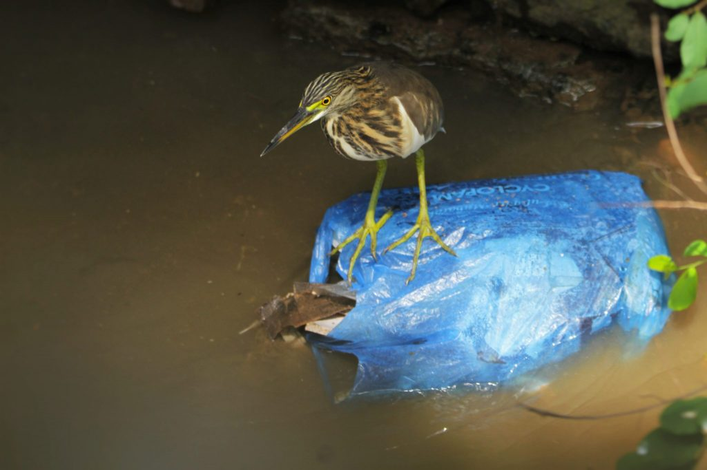
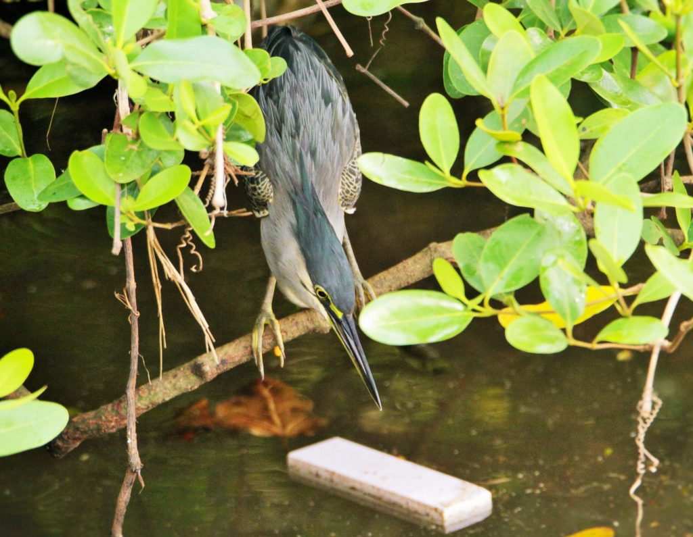
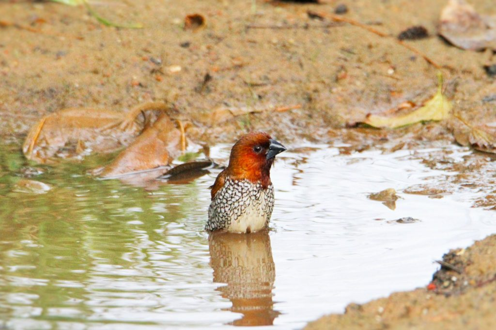
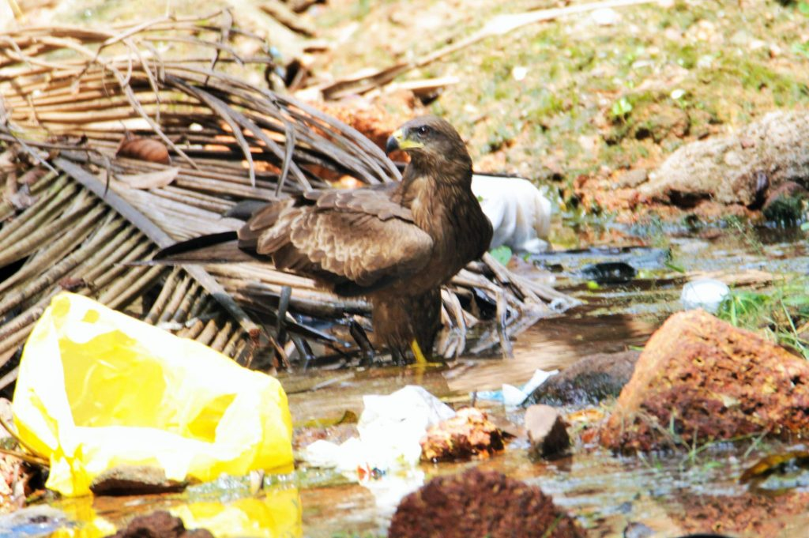
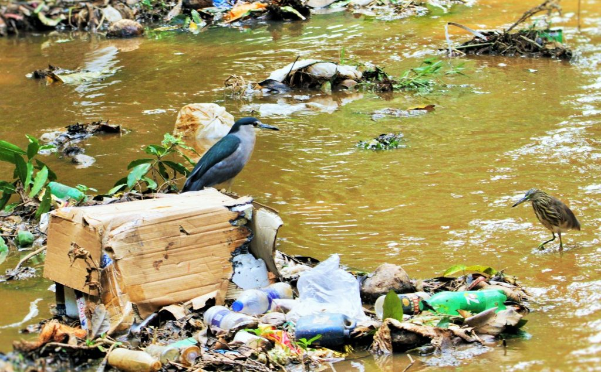

India was the global host of the 2018 World Environment Day which took take place on June 5, 2018. With “Beat Plastic Pollution” as the theme. The focus of this entire exercise was to help the world  come together, to combat single-use plastic pollution. Eventually, these single-use plastic items clog rivers, other water bodies and the ocean. They are consumed by animals, and often find their way into our food systems. It’s a fact that India is one of the most visibly affected Nation’s in the world by plastic litter.

Plastics today are an integral part of our life. Every Citizen on the Planet uses Plastics in one or the other way. In the last decade, we produced more plastic than in the whole last century. It’s in the water we drink and the food we eat. It’s destroying our beaches and oceans. 50 percent of the plastic we use is single-use or disposable. According to The World Economic Forum, India annually generates about 56 lakh tonnes of plastic waste and contributes an astounding 60 per cent to the amount of plastic waste dumped into the world’s oceans every year.

 Unfortunately, Plastics are also making inroads in agriculture leaving behind a trail of toxic residues for the future generations to clean. In some instances, the damage is irreversible making soils sick and in turn jeopardizing our food security. Plastic makes up 10% of all of the waste we generate. It’s a global emergency affecting every aspect of our lives.  India will now help galvanize greater action on plastics pollution. India will now be leading the push to save our oceans and planet.”

### India Plastic Facts

Size of Plastics Industry                Rupees 110,000 Crores.

Number of Companies/Units      Over 30,000

Plastic Consumption                     13 million tonnes per year

Waste Generated                            9 Million Tonnes per year.

Amount Recycled                           60 %

Today, with the indiscriminate use of Plastics, the “COMMERCIAL TRUTH “has come out. The Plastic Lobby is strong and influential in the corridors of power. Banning a few items will not help in any way. The greatest threat of irresponsible use of Plastic is that if it is not disposed in a scientific way, it can significantly harm the environment such that the wider resource base gets depleted or choked.

### Types of plastic debris

There are three major forms of plastic that contribute to plastic pollution: micro plastics as well as mega- and macro-plastics.

### How Plastic Bags Affect Wildlife

The real impact of plastic bag litter is felt on wildlife both on land and in the aquatic environment.

Tens of thousands of birds and other wildlife are killed every year from plastic bag litter, as they often mistake plastic bags for food. When plastic is ingested, it can get lodged in the windpipe, obstructing airflow when swallowed or when birds try to regurgitate it to feed their chicks, eventually causing suffocation. Once in the digestive tract, plastic debris can either block the tract, or accumulate in the stomach, producing a false sense of fullness, causing the animal to stop eating, resulting in malnutrition as it slowly starves to death. As plastic bags can take up to many years to break down, once an animal dies and decays after ingesting plastic, the plastic is then freed back into the environment, to carry on killing other wildlife. At different stages, the plastic undergoes various transformations, releasing carcinogenic chemicals to the external environment. These partially degradable chemicals make their way into soil. Water and air and cause pollution. Some of the released chemicals combine with other chemicals, increasing their toxicity levels which are very harmful to all living beings.

### Action Plan

India needs strong commitment to manage its plastic waste: Experts the country needs a people-driven solution, involving all main players — politicians, policy makers, bureaucrats, corporations, professionals and even the humblest garbage collectors. However the key to the success of reducing Plastic pollution lies with the Public. Unless there is a commitment from people, the solution is never going to be realistic.

Instead of looking at Government or other organizational help, we need to reinvent and discover new ideas to combat plastic pollution within our own households. One way of going about it is to mark wastes as biological and synthetic. Each household should have a colour coded jute bag segregating wastes into two different categories namely Biological and Synthetic waste. Once the segregation takes place at the household level, then the City Corporation will make use of technology to break down wastes into wealth. Biological wastes can be recycled for compost value and the other wastes subdivided into hazardous and non-hazardous and treated accordingly. The technology to break down wastes is expensive and energy consuming too. Recycling plastic is not a viable solution because the same plastic is just being used for a different purpose.

### Disruptive humans

Southeast Asia’s waters are choked with plastic and more than half of the eight million tonnes dumped into the world’s oceans each year comes from just five countries: China, Indonesia, the Philippines, Vietnam and Thailand.

A recent World Wildlife Fund report warned that unbridled human consumption had destroyed much wildlife worldwide, wiping out 60 percent of all fish, birds, amphibians, mammals and reptiles in the last half century.

### Conclusion

It was recently estimated by the World Economic Forum and Ellen MacArthur Foundation that by 2050 there very well may be more plastic in our oceans than fish (by weight).It is, therefore, vitally important for industry and the community to develop methods of limiting the harmful effects of Plastic Pollution and, wherever possible of converting ‘waste’ into productive outputs. There has been an effort to encourage the alternative uses for plastic waste. The use of 10 to 15 % of plastics in road construction is one such use. Recycling, reuse, or alternative use of plastic waste can help reduce the amount of virgin plastic produced. However, this is not enough to address the planet’s plastic pollution problem. That would require a drastic reduction of the use of single use plastic products.

There are many small ways you can have a big impact.

If each and every one of us does at least one green good deed daily towards our Green Social Responsibility, there will be billions of green good deeds daily on the planet.

### References

Anand T Pereira and Geeta N Pereira. 2009. Shade Grown Ecofriendly Indian Coffee. Volume-1.

Bopanna, P.T. 2011.The Romance of Indian Coffee. Prism Books ltd.

[Bits of plastic debris](https://www.bird-rescue.org/our-work/research-and-innovation/how-plastics-affect-birds.aspx)

[Plastic pollution](https://en.wikipedia.org/wiki/Plastic_pollution)

[The Effects of Plastic Waste on Animals](https://web.archive.org/web/20180820213300/http://www.rainbowlight.com:80/ecoguard/docs/The%20Effects%20of%20Plastic%20Waste%20on%20Animals.pdf)

[6 Ways Plastic is Harming](https://www.onegreenplanet.org/environment/how-plastic-is-harming-animals-the-planet-and-us/)

[5 Ways Plastic Pollution Impacts](http://www.onegreenplanet.org/environment/ways-plastic-pollution-impacts-animals-on-land/)