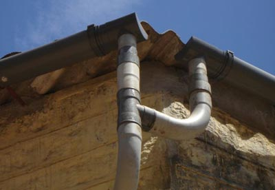
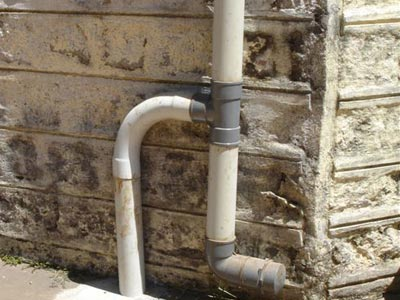
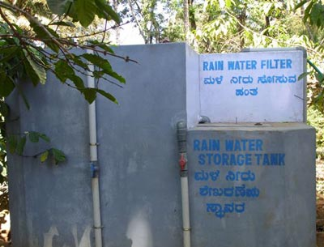
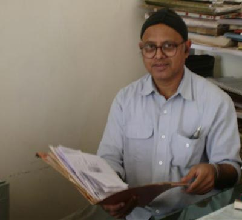

Every one is aware of the scarcity of rain water. The media has been giving enough publicity to encourage rain water harvesting.

  

At Siddapur St.Josephs Church premises have buildings inside a coffee farm with about 2000 square meters of roof span. The rainwater of about 500 sq. meters is harnessed. The water is filtered and stored in tanks, the total capacity of which is about 50000 liters.

Whenever tanks are full, overflowing water is so channelized to recharge the underground water table through percolation soak pits. Even the storm water that flows in the compound is directed towards the soak pits.

While harvesting rainwater and storing. Care must be taken to filter the water. Filter tank is designed to make the rainwater to pass through layers of sand, charcoal and gravel of various sizes. Thus leaves, biogradable matter are filtered. The storage tanks must be properly covered without any room for sunlight to enter, lest algae and bacteria should develop.

Above the water level, in the tank ventilators are essential for aeration but must be well covered with weld mesh, through which not even mosquitoes should enter. These aspects are taken care here. Only then harvested water is safe enough. All the same, we need to boil the water to make it potable. We have got used to the piped running water in our houses. When the taps go dry we curse. At last during monsoon should we not harness the rainwater from our rooftop. Our grand parents have used the rainwater for domestic use. Rainwater harvesting recharges underground water table.

Every drop of rainwater saved and preserved today will be precious wealth tomorrow.

The author wishes to express their profound gratitude to Mr. Allen J Pais, Coffee Planter, *PROVIDENCE ESTATE*, Siddapur, Coorg, Kodagu. For editing the page and Photography.