*Dr.Anand Titus Pereira is a Technical Consultant to Canara Bank. (A Government of India enterprise). The information in this article is not biased toward any single product or manufacturer!*

Readers are requested to refer the article [THE FINE ART OF IRRIGATION IN ROBUSTA ( C. canephora) COFFEE PLANTATIONS](http://ecofriendlycoffee.org/the-fine-art-of-irrigation-in-robusta-coffee-plantations/) and [PHYSIOLOGY OF COFFEE FLOWERING](http://ecofriendlycoffee.org/physiology-of-coffee-flowering/) for a better understanding of the present article.

Shade grown ecofriendly coffee plantations are located in the picturesque evergreen forests of the Western Ghats. These coffee landscapes are known for their beauty all over the world. The natural features of coffee forests include steep mountainsides with altitudes reaching up to 4500 feet main sea level.

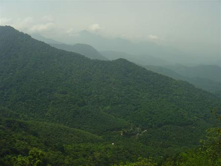

Depending on the agro climatic region, Coffee forests are known to receive from a modest 30 inches of rainfall per annum to a high of 300 inches. However, a well distributed annual rainfall is a prerequisite for growing economically sound Arabica and Robusta coffee’s. Coffee, being an evergreen bush, requires a high regime of soil moisture during the dry months. In India, coffee usually encounters four to five months of dry spell in a year. The Robusta variety of coffee is more susceptible to drought and needs irrigation to sustain itself compared to the Arabic’s.

The rainfall inside the coffee mountain is not evenly distributed throughout the year. Due to global warming, the rainfall is uncertain, erratic and altogether unpredictable. Some parts of the coffee forests may receive rainfall for the year in a few days, without another drop of rain for the year.

Often the drought that follows the rains is so intense that the surface feeders in both Arabica and Robusta are deprived of residual moisture resulting in poor yields. In some coffee regions of chikmagalur the terrain drops down from 4500 feet main sea level to 400 feet, registering a vertical drop. Setting up a sprinkler system to augment the plants unquenchable thirst for water, under such difficult terrain and mountainous region is indeed a great challenge to engineering skills.

The aim of the present article is to place at the disposal of coffee farmers world-wide, a technical description of the use of rain gun sprinklers inside coffee plantations, which will form a bridge from the results of research to the concerns of practice.

We have pioneered a whole new concept of efficient sprinkling for coffee plantations using both impact and non impact sprinkler systems.

Our objectives are as follows.

-   To bring about a new awakening. This should lead to the adoption of new and superior sprinkling technologies and a trend towards modernization.
-   To pump out large quantities of water and sprinkle it uniformly over a large area in a short period of time. After all time is the essence for efficient sprinkling. ( Quantitative and Qualitative change )
-   To design and evolve cost effective strategies that have a direct bearing on farmers livelihood.
-   To make the entire sprinkler operation ecofriendly and labour friendly.

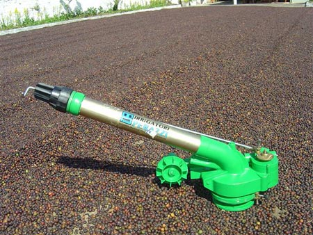

A sprinkler system delivers water to coffee plantations using a net work of main lines, sub mains and lateral lines with emission ducts spaced along their lengths. The aim is to supplement the natural rainfall conducive for inducing blossom.

The concept of sprinkler irrigation is to supply the water at the proper time and in sufficient quantities. The timing and the quantity of water are of prime importance in determining the fruit set. If the sprinkling is carried out too early or too late, it will adversely affect the yield. The same thing will happen, if the water is either too little or too much.

### RAINGUN TECHNOLOGY

Rain guns provide a promising possibility for sprinkling of small and large holdings in a short time, in situations where the supply of labour is scanty or expensive. Large quantities of water are sprayed on an increasing scale with the help of towers spread out inside the plantation.

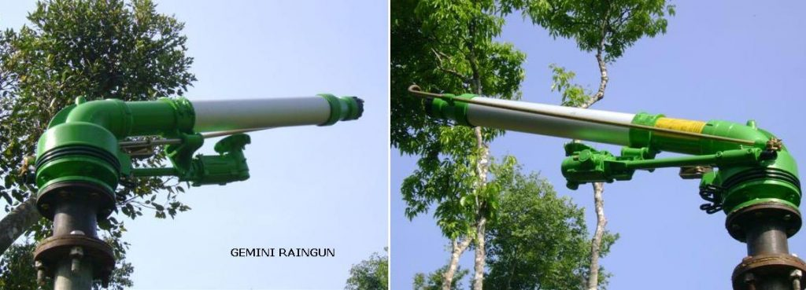

Rain gun sprinklers operate under low, medium and high pressure systems, rotating at uniform speed and can be adjusted to cover part circle or full circle. The entire sprinkler is driven by gearboxes housed inside the telescopic barrel made up of pressure die cast aluminum body. The rain gun is perfectly balanced and has two discharge outlets. Interchangeable nozzles of different sizes can be fixed depending on the dead length and static head. The main nozzles are provided with an adjustable jet breaker, providing a uniform distribution of rain all over the irrigated area. The second opening is much smaller in size and throws water to an approximate distance of 100 feet, covering the nearby coffee plants.

### VARIABLE SPEED RAINGUNS

We have also experimented with rain guns equipped with variable speed. These guns are light weight, fitted with turbines and gearboxes and offer two different rotational speeds. The first speed is extremely fast in nature and is particularly useful for sprinkling coffee on the 5th day of flowering. {This particular stage of coffee flowering is very susceptible to damage due to big droplet size of water}. The high speed of rotation results in a fine mist like spray, which is favorable for coffee flowering.

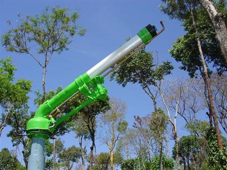

The second speed (slow) is suitable for inducing flowering in coffee.

### RAINGUNS IN JOE’S SUSTAINABLE FARM, KIREHULLY ESTATE

In the year 2002-2003 we were the first to introduce the Italian rain guns, SKIPPER and MARINER into coffee plantations. In the year 2007, we successfully tried out the GEMINI rain gun.

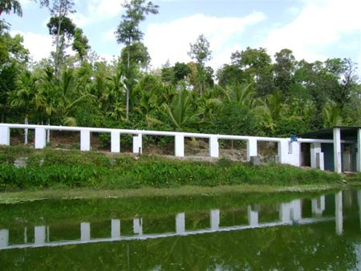

The main line consists of 12 inches diameter galvanized iron pipes, branching out into 8 inches diameter galvanized iron pipes. The end point is connected to a Y shaped connector connected to two separate 6 inches HDPE pipe line and ending with four inch HDPE lateral lines. The pipe system is so designed in the form of a ring main, so as to avoid water hammer. A specially designed 12 inches non return valve controls the upstream and downstream water pressure.

Depending on the elevation and number of pipes required to sprinkle various blocks, we can comfortably operate two mariner jets, throwing water to a distance of 180 feet radius; right up to 220 feet radius. As the deadline and head increases, a single jet operates throwing water to a distance of 180 feet radius. We use a 100 H.P. air-cooled turbo driven engine (diesel) to operate the jets.

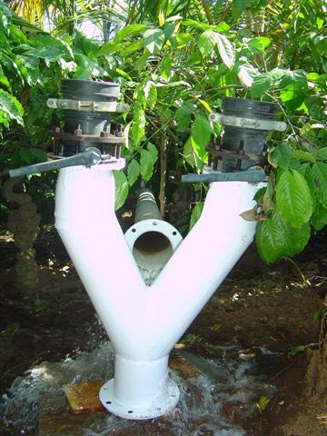

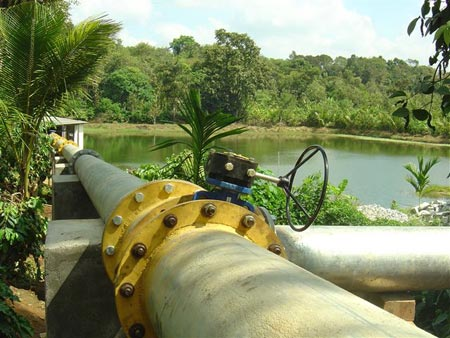

Table-a : Rain gun performance under field conditions.

### SKIPPER

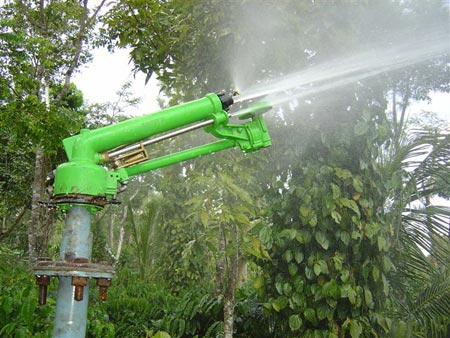

NOZZLE

PRESSURE

PUMP DISCHARGE

JET THROW

IRRIGATED AREA

PRECIPITATION

Diameter in mm.

kg/cm\[2\]

Liters per minute

Radius in feet

Square Feet

mm / hr

20

2

3000

110

37994

7.0

3

3000

125

49062

8.0

4

3000

130

53066

7.5

5

3000

135

57226

7.0

### MARINER

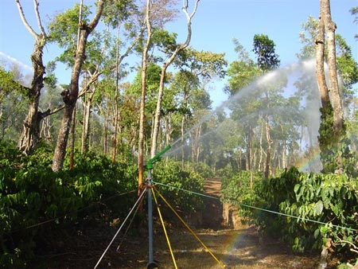

NOZZLE

PRESSURE

PUMP DISCHARGE

JET THROW

IRRIGATED AREA

PRECIPITATION

Diameter in mm.

kg/cm\[2\]

Liters per minute

Radius in feet

Square Feet

mm / hr

28

3

3000

150

70650

8.00

4

3000

165

85486

7.25

5

3000

170

90746

7.00

6

3000

180

101736

7.00

34

5

3000

200

125600

9.00

6

3000

220

151976

8.00

### GEMINI

NOZZLE

PRESSURE

PUMP DISCHARGE

JET THROW

IRRIGATED AREA

PRECIPITATION

Diameter in mm.

kg/cm\[2\]

Liters per minute

Radius in feet

Square Feet

mm / hr

34

5

3000

210

138474

9.5

6

3000

225

158962

9.0

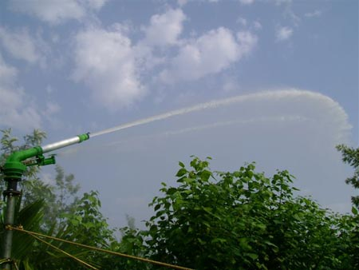

The GEMINI rain gun is also versatile and can throw water to a radius of 225 feet. We have irrigated the entire estate with the help of the MARINER and GEMINI RAINGUN. Our observations also point out to the fact that these rain guns can be comfortably placed on the pathways leading to various blocks and need not be placed inside the blocks. The advantage is that the throw of water reaches the other block, there by eliminating the need of carrying these heavy sprinklers inside the coffee estate. This also reduces the physical damage to the sensitive coffee bush.

### NEW CLEARINGS / YOUNG PLANTATIONS

Newly opened plantations need to be frequently irrigated during dry months. It is crucial that the amount of sprinkler irrigation should not create water logging conditions in the field because the young seedlings are highly susceptible to excess moisture. As such the duration of sprinkling should be regulated and the intervals between irrigation schedules maintained such that the young plants and introduced tree saplings are provided with the right amount of moisture to carry on their physiological activities. Young plants are also prone to leaf damage if the water droplet size is big. Soil erosion is also of great concern.

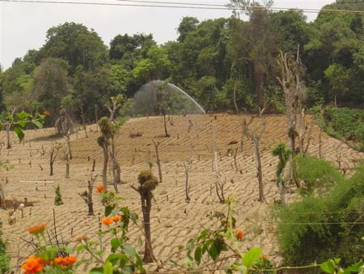

Rain gun sprinklers are ideal for new clearings because it simulates soft rain and different nozzle sizes give the desired amount of precipitation.

### SAVINGS ON COST OF LABOUR

In the course of technical progress, every possible saving on labour by the use of efficient sprinkler systems has become an obvious necessity on account of the ever increasing cost of labour. Also due to the fact that men labourers are difficult to find during the sprinkler season, it is more appropriate to find ways and means of alternate technology that reduces the requirement of labour. In the conventional system, nine impact sprinklers spaced at 80 feet by 80 feet are needed to sprinkle one acre of coffee. However, a single rain gun can cover almost 2 acres, there by eliminating the laying of hundreds of lateral lines and jets.

### RAISER PIPE HEIGHT

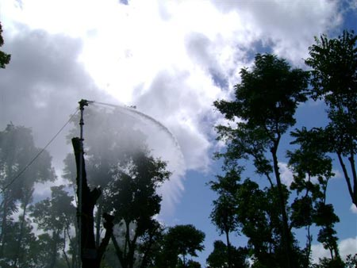

We have experimented with varied diameter galvanized raiser pipes starting from 2 inches right up to 8 inches. The length of the raiser pipes tested; varied from 3 feet right up to 35 feet. We have also standardized the diameter and height of the raiser pipes depending on the terrain and height of the bush.

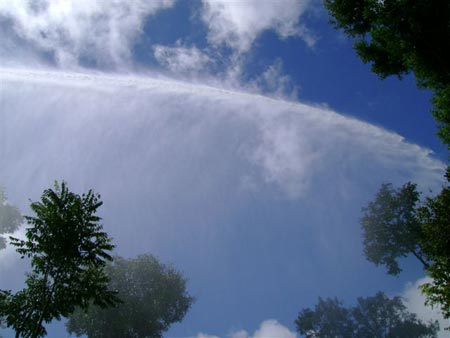

The key factor when using rain guns in shade grown ecofriendly coffee plantations is that the area around the gun measuring 25 feet radius should be free from any obstructions like trees or shrubs. The raiser pipe should be at least 15 feet long in blocks with tree population of more than 100 trees per acre, for uniform distribution of water.

### SIMPLE PRECAUTIONS WITH RAINGUNS

-   Avoid adjustments when the gun is in operation.
-   Speed on gearbox should be changed only when the sprinkler is stopped.
-   Special care has to be taken in blocks where electric lines are running. Never Place the jet under the electric lines.
-   Shade lobbying of trees to a height of 30 to 35 feet.
-   Increasing the raiser pipe height in blocks having large tree population.
-   The surrounding area around the rain gun (25 feet) should be free from all obstructions.

### ADVANTAGES OF RAINGUNS

The Advantages are many.

1.  Highly energy efficient, Long lasting and trouble free
2.  Since the jet sprinkles over a large area, it avoids the setting up a large number of smaller jets.
3.  Reduces labour cost, because the pipeline within the estate is minimized so also the number of jets.
4.  The precipitation varies with the nozzle size, but unlike conventional jets, overlapping is not necessary.
5.  This reduces the time required for irrigation as well as the savings on diesel.
6.  Time is the essence in Robusta sprinkling and in the eventuality of an insufficient natural rain, more are can be covered with the help of these jets.
7.  The jets are rugged and only require periodic greasing. Ease of installation, assembly and maintenance
8.  The trajectory of the throw of water is such that the damage to pepper vines is negligible.
9.  Part circle adjustments, saves water from going into neighboring plantations.
10.  Fine droplet adjustment, like mist is helpful in creating a microclimate, desirous for Robusta flowering.
11.  The jet is made up of Aluminum die-casting and as such, it is finely balanced.
12.  A gear inside the jet ensures the smooth operation of the gun.
13.  The pressure with which the jet operates is low because of the gearbox mechanisms.
14.  Ideally suited for sprinkling newly cleared areas.
15.  The backup of good after sales and service.
16.  Rain gun irrigation results in improved efficiency compared to conventional sprinklers and provides for surplus irrigation water for subsequent backing showers.

### DISADVANTAGES

1.  large numbers of trees make it difficult to sprinkle uniformly.
2.  The rain gun and the raiser pipes are very heavy.
3.  High day time temperatures result in evaporation loss.
4.  Not suitable in areas with high velocity Winds.
5.  Prohibitive cost of rain guns.
6.  Repairs by qualified personnel

### DUTY OF IMPORTED SPRINKLERS and ACCESSORIES

At this point of time, it is important to note that technology with respect to sprinkler irrigation has made great strides in the Developed world but the most important foreseeable problem concerning the growth of sprinkler irrigation in India; is the high levels of import duty put forth by the Government of India. In spite of being fully aware that more than 80% of the Country’s crop is exported, the Ministry of Commerce has done precious little to bring down the import duty. As such, the imported technology becomes prohibitively expensive, often, beyond the reach of the small and marginal coffee farmer.

The Government should alleviate the problem of the coffee farmers by significantly reducing the customs duty so that technology becomes more affordable in the hands of the farmer.

### FUTURE STRATEGIES: VISION 2020

We have made an attempt to look into the distant future and devise a sprinkler system that will be both practical and economical. Our imagination has run wild and we have dared to dream big! We plant to install permanent towers in steep terrain and set up mobile towers in blocks having gentle gradients. Then, with the help of a pneumatic controlled high pressure system we intend to sprinkle 100 acres in 48 hours.

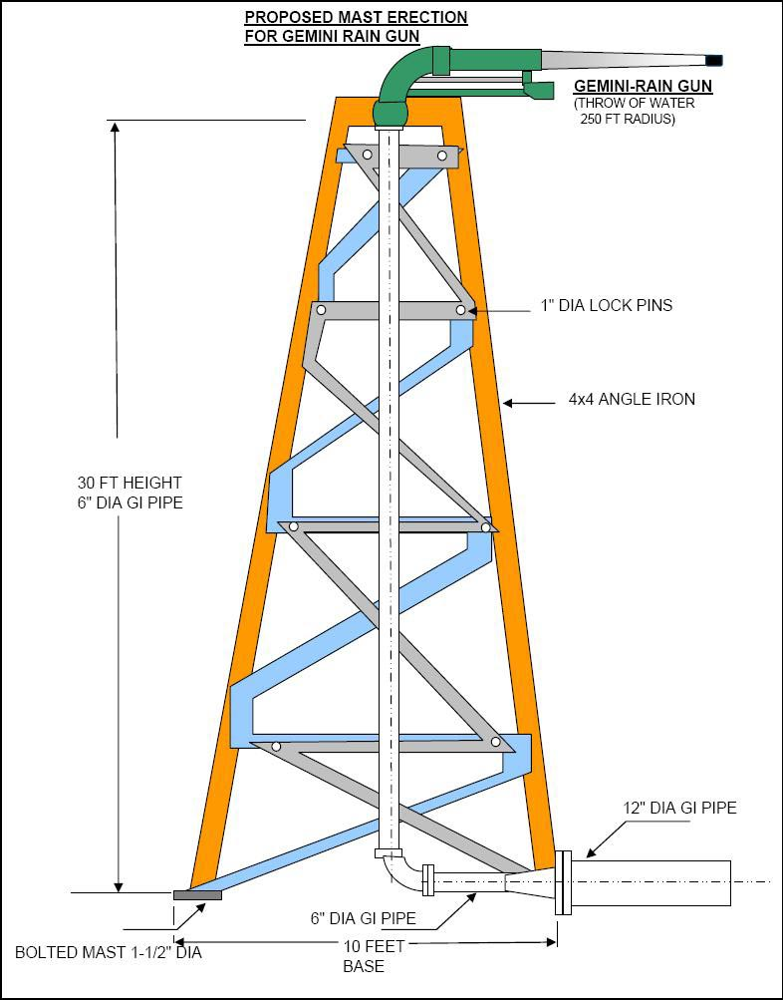

-   Erection of PERMANENT TOWERES

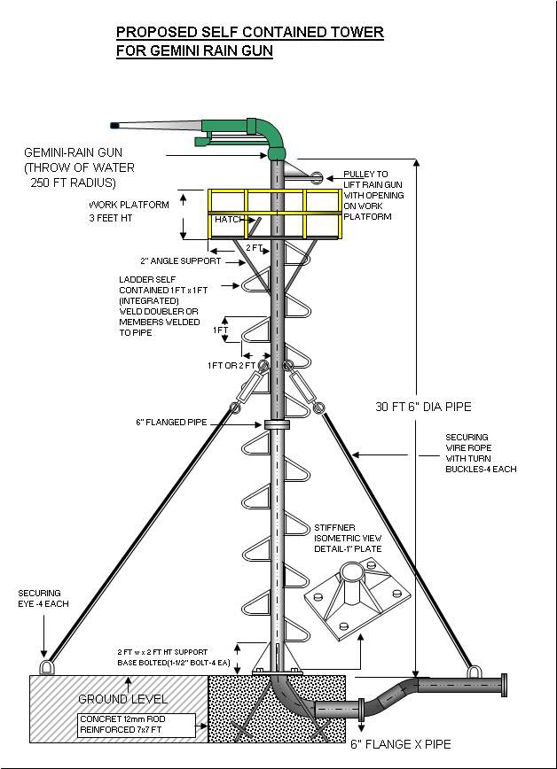

-   Setting up of MOBILE TOWERS

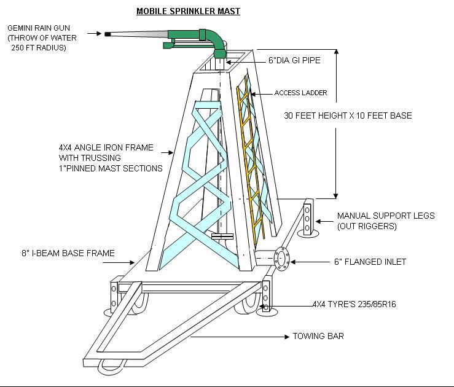

-   Introduction of BASE BOOSTER PUMPS
-   We are in touch with few sprinkler companies asking them to design jets which can cover an area of 10 acres at a time.

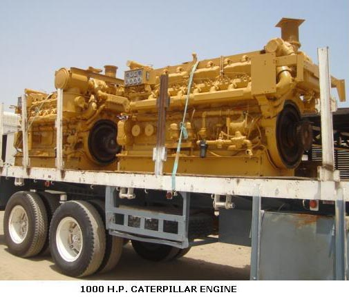

### CONCLUSION

Over the years the Indian coffee farmer has made large investments in the sprinkling set up (TANKS+TUBEWELLS+ENGINES+PIPES+SPRINKLERS) but the returns on investment in terms of yield are disappointing; largely due to a short sighted vision. Many sprinkler systems designed, fail to consider the need to irrigate the coffee farm in a specified time period. After all; time is the essence in irrigating the entire farm. In most cases the main line supplying water to the lateral lines are undersized creating tremendous friction losses at the first step itself, resulting in the overloading of the engine and pump. Also in times of emergency, when there are unseasonal rains, irrigation cannot be completed within a reasonable time window.

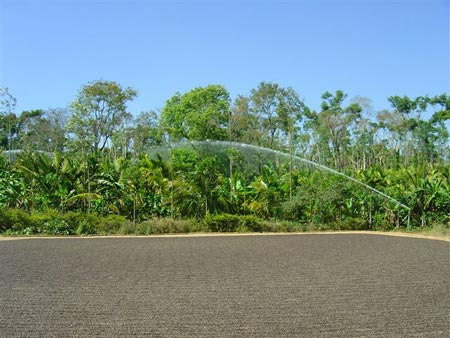

Our experience tells us that poorly designed sprinkler systems that have already been installed is labour intensive and increases the cost of production. Planning for years ahead is a better option, than spending our most productive time in correcting the past mistakes. We firmly believe that up gradation of quality, will reduce running costs. Ultimately, this up gradation will saves thousands of rupees. After all, money saved is money earned.

### REFERENCES

[ecofriendlycoffee.org/the-fine-art-of-irrigation-in-robusta-coffee-plantations/](http://ecofriendlycoffee.org/the-fine-art-of-irrigation-in-robusta-coffee-plantations/)

[ecofriendlycoffee.org/physiology-of-coffee-flowering/](http://ecofriendlycoffee.org/physiology-of-coffee-flowering/)

[ATS Irrigation](http://www.atsirrigation.com/)

[2000 Series Rain Guns](http://web.archive.org/web/20060311064943/http://www.rainbird.com/ag/products/rainguns/chart_2000series.htm)

[www.javelinirrigation.co.uk](http://www.javelinirrigation.co.uk/)

Awatramani, N. A. 1973. Sprinkler irrigation for coffee. 1. Studies on rainfall pattern and soil moisture. Journal. Coffee Research. 3 (1): 3-13.

Awatramani, N. A., Mathews Cherian and Mathew, P.K. 1973. Sprinkler irrigation for coffee. 11. Studies on Robusta Coffee. Indian Coffee. 37 (1): 16-20.

Coffee Guide. 2000. Central Coffee Research Institute, Coffee Research Station. Chikmagalur District. Karnataka. India.

Raghuramulu. Y. 2001. Irrigation Management in Coffee. Head. Division of Agronomy, Central Coffee Research Institute, Coffee Research Station. Chikmagalur District.

### ACKNOWLEDGEMENT

We wish to give special recognition to Mr. Allen J Pais, Coffee Planter, “PROVIDENCE ESTATE”, Siddapur, Coorg, Kodagu for designing the slides pertaining to the fixed and mobile towers, with skill and sensitivity. Allen has always given us unfailing support and counsel every step of the way. We deeply appreciate his patience, talent and clarity of thought.