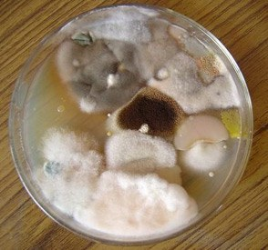
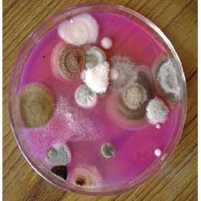

Coffee soils in India are undergoing a sea change in terms of fertilizer application. Many indigenous fertilizer companies are promoting new-age synthetic fertilizers and a few foreign fertilizer manufacturing units in collaboration with their Indian Counter parts are setting up state of the art manufacturing units in India to promote chemical farming. Eco-friendly shade coffee Plantations have adopted quickly to these new technologies in terms of foliar sprays, drip fertigation and neem and sulphur coated fertilizers. The far-reaching consequences of these fertilizer applications is not fully understood. At this point, we would like to enlighten the Coffee Planters in India and abroad that our work on the isolation of rhizosphere microorganisms throws light on many important aspects that has a positive impact on the entire coffee ecology.

### So what is Rhizosphere all about?

Rhizosphere denotes that region of the soil which is subject to the influence of plant roots. The rhizosphere is characterized by greater microbiological activity than the soil away from plant roots.

### Importance of Coffee Rhizosphere

The characteristic feature of Indian Coffee Plantations is that we adopt the agroforestry model. Multiple crops are associated with coffee along with native and introduced trees. As such, the coffee roots constantly interact with the roots of various tree species, legumes, spices and other crops like citrus, avocado, and other fruit trees.

Hence the coffee rhizosphere is greatly influenced by its surrounding environment, which in turn is influenced, depending on the distance to which exudations from the root system migrate to the surrounding area. Some of the microbes that inhabit this area are bacteria that are able to colonize very efficiently the roots or the **rhizosphere** soil of crop plants. These bacteria are referred to as plant growth-promoting rhizobacteria (PGPR). They fulfill **important** functions for plant growth and health by various manners.

The rhizosphere effect indicates the overall influence of plant roots on soil microbes. Scientific data clearly reveals that a greater number of bacteria, fungi, and actinomycetes are present in the rhizosphere soil than in nonrhizosphere soil. It has also been demonstrated that the rate of metabolic activity of the rhizosphere microorganisms is different from the nonrhizosphere soil.

### Factors affecting rhizosphere microorganisms.

Soil type, Soil moisture, Hydrogen ion concentration, Temperature, variety of crop plants, Age and health of crop plants and trees. Apart from the numerical preponderance of microorganisms in the rhizosphere, the rhizosphere effect is also manifest in the occurrence and distribution of bacteria characterized by specific requirements of amino acids, B Vitamins and specialized growth factors.

**The rhizosphere region can be divided into two zones:**

1.  The inner rhizosphere which is in a close vicinity of root surface, and
2.  The outer rhizosphere embracing the immediate adjacent soil

In 1949, F.E. Clark has suggested to use the term “rhizoplane” for root surface itself in studying the rhizosphere phenomenon. Balandreau and Knowles (1978) have termed the epidermis/cortex region, the endorhizosphere and the zone in the immediate vicinity to the epidermis, the exorhizosphere to denote the intimacy of microbial associations.

Between the rhizosphere and soil there is an area of transition in which the root influence diminishes with distance. Therefore, it is generally accepted that the term rhizosphere soil refers to the thin layer adhering to root after the loose soil and clumps have been removed by shaking. The soil coating varies in thickness according to root types, presence of moisture and condition of the soil. This certainly influences the ‘rhizosphere effect’.

### What do roots do in the rhizosphere?

The **roots** exude water and compounds broadly known as exudates. … The exudates act as messengers that stimulate biological and physical interactions between **roots and** soil organisms. They modify the biochemical and physical properties of the **rhizosphere** and contribute to root growth and plant survival.

### What happens in the rhizosphere?

The **rhizosphere** contains many bacteria and other microorganisms that feed on sloughed-off plant cells, termed rhizodeposition, and the proteins and sugars released by roots. This symbiosis leads to more complex interactions, influencing plant growth and competition for resources.

### Beneficial effect of the rhizosphere microbial community for plant growth

Microbial seed inoculants such as Azotobacter, Beijerinckia, Rhizobium and Phosphate solubilizing microorganisms play a significant role in the establishment of beneficial microorganisms in the rhizosphere in the immediate vicinity of growing roots. Many of the microbes have a positive role in enhancing seed germination and in the better establishment of young seedlings in the field. The Rhizosphere microorganisms also play a significant influence in minimizing the damage to crops infected by pathogens. Most of the plant growth-promoting rhizobacteria (PGPR) inhibit the del­eterious plant pathogens.

### Isolation of Rhizosphere Microorganisms

Greater rhizosphere effect is seen with bacteria, than with actinomycetes or fungi. Only negligible changes are noted with regard to protozoa and algae. Several genera of bacteria Pseudomonas, Arthrobacter, Agrobacterium, Azotobacter, Mycobacterium, Flavobacterium, Cellulomonas, Micrococus and others have been reported to be either abundant or sparse in the rhizosphere. We have noticed that traditional varieties of coffee like the old robusta and other indigenous crops accommodate an abundance of nitrogen-fixing and phosphate solubilizing bacteria in the rhizosphere in comparison to high yielding varieties. Scientific data from other researchers suggest the preponderance of amino acid requiring bacteria in the rhizosphere of crop plants. The preferential stimulation of vitamin requiring bacteria in the rhizosphere has also been emphasized by some research workers.

The dominant fungi of rhizosphere were Aspergillus flavus, A. fumigatus, A. luchuensis, A. niger, A. terreus, Cladosporium cladosporioides, Curvularia lunata and Fusarium oxysporum. In addition, mycorrhizal fungi are also known to be present in rhizosphere soil and rhizoplane of roots.

### Manipulation of Rhizosphere Microflora

Enhancing the rhizosphere microflora may be done by introducing soil amendments, foliar application of nutrients and artificial inoculation of seed or soil with a preparation containing live microorganisms, especially bacteria. A process commonly referred to as bacterization.

### Conclusion

The Coffee Rhizosphere is teeming with beneficial microbes which has not been scientifically looked into. Understanding this sensitive region will enable us to reduce the application of synthetic fertilizers and reduce nitrate pollution. It will also enable the planting community to keep their soils vibrant and healthy. More importantly, several pathogenic microorganisms have to pass through the rhizosphere and infect the root system. These pathogenic microbes can be controlled by either seed inoculation or by manipulating the rhizosphere in a way that is beneficial to only beneficial microbes.

### References

Anand T Pereira and Geeta N Pereira. 2009. Shade Grown Ecofriendly Indian Coffee. Volume-1.

Anand Titus Pereira & Gowda. T.K.S. 1991. Occurrence and distribution of hydrogen dependent chemolithotrophic nitrogen-fixing bacteria in the endorhizosphere of wetland rice varieties grown under different Agro climatic Regions of Karnataka. (Eds. Dutta. S. K. and Charles Sloger. U.S.A.) In Biological Nitrogen Fixation Associated with Rice production. Oxford and I.B.H. Publishing. Co. Pvt. Ltd. India.

Subba Rao. N. S. 1998. Soil Microorganisms And Plant Growth. Oxford and IBH Publishing Co.

Bopanna, P.T. 2011.The Romance of Indian Coffee. Prism Books ltd.

[rhizosphere effect](https://www.merriam-webster.com/dictionary/rhizosphere%20effect)

[Beneficial effect of the rhizosphere](https://popups.uliege.be/1780-4507/index.php?id=7578)

[Rhizosphere](https://en.wikipedia.org/wiki/Rhizosphere)

[Rhizosphere: Origin and Effects](http://www.biologydiscussion.com/soil-microbiology/rhizosphere-origin-and-effects-microbiology/66666)aswath