Shade grown Ecofriendly coffee forests are ideal habitats for various bat species because of two main reasons.

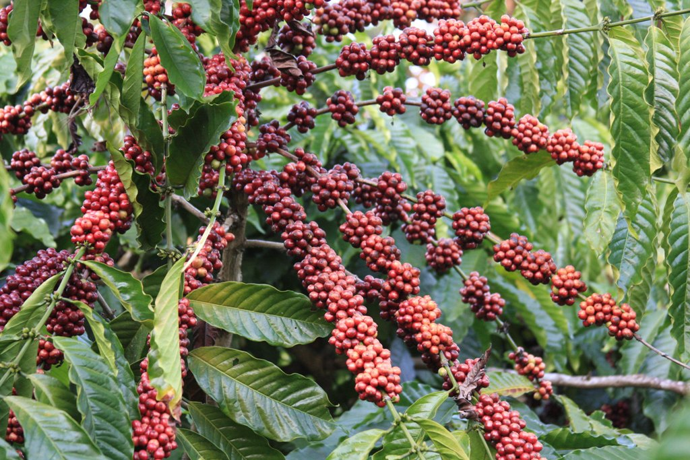

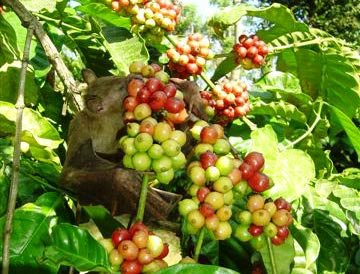

First, the forests provide sanctuary for various types of birds and mammals in the tall evergreen canopy.

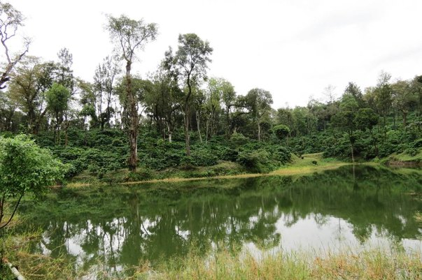

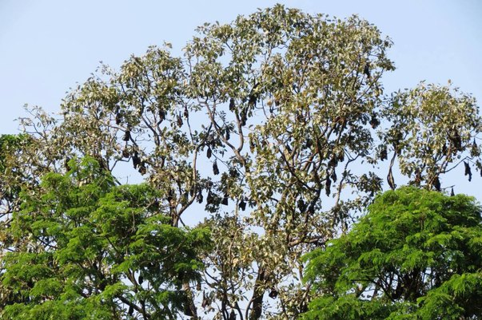

Second, due to the multi cropping inside shade grown Ecofriendly coffee plantations, bats find food throughout the year.

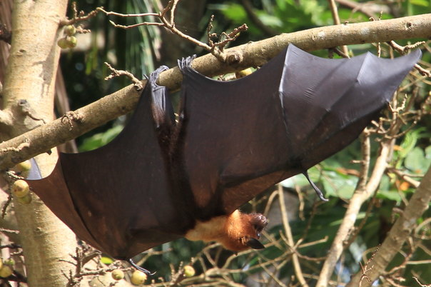

Over the years we have observed many different bat species of bats,like the Indian false vampire bat – Megaderma lyra, the Indian Short nosed fruit bat – Cynopterus sphinx, the Egyptian mouse tailed bat – Tadarida aeygptica, the Indian flying fox – Pteropus giganteus giganteus and the Ceylon bat –  Pipistrellus ceylonicus.

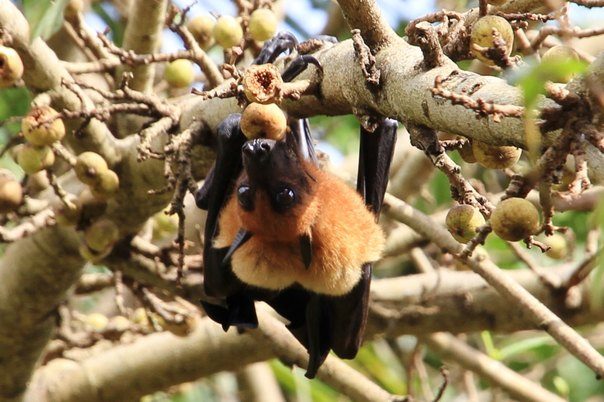

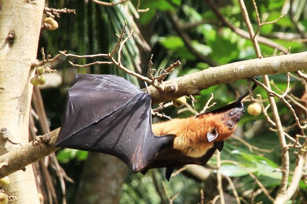

The Fruit bat comes under the category of the Mega bat and is often referred to as the Flying fox.

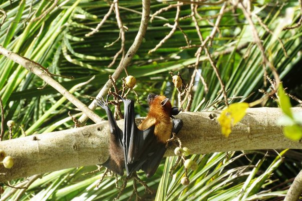

### Description

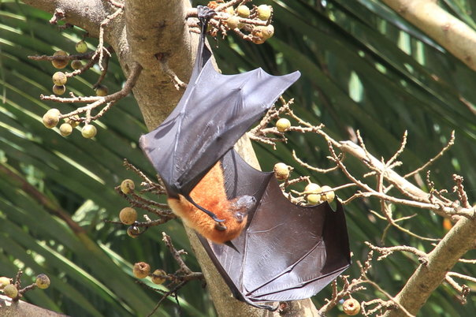

The Fruit Bat is often referred to as the flying fox or mega bat.  There are many differences in their size, depending on the location.

The size can vary from 2 inches to more than 16 inches. Some weigh an ounce and others weigh a couple of pounds.

Some bats have wing span of more than five feet. All fruit bats have excellent eyesight and a keen sense of smell.

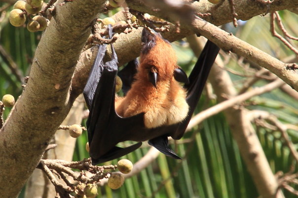

The bats are also gifted with small sharp teeth which help them to eat fruits with thick coats. They also have a long tongue that unrolls during feeding.

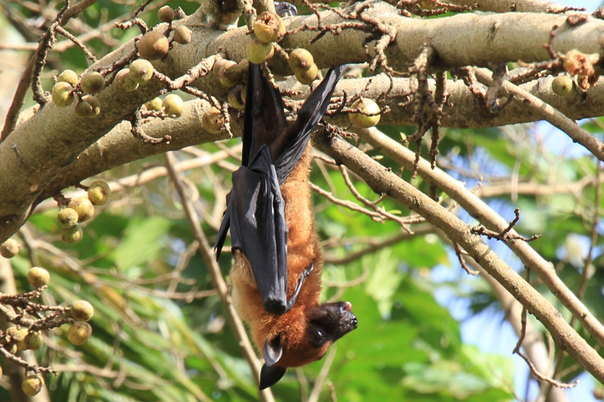

### Scientific Classification

**Kingdom**

Animalia

**Phylum**

Chordata

**Class**

Mammalia

**Order**

Chiroptera

**Family**

Pteropodidae

**Suborder**

Megachiroptera

**Subfamilies**

Nyctimeninae

Cynopterinae

Pteropodinae

### Role of Bats in Coffee Plantation Ecology

Many Planters are of the opinion that bats are harmful to the ecology of coffee plantations. They are of the view point that, bats harbor a variety of disease causing vectors and are responsible for the outbreak of a range of diseases in both plant and animals.

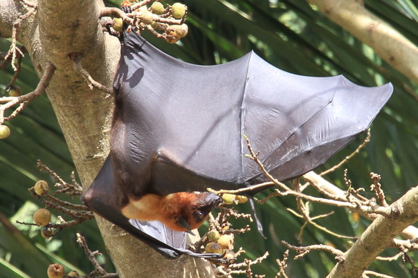

We are of the firm opinion that bats play a crucial positive role in maintaining a vibrant ecosystem, especially helping in the pollination process of fruit trees.

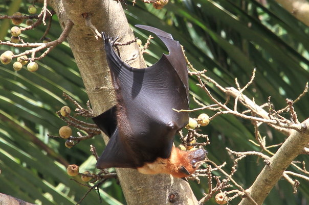

The pollination of plants by bats is called chiropterophily.

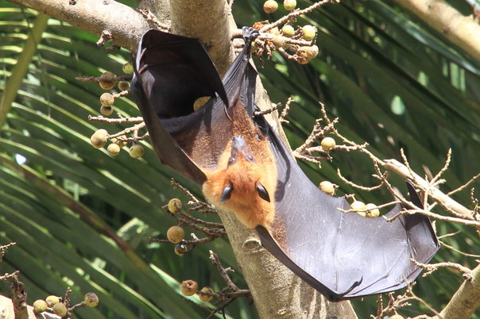

They also act as agents for seed dispersal. Another important contribution of bats is that their droppings are rich in nutrients, which in turn can be used as fertilizer.

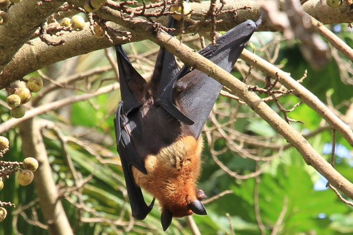

Other species of bats eat insects which in turn will help in pest control. In all Bats, act as indicators of biodiversity. In simple words keystone species help in maximizing biodiversity.

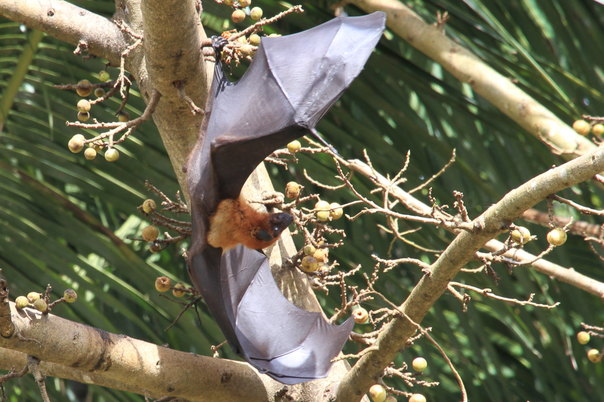

Bats are often considered as “Keystone Species”. The significance of any keystone species is such that it has a disproportionately large effect on the communities in which it occurs.

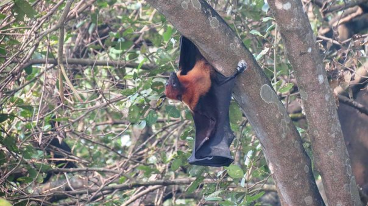

Such species help to maintain coffee biodiversity either by controlling populations of other species that would otherwise dictate the community or by providing critical resources for a wide range of species.

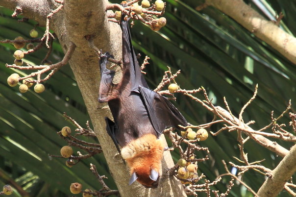

In simple words Keystone species support the ecological integrity of coffee biodiversity.

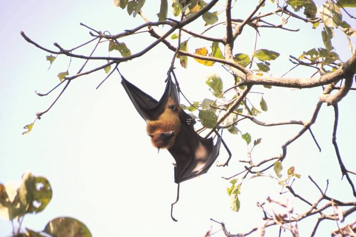

A species whose loss from an ecosystem would cause a significant change in other species populations or ecosystem processes.

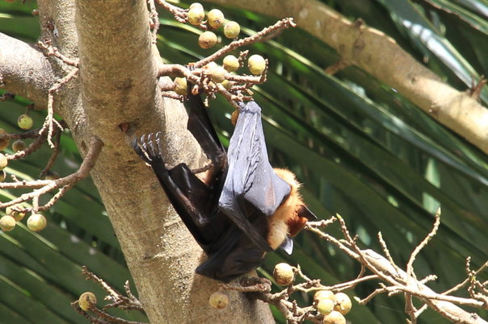

Scientific literature (Batworld.org) points out that Fruit and Nectar Bats play a key role in more than 450 commercial products available to humans, and over 80 different medicines through seed dispersal and pollination.

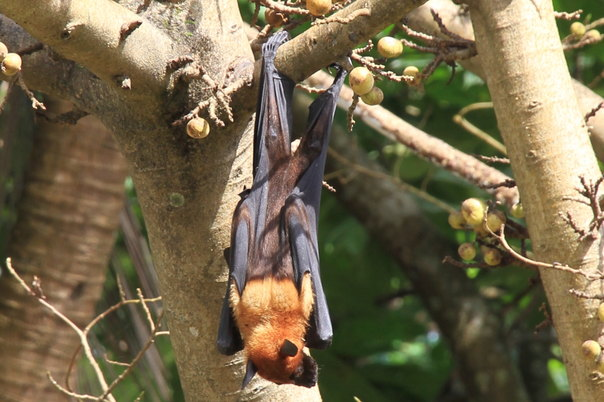

Up to 98 % of all rain forests re growth comes from seeds that have been spread by fruit bats.

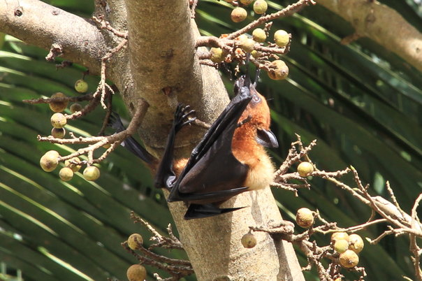

### Behaviour

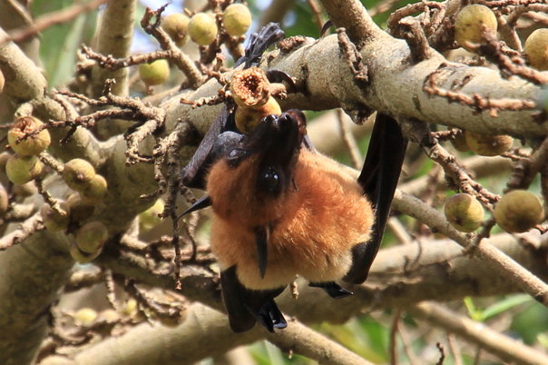

These bats find their strength in numbers. Hundreds of bats colonize a single tree.

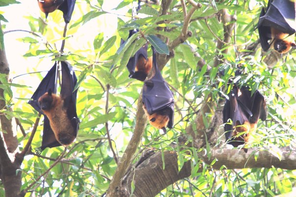

Research findings state that fruit bats live in huge colonies known as camps.

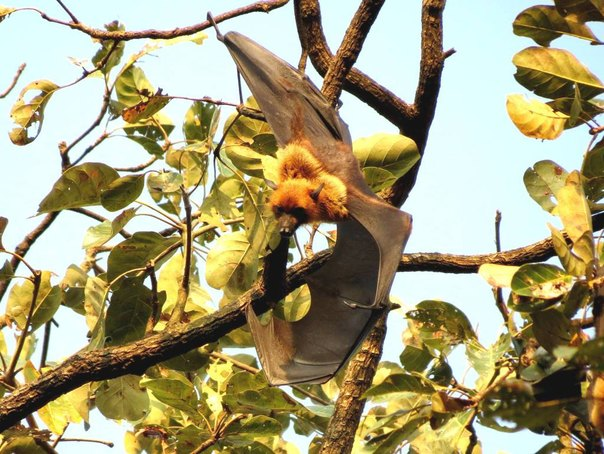

Each colony has sub colonies with one male and approximately eight females. They form close bonds with their sub groups.

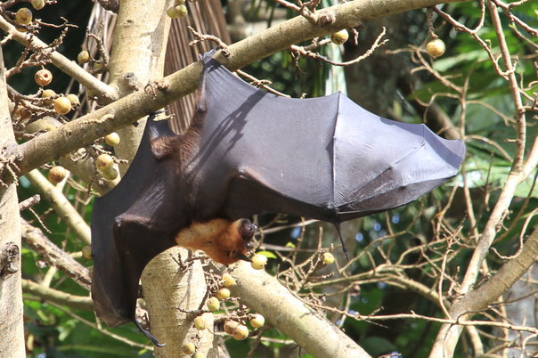

Their long wings help conserve body heat.

### Habitat and Distribution

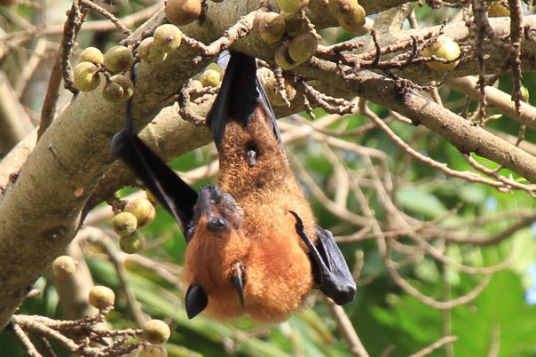

We have observed fruit bats roosting in tall trees and are of the opinion that they are territorial in nature. From one roosting tree to another there is considerable distance of a few kilometers in order to avoid food competition.

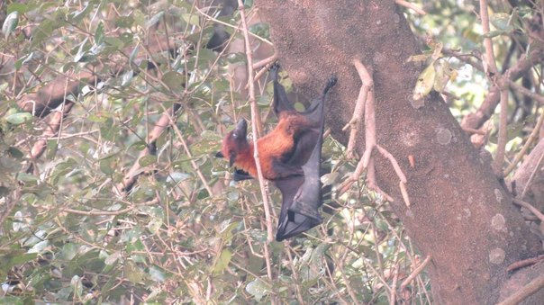

### Diet

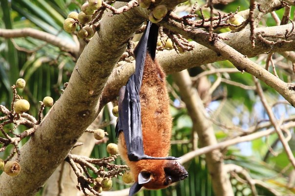

Since coffee plantations are blessed with an abundance of tropical fruit trees, the bats find a variety of fruits to eat all year through, depending on the season.

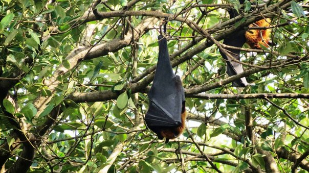

The presence of a wide variety of fruiting and flowering trees inter cropped with different spices, provide food and nectar all the year round.

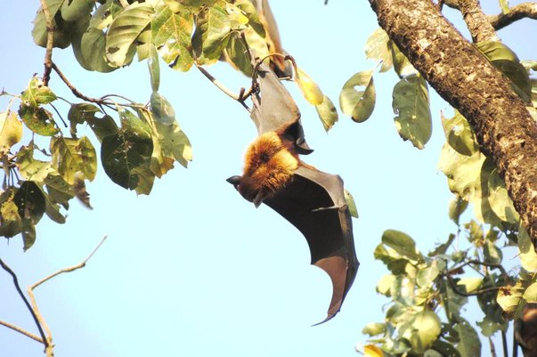

(Mango, Guava, Mulberry, Cherry, Figs, Banana, Pineapple, Tamarind, Cocoa,Sapota, pepper, vanilla, Arecanut, Cardamom, Jamun, Rose apple, Almond, Jack Fruit, Banana, Butter Fruit, Custard Apple)

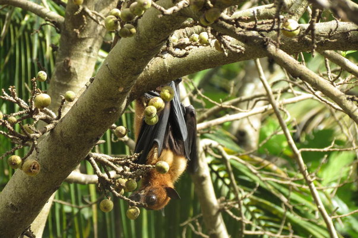

### Reproduction

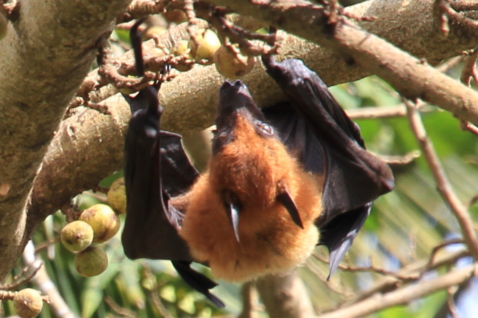

The females give birth to only one young at a time. The young ones are fully dependent on the mother for up to six weeks before they can fly on their own.

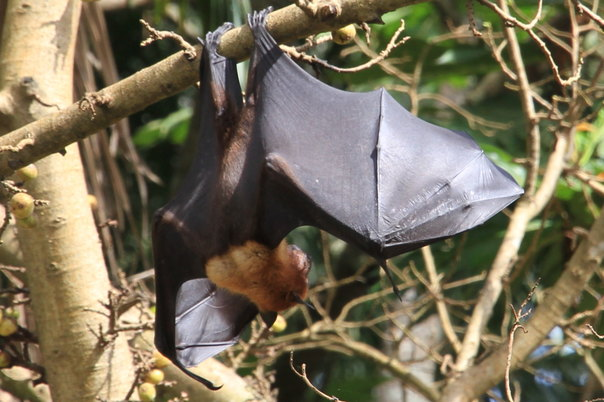

Literature states that the fruit bat won’t take part in mating when they are struggling for food or habitat.

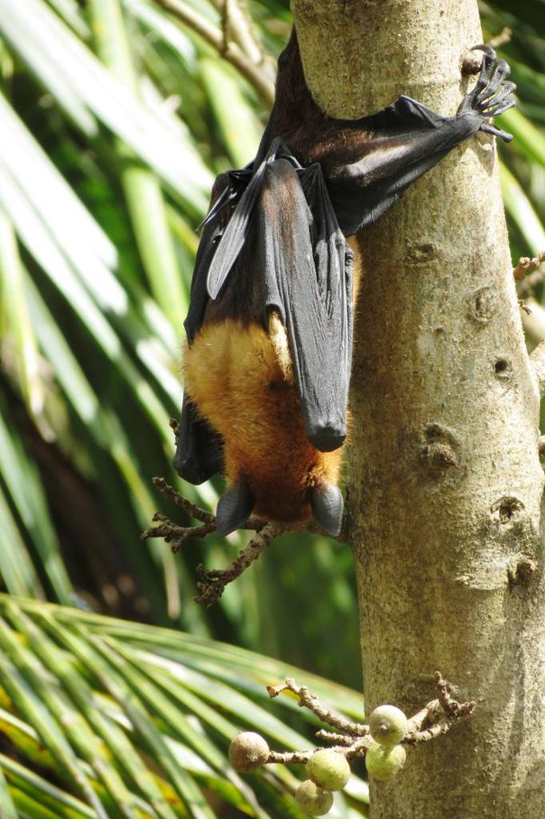

Evolutionary instincts that allow them to ensure overpopulation don’t occur in any given area where they live.

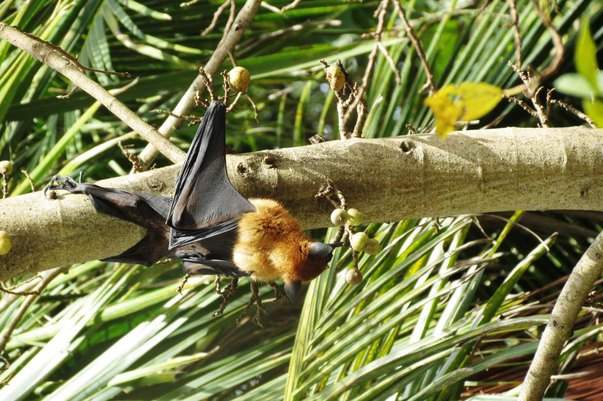

### Predators

Birds of prey and reptiles.

### Life span

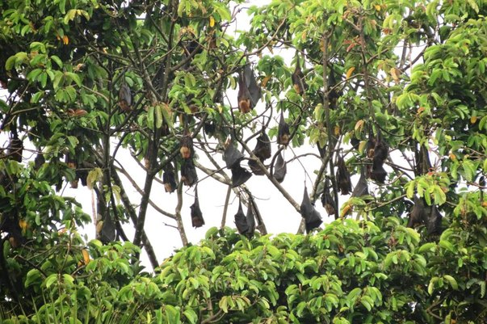

Approximately 20 years.

### Conclusion

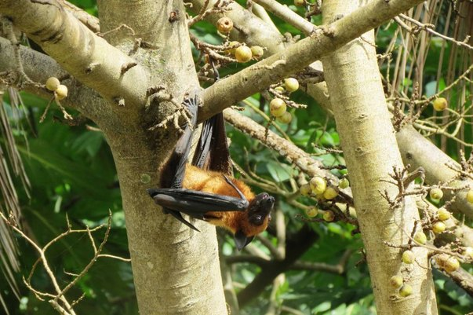

It is important to understand that there are more than 1200 species of bats in the world. This includes approximately 166 species of fruit bats. 75 % of bats consume insects, beetles and other small animals for food.

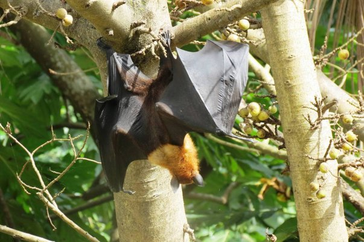

The remaining 25% depend on one or the other fruit for their survival. A negligible per cent feed on blood. They play an active role in maintaining a healthy vibrant ecosystem. Study of bat populations will be a helpful tool in understanding various aspects of coffee plantation biodiversity.

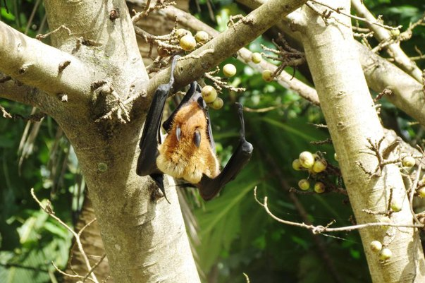

We have not studied the bat populations but are concerned that due to deforestation and fragmentation of habitat, roosting places available for these bats are plummeting by the day.

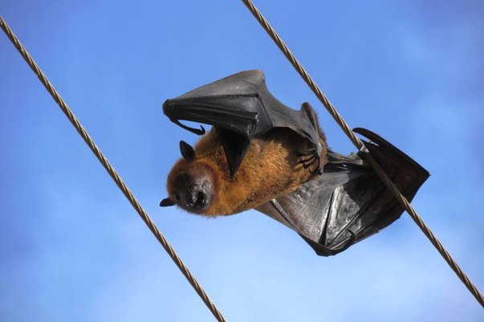

Another area of concern is the erection of micro Hydel towers and electric lines which poses a grave threat to bats flying from one place to the other in search of food.

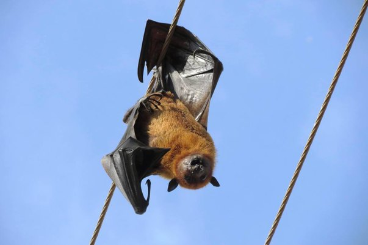

According to Bat Conservation International, Asia is a vast region, boasting an amazing diversity of bat species and habitat. The region is home to at least 448 of the world’s 1,300+ species of bats.

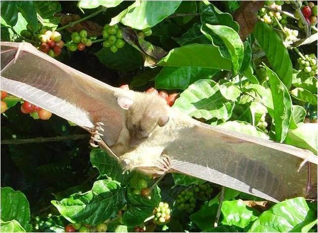

These range from the world’s smallest bat, called the bumblebee bat (*Craseonycteris thonglongyai*), to the largest bat on the planet (by weight), the golden-crowned flying fox (*Acerodon jubatus*).

**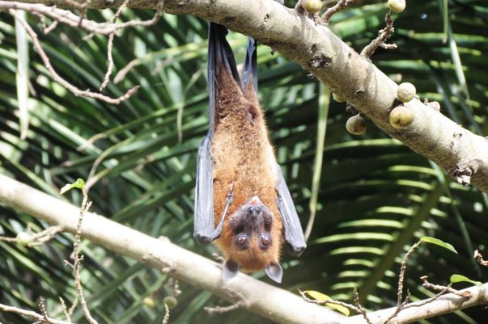**

Within Asia, Indonesia has a current tally of 219 distinct bat species, making it the country with the greatest number of species in the world. Unfortunately, 25 of Asia’s bat species are currently listed by the International Union for the Conservation of Nature as either Endangered or Critically Endangered, and another 36 are considered Vulnerable.

**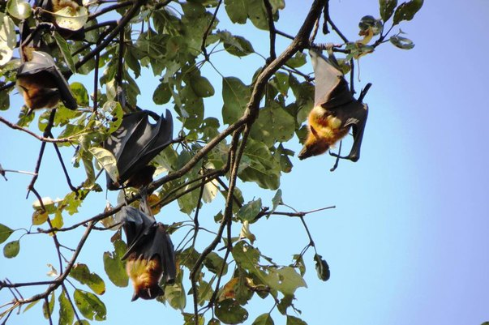**

Scientific literature states that lack of knowledge is recognized as one major threat to the conservation of bats.

**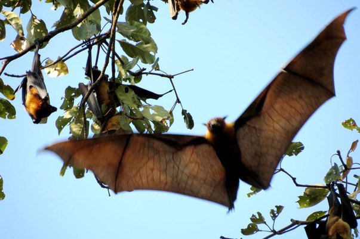**

In this direction, We would like to assist the Coffee Research Wing of the Coffee Board, undertake a study on fruit bat populations and their importance to coffee ecology.

### References

Anand T Pereira and Geeta N Pereira. 2009. Shade Grown Ecofriendly Indian Coffee. Volume-1.

Bopanna, P.T. 2011.The Romance of Indian Coffee. Prism Books ltd.

www.learnaboutnature.com

[http://en.wikipedia.org/wiki/Megabat](http://en.wikipedia.org/wiki/Megabat)

[http://batworld.org/](http://batworld.org/)

http://www.batcon.org/

[http://www.fs.fed.us/wildflowers/pollinators/animals/bats.shtml](https://web.archive.org/web/20220628015345/https://www.fs.fed.us/wildflowers/pollinators/animals/bats.shtml)

[http://www.bats.org.uk/pages/why\_bats\_matter.html](http://www.bats.org.uk/pages/why_bats_matter.html)

[http://www.batworlds.com/fruit-bat/](http://www.batworlds.com/fruit-bat/)

http://www.batcon.org/our-work/regions/asia

http://www.batworlds.com/bats-in-mythology/

[http://www.batworlds.com/bat-role-in-pollination/](http://www.batworlds.com/bat-role-in-pollination/)

[http://www.batworlds.com/facts-about-bats/](http://www.batworlds.com/facts-about-bats/)

[http://www.batworlds.com/fruit-bat/](http://www.batworlds.com/fruit-bat/)