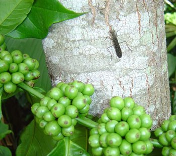
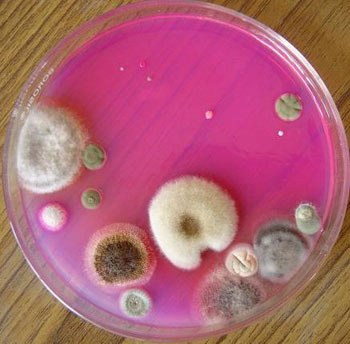
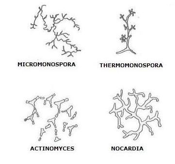
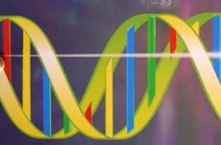
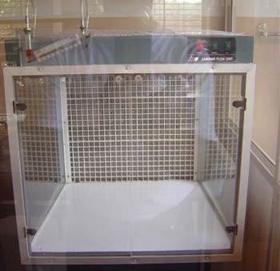
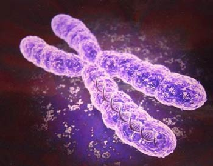
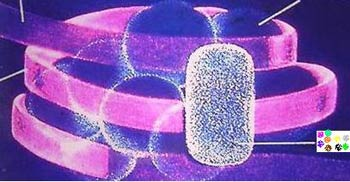
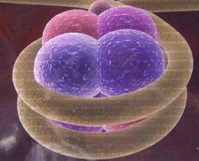
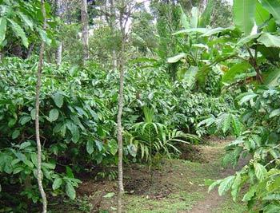
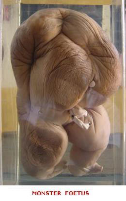

Microorganisms are an integral part of the coffee ecosystem. Our earlier articles have clearly defined the functional role played by these minute wonders in maintaining the sustainability and ecological integrity of the coffee mountain. This article is different from the rest because it explains in detail the production of antimicrobial substances produced by living microorganisms within the confines of the coffee mountain.

The coffee mountain has evolved a set of mechanisms over thousands of years, allowing complete harmony among and between all biological partners. Life is so relaxed inside the coffee mountain for microbes, insects, birds and animals; they move about with ease. They communicate with signals far below the reach of human ears and can penetrate three miles of green forest cover. Antibiotic production by a certain group of microorganisms has also been an evolutionary process in facilitating the organism to survive the hardships of nature. Biosynthesis of antibiotics is the inherited property of a certain group of organisms.

The present article throws light on the microbial inhabitants of the coffee mountain producing a variety of ANTIBIOTICS; The presence of antibiotics in soil may either have a positive or negative effect on plant growth and development. Antibiotics that are effective against a wide range of infectious agents are known as BROAD SPECTRUM antibiotics, where as some are very specific and are known as narrow spectrum antibiotics and act against only a few bacterial species. They act by inhibiting the growth of the infecting organisms.

### ANTIBIOTICS

An antibiotic is defined as a substance formed by one organism that, in low concentrations, is capable of inhibiting or killing (susceptible) microorganisms. “Antibiotics,” Microsoft Encarta(R) Online Encyclopedia 2005 defines Antibiotics (Greek anti, “against”; bios, “life”) as chemical compounds used to kill or inhibit the growth of infectious organisms.

Originally the term antibiotic referred only to organic compounds, produced by bacteria or molds that are toxic to other microorganisms. The term is now used loosely to include synthetic and semi synthetic organic compounds. Antibiotic refers generally to antibacterial. All antibiotics share the property of selective toxicity: They are more toxic to an invading organism than they are to an animal or human host.

### EARLY HISTORY OF ANTIBIOTICS

The discovery of antibiotics has a very interesting origin. The French scientist Louis Pasteur in the year 1857 indicated the active role of microorganisms in lactic acid fermentation. In 1877, Pasteur and Joubert reported that aerobic bacteria could inhibit the growth of Bacillus anthracis. Noble laureates Mechnikov (1845-1916) and Paul Ehrlich showed that certain saprophytic bacteria might be used to control pathogenic microorganisms.

In 1896, Gosio isolated a crystalline substance from the fungus Penicillium brevi compactum known to inhibit the growth of anthrax microbe. Emmerich and Low (1899) reported the discovery of an antibiotic substance formed by the bacterium Pseudomonas pyocyanea, which they called PYOCYANASE. Black and Alsberg (1910-1913) isolated penicillic acid from the fungus Penicillium. In 1929, Alexander Fleming discovered a new preparation PENICILLIN. In 1937 Welsh described the first antibiotic actinomycin, in 1939 Krasilnikov and Korenyako obtained mycetin and Dubos isolated tyrothricin.

This was the starting point in the establishment in a new branch of science known as the science of ANTIBIOTICS. However, the isolation of penicillin in the crystal state in 1940 by Alexander Fleming leads to the wide scale application of antibiotics. This land mark discovery resulted in Alexander Fleming being awarded the Nobel Prize.

### TABLE: ANTIBIOTICS PRODUCED BY MICROORGANISMS AND HIGHER PLANTS AND ANIMALS. {After BERDY, 1980.}

Microorganisms

Higher Plants & Animals

Total

YEAR

TOTAL

STREPTOMYCETES

RAREFORMS

BACTERIA

FUNGI

Before 1940

5

2

–

2

1

1

6

1945

88

10

2

25

51

105

193

1950

316

72

10

94

140

218

534

1955

707

325

22

137

223

356

1063

1960

1275

760

40

181

294

465

1740

1965

1898

1177

75

223

423

627

2525

1970

2889

1745

136

328

680

990

3879

1975

4099

2361

250

518

970

1438

5537

1978

4973

2769

396

567

1151

1795

6368

### ENVIRONMENTAL FORCES

Microbiologists are slowly beginning to realize the unexplored potential of using antibiotics and other natural products in the control of plant diseases and also in its therapeutic value. Antibiotics may be a powerful force in small locales immediately surrounding the active organisms.

Microbes producing antibiotics have a solid advantage in suppressing their neighbors, there by enabling them to ward off competitors. It further enables them to build ecological niche sites and exist in micro environments. In the words of Alexander Martin, a leading soil Microbiologist, antibiotic production is one of the several weapons in the struggle for existence in micro environments, and it can be classified together with rapid growth, nutritional complexity and survival in mixed populations.

Antagonism among and between microbes is a common phenomenon in soil resulting in the production of antibiotics. The complexity of the coffee mountain determines the growth and multiplication of various organisms that can grow together and also produce antibiotic substances. At times the produced antibiotic may have an adverse effect on its neighbor or it may resist the inhibiting effect of the organism producing the antibiotic.

Nature has devised its own way of tackling competition by gifting microbes with chemicals to destroy or neutralize substances produced by other organisms. Bacteria E. coli, Bacillus subtilis, Bacillus cereus, and Bacillus megatherium can form the enzyme PENICILLINASE which destroys the antibiotic penicillin produced by the fungus Penicillium notatum and Penicillium chrysogenum. In many instances certain bacteria can utilize antibiotics produced by other microorganisms as a source of food. Soil bacteria are known to utilize antibiotic streptomycin as the sole source of carbon and nitrogen.

A gram of fertile soil contains billions of different microorganisms living in close proximity to one another. Nevertheless, one or more of the microbial colonies occasionally is surrounded by an invisible clear zone in which no other organism appears. This halo devoid of growth is clear evidence that microorganisms produce antibiotics to inhibit the growth and development of other microorganisms.

A variety of coffee soil inhabitants like actinomycetes, bacteria and fungi are capable of synthesizing antibiotics. Actinomycetes are particularly active in this regard, and streptomycin, cycloheximide, chloramphenicol, and chlortetracycline are but a few of the important chemotherapeutic substances synthesized by microorganisms. We have to bear in mind that many microorganisms produce more than one toxic metabolite and each may act on a different group of organisms.

-   ACTINOMYCETES: STREPTOMYCES, NOCARDIA, MICROMONOSPORA
-   BACTERIA: BACILLUS, PSEUDOMONAS
-   FUNGI: PENICILLIUM,TRICHODERMA,ASPERGILLUS,FUSARIUM

### TABLE: ANTIBIOTICS PRODUCED BY ACTINOMYCETES, FUNGI AND BACTERIA.

ANTIBIOTIC

ISOLATED FROM MICROORGANISM

ACTIVE AGAINST

BACITRACIN

BACILLUS SUBTILIS

GRAM POSITIVE BACTERIA

BLASTICIDIN-S

STREPTOMYCES GRISEOCHROMOGENES

FUNGI

CHLORAMPHENICOL

STREPTOMYCES VENEZUELAE

GRAM POSITIVE & NEGATIVE BACTERIA

CYCLOHEXIMIDE

STREPTOMYCES GRISEUS

FUNGI

ERYTHROMYCIN

STREPTOMYCES ERYTHREUS

GRAM POSITIVE BACTERIA

GENTAMYCIN

MICROMONOSPORA PURPUREA

GRAM POSITIVE BACTERIA

GRISEOFULVIN

PENICILLIUM GRISEOFULVUM

FUNGI

KANAMYCIN

STREPTOMYCES KANAMYCETICUS

GRAM POSITIVE & NEGATIVE BACTERIA, TUBERCULOSIS BACTERIA

PENICILLIN

PENICILLIUM CHRYSOGENUM

GRAM POSITIVE BACTERIA

STREPTOMYCIN

STREPTOMYCES GRISEUS

GRAM POSITIVE & NEGATIVE BACTERIA, TUBERCULOSIS BACTERIA

NEOMYCIN

STREPTOMYCES FRADIAE

GRAM POSITIVE & NEGATIVE BACTERIA, TUBERCULOSIS BACTERIA

Fungal antibiotics have been isolated from various types of soils and they are known to control many plant diseases. Antibiotic griseofulvin is a metabolic product of the fungus Penicillium griseofulvum and aureofungin, a metabolic product of Streptoverticillium cinnamomeum var.terricolum are the most commonly used antibiotics.

### SIMPLE PROCEDURE TO ISOLATE ANTIBIOTICS

The coffee soil sample containing millions of microorganisms is suspended in sterile water and the suspension diluted several fold and samples are transferred to Petri plates containing agar media of various nutritive compositions. The plates are incubated until growth of the microorganisms occurs in the form of individual colonies. If any of these colonies has produced an antibiotic, it probably will have diffused into the agar and it can be detected by spraying the agar with a suspension of bacteria susceptible to the antibiotic.

The susceptible organisms form a solid lawn except where the antibiotic has diffused. Where the antibiotic exists, their growth will be arrested and a clear zone will surround the colony that has produced the antibiotic. Studies then can be carried out to determine the types of organisms inhibited by the antibiotic.

### MECHANISM OF ANTIBIOTIC ACTION

The Russian Microbiologist Egorov in his book titled “ANTIBIOTICS A SCIENTIFIC APPROACH” describes in detail the mechanism and mode of action of various antibiotic producing microorganisms. Antibiotics are effective against some species of organisms and others remain unaffected. The base line is that antibiotics are selective in arresting the growth or in killing the target organism. Egorov reports that In spite of change in chemical structure of antibiotics produced by various microorganisms, their primary effect on microbial cells is about the same.

All antibiotics are to a certain degree ADSORBED on the cell wall or by the cytoplasmic contents, secondly all antibiotics inhibit the growth of cultures sensitive to them, even if their concentration is very low and most importantly, all antibiotics are selective in nature. At the same time, the character and especially the mechanism of biological action of each particular antibiotic are quite specific. The following factors are largely responsible for the efficiency of the antibiotic.

1.  Composition of microbial cell wall.
2.  Concentration of antibiotic.
3.  Nature of antibiotic
4.  Environmental conditions like temperature, Ph, moisture, etc.
5.  Site of action

Antibiotic substances arresting the growth of cells are known as CYTOSTATIC. Those that kill cells are called CYTOCIDAL, and the ones which dissolve the cell wall are referred to as CYTOLYTIC. Antibiotics may also be classed as bactericidal (killing bacteria) or bacteriostatic (stopping bacterial growth and multiplication).

Egorov further reports that the interaction of the antibiotic within the microbial cell may upset some of its vital processes. The antibiotic may alter permeability of the cell wall or cause its lysis by deranging the osmotic properties on its surface ; the antibiotic may upset one or several enzymatic processes that are essential for the metabolism of the cell ( adsorption, respiration, energy metabolism, synthesis of various structures, detoxication reactions, maintenance of balance between the enzymes and the metabolites ); the antibiotic may affect the growth function or the ability to absorb vitally important substances, upset the reproductive function, the excretion of the metabolites and some other functions.

In spite of a very high proportion of soil inhabitants producing antibiotics, under laboratory conditions, the role of these microorganisms inside the coffee forest and their significance in determining the composition of micro flora are unknown.

### USES OF ANTIBIOTICS

-   In coffee Plantations the naturally produced antibiotics is an indispensable tool in plant disease control.
-   Antibiotic producing microorganisms provide vital clues in the mechanism of synthetic activity of antibiotic producing microorganisms and metabolism of the product.
-   Antibiotics are crucial in studying the molecular mechanisms of protein synthesis, membrane function and biochemical conversions.
-   Antibiotics are widely used in both Agriculture and Biotechnology as inhibitors of some reactions.
-   The discovery of antibiotics has resulted in an explosion of knowledge in allied fields like biochemistry resulting in the synthesis of antibiotics under laboratory conditions.
-   Due to resistance build up, and the occurrence of resistant strains, antibiotics play a vital role in understanding the physiology of the plant microbe reaction.
-   Antibiotics are commonly used in preservation of many agricultural products.
-   Antibiotics are at times used as stimulants for the growth of live stock.
-   Antibiotics are used in genetic recombinant technologies to isolate desired mutants.

### TABLE: PRACTICAL USES OF ANTIBIOTICS (after Berdy, 1980)

YEAR

IN MEDICINE

IN AGRICULTURE

SEMI SYNTHETIC PREPARATIONS

1945

2

–

–

1950

9

–

1

1955

19

2

3

1960

37

7

8

1965

59

13

20

1970

73

19

36

1975

89

29

62

1978

95

35

86

### WHY CERTAIN ANTIBIOTICS CANNOT ACT UNDER FIELD CONDITIONS

The biological role of antibiotics in soil system is very complex and varied. A particular antibiotic can be very effective against particular species of pure culture microorganisms under laboratory conditions, but may be totally ineffective under field conditions against the same target organism. The soil is a microcosm harboring different types of micro and macro organisms, together with insects, plants, herbs and shrubs. The minute an antibiotic is added to the soil system, it may be inactivated due to the microbial population present in that respective soil.

Soil microorganisms are known to produce acid and alkaline products that may bind to some sites on the antibiotic, resulting in its inactivation. Another factor that contributes to the inactivation process is the production of enzymes by soil microorganisms which can destroy antibiotics. Lastly, the added antibiotic may be a source of food for some microorganisms.

### ANTIBIOTIC RESISTANCE

### EVOLUTIONARY CHANGES

In the course of evolution microorganisms have also developed a mechanism to build up resistance towards the desired antibiotic. Based on this fundamental truth, coffee farmers need to judiciously apply antibiotics taking extra ordinary precautions to select the most appropriate antibiotic together with the correct dosage.

Often the right antibiotic and the prescribed dosage are not adhered to when applying the antibiotic resulting in a favorable environment for the development of new races which are antibiotic resistant. Some other soil microbiologists are of the view that resistance to antibiotics is due to the fact that soil is not a homogenous medium but consists of millions and billions of heterogeneous microorganisms.

A gram of soil may contain in addition to antibiotic sensitive microorganisms, MANY OTHER microorganisms characterized by resistance to the said antibiotic. This is the trigger point where in the added antibiotic substance will act as an inducer favoring selection of resistant forms. This antibiotic resistance, also known as antimicrobial resistance or drug resistance is due largely to the INDISCRIMINATE use of antibiotics.

Based on the research work carried out by several leading soil scientists, Egorov, has summarized the findings on the causes of antibiotic resistance.

-   Changes in the ability of the cell wall to hold the antibiotic on its surface and to prevent its penetration inside the cell.
-   Possible destruction of the antibiotic by constitutive or induced enzymes that are synthesized intensively in the presence of the antibiotic before it acts biologically on the cell.
-   Changes in the cell structures of which the antibiotic acts.
-   The ability of cells to decrease the antibiotic concentration inside them by intensified withdrawal of the antibiotic.
-   Impaired sensitivity to the antibiotic at a certain stage of metabolism in the microbial cell.
-   The transition of the R factor from one cell to another.

### CLASSIFICATION OF ANTIBIOTICS

According to “Antibiotics,” Microsoft Encarta(R) Online Encyclopedia 2005, Antibiotics can be classified in several ways. The most common method classifies them according to their action against the infecting organism.

Some antibiotics attack the cell wall; some disrupt the cell membrane; and the majority inhibits the synthesis of nucleic acids and proteins, the polymers that make up the bacterial cell. Another method classifies antibiotics according to which bacterial strains they affect: staphylococcus, streptococcus, or Escherichia coli, for example. Antibiotics are also classified on the basis of chemical structure, as penicillin’s, cephalosporin’s, amino glycosides, tetracycline’s, macro ides, or sulfonamides, among others.

### CONCLUSION

The coffee farm is a zone of ecological marvel. Billions of invisible microbes work day in and day out in maintaining the balance of population. Some do so by the production of substances known as antibiotics. Thus the production of ANTIBIOTICS is clearly a microbial process that has great importance in the successful establishment of coffee plantations.

Coffee farmer’s world wide need to bear in mind that EXTERNAL APPLICATION of antibiotics need to be used with great caution, keeping in mind the surrounding beneficial flora and fauna. External application of Antibiotics disrupts the normal population of beneficial microbes in the coffee mountain. However, in the race to produce more; the coffee ecosystem is under tremendous pressure from external forces. One such force is by conditioning ourselves with quick fix solutions. We know from experience that this often only gives temporary relief. In fact it can generate a rebound effect on the ecology of the coffee mountain with plenty of undesirable side-effects.

It is an open secret that control of disease-causing microbes within the coffee mountain is threatened by the upward trend in the numbers of bacteria that are resistant to multiple antibiotics. Over the years, farmers have exploited the use of antibiotics to suppress the growth of pathogens. The overuse and misuse of antibiotics by farmers has created mutations of microbes. Indiscriminate use of antibiotics builds up resistance in microorganisms thereby reducing the efficacy of the antibiotic.

Simple disease causing microbes have also become hard to treat with antibiotic drugs. A major part of the problem is that microorganisms that cause infections are remarkably resilient and can develop ways to survive antibiotics meant to kill or weaken them. The use of antibiotics in this manner has prompted many human health concerns.

Commonly used antibiotics have been rendered useless against many new strains of bacteria, prompting food safety concerns. Also, an excess build up of antibiotics inside the soil system contaminates the ground water table and is a direct threat to human beings, especially to infants and children.

A very interesting fact that is mostly ignored ; stems from the fact that Farmers routinely mix animal feed with antibiotics to make livestock grow faster on less feed and prevent infections , there by creating drug-resistant bacteria that could cause serious illnesses among humans. 50% of all antibiotics used in the world are routinely put in the food and water of healthy livestock.

The scale of antibiotic use in commercial farming is so enormous that Livestock are given anywhere from 100 to 500 times the amount of antibiotics as the human population. More than half of these drugs are similar to antibiotics doctors use to treat humans. The Food and Agriculture Organization reports that the levels of antibiotics in animal feeds have increased by over 20 times since the 1970s. The use of antibiotics in this manner has prompted many human health concerns. Commonly used antibiotics have been rendered useless against many new strains of bacteria, prompting food safety concerns. With few promising new antibiotics in the pipeline, means fewer weapons to attack disease causing microorganisms once traditional ones fail.

Increasingly, the coffee mountain is running into trouble. Plant life, Animal life, microbes and biodiversity are simply vanishing. Unfortunately, Agriculture is a major contributor to the emergence of antibiotic-resistant bacteria because farming inside the coffee mountain is dependent on chemicals. There is no doubt that human activities take their toll. It is terribly important ; mankind understands that in the battle of strength, we will destroy both planet earth as well as our earthly home.

Coffee Farmers need to take a big leap of faith and trust these mysterious microbes to stimulate the production of antibiotics in their congenial NATURAL ENVIRONMENT!. It is they and not we who rule the PLANET.

### REFERENCES

[Microbial Communities](http://ecofriendlycoffee.org/microbial-communities/)

[Role of Bacteria in Coffee Plantation Ecology](http://ecofriendlycoffee.org/role-of-bacteria-in-coffee-plantation-ecology/)

[Role of Fungi in Coffee Plantation Ecology](http://ecofriendlycoffee.org/role-of-fungi-in-coffee-plantation-ecology/)

[The Role of Actinomycetes in Coffee Plantation Ecology](http://ecofriendlycoffee.org/the-role-of-actinomycetes-in-coffee-plantation-ecology/)

[Coffee Plantations A Multidisciplinary Approach](http://ecofriendlycoffee.org/coffee-plantations-a-multidisciplinary-approach/)

[Invisible Communications in Coffee Plantations](http://ecofriendlycoffee.org/invisible-communications-in-coffee-plantations/)

[Significance of Microbial Interactions Within Coffee Plantations](http://ecofriendlycoffee.org/significance-of-microbial-interactions-within-coffee-plantations/)

[CDC Antibiotic / Antimicrobial Resistance](http://www.cdc.gov/drugresistance/)

[www.fda.gov/oc/opacom/hottopics/anti\_resist.html](https://web.archive.org/web/20090511173052/http://www.fda.gov/oc/opacom/hottopics/anti_resist.html)

[www.nlm.nih.gov/medlineplus/antibiotics.html](http://www.nlm.nih.gov/medlineplus/antibiotics.html)

[www.cdc.gov/drugresistance/actionplan/index.htm](https://web.archive.org/web/20170627105037/https://www.cdc.gov/drugresistance/actionplan/index.htm)

[www.ems.org/antibiotics/sub2\_antibiotics.html](https://web.archive.org/web/20180517083638/http://www.ems.org/antibiotics/sub2_antibiotics.html)

“Antibiotics,” Microsoft Encarta(R) Online Encyclopedia 2005 http://encarta.msn.com 1997-2005 Microsoft Corporation.

Alexander, M. 1974. Microbial Ecology. New York. John Wiley and sons.

Alexander, M. 1977. Introduction to soil Microbiology. 2nd edition. New York. John Wiley and sons.

Atlas, R.M. and R. Bartha. 1993. Microbial Ecology: Fundamentals and application. Third edition. Benjamin/Cummings Pub. Co. New York.

Brock. T. D. 1979. Biology of Microorganisms. Third Edition. Englewood Cliffs. Prentice-Hall.

De Witt. W. 1977. Biology of the cell. An Evolutionary Approach. W.B. Saunders Company. Philadelphia, London, Toronto.

David B Alexander, 2002. Bacteria and Archaea (chapter 3). In Principles and applications of soil microbiology. Edited by David M Sylvia, J.J. Fuhrmann, Peter G Hartel and David A Zuberer. Prentice Hall. Upper Saddle River, NJ 07458

Rangaswami . G and Bagyaraj, D. J. 2001. Agricultural Microbiology. Second edition. Prentice-Hall of India Private Limited. New Delhi.

Subba Rao. N.S. 2002. Soil Microbiology (fourth edition of soil microorganisms and plant growth) Oxford and IBH Publishing CO. PVT. LTD. New Delhi.

Egorov .N. S. 1985. Antibiotics – A Scientific Approach. Mir Publishers , Moscow.

Berdiy . J. 1980. Process Biochemistry. Oct./ Nov.

National Academy of Sciences. 1981. Microbial Processes: Promising Technologies for Developing Countries. N.A.S. Washington, D.C.

Paul Singleton and Diana Sainsbury.1980. Dictionary of Microbiology. John Wiley & Sons. New York.