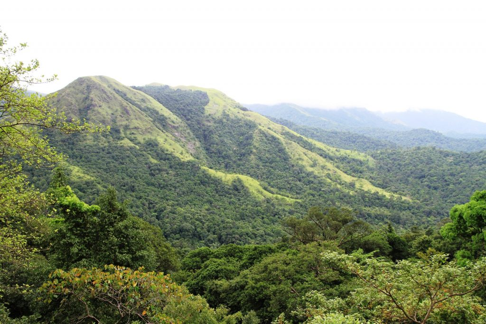
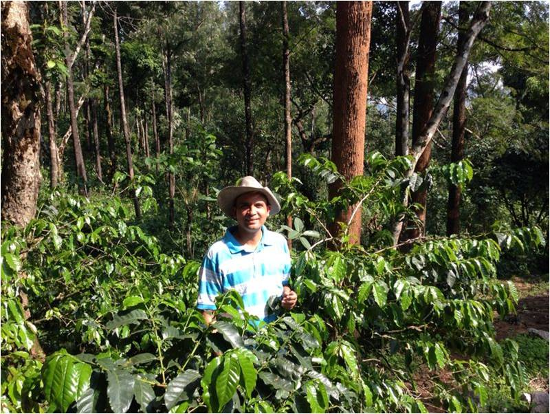
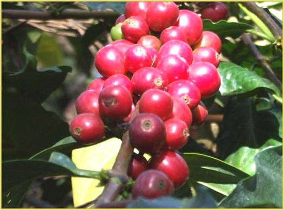
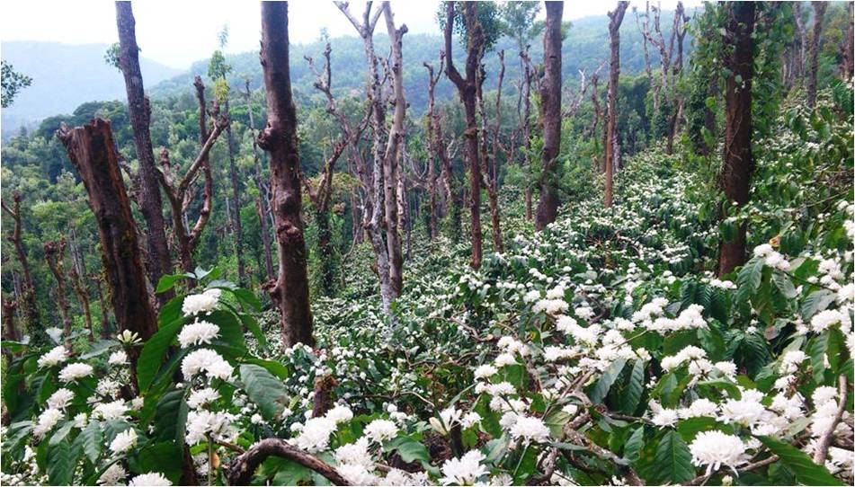
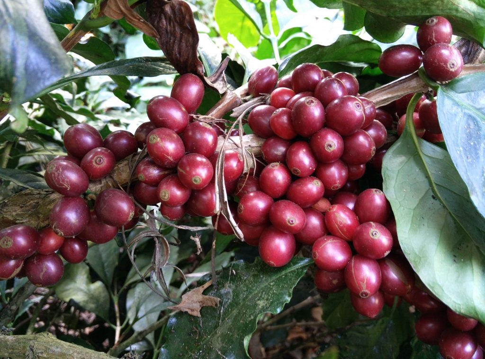
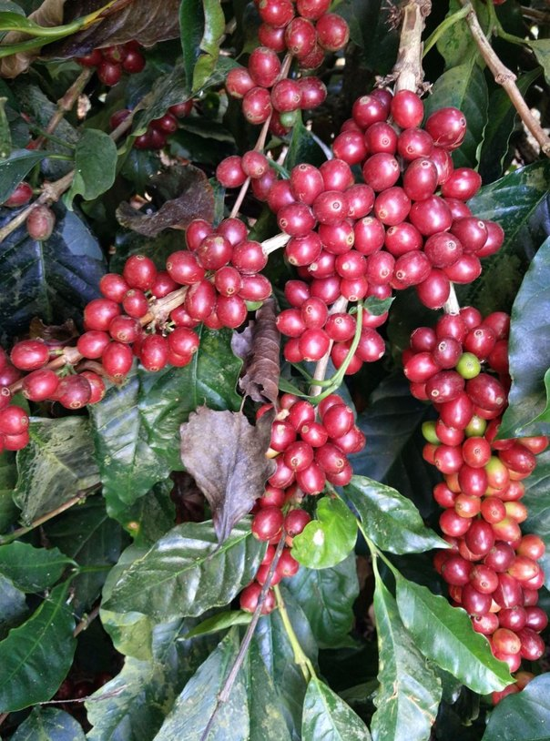
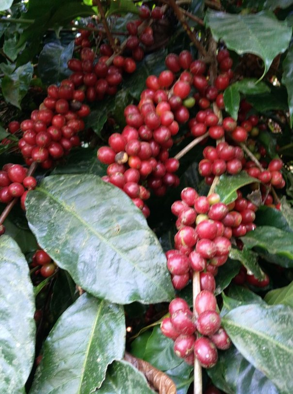
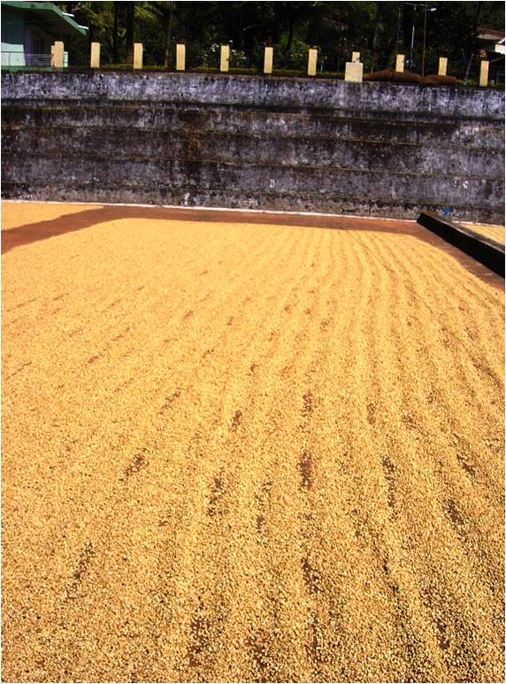

Shade Grown Ecofriendly Indian Coffee Plantations. The very mention of the word conjures images of lofty green mountains, enchanting rolling hills and meadows, multi-hued flowering trees, forests of rosewood and sandal wood and pristine lakes and eternal springs oozing from the mountain tops. Nature has lavished her best on this enchanting land. In the midst of such pristine surrounding’s, Melkudige Ecofriendly Shade Grown Arabica Plantations, Certified for Rainforest Alliance and Woods Certification; grows, India’s Prized Arabica Coffee Beans. We are proud to state that our high elevation Arabica Coffees have also won the Nespresso International Award.

Over the years Melkudige Plantation is in the forefront; adopting new technologies that has a direct bearing on crop yields, nutrition and plant growth and Development. This has primarily been possible because the two of us are armed with Horticulture degrees, facilitating research and development right at the plant molecular level.

This paper on the role of Boron in Coffee Production, especially in Arabica Cultivars is to stimulate the imagination of the Coffee Planter’s in helping them understand the importance of micronutrients in plant growth and development, especially the pivotal role played by Boron in a number of vital processes such as root development, Cell Wall formation, Cell Division and also in enhancing the uptake of Primary and secondary nutrients.

Review of Literature clearly states that application of Boron is a prerequisite for water uptake, root growth, development of nodes, fruit size, Flowering, fruit setting and also drought resistance. However, Boron application has taken a back seat in Ecofriendly Shade Grown Coffee Plantations and our thrust on the use of Boron as an essential micronutrient for a number of years has paid rich dividends.

A long term study was undertaken in our coffee farm ( 2010 to 2016 ) to find out if Boron and other micronutrients have a significant impact on coffee yield . The study was undertaken in a 120 acre Arabica coffee farm situated in Javali village, of Chikmagalur district over a period of five years.

Boron as well as other micronutrients nutrients are required in minute quantities. The expression of visual symptoms of deficiency are seen only after there is a hunger for the micronutrients inside the plants which in turn will affect the yield. The correction of deficiency after the expression of visual symptoms can be undertaken by giving a foliar spray or applying it through the soil. Application of micronutrients regularly in the required quantities will overcome the deficiency.

A pre blossom spray of Boron 200 grams andrexolin 200 grams was added to a regular schedule of foliar fertilizers containing 1kg of MAP (Mono Ammonium Phosphate) 12:61:0, 500 grams of 19all along with a surfactant in 200 litres of water was used at the rate of 3 barrels an acre. Observations were made over a five year period on growth as well as yield parameters.

### **Growth Parameters**

Boron plays a important role in growth of the plant by giving the plants disease resistance. The incidence of diseases especially leaf rust was very low thereby maintaining good leaf canopy which translates into more food production thereby maintaining the health of the plants.

The incidence of white stem borer are significantly lower since Boron plays a major role in thickening of the cell wall making it difficult for the larvae to penetrate the bark of the coffee plant. The dense canopy indirectly helped lower the stem borer incidence by self shading the bark.

### **Yield Parameters**

The following observations were made subsequent to foliar application of Boron.

-   Robust primaries with shortened inter nodal length thereby having more number of yielding nodes ranging between 6-7.
-   More number of flower buds per node 10-15 compare to 5-6 buds before Boron application.
-   Increased fruit set : more number of flowers translated into a compact bunch of berries 10-15 per node.

-   Uniform ripening of berries thereby reducing the picking cost. The unripe to ripe percentage was approximately 7%. Thereby there was more parchment production increasing the monetary benefits.
-   Fruit cracking and dropping of berries is significantly low even when there is rain.
-   The ripe to dry parchment outrun was about 22-23 percent compared to 18-19 percent earlier.
-   The curing out turns was ranging between 83.5-84.5 percent compared to 80-81 percent earlier thereby indicating that addition of Boron leads to denser beans leading to increased productivity.
-   The number of A grade beans above screen 17mm was ranging between 62-65 percent compared to 55-57 percent leaving out the pea berries entirely. This shows that Boron also plays a significant role in quality aspects.

### **Conclusion**

The application of Boron along with other micronutrients had a significant effect on growth of the plants. Boron plays a important role in the cell wall development thereby giving strength to the cell wall. Thereby maintaining the health of the plants which in turn helps the plant to fight diseases.

Boron also plays an important role in the beter out turn of coffee there by facilitating better quality coffee parameters.

Boron plays a role in cell development thereby giving strength or toughens the bark of the plants thereby making it difficult for the stem borer larvae to penetrate.

The cost benefit ratio of Boron as well as micronutrient application is enormous thereby the coffee growers should be encouraged to go in a pre blossom spray.

### **References**

Anand T Pereira and Geeta N Pereira. 2009. Shade Grown Ecofriendly Indian Coffee. Volume – 0ne.

[Complementary study of boron absorption](http://www.ncbi.nlm.nih.gov/pubmed/11000877)

[Coffee leaf and stem anatomy under boron deficiency](http://www.scielo.br/scielo.php?script=sci_arttext&pid=S0100-06832007000300007)

[BMS Micro-Nutrients](http://www.chelal.com/en/crops/coffee)

[Boron in coffee](http://web.archive.org/web/20150424093759/http://www.borax.com/docs/crop-guides/rtm-cg-coffee-final-june2012.pdf?sfvrsn=2)

[Role of Boron in Plant Culture](http://www.pthorticulture.com/en/training-center/role-of-boron-in-plant-culture/)

[Importance of Boron in Plant Growth](http://www.cropnutrition.com/importance-of-boron-in-plant-growth)

[Boron’s Importance in Plant Development and Growth](http://www.cropnutrition.com/borons-importance-in-plant-development-and-growth)

[Functions of boron](http://web.archive.org/web/20150424103347/http://www.borax.com/docs/agronomy-notes/functionsofboroninplantnutrition-final-feb2012.pdf?sfvrsn=2)

[Role of Boron in Plant Culture](http://www.pthorticulture.com/en/training-center/role-of-boron-in-plant-culture/)

[Boron deficiency (plant disorder)](https://en.wikipedia.org/wiki/Boron_deficiency_\(plant_disorder\))

[BORON, THE OVERLOOKED ESSENTIAL ELEMENT](https://web.archive.org/web/20160304030458/http://www.soilandplantlaboratory.com/pdf/articles/BoronOverlookedEssential.pdf)

### About the Authors

Dr. Aveen and Dr. Yogita Rodrigues are third generation Coffee Planters and are owners of Melkudige Coffee Plantations, Shade Grown, high elevation Arabica Plantation in the foothills of the Western Ghats. This husband and wife Couple are highly qualified with post graduate degrees in Horticulture from the prestigious University of Agricultural Sciences, Bangalore. They have a passion for cultivating Ecofriendly shade coffee and share their knowledge to the outside world.

### **International Award and Recognition**

Dr. Aveen Rodrigues, of Melkudige Estate has won the prestigious and unique Nespresso AAA Sustainable quality International Award for the year 2014 with respect to India.

The prestigious and unique Nespresso AAA Sustainable quality International Award in collaboration with the Rainforest Alliance, bestowed on Aveen Rrodrigues speaks volumes of the initiative taken by Aveen over many years in adhering to the stringent AAA norms in terms of Highest quality of coffee, Sustainability and Ecofriendliness and  
productivity pertaining to shade grown high elevation Arabica coffees. In a nut shell, in addition to sustainability criteria, the tough AAA programme adds to quality and productivity dimension to sustainability. Only 1 to 2 % of the worlds coffee crop meets the tough standards set by Nespresso.

Aveen can be contacted at  <aveen73@gmail.com>