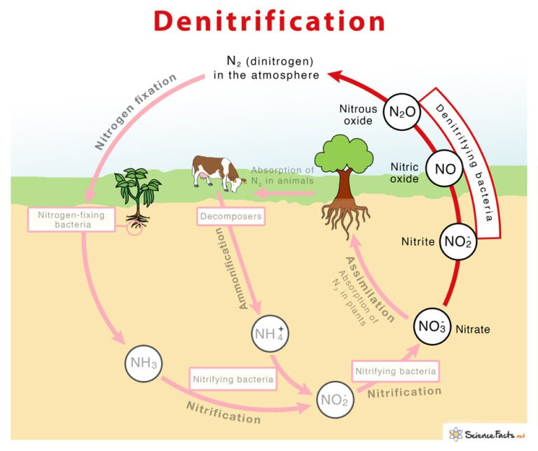

More than 95 % of the coffee farmers in India have little understanding of the complex and volatile chemistry that occurs in straight and complex fertilizers. Once the chemical fertilizers are applied to the field they have to operate in an unpredictable harsh environment and send energy forward and backward a hundred times before a part of it is assimilated by the plant. A better understanding of these mechanisms will empower the coffee grower to select the right type of fertilizer, with minimum environmental impact.

Even though, nitrogen is one of the three (Nitrogen, Phosphorus, Potassium ) major elements required for plant growth and development, very few coffee farmers are aware that nitrogen is assimilated almost entirely in the inorganic state, as nitrate or ammonium. Both forms of nitrogen are produced as a result of microbial decomposition of the organic residues of plants and animals.

The bulk of synthetic fertilizer application in coffee soils is either urea or diammonium phosphate (DAP). We have observed that coffee farmers often use excessive urea, in times when there is an acute shortage of phosphate and potash fertilizers. This unbalanced fertilization not only depletes the soil of other nutrients but also results in the inefficiency of applied nitrogen and deficiency of other essential and micronutrients.

### Denitification

The conversion of nitrate and nitrite into molecular nitrogen or nitrous oxide through microbial processes. It is important to understand that the entire process is microbially facilitated where nitrate (NO3−) is reduced and ultimately produces molecular nitrogen (N2) through a series of intermediate gaseous nitrogen oxide products. Denitrification is a response to changes in the oxygen (O2) concentration of their immediate environment. Only when O2 is limited will denitrifiers switch from aerobic respiration to anaerobic respiration, using nitrite (NO2) as an electron acceptor.

Two main factors influence denitrification

The oxygen supply in the soil.

The soil microorganisms.

**Denitrification Mechanism** 

Denitrifying bacteria are part of the nitrogen cycle, and they convert nitrates in the soil to free atmospheric nitrogen.

2 NO3–\+ 10 e– + 12 H+ → N2 + 6 H2O

**What is the effect of denitrification?**

Denitrification reduces the amount of fixed nitrogen present in the soil. It has a negative effect in removing valuable nitrogen fertilizer from the soil and releasing the greenhouse gas N2O and the tropospheric pollutant NO.

**Consequences of Denitrification**

First and foremost, the entire process is mediated by anaerobic bacteria. Anaerobic bacteria convert soil nitrates back into nitrogen gas.

Denitrifying bacteria removes fixed nitrogen, like nitrites and nitrates form the coffee ecosystem and release gaseous nitrogen back to the atmosphere.

Denitrifying microorganisms involve a wide range of bacterial groups, such as Bacillus, Enterobacter, Micrococcus, Pseudomonas, Spirillum, Proteus, Aerobacter, and Flavobacterium, Paracoccus species and Pseudomonasdenitificans. Most denitrifying bacteria are facultative anaerobic chemoheterotrophs using organic compounds as electron donors and a source of cellular carbon and using nitrate as terminal electron acceptors

**Why is denitrification a problem for farmers?**

Denitrification can result in a loss of up to 59% nitrogen in agricultural systems . In addition, nitrate can also leach out of the soil  and potentially cause pollution or even human health problems

**Conclusion**

Denitrification in coffee soils is not very common because coffee is cultivated on the slopes of mountains, where water logging is rare. However, in the last 2 decades, coffee cultivation has expanded to non-traditional areas as well as low-lying paddy fields, where water logging is a common feature during monsoons. In such situations, denitrification has a negative effect on the coffee ecosystem, because valuable nitrogen fertilizer from the soil is removed and converted to nitrous oxide gas, which acts as a greenhouse gas, contributing to global warming. Hence, coffee Planters need to avoid water logging and also regularly cay out scuffle digging operations once in two years to facilitate aeration.

**References**

Anand T Pereira and Geeta N Pereira. 2009. Shade Grown Ecofriendly Indian Coffee. Volume-1.

Anand Titus Pereira & Gowda. T.K.S. 1991. Occurrence and distribution of hydrogen-dependent chemolithotrophic nitrogen-fixing bacteria in the endo rhizosphere of wetland rice varieties grown under different Agro-climatic Regions of Karnataka. (Eds. Dutta. S. K. and Charles Sloger. U.S.A.) In Biological Nitrogen Fixation Associated with Rice Production. Oxford and I.B.H. Publishing. Co. Pvt. Ltd. India.

Subba Rao. N. S. 1998. Soil Microorganisms And Plant Growth. Oxford and IBH Publishing Co.

Bopanna, P.T. 2011.The Romance of Indian Coffee. Prism Books ltd.

Brady, N., and Weil, R. 2010. “Nutrient cycles and soil fertility,” in *Elements of the Nature and Properties of Soils, 3rd Edn*, ed V. R. Anthony (Upper Saddle River, NJ: Pearson Education Inc.), 396–420.

Skiba. [Encyclopedia of Ecology](https://www.sciencedirect.com/referencework/9780080454054/encyclopedia-of-ecology), 2008

D.A. Martens, in [Encyclopedia of Soils in the Environment](https://www.sciencedirect.com/referencework/9780123485304/encyclopedia-of-soils-in-the-environment), 2005

[Nitrification and Denitrification](https://water.mecc.edu/courses/Env149/lesson8_print.htm#:~:text=Nitrification%20is%20the%20conversion%20of,organic%20nitrogen%20and%20ammonia%20nitrogen).

[Nitrification](https://en.wikipedia.org/wiki/Nitrification)

[Denitrification](https://en.wikipedia.org/wiki/Denitrification)

[Denitrification is defined](https://www.sciencedirect.com/topics/agricultural-and-biological-sciences/denitrification)

[Denitrification is the microbial process](https://www.sciencedirect.com/science/article/pii/B9780080454054002640)

[Nitrification in agricultural soils](https://pubmed.ncbi.nlm.nih.gov/29414056/)

[Difference Between Nitrification and Denitrification](https://byjus.com/biology/difference-between-nitrification-and-denitrification/#:~:text=The%20entire%20process%20of%20denitrification,2O%20\(Water%20molecules\)).

[Does Biological Denitrification](https://www.ncbi.nlm.nih.gov/pmc/articles/PMC7466050/#:~:text=Denitrification%20can%20result%20in%20a,human%20health%20problems%20%5B22%5D).

[https://www.sciencefacts.net/denitrification.html](https://www.sciencefacts.net/denitrification.html)