The diversity of bird-life inside shade grown Ecofriendly coffee plantations is beyond belief. Yet most of the members of the coffee community have failed to realize the underlying importance of birds in growing environmentally sound coffee.

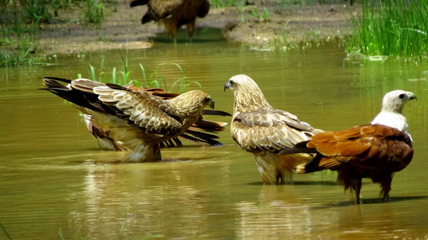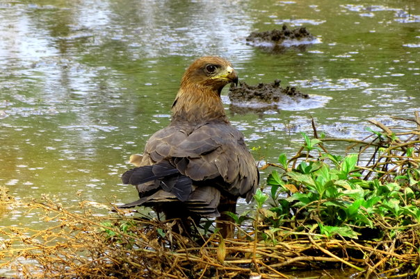

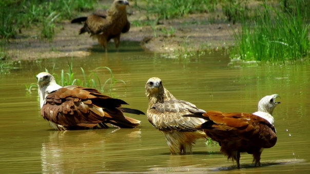

Our work on coffee biodiversity has brought out the wide ranging benefits of growing coffee under the canopy of a heterogeneous tree population. Connoisseurs of coffee are willing to pay a premium price for bird friendly coffees certified by various International Agencies.

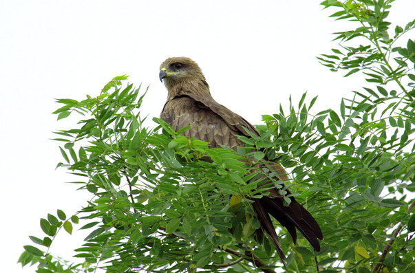

We need to comprehend that the balance between birds and the other biotic partners inside coffee forests is a delicate one and the consequences of changes to any aspect of this balance will in turn, affect the entire web of life.

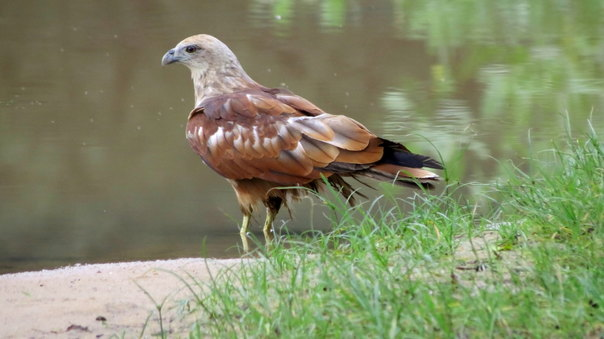

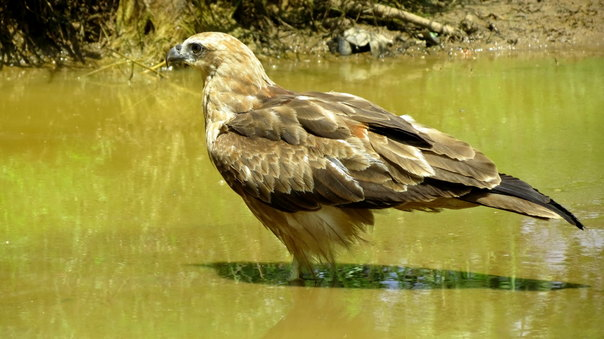

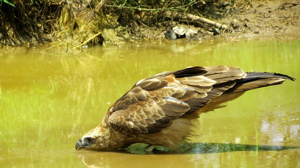

Many coffee forest birds’ species are declining due to the dwindling of natural resources and the advancement of agricultural practices that are detrimental for bird life. Many of the modern day farm practices are negatively affecting all types of bird populations.

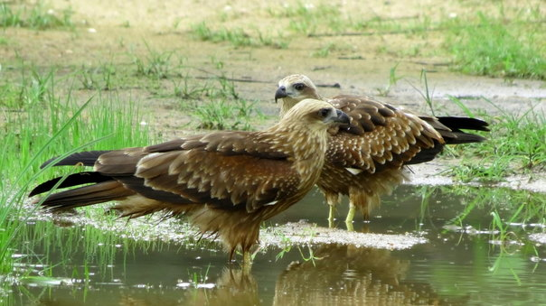

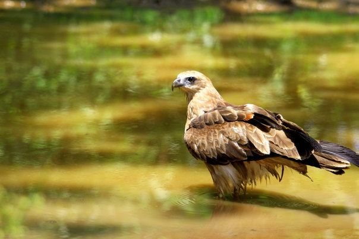

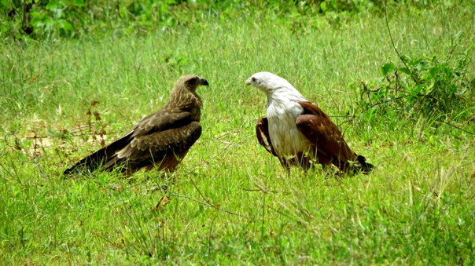

Our work on Bird ecology aims to enhance the conservation of all types of birds observed inside coffee forests.

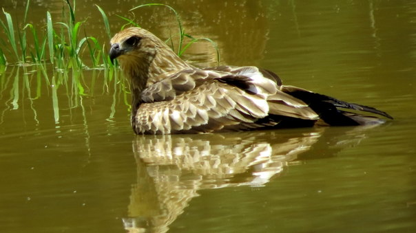

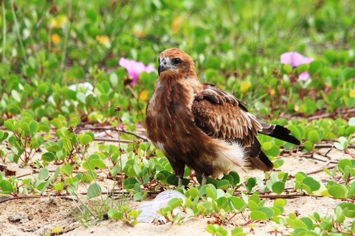

The Common Pariah Kite is a medium sized bird of prey and is one of the most noticeable and abundant birds inside shade grown Ecofriendly coffee plantations. The Pariah Kite is sacrificed in some mythological taboos.

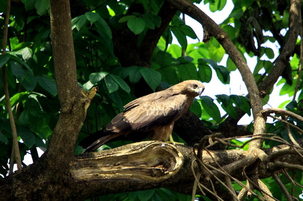

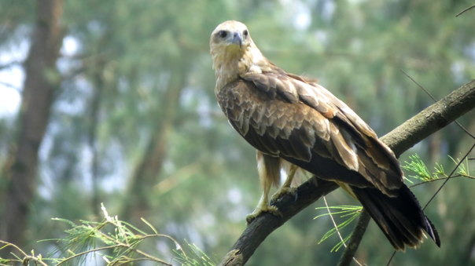

Kites have a significant role to play in the ecological aspects of coffee plantations. We often refer to them as “Farmers Friends “because they feed on large number of farm pests and clean up garbage dumps.

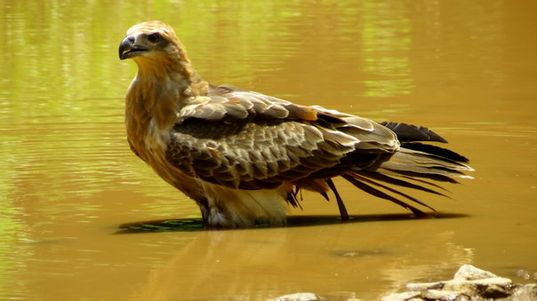

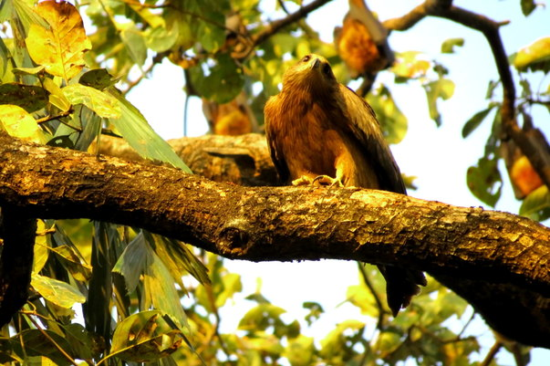

Apart from being considered ecological indicators these birds play a vital role in maintaining a healthy balance between predator and prey.

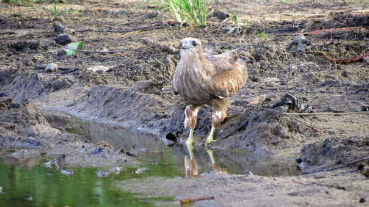

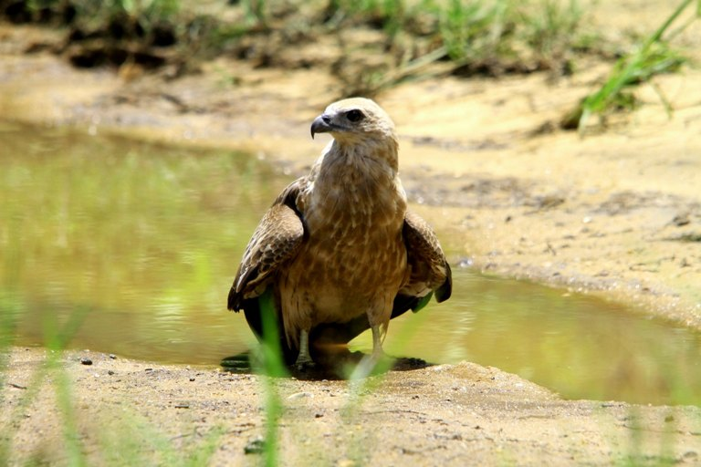

The bird is mid-sized and is a powerful predator with broad wings, hooked beaks, strong legs and feet with sharp talons. They are gifted with an excellent binocular vision.

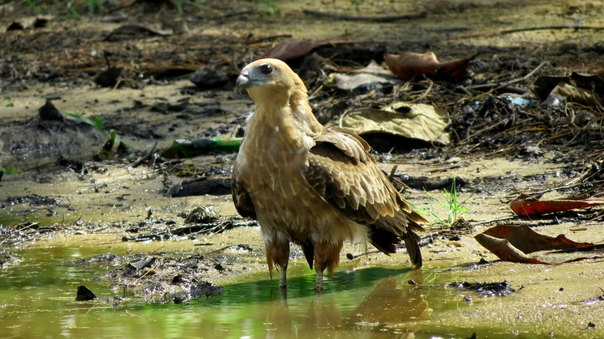

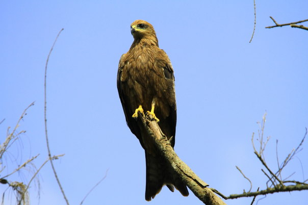

### The Classification table is as follows.

Scientific Classification     Kingdom

**Animalia**

Phylum

**Chordata**

Class

**Aves**

Order

**Falconiformes**

Family

**Accipitridae**

Genus

**Milvus**

Species

1.  M. **migrans**

Scientific Name                               **Milvus** **migrans**

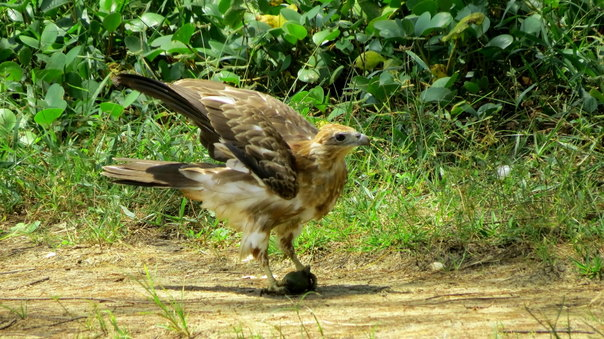

### Size :

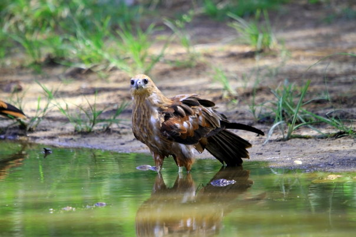

Approximately 24 inches

### Head Tail Length

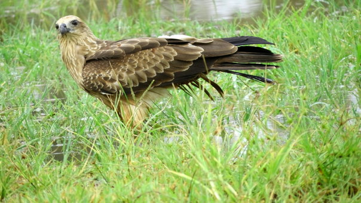

50 -60 cm

### Weight

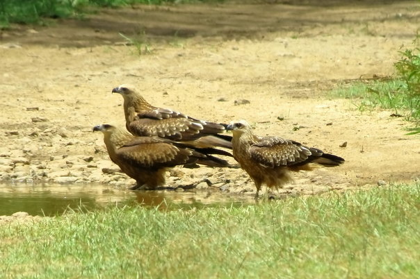

950 -975g.

### Distribution

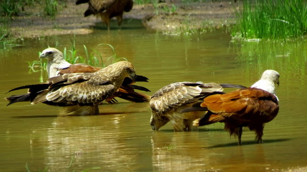

The Pariah Kite is commonly observed in all coffee zones. It is the most abundant bird of prey associated with Plantations.

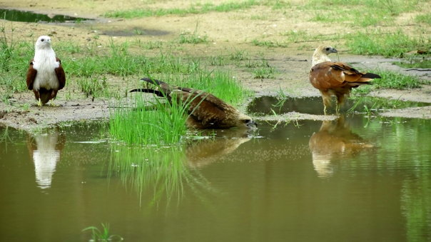

### Habitat

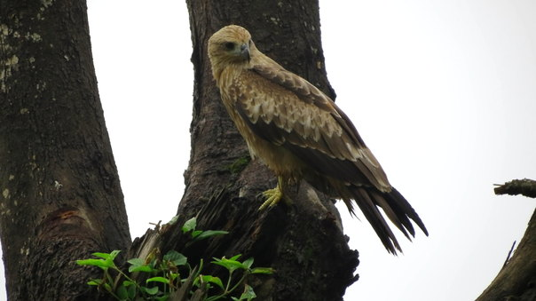

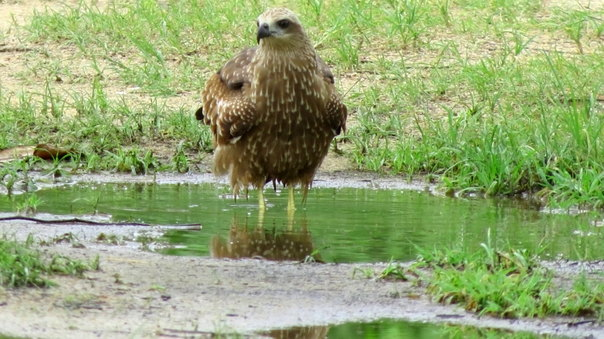

Commonly observed in wet lands, marsh lands, ponds, lakes and swamps.

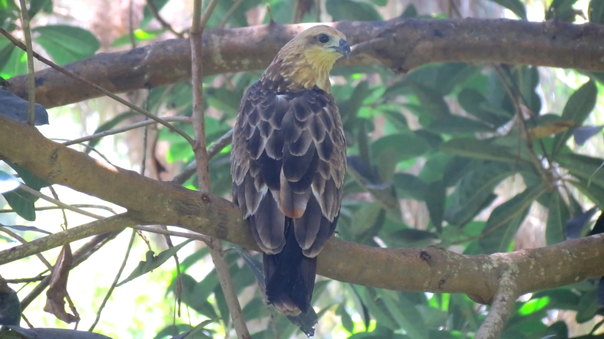

###  Description

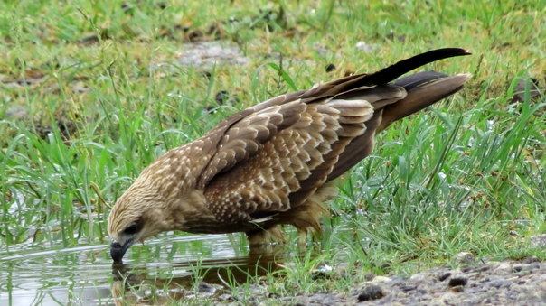

The plumage varies with the age of the bird. The juveniles are slightly paler and less uniform in coloration.

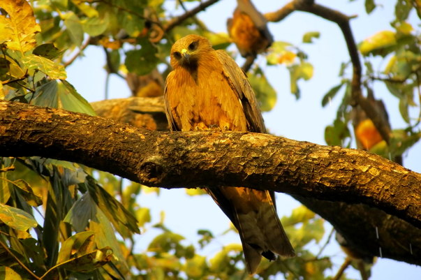

In adults the upper plumage is brown, the top of the head and hind neck slightly dull, and the sides of the wings darker. The feathers on the outer edge of the wings appear open fingered.

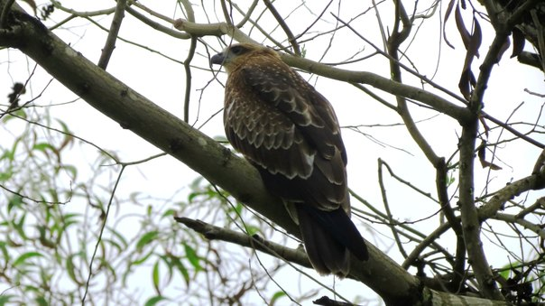

The legs are short and are yellow in colour and the claws distinctly black. The beak is hooked but is rather weak compared to other birds of prey.

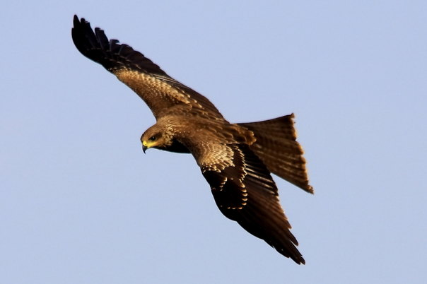

It is very easy to identify the bird during flight because of the long shallow forked tail. The female is marginally larger than the male. These birds often fly in a group and are easily spotted soaring in thermals.

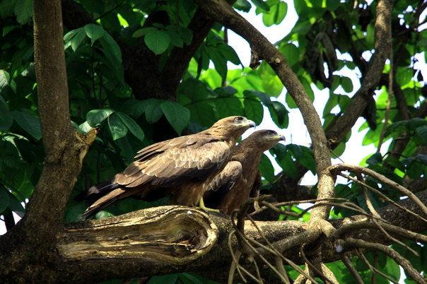

### Nesting

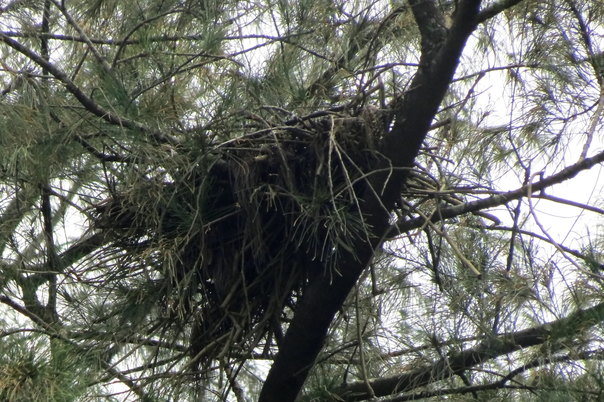

Nests are built on tall trees where there is access to water bodies. The nests are built on tree branches, and are made from sticks and twigs lined with softer material, often comprised of rags and plastic .We have observed one or two nests located on a single tree, close to the Brahminy kite nests.

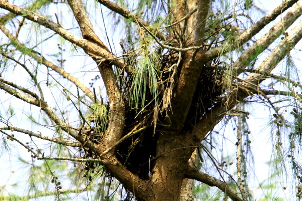

### Diet / Feeding

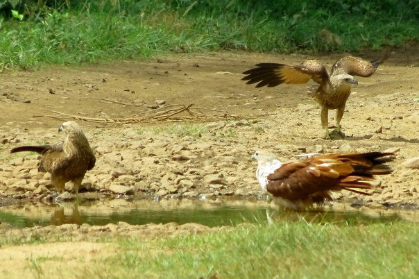

The bird is omnivorous in nature. The hugely diverse range of food consumed by black kites varies from region to region and across the seasons. All types of carrion form an important part of this species’ diet, but a notable variety of live prey, such as insects, reptiles, birds and small mammals, are also taken by this agile raptor.

In urban environments, black kites are known to forage on human food scraps and garbage, and daringly steal food from market stalls and even people

### Migration

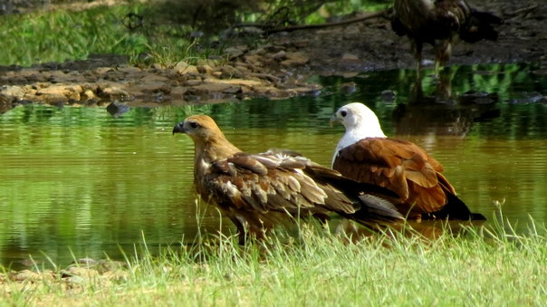

These kites are more or less resident in nature. Some do make small migrations in association with the seasons as well as in response to food supply and rainfall.

### Communication

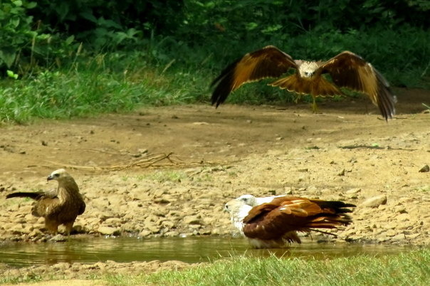

The pariah kite has well developed intraspecific communication. During the breeding season , pairs will engage in aerial man-oeuvres and acrobatically hanging on tree branches.

### Reproduction

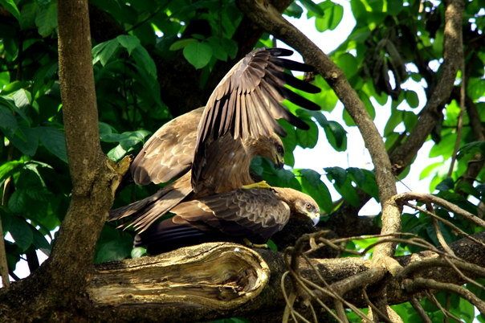

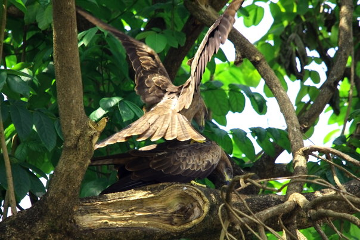

The typical clutch size is two to three eggs which are incubated by the female for around a month before hatching. Some pairs may breed solitary but usually loose groups are formed, as is commonly seen in urban areas where nests may be made only a few metres apart.

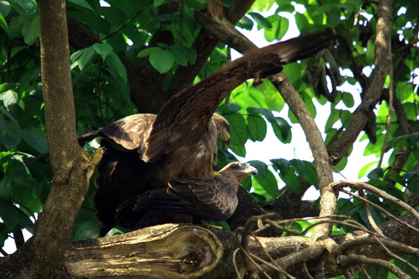

Aside from high circling, slow flapping and diving, the aerial displays during courtship are fairly limited but occasionally a pair will interlock talons in mid-air.

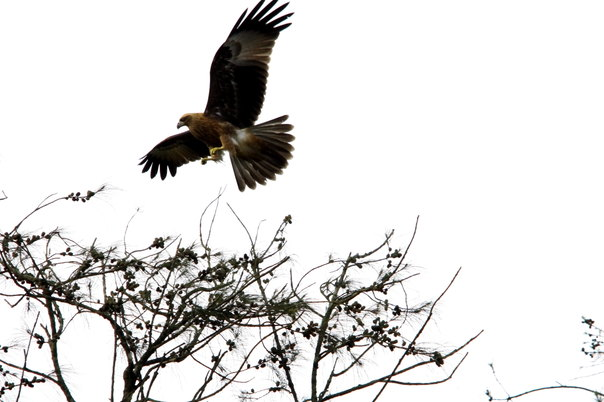

The young  fledge  after 42 -56 days and become independent another 15 to 50 days later. Both sexes share in building the nest, incubation and feeding the young.

### Breeding Season

Winters in the Indian Subcontinent.

### Threats

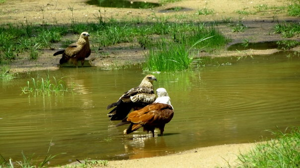

Pollution of water bodies by chemicals and pesticides has resulted in a steep decline in population in some coffee belts. Erection of wind mills and transmission towers also pose a threat.

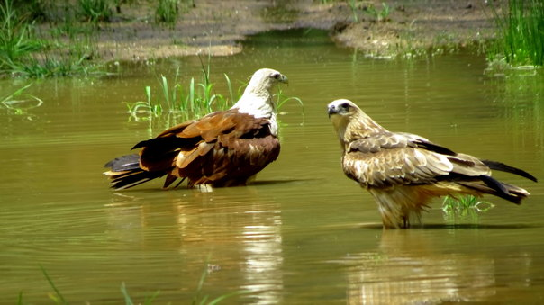

### Red List Category

Classified as Least Concern (LC) on the IUCN Red List.

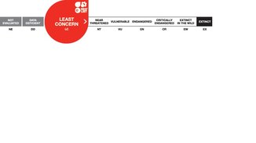

Least Concern.

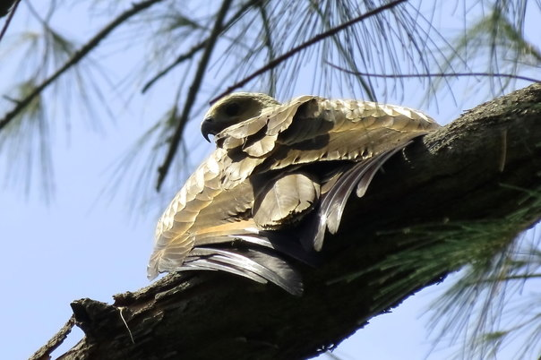

The species have a extremely large range, and hence does not approach the thresholds of vulnerable under the range size criteria.

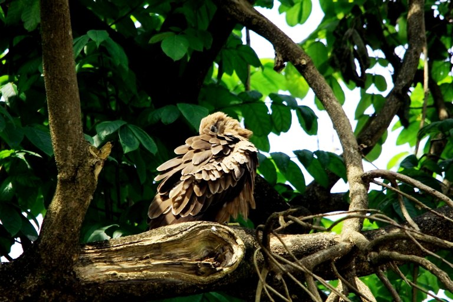

### Life span

20 – 25 years.

### Conclusion

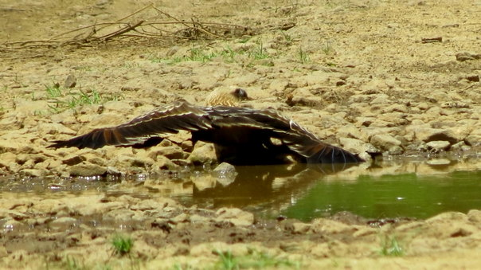

Eagles are under threat because of their position at top of the food chain. Decreases in bird numbers are most rapid in areas that are most heavily polluted with pesticides and farm chemicals.

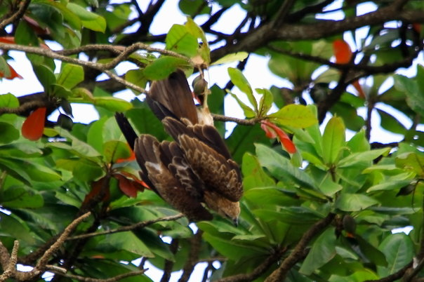

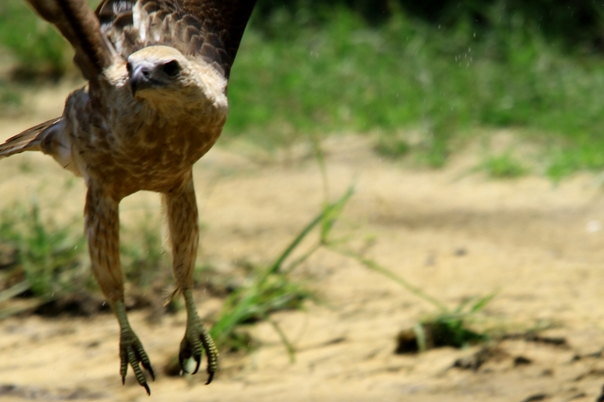

  Indiscriminate use of farm chemicals, insecticides, herbicides, fertilizers etc gets accumulated into the food chain and as a result it affects the bird’s reproductive behavior.

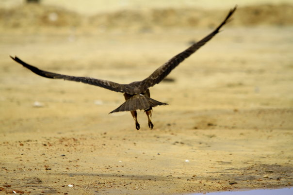

In a short time span, the bird numbers become unsustainable to breed. The real danger is in the application of banned chemicals like DDT and Endosulphan which are freely available in the market under a different brand name.

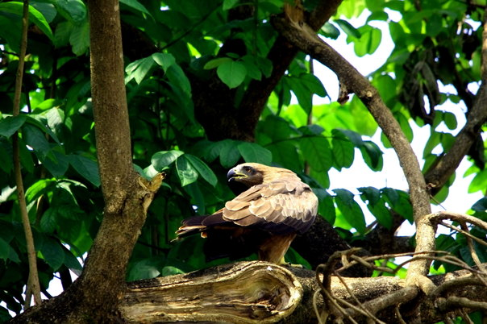

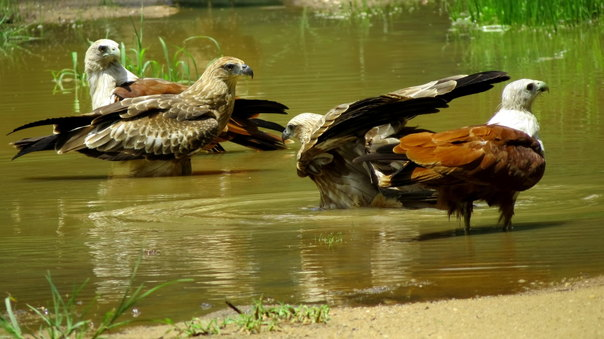

###  References

Anand T Pereira and Geeta N Pereira. 2009. Shade Grown Ecofriendly Indian Coffee. Volume-1.

Bopanna, P.T. 2011. The Romance of Indian Coffee. Prism Books Ltd. Perrins, C. (Ed.). (2003).

###  Dedication

This article is specially dedicated to the memory of Late **Professor Dr. C.K. Suresh** who passed away recently. Prof. Suresh has been a positive  influence in both our academic as well as professional career. A kind and gentle soul, Prof. Suresh has always been a good advisor and personal friend.