Shade grown tropical evergreen coffee forests are home to many bird species. A comparative study of the widely distributed Common Sandpiper bird reveals that there are well marked and readily recognizable differences in size, coloration and other details in these species which range over a wide area.[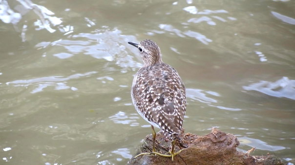](http://ecofriendlycoffee.org/wp-content/uploads/2014/07/2014.-JULYSLIDE-1.ECOFRIENDLY-COFFEE-11.jpg)

[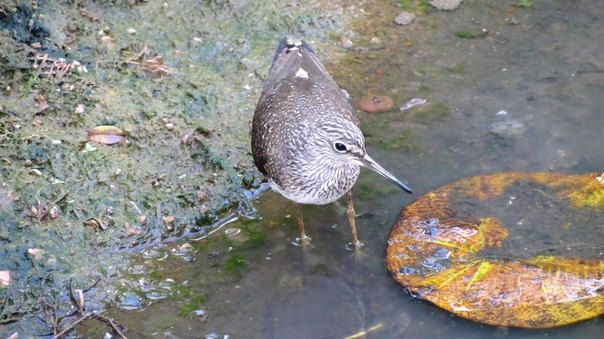](http://ecofriendlycoffee.org/wp-content/uploads/2014/07/2014.-JULYSLIDE-1.ECOFRIENDLY-COFFEE-32.jpg)[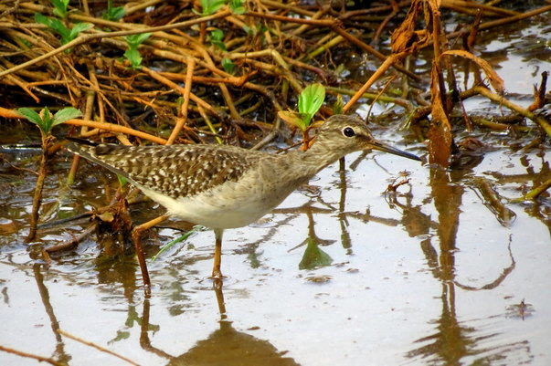](http://ecofriendlycoffee.org/wp-content/uploads/2014/07/2014.-JULYSLIDE-1.ECOFRIENDLY-COFFEE-22.jpg)

 The Common Sand piper as the name suggests is widely distributed in almost all coffee growing regions of India

### **Scientific Classification**

 

**Kingdom**

**Animalia**

**Phylum**

**[Chordata](http://en.wikipedia.org/wiki/Chordata)**

**Class**

**[Aves](http://en.wikipedia.org/wiki/Aves)**

**Subclass**

**[Neornithes](http://en.wikipedia.org/wiki/Neornithes)**

**Infraclass**

**[Neognathae](http://en.wikipedia.org/wiki/Neognathae)**

**Superorder**

**[Neoaves](http://en.wikipedia.org/wiki/Neoaves)**

**Order**

**[Charadriiformes](http://en.wikipedia.org/wiki/Charadriiformes)**

**Suborder**

**Scolopaci**

**Family**

**[Scolopacidae](http://en.wikipedia.org/wiki/Scolopacidae)**

**Genus**

***[Actitis](http://en.wikipedia.org/wiki/Actitis)***

**Species**

***A. hypoleucos***

[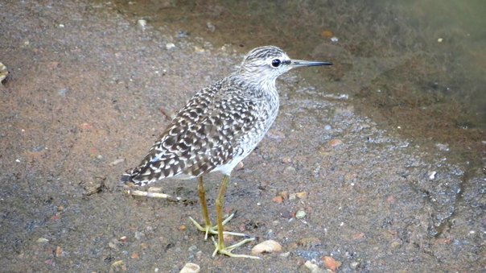](http://ecofriendlycoffee.org/wp-content/uploads/2014/07/2014.-JULYSLIDE-1.ECOFRIENDLY-COFFEE-17.jpg)

### **Description**

[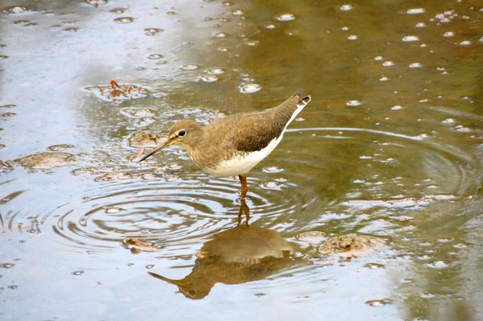](http://ecofriendlycoffee.org/wp-content/uploads/2014/07/2014.-JULYSLIDE-1.ECOFRIENDLY-COFFEE-111.jpg)

Common Sand pipers are small to medium sized birds with relatively long legs.     This bird is a small wader with complementary brown upper parts and white under parts. When at rest its wingtips reach halfway back to its tail. Throat is pale dusky coloured. Tail and rump is brown and is highly visible during the flight.

[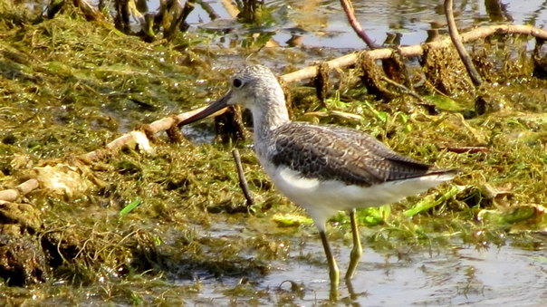](http://ecofriendlycoffee.org/wp-content/uploads/2014/07/2014.-JULYSLIDE-1.ECOFRIENDLY-COFFEE-8.jpg)

The bird is a European and Asian species. The Common Sandpiper is a migrator, but is basically a winter visitor.

[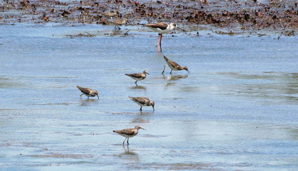](http://ecofriendlycoffee.org/wp-content/uploads/2014/07/2014.-JULYSLIDE-1.ECOFRIENDLY-COFFEE-161.jpg)

The characteristic feature of this bird is that it often bobs its head up and down, known as “teetering”. In flight common sand pipers have a stiff-winged style and typically stay close to the water or ground.

[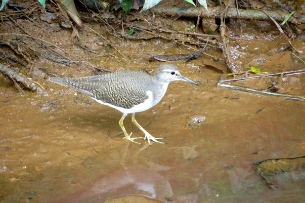](http://ecofriendlycoffee.org/wp-content/uploads/2014/07/2014.-JULYSLIDE-1.ECOFRIENDLY-COFFEE-181.jpg)

**Average length**

**20cm**

**Average mass**

**40g**

**Range Lemgth**

**18 to 24 cm**

**Average wing span**

**35cm**

**Range Elevation**

**Sea level to 4000m**

[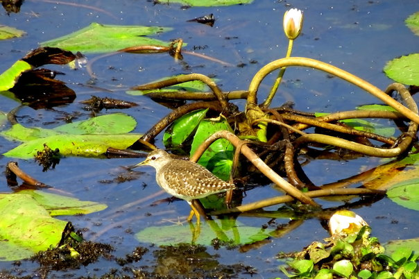](http://ecofriendlycoffee.org/wp-content/uploads/2014/07/2014.-JULYSLIDE-1.ECOFRIENDLY-COFFEE-131.jpg)

### **Distribution and habitat**

### [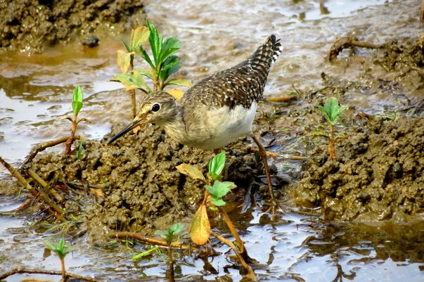](http://ecofriendlycoffee.org/wp-content/uploads/2014/07/2014.-JULYSLIDE-1.ECOFRIENDLY-COFFEE-14.jpg) [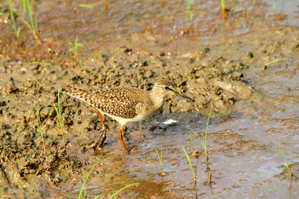](http://ecofriendlycoffee.org/wp-content/uploads/2014/07/2014.-JULYSLIDE-1.ECOFRIENDLY-COFFEE-20.jpg)

### [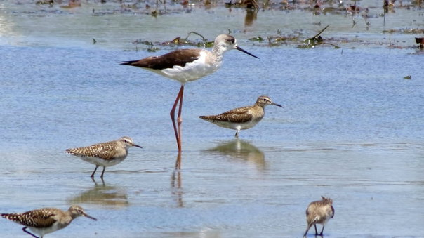](http://ecofriendlycoffee.org/wp-content/uploads/2014/07/2014.-JULYSLIDE-1.ECOFRIENDLY-COFFEE-4.jpg)

[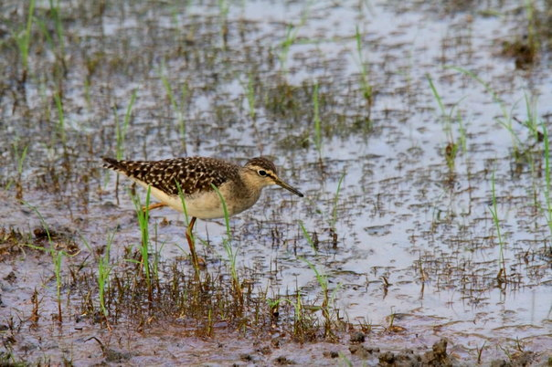](http://ecofriendlycoffee.org/wp-content/uploads/2014/07/2014.-JULYSLIDE-1.ECOFRIENDLY-COFFEE-5.jpg)

Sandpipers are familiar birds on any coffee landscape and are often seen running near the water’s edge near streams, water puddles, lakes and wetlands. Common Sandpipers can live in a variety of habitats depending on season.

 [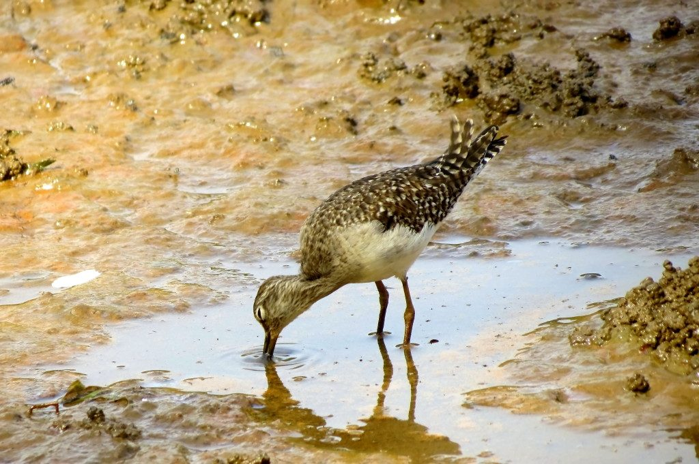](http://ecofriendlycoffee.org/wp-content/uploads/2014/07/2014.-JULYSLIDE-1.ECOFRIENDLY-COFFEE-121.jpg)

During the breeding season, they tend to nest along sandy coasts and river banks preferably near fast-moving water. Their habitat can extend up into the mountains as high as the tree-line if the climate and environment is suitable. They are able to withstand heavy rain and a broad range of day-to-night temperatures.

[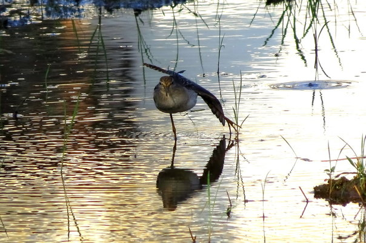](http://ecofriendlycoffee.org/wp-content/uploads/2014/07/2014.-JULYSLIDE-1.ECOFRIENDLY-COFFEE-91.jpg) [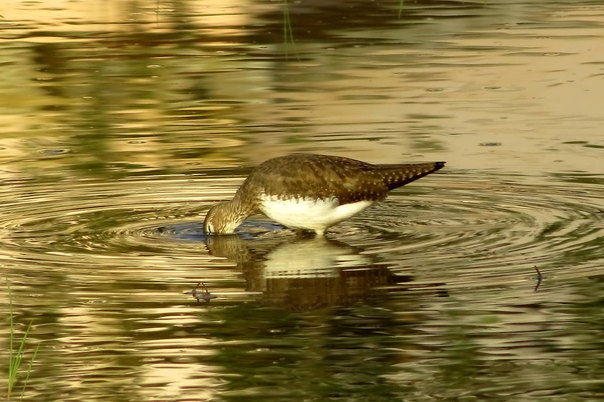](http://ecofriendlycoffee.org/wp-content/uploads/2014/07/2014.-JULYSLIDE-1.ECOFRIENDLY-COFFEE-241.jpg)

### **Diet**

[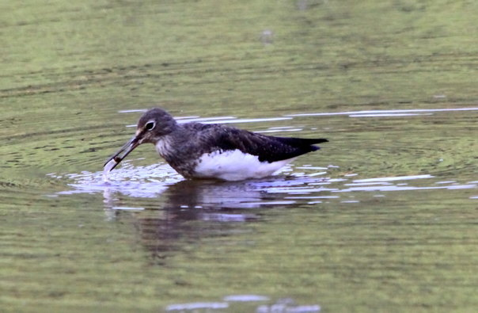](http://ecofriendlycoffee.org/wp-content/uploads/2014/07/2014.-JULYSLIDE-1.ECOFRIENDLY-COFFEE-21.jpg)

Sandpipers are ground feeders and are basically carnivorous. They feed on small insects, worms, crustaceans, molluscs, larvae and snails.

### **Breeding**

Breeding season for the Common Sandpiper takes place from April to July. During this time, their head, upper breast and under-parts become a greenish-brown colour with a delicate dark streaking. [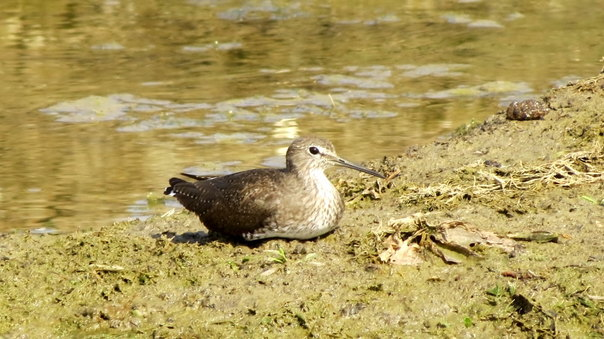](http://ecofriendlycoffee.org/wp-content/uploads/2014/07/2014.-JULYSLIDE-1.ECOFRIENDLY-COFFEE-62.jpg)

A female will lay 3 to 5 eggs (4 on average) and both parents will take turns incubating them for 21 to 22 days, at which point the eggs hatch. The chicks are fed and protected by both parents, although one of them (usually the female) will leave before they fledge (learn to fly) at 22 to 28 days old.

[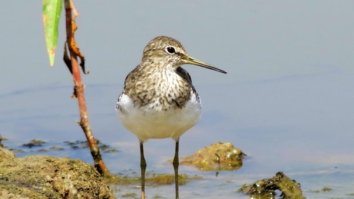](http://ecofriendlycoffee.org/wp-content/uploads/2014/07/2014.-JULYSLIDE-1.ECOFRIENDLY-COFFEE-151.jpg)

The chicks will usually remain in their winter grounds for the first summer of their lives. If the chicks can survive long enough, then they can live to be up to 12 years old.

[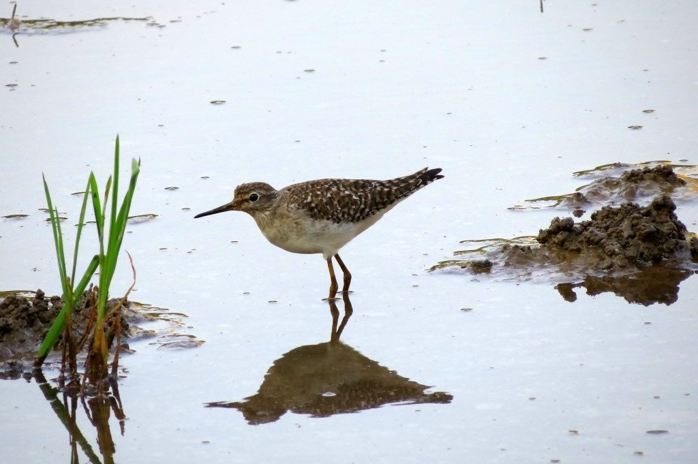](http://ecofriendlycoffee.org/wp-content/uploads/2014/07/2014.-JULYSLIDE-1.ECOFRIENDLY-COFFEE-7.jpg)

This species displays no sexual dimorphism in plumage, but females tend to be a little larger than males.

### **Reproduction**  

Common sandpipers are almost exclusively monogamous for each breeding season. The length of this pair bond is currently unknown. The male will defend his territory and his female by making threatening displays.

[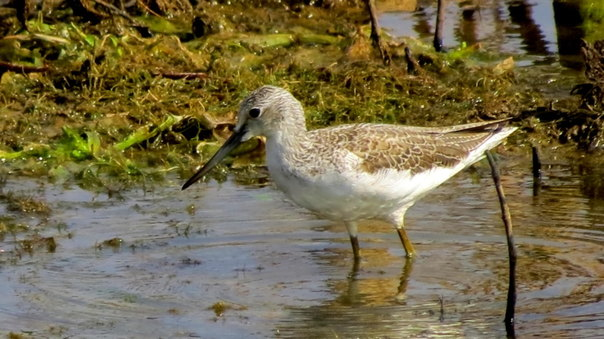](http://ecofriendlycoffee.org/wp-content/uploads/2014/07/2014.-JULYSLIDE-1.ECOFRIENDLY-COFFEE-231.jpg)

### **IUCN threat status**

Least Concern

[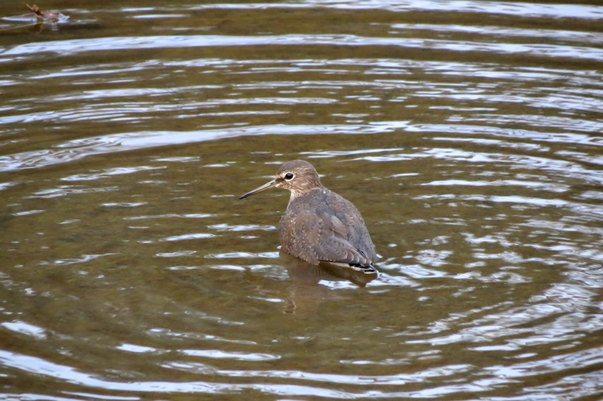](http://ecofriendlycoffee.org/wp-content/uploads/2014/07/2014.-JULYSLIDE-1.ECOFRIENDLY-COFFEE-19.jpg)  

The Common Sand piper is not considered endangered, although they do face their share of threats. We have observed that the population of Common Sandpiper in the Coffee growing regions of Karnataka State has undergone moderate declines overall in the past 20 years. However, the decline has been particularly steep in lowland wet lands because of the conversion of wetlands into coffee and arecanut plantations.

[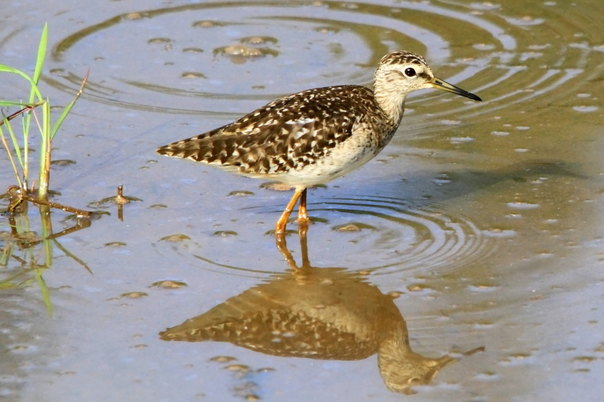](http://ecofriendlycoffee.org/wp-content/uploads/2014/07/2014.-JULYSLIDE-1.ECOFRIENDLY-COFFEE-261.jpg)

Although it is unclear whether the causes are related to climate change, changes in the species’ wintering habitats, or changes to stopover sites on its migration routes The loss has been steep particularly due to loss of feeding and hunting grounds available during their migrations.

[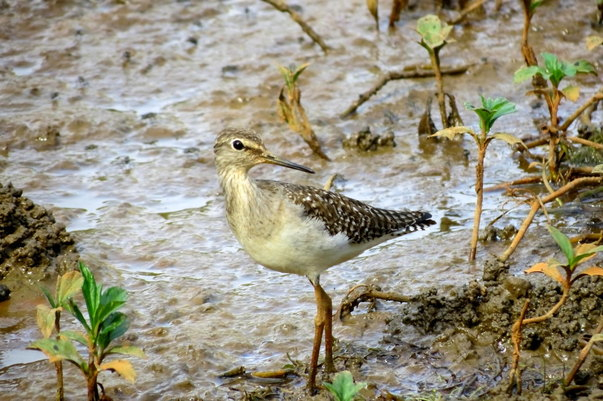](http://ecofriendlycoffee.org/wp-content/uploads/2014/07/2014.-JULYSLIDE-1.ECOFRIENDLY-COFFEE-101.jpg)

### **Conservation**  

The common sandpiper is listed on Appendix II of the Convention on Migratory Species (CMS or Bonn Convention), which aims to conserve migratory species throughout their range and is also listed on the Agreement on the Conservation of African-Eurasian Migratory Waterbirds (AEWA), which calls upon parties to undertake actions to help conserve bird species that are dependent on wetlands for at least part of their annual cycle. .However, there are not currently known to be any conservation measures specifically targeted at this small, widespread wader.

[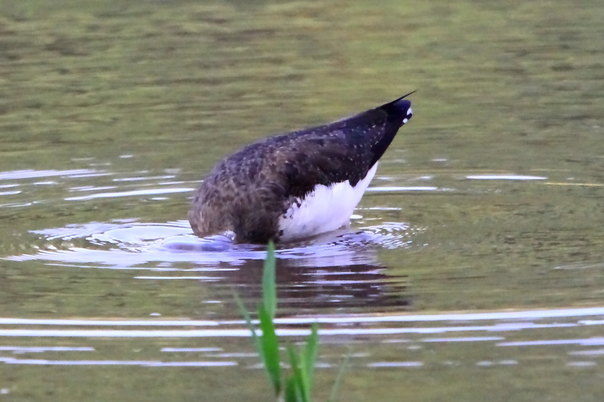](http://ecofriendlycoffee.org/wp-content/uploads/2014/07/2014.-JULYSLIDE-1.ECOFRIENDLY-COFFEE-251.jpg)

### **Conclusion**

Our greatest need today is for careful and rational field work on all birds inhabiting the coffee landscape and to learn from their interactions with the forest ecosystem. Disturbing the ecological cycle may change the local climate, which in turn will lead to wide scale implications for both regional as well as global climate stability. This has a profound impact on all bird communities.

[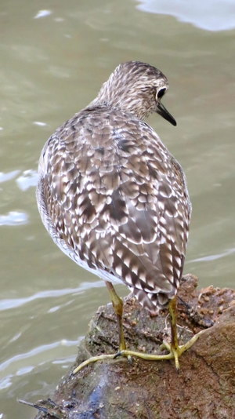](http://ecofriendlycoffee.org/wp-content/uploads/2014/07/2014.-JULYSLIDE-1.ECOFRIENDLY-COFFEE-27.jpg)

###  **References**

Anand T Pereira and Geeta N Pereira. 2009. Shade Grown Ecofriendly Indian Coffee. Volume-1.

Bopanna, P.T. 2011. The Romance of Indian Coffee. Prism Books ltd.

[https://www.flickr.com/photos/67484414@N08/sets/72157645179936518/](https://www.flickr.com/photos/67484414@N08/sets/72157645179936518/)