Shade grown Ecofriendly Indian coffee forests located in the heart of the Western Ghats can easily be considered as one among the top birding spots of the world. One of the richest bird areas, coffee forests act as an important route for migratory birds and a safe haven for resident birds.

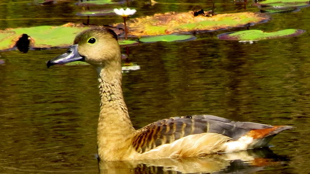

The Lesser Whistling Duck also known as Indian Whistling Duck or Javan Whistling Duck is a small chestnut coloured [whistling duck](https://web.archive.org/web/20150323153214/http://beautyofbirds.com/whistlingduck.html) which breeds in South Asia and Southeast Asia

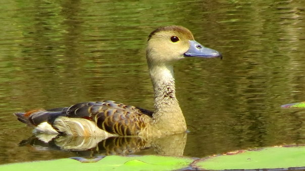

In literature it is also referred to as the tree duck. They often fly in a flock in V formation numbering 20 to 30 and whistle in chorus. Their whistling is shrill and sharp and when the entire flock whistles together it has an almost musical quality.

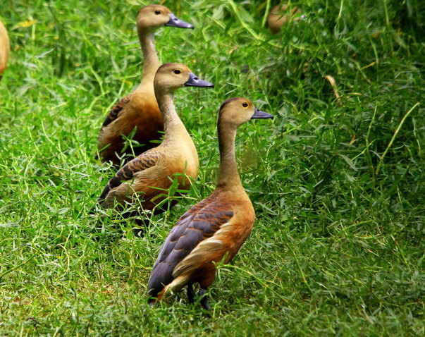

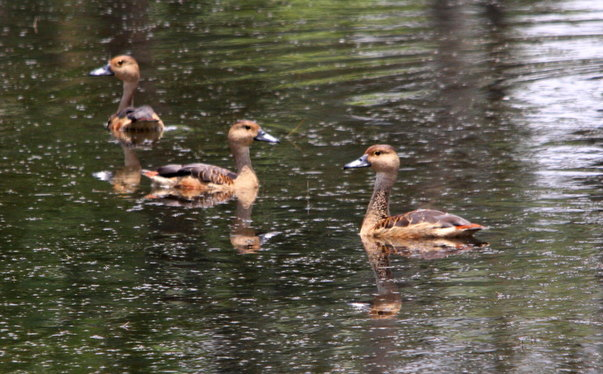

### The Classification table is as follows.

Scientific ClassificationBinomial nameKingdom

Dendrocygna javanicaAnimalia

Phylum

Chordata

Class

Aves

Order

Anseriformes

Family

Aanatidae

Genus

Dendrocygninae

Species

D. javanica

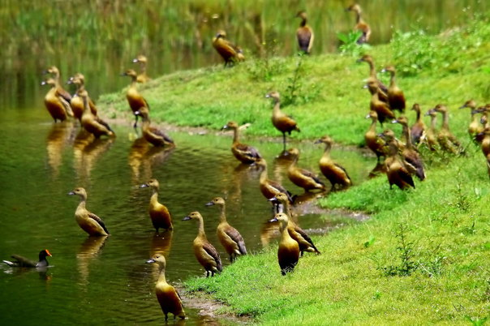

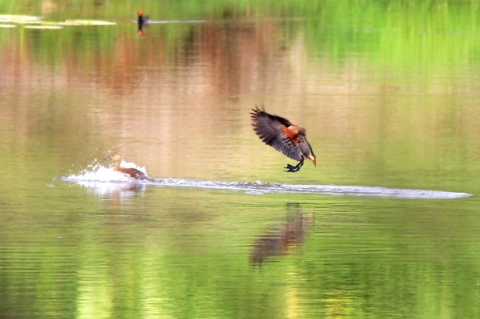

### Distribution

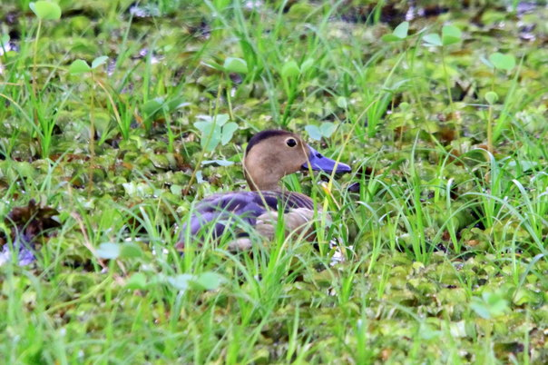

These birds are largely resident species. They sometimes fly from one lake to another in response to weather and availability of food.

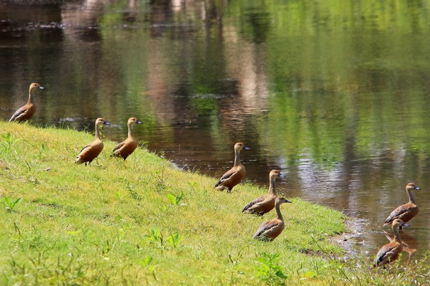

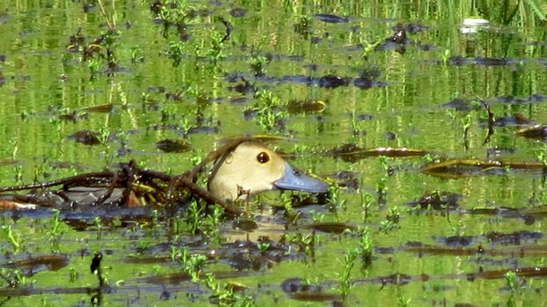

### Habitat

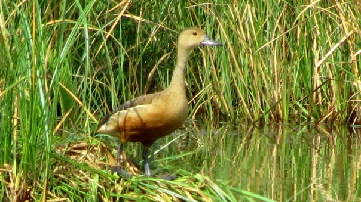

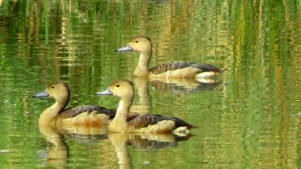

Whistling Teals prefer freshwater lakes with undergrowth and vegetation. They can also be observed near water bodies like ponds, rivulets, wetlands, marsh lands and streams. They are expert swimmers and divers.

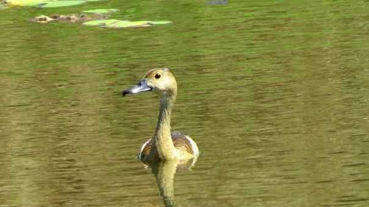

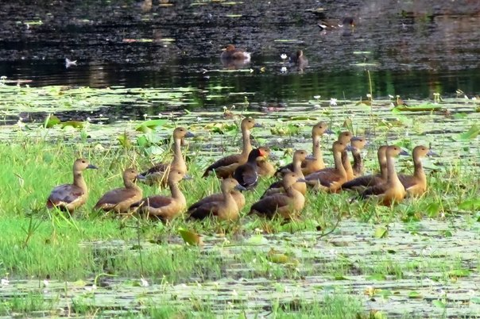

### Description

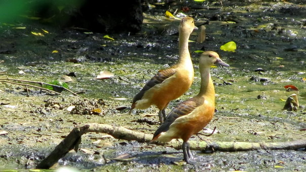

This species has a long grey bill, long head and longish legs. It has a buff head, neck and under parts, and a darker crown. The back and wings are darkish grey, and there are chestnut patches on the wings and tail. All plumages are similar.

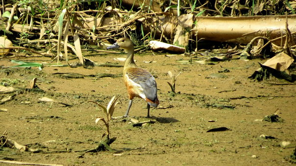

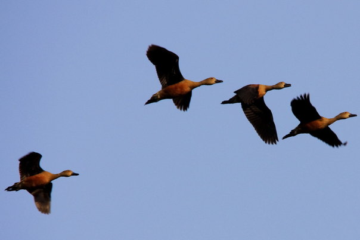

### Nesting

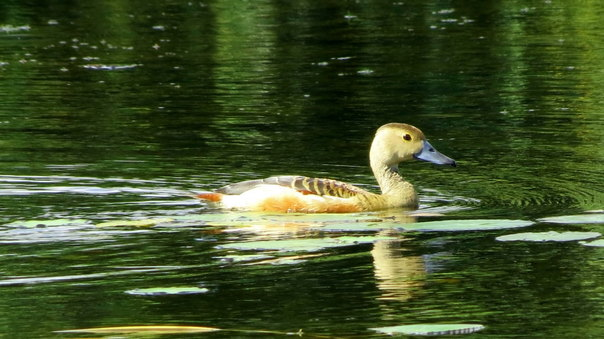

It nests in tree holes, old nests of other birds, or on a stick platform near the ground, and lays a clutch of 6-12 eggs. The female alone incubates the eggs.

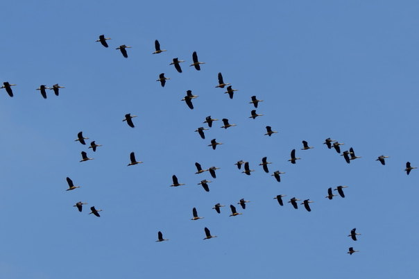

### Diet / Feeding

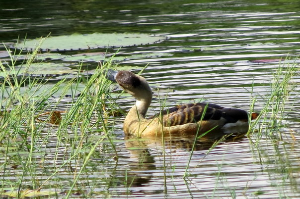

Ducks generally feed on the shoots, leaves and seeds of aquatic vegetation. They also eat larvae and insects and aquatic invertebrates. They generally feed mostly at night in small family groups.

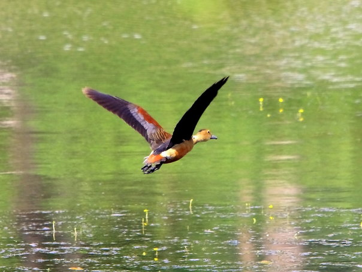

### Migration

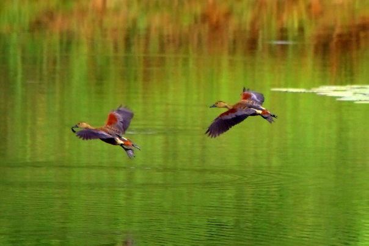

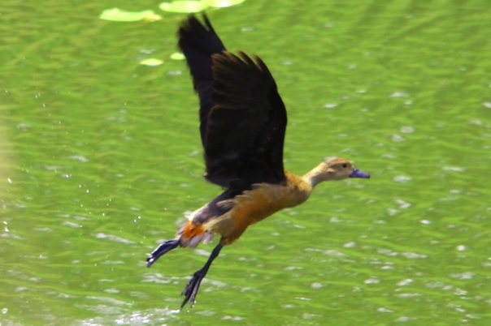

We have observed that the entire flock of lesser whistling teals are resident but numbers swell during winter, suggesting some degree of migration. We are not sure if the migration is local or to far off places. Unlike other ducks, males and females look similar, and there is no special breeding plumage.

### Reproduction  

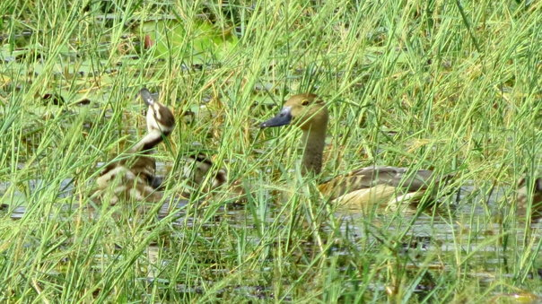

The season ranges from June to October in India.

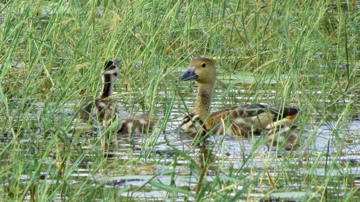

### Threats

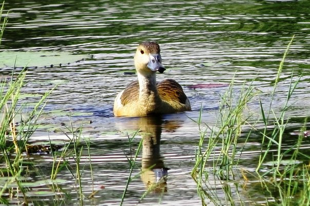

Major threats are due to habitat loss, disturbance and poaching. Shy and nervous, they fly off at the slightest hint of danger.

### Red List Category

 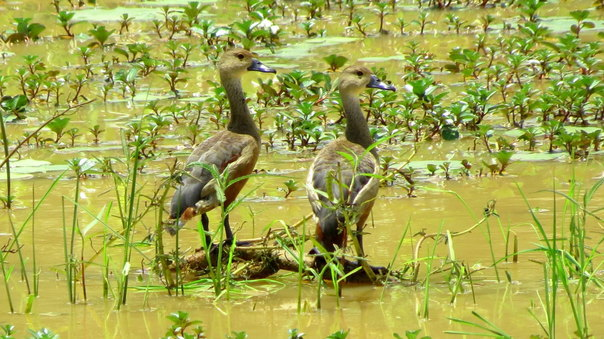

Classified as Least Concern (LC) on the IUCN Red List.

The species has an extremely large range, and hence does not approach the thresholds of vulnerable under the range size criteria.

### Conclusion

Our work with respect to coffee ecology spanning three decades has brought to light the immense bird biodiversity that is present inside coffee forests. However, we need to caution the coffee farming community that despite the biological riches within the confines of the coffee forests, we are in the midst of a biodiversity crisis, with many species on the brink of extinction because of man made changes.

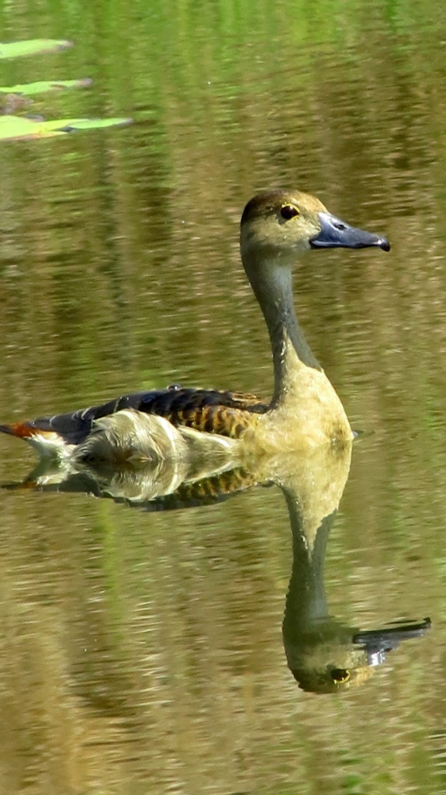

There are a number of reasons why understanding and preserving biological diversity is important for the success of coffee cultivation. In the web of life, every species is unique and the presence of a variety of different species helps perform a variety of roles under a variety of circumstances. The more species that are available inside the coffee ecosystem, the more likely it is that there will be some adapted to handle the outbreak of pest and disease incidence.

### References

Anand T Pereira and Geeta N Pereira. 2009. Shade Grown Ecofriendly Indian Coffee. Volume-1.

Bopanna, P.T. 2011.The Romance of Indian Coffee. Prism Books ltd. Perrins, C. (Ed.). (2003).

[https://www.flickr.com/photos/67484414@N08/sets/72157646699130299/](https://www.flickr.com/photos/67484414@N08/sets/72157646699130299/)

[http://en.wikipedia.org/wiki/Lesser\_whistling\_duck](http://en.wikipedia.org/wiki/Lesser_whistling_duck)