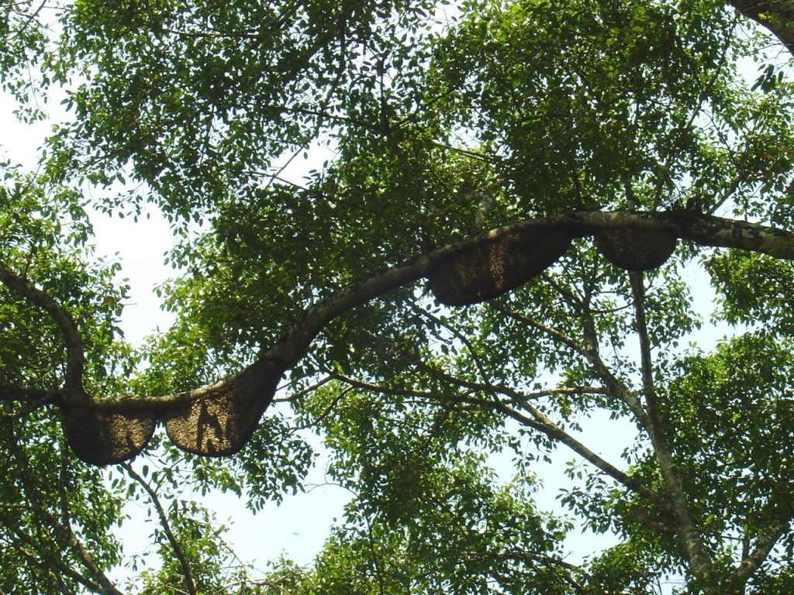
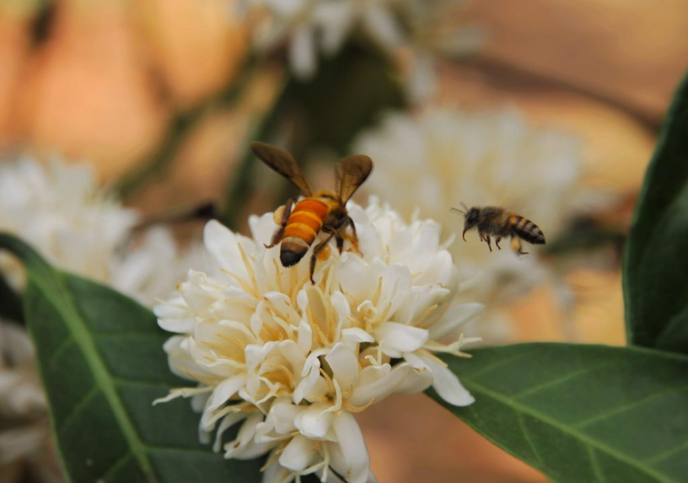
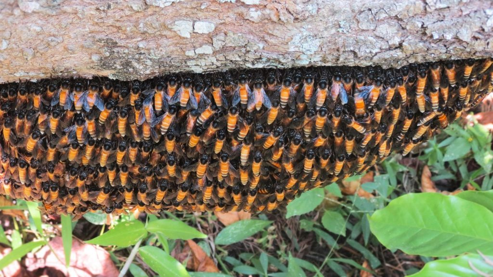
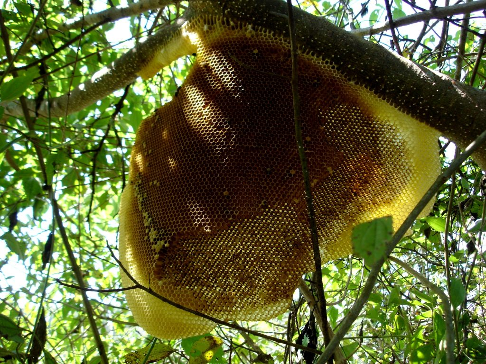
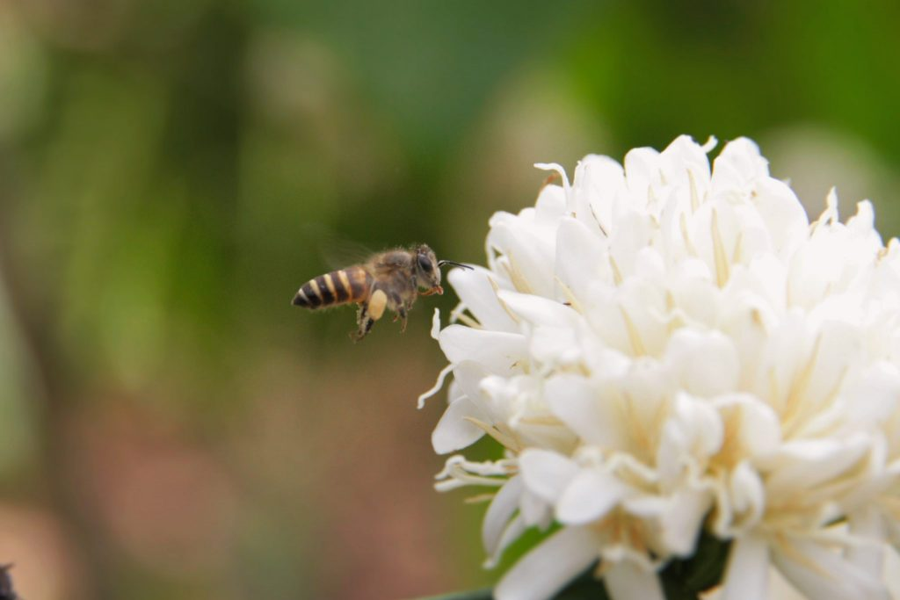
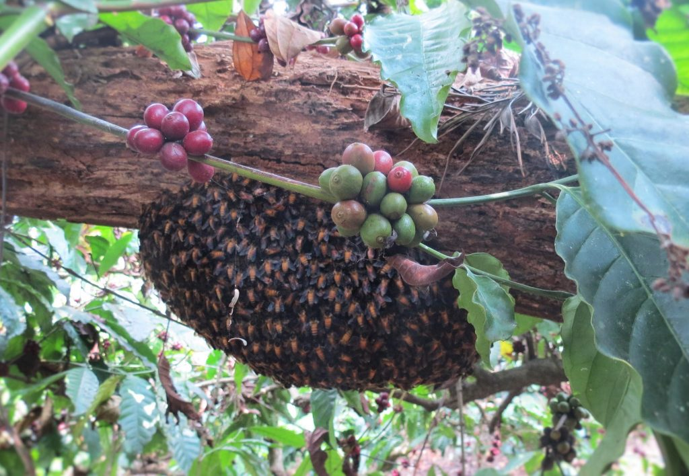
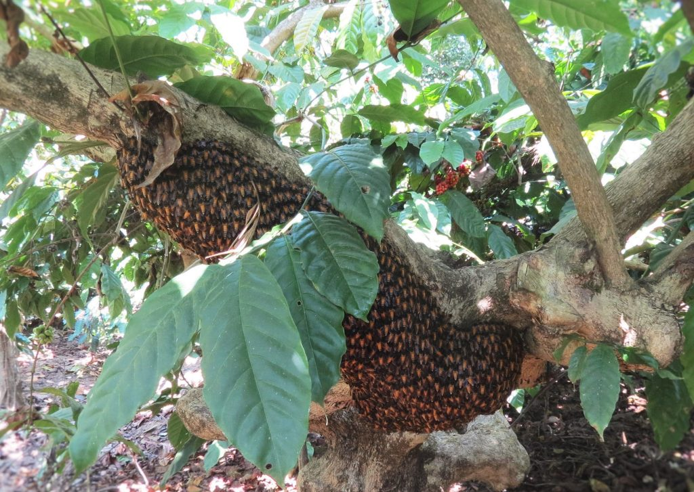
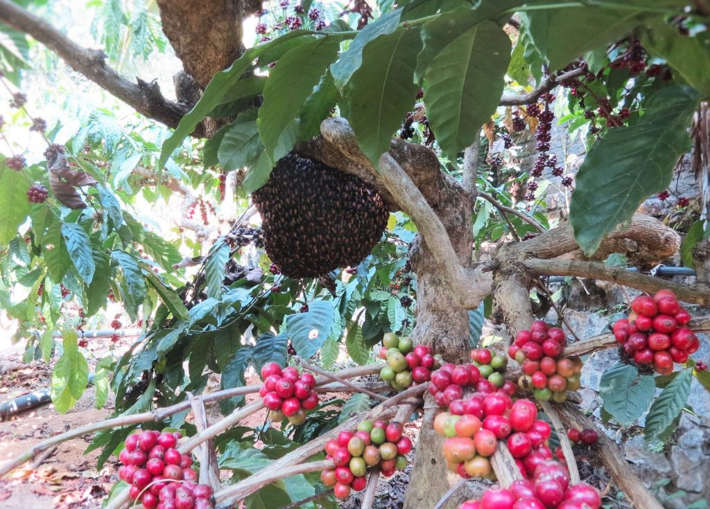
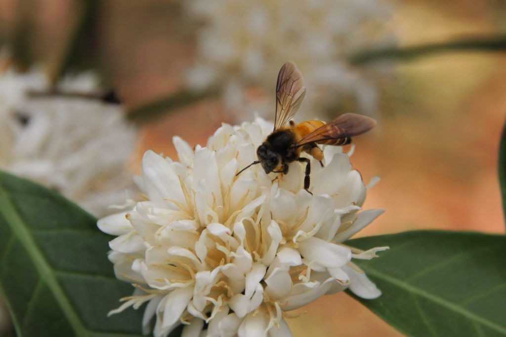

From the very inception of the Coffee Plantations, honey bees has been an integral part of the Coffee Forests. Coffee and bees has always enjoyed a symbiotic relationship. As a matter of rule, with very few exceptions, every Plantation is known to accommodate a select set of trees where large colonies of honey bees live. These colonies are resident all year round. It is important to understand the larger picture in terms of bee hives, bee population and their strength in numbers inside eco-friendly shade coffee. India’s eco-friendly coffee Plantations are located in the picturesque Western Ghats, famous for its biodiversity. This hotspot known for its rare and endemic species is home to over 6000 species of flowering plants and flowering trees which in turn act as a powerful magnet to attract wild honey bees. More than 16,000 species of bees, organised into seven families, are known to exist in the world.

A few decades ago, during coffee blossom one could see honey bees dancing from one flower to the other and hear the bee buzz , throughout the white carpeted coffee forest. All Coffee Planters took it for granted that these untiring bee workers, essential for cross pollination would do their work and also enable the Planter to harvest better yields of Coffee, multiple crops and honey. Our earlier articles on bee pollination elaborates  the crucial role of honey bees in enhancing the productivity of coffee and multiple crops. However, we also need to understand that bees are not only important for coffee and allied crops but the importance extends beyond, in terms of pollinating wild fruit trees, herbs, shrubs and vegetables which enable biodiversity to flourish.

It is only during the last decade that Coffee Planters have realized that despite good blossom showers and sprinkler infrastructure, there is a decline in fruit set and yield of both Robusta and Arabica, so also other multiple crops. They also realized that the single most important attribute to low yields was the absence or decline in population of honeybees.

Scientific research first reported massive die-offs of honey bee colonies in the early 1990’s. But the alarm bells within the Plantation Community didn’t really buzz until the summer of 2008. Review of literature in leading journals pertaining to the study of bees reports that a mysterious phenomenon known as colony collapse disorder was responsible for wiping out significant bee populations throughout the globe.

Rex Weyler, co-founder of Greenpeace warns that Worldwide Bee Colony Collapse is not as big a mystery as the chemical companies claim. In his personal opinion, “the systemic nature of the problem makes it complex, but not impenetrable. Rex, further states that Scientists know that bees are dying from a variety of factors – pesticides, drought, habitat destruction, nutrition deficit, air pollution, global heating, and so forth. The causes of collapse merge and synergise, but we know that humanity is the perpetrator, and that the two most prominent causes appear to be pesticides and habitat loss”.

Reasons for Decline

A Greenpeace scientific report identifies seven priority bee-killer pesticides – including the three nicotine culprits – plus clorpyriphos, cypermethrin, deltamethrin, and fipronil. The three neonicotinoids act on insect nervous systems. They accumulate in individual bees and within entire colonies, including the honey that bees feed to infant larvae. Bees that do not die outright, experience sub-lethal systemic effects, development defects, weakness, and loss of orientation. The die-off leaves fewer bees and weaker bees, who must work harder to produce honey in depleted wild habitats. These conditions create the nightmare formula for bee colony collapse.

### The Coffee Ecosystem & how bees are affected

Indiscriminate use of chemicals & Pesticides

More of monoculture (Shifting towards sun loving coffee by cutting down shade trees)

Parasites like mites/nematodes affecting colonies

Lack of wild flowering trees during the entire season.

Poor nutrition in terms of unavailability of varied diet of a mixture of pollen’s that is available in the surrounding grasslands, wetlands, or aquatic habitats. Coffee Planters are increasingly turning their attention towards creating a sterile condition that only favors coffee, chemicals and multiple crops. Al other flora is sprayed with herbicides to make room for economically important crops.

In recent years the mercury has touched 40 degree centigrade during the peak summer months and dipped to 14 degrees during the winter months. Also the erratic pattern of rainfall, with sudden cloud bursts, high velocity winds and nonseasonal showers has confused the wild as well as domestic bee species.

Every individual whether owner of agriculture land or otherwise needs to sit up and understand that honey bee’s survival is directly linked to our well-being. Just because some of our crops are self-pollinated, we may be under the false impression that disappearance of bees may not affect us in a big way. Eventually, it will lead to a collapse of our fragile ecosystem and lead to a negative impact on all other ecosystems.

### Consequences

Less bee population’s results in decline in fruit set.

Coffee pollinated by bees are heavier and denser

The Coffee out-turn too is better when crops are pollinated by bees.

We have also observed that induction of batch flowering by way of delay in sprinkling enables the limited bee colonies to pollinate the existing blossom and such flowers have a better fruit set in extreme environmental situations in terms of both drought and excess rainfall.

### Native Bees Vs. Managed Bees

Some of the native trees inside coffee forests are more than a hundred years old and reach out to the sky. A few of these trees are home to rock bees and other bee colonies.

We have no idea regarding the relationship between and among Native bee colonies found on trees, rocks or other plant material with managed bees kept in boxes.

We need to have answers as to whether the domesticated bees interfere with the wild bee colonies.

Whether the native colonies are better pollinators in comparison to the introduced species.

Whether the native colonies prefer traditional coffee varieties or hybrid high yielding varieties.

### Are there Any Solutions

Ban dangerous pesticides

Chemical weedicides to be replaced with manual weeding wherever possible.

Preserve 10 % area of the farm as a virgin forest,

The farm should have a strong organic input base.

### Conclusion

It is a fact that honey bee populations inside Coffee Plantations are dwindling at an alarming rate. This is a real troubling problem. The past few summers we have noticed that there were very few bee colonies. Habitat loss, chemical sprays and the decline of native plants seems to be the culprit.

Scientists had struggled to find the trigger for so-called Colony Collapse Disorder (CCD) that has wiped out an estimated 10 million beehives, worth $2 billion, over the past six years. Suspects have included pesticides, disease-bearing parasites and poor nutrition.

We are going to make a bold statement. Our attitude should be such that our Coffee Plantations should belong more to the bees than it does to the individual. All care should be taken to promote bees by introducing native flowering trees, native herbs, shrubs and other plant material. When we learn to understand that bees come first, then our survival and the well-being of the Planet is assured.

### References

Anand T Pereira and Geeta N Pereira. 2009. Shade Grown Ecofriendly Indian Coffee. Volume-1.

Bopanna, P.T. 2011.The Romance of Indian Coffee. Prism Books ltd.

[You Asked: Are the Honeybees Still Disappearing?](http://time.com/3821467/bees-honeybees-environment/)

[Why Are Honeybees Disappearing?](https://www.thoughtco.com/why-honeybees-are-disappearing-1203584)

[7 Bee Species Have Been Added to the US Endangered Species List](http://www.sciencealert.com/seven-species-of-bees-have-been-added-to-the-endangered-species-list)

[Staying Ahive](http://www.snopes.com/bee-species-endangered/)

[Death and Extinction of the Bees](http://www.globalresearch.ca/death-and-extinction-of-the-bees/5375684)

[Pollinators and Coffee background](https://web.archive.org/web/20160319084945/http://www.iubs.org:80/prg/pol_coffee_bg.html)

[Honey Bee Collapse: A Lesson in Ecology](http://www.greenpeace.org/international/en/news/Blogs/makingwaves/honey-bee-collapse-a-lesson-in-ecology/blog/45357/)