*Readers are requested to refer the article [INVISIBLE COMMUNICATIONS IN COFFEE PLANTATIONS](http://ecofriendlycoffee.org/invisible-communications-in-coffee-plantations/) for a better understanding of the present article.*

Think of Indian coffee plantations and the picture that flashes across the mind is tall evergreen mountains and steep valleys covered with trees, shrubs, herbs, spices and an array of insects and microbes. It is indeed Nature at its best. However, no one realizes that the health and wealth of the coffee mountain is constantly managed, regulated and transformed by invisible agents known as microorganisms.

So begins a partnership between microbes and coffee that lasts the lifespan of the coffee farm. These agents which cannot be seen by the naked eye are less than one micron in size but the work they do is astonishing. They are part of the dynamic environment within the heart of the coffee mountain.

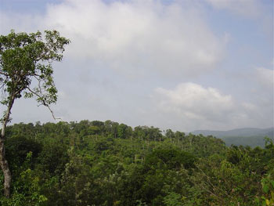

Microorganisms are a vital link in the establishment of ecologically sound plantations. The total weight of soil microorganisms is about 0.1 % of the total weight of the top one foot of soil. The bacterial population is close to 20 million per gram of soil on dry weight basis and they may contribute about 400 lb per acre, the actinomycetes and fungi may range from 25,000 to one million per gram of soil and may contribute 500 lb per acre; the algae may account for a few 100 lb, protozoa about 250 lb, nematodes about 50 lb per acre foot of soil. Among the larger forms are the earthworms, myriapods, insects like collembolan, beetle larvae, fly larvae, wireworms, ants, mites, snails etc.

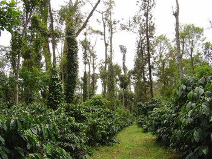

Down the ages, coffee farmers world wide knowingly or unknowingly, have been totally dependent on microbes for various transformations and life processes. The degradation of plant and animal residues and the resultant build up of soil organic matter and humus is largely due to the activity of various microorganisms.

Today, with a better understanding of the various microbial processes, coffee farmers globally have improved their farming practices for better yields as well as qualitative improvements of the bean. Farmers who understand the language of the microbes find them increasingly attractive in using them as a tool for bringing about a qualitative as well as quantitative change on the coffee farm.

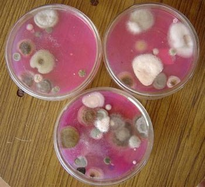

To exploit the usefulness of microorganisms we need to recognize and capitalize on their potential but the fundamental rule is in the understanding of various relationships between and among members of the microbial world. These relationships are pretty complex.

Hence this article is written keeping in mind the global coffee farming community and helping them understand the comprehensive role played by these fascinating microbes in maintaining the vital links of nature within the heart of the coffee mountain and the significant relationships they hold in nurturing the health of the plantation.

After all the majority of microbes are beneficial to mankind. In the Indian context shade grown coffee plantations with large deposits of plant and animal residues provide a ideal substrate made up of complex carbohydrates, simple sugars, cellulose, hemicellulose, proteins and hydrocarbons for the proliferation of billion of beneficial microbes. The relationship between microorganisms and plant growth and development may be direct or indirect.

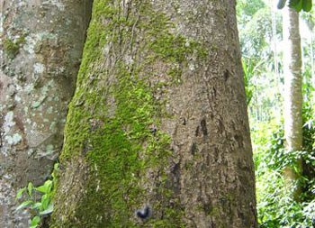

The coffee ecosystem is characterized by a complex and diverse interrelationship among and between microorganisms. These relationships could be positive, negative or neutral.

Broadly these relationships can be grouped as INTRASPECIFIC or INTERSPECIFIC.

Intraspecific relationships refer to microbial interactions within the same species, where as Interspecific relationships occur among microbial communities belonging to different species. The long term advantage of understanding these microbial relationships is that the coffee farmer is better equipped in determining the fitness levels of his farm and there by optimize his resources.

The interspecific relationships may be broadly classified as SYMBIOSIS; ANTAGONISM; NEUTRALISM.

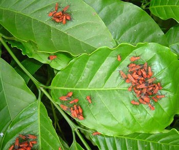

### Symbiosis

Two partners are involved in this association, commonly referred to as the MACRO and MICRO symbiont. Both the partners are benefited, while none is harmed. Infact, one partner cannot do without the other. In the literal sense it is something like a husband and wife relationship. Symbiosis can be further classified as MUTUALISIM, COMMENSALISM, and PROTOCOOPERATION.

### Antagonism

In spite of two partners being involved in the association, only one species is benefited at the cost of the other. Hence one species is harmed. Antagonism can be further classified as ANTIBIOSIS, PARASITISM, PREDATION, and COMPETITION.

### Neutralism

Both the populations are not affected by each others presence.

### Mutualisim

In simple terms this association involves two partners where both are benefited. A classical example is the legume rhizobium symbiosis where the legume acts as a host for the rhizobium bacteria. The rhizobium bacterium harvests the atmospheric nitrogen and in turn passes it to the plant for its growth and development and the plant in turn protects the rhizobium from oxygen damage by building up nodules.

A similar relationship exists in the Azolla anabaena symbiosis. In this relationship the association is between a fern and an alga. The algae are capable of deriving nitrogen from the atmosphere and supplying it to the fern in the available form and the fern in turn protects the algae from oxygen damage.

Mutualism is a highly organized and complex web in the evolutionary ladder, primarily to allow both the partners to thrive and survive in habitats that neither could occupy alone. Evolution, down the ages has provided specialized structures to both the macro and micro symbiont to enable the smooth transfer of gases and nutrients. In coffee plantations such associations are common.

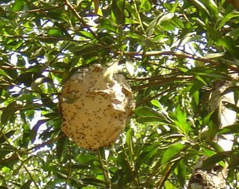

### Consortium

Two or more members of the microbial community in which each organism benefits from the other. The group may collectively carry out some processes that no single member can accomplish on its own.

### Commensalism

One species of microorganisms benefits from the interaction of the other and the second remains unaffected. Both the partners do not enter into any kind of physiological exchange. The association may be temporary or permanent. The floor of the coffee plantation is littered with thousands of tons of biomass in various forms, right from green leaves to dead woody material or animal carcass.

Microbial communities constantly act on this organic debris. The action of one species of microorganisms paves the way for the build up of the other resulting in the ultimate biodegradation of all bio matter. Commensals attached to the outer surface of the host are termed ECTOCOMMENSALS and those found inside the host are referred to as ENDOCOMMENSALS.

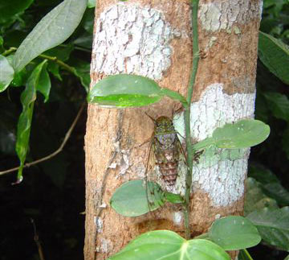

### Advantages

-   Nutritional availability
-   Transportation
-   Protection
-   Living space

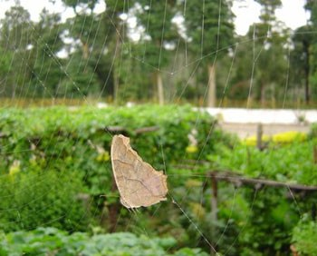

### Protocooperation

Two species of microorganisms deriving mutual benefit, but not necessarily obligatory for the existence. For e.g. Lichens on nitrogen fixing Erythrina indica. Lichens are the combination of algae and fungus. Together the two organisms live in places where neither could survive alone.

### Syntrophy

The interaction of two or more microbial populations that supply each other’s nutritional needs. For e.g. Supply of growth promoting substances.

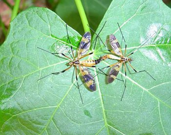

### Negative Interactions

1.  Competition
2.  Predation
3.  Amensalism
4.  Parasitism

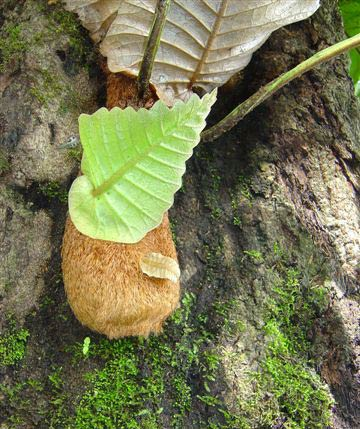

### Competition

In competition two populations of microorganisms compete for the same substrate. The substrate acts as a limiting factor and has a negative effect on the microbial population. For e.g. During organic matter decomposition inside the coffee plantations, at times carbon is the limiting factor. Also whenever pure cultures are applied to the field, they fail to establish because the native strains use up nutrients more efficiently than the introduced strains.

In Competitive exclusion one species of microorganism is squeezed out of the habitat by another.

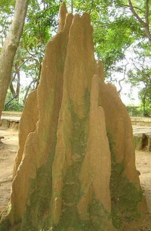

### Predation

Predation is commonly associated with the idea of the strong attacking the weak. One set of microorganisms suppresses the growth of the other by feeding on it and reducing its numbers. In nature protozoans engulf bacteria.

### Amensalism

Amensalism is the relationship between two populations, in which one set inhibits the growth of the other by producing inhibitory substances like antibiotics, while the other remains unaffected. Some group of microorganisms like algae produce extra-cellular by products which inhibit the growth of other algal species. This is referred to as antibiosis.

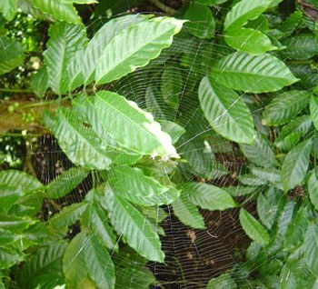

### Parasitism

Represents a negative interaction which has great ramifications. In this interaction it is case of the weak attacking the stronger. One species of microorganisms benefits to the detriment of the other species. The beneficiary group of microorganisms is known as Parasites and the one that is affected is known as host.

The difference between Predation and Parasitism is that in parasitism the host is killed very slowly (over a period of time); where as in predation the prey is killed immediately.

### Kind of Parasites

Temporary or Partial parasites: The organisms spend only a part of their life cycle as parasites.

Permanent parasites: The organisms spend its entire life cycle as a parasite.

External parasites: or ectoparasites: Are generally found on the outer surface and derive their nourishment from the body of the host.

Endoparasites: or internal parasites: Are found within the body of the host.

Facultative parasites: Some parasites are parasitic only on a need basis. They remain free at other times.

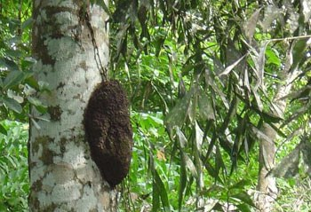

### Conclusion

The coffee farm is a self contained eco system. Large trees shade smaller trees and the coffee bush in turn shades the soil system from direct sunlight. The biomass accumulated on the forest floor brings about energy transformations and energy exchanges within and between living things and the coffee environment.

Decomposition of organic residues and returning essential plant nutrients to the soil is carried out by microorganisms. These nutrients then move along the food chain and are made available to higher forms of life. Understanding and applying principles of microbial behavior will go a long way in maximizing the locked up energy within the plantation.

By going one step further, these relationships whether positive or negative provide rare insights into the natural mechanisms taking place in nature. This knowledge is of enormous significance in dealing with pest and disease incidence and also in improving the qualitative aspect of the farm. Our recent articles show us that different species of microorganisms are communicating with each other and the surrounding habitat.

Each species uses its own highly effective ways of communicating and quite surprisingly, this balance in nature is maintained unless or otherwise disturbed by man and his activities. Ultimately, the chance of success depends on the build up of a stable microbial population. The benefits outweigh the risks. What’s really exciting is that if we take the time, we can learn more. We may actually be able to decipher the needs of the biotic community and profoundly influence the benefits of shade grown ecofriendly coffee.

At JOE’S SUSTAINABLE COFFEE FARM, We start with basic assumptions, but when we learn more, we keep changing them to suit the current trends. Our views are shaped by stories filled with tradition, ancestral wisdom and scientific truths. It reinforces the magic and mystique of the coffee forests that everything inside the coffee mountain is inter connected with the web of life.

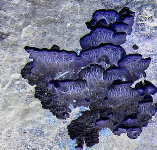

### REFERENCES

[Farm Coffee Organic Manures](http://ecofriendlycoffee.org/farm-coffee-organic-manures/)

[The Fine Art of Composting In Coffee Plantations](http://ecofriendlycoffee.org/the-fine-art-of-composting-in-coffee-plantations/)

[Organic Matter Decomposition In Coffee Plantations](http://ecofriendlycoffee.org/organic-matter-decomposition-in-coffee-plantations/)

[Soil Water Conservation in Coffee Plantations](http://ecofriendlycoffee.org/soil-water-conservation-in-coffee-plantations/)

[Coffee Plantations A Multidisciplinary Approach](http://ecofriendlycoffee.org/coffee-plantations-a-multidisciplinary-approach/)

[Invisible Communications in Coffee Plantations](http://ecofriendlycoffee.org/invisible-communications-in-coffee-plantations/)

Anand Titus Pereira. 1990. Endorhizosphere Bacteria of Wetland Rice , Their Hydrogen Dependent chemolithotrophy, P Solubilization And Interaction With Rice Genotypes. Thesis submitted to the University of Agricultural Sciences, Bangalore for the award of the Degree OF Doctor of Philosophy in Agricultural Microbiology.192 Pages.

Alexander ,M. 1974 . Microbial Ecology. New York. John Wiley and sons.

Alexander ,M. 1977 . Introduction to soil Microbiology. 2nd edition. New York. John Wiley and sons.

Atlas, R.M. and R. Bartha. 1993. Microbial Ecology : Fundamentals and application. Third edition. Benjamin/Cummings Pub. Co. Newyork.

Brock. T. D. 1979. Biology of Microorganisms. Third Edition. Englewood Cliffs. Prentice-Hall.

Kotpal ,R.L. and N.P. Bali. 2003. Concepts of Ecology. : Environmental and field biology. Vishal Publishing Compamy.India.

Killham. K . 1994. Soil Ecology. Cambridge University Press, Cambridge. England.

Paul. E.A. and Clark. F. E. 1996. Soil Microbiology and Biochemistry. Academic Press.

Pelczar. M.J.Jr; R.D. Reid and E.C.S. Chan. 1977. Microbiology. Fourth Edition. New York. Mc.Graw-Hill.

Peter J. Bottomley, 2002. Microbial Ecology (chapter 8). In Principles and applications of soil microbiology. Edited by David M Sylvia, J.J. Fuhrmann, Peter G Hartel and David A Zuberer. Prentice Hall. Upper Saddle River, NJ 07458

Rovira. A. D. & C. B. Davey. 1975. Biology of the rhizosphere. In E.W. Carson, ed;The plant root and its environment. University Press of Virginia, Charlottesville.

Rangaswami. G and Bagyaraj, D. J. 2001. Agricultural Microbiology. Second edition. Prentice-Hall of India Private Limited. New Delhi.

Subba Rao. N.S. 2002. Soil Microbiology (fourth edition of soil microorganisms and plant growth) Oxford and IBH Publishing CO. PVT. LTD. New Delhi.

Stevenson. F. J. 1982. Humus Chemistry. Wiley-Interscience, New York.

Kelly. D. P. 1978. Microbial Ecology. In K.W.A. Chater and H.J. Somerville (eds ). The oil industry and microbial ecosystems. Heyden and Son , London .

Tilman. D. 1982. Resource Competition and Community Structure. Princeton Unioversity Press, Princeton , NJ.

Yarmolinsky. M. B. 1995. Programmed cell death in bacterial populations. Science 267 : 836-837.