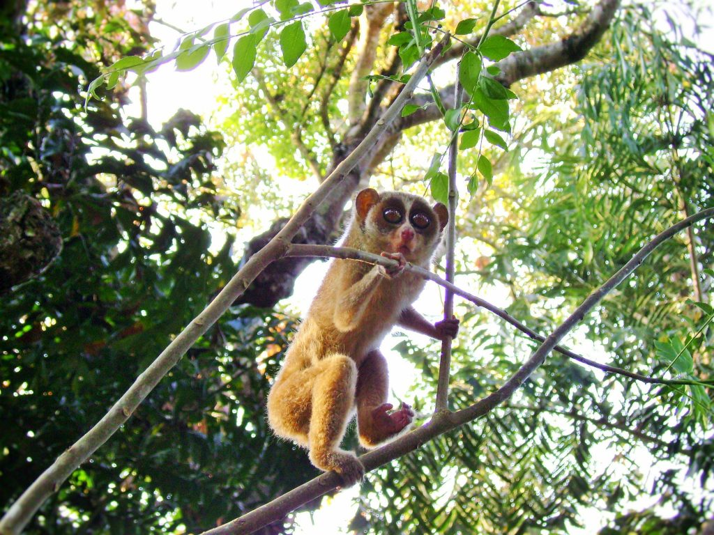
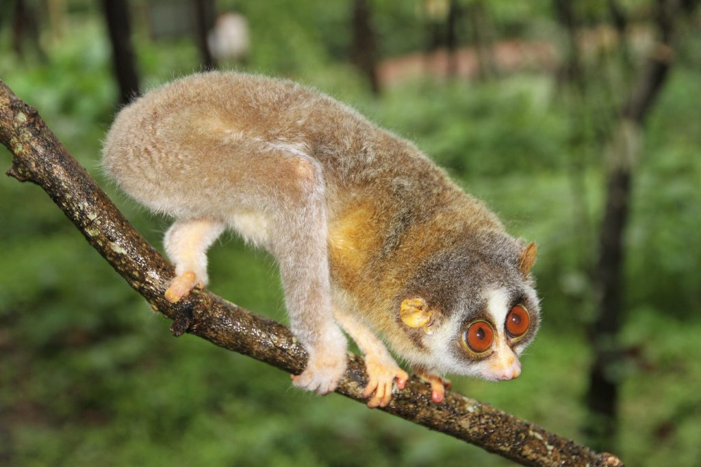
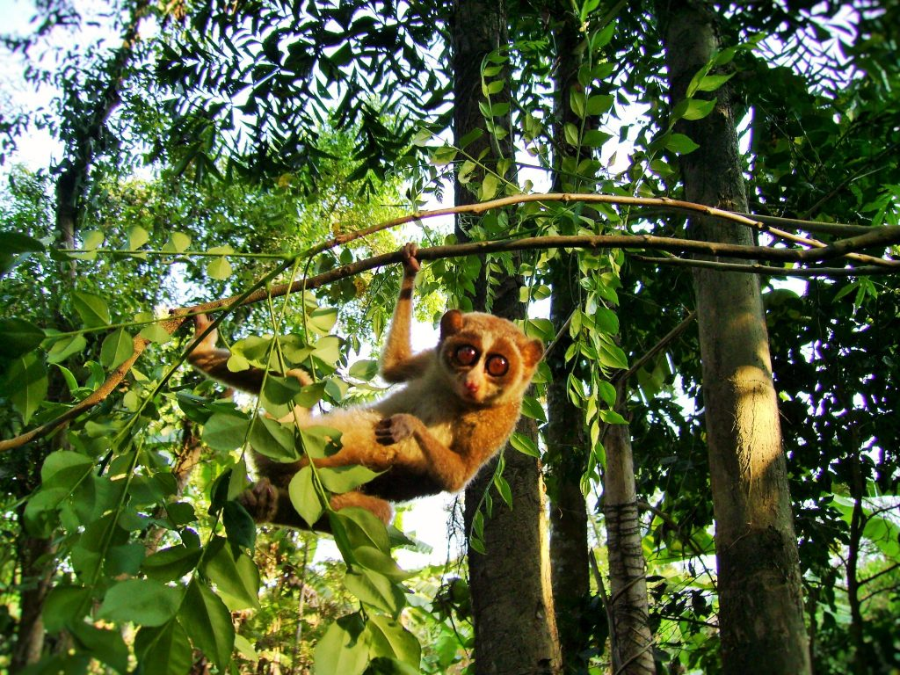

We have trekked the dense Western Ghat forest range for over three decades and have recorded the flora and fauna present in Coffee forests, for the benefit of future generations. This amazing stretch of forests has been designated as one among the 8 mega biodiversity hotspots of the world. The Western Ghats comprises less than five percent of the total land area of India but contains an estimated 25 % of the country’s non marine vertebrate animals.  It is home to a range of 350 globally endangered wild animals, both big and small. In one of our recent treks, we were fortunate to have spotted the Slender loris, which is pretty rare. Loris **tardigradus** **malabaricus** is only found in India. The maximum concentrations of these beautiful and delicate animals are only found in a narrow belt of the Western Ghats. The slender Loris is included in the list of more than 30 species which are listed as endangered in India by the International Union for conservation of Nature and Natural Resources (ICUN). It positions the slender Loris in the same endangered category as that of the Asian elephant, Indian rhino, Lion tailed Macaque, snow leopard, royal Bengal tiger and the blue whale. The fact of the matter is that to date no study has been undertaken to find the exact population of slender Loris.

Common name Slender loris

Genus Loris

Scientific name tardigradus malabaricus

Sub species : Six

Type Mammal

Diet Insectivores

Size Up to 6 to 10 inches long with a small vestigial tail.

Weight. Ranges from 400 to 500 grams.

Morphology.The slender Loris is about the size of a small baby monkey. It has unusually long arms and legs. It measures between 8 to 10 inches in length and has a small vestigial tail. It weighs approximately 400 grams. The distinctive feature of the slender Loris is its two large dominant brown eyes shining like pearls in a round head. The huge round eyes provide excellent night vision. The nose bridge is pretty long and the eyes are surrounded by dark brown to black circles of fur. The prominent ears are large and round. It has a beautiful fur coat which appears golden brown to silvery in color. It also has small finger nails. The animal moves slowly among twigs and branches but has a tight grip on whatever it holds. Its movement is slow and precise. Unfortunately, unlike monkey’s slender lorises cannot jump from one tree to another, but with their long arms and legs they can bridge significant distances.

Habitat. Slender lorise’s roll up in a ball and take refuge in tall evergreen trees. They are known to hunt in pairs and it is not unusual to find a few solitary hunters. They approach their prey slowly and stealthily before reaching out and grabbing it with both hands. They have efficient grasping hands and opposable thumbs. They are known to share food with other members of their family. They live either alone or with a mate and an infant.

Habitat. Tropical rain forest, montane and scrub forest.

Females. Have two pairs of mammary glands

Mating. Twice a year; in April-may and October-November. Females reach sexual maturity in 10 months and males in 18 months. Female slender lorise’s hang upside down during mating.

Gestation. 166 – 170 Days

Off-springs. Normally two every 9 to 10 months.

Life span. 12- 15 YEARS.

Diet. Insects, leaves, tender shoots and eggs of birds.

Mode of Escape. When confronted with danger, they immediately freeze, until the danger passes away.

Special Feature. Slender Loris is known to eat beetles that have a foul smell and other insects which are quite poisonous. They neutralize the toxicity by wiping their hands and body with urine.

Decline in population. Local tribes believe that the slender Loris has magical, medicinal and mystique powers. Hunted for centuries by locals for its purported qualities as an aphrodisiac, asthma cure and other ailments .Large populations were eliminated for use in supposed remedies for eye diseases and also for use as laboratory animals. Other threats include electrocution, road accidents and smuggling for pet trade. Many tribal people connect the slender Loris with bad luck. Hence the minute they see them, they kill the primate.

In spite of stringent wildlife Protection acts, which stipulate a penalty of 25,000 rupees (500 U.S.dollars) and five years in prison, for people who harbor this rare primate, the trade is flourishing because the premium paid to smugglers is approximately twice the value of the fine. The skin and toe nails are dried and worn as a charm by many people who care less about the environment.

Large scale forest destruction, fragmentation and fires have destroyed their habitat too.

ICUN conservation status Loris. t. tardigradus is classified as Endangered on the 2006 IUCN Red List, whereas L. t. nycticeboides is classified as Critically Endangered.

Related Species**.** The [slow Loris](https://web.archive.org/web/20180323160952/http://lemur.duke.edu:80/slow-loris/) (*Nycticebus coucang*) and [pygmy slow Loris](https://lemur.duke.edu/discover/meet-the-lemurs/pygmy-slow-loris/) (*Nycticebus pygmaeus*) live in the same *general* area, and are similar in behavior to the slender Loris.

### Conservation

-   Protecting dense forests and establishing migratory corridors from one forest to the other not only within the country but across countries wherever possible.
-   Ban on the use of these animals as pets.
-   Educating locals on the ecological significance of protecting these rare animals.

### Conclusion

The slender Loris is a small nocturnal primate. It spends most of its life on tall trees. They can adapt to both wet and dry forests as well as lowland and highland forests. They prefer thick thorny vegetation which comfortably hides them from predators. They are not vegetarians, and their diet consists of small insects, lizards and fruits. Unfortunately, due to timber logging and expansion of agricultural activities, their habitat is severely depleted resulting in an alarming loss in numbers.

There are many areas which lack sufficient scientific facts regarding the Slender loris. Little information exists concerning reproduction in slender lorises. The entire process, from copulation to independence of offspring, is not fully understood. Also,  there is no information available regarding communication and perception in slender lorises. Regarding Predation, more scientific work needs to be carried out. Another important role that needs to be understood is regarding the ecological role of slender lorises.

### References

Anand T Pereira and Geeta N Pereira. 2009. Shade Grown Ecofriendly Indian Coffee. Volume-1.

Bopanna, P.T. 2011.The Romance of Indian Coffee. Prism Books ltd.

[Slender loris](http://www.blueplanetbiomes.org/slender_loris.htm)

[animal](https://animaldiversity.org/accounts/loris_tardigradus/)

[wwf](https://www.wwfindia.org/about_wwf/priority_species/lesser_known_species/slender_loris/)

[wikipedia slender loris](http://en.wikipedia.org)

[Animal corner](https://animalcorner.co.uk/animals/slender-loris/)

[Red Slender Loris](http://www.edgeofexistence.org/species/red-slender-loris/)