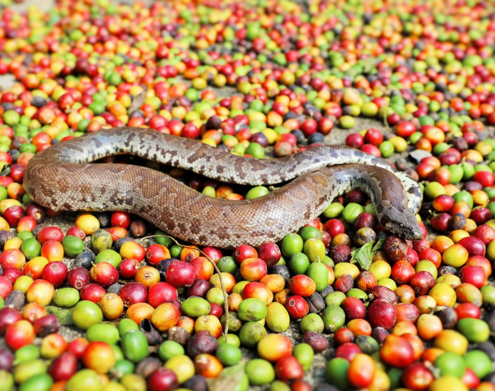
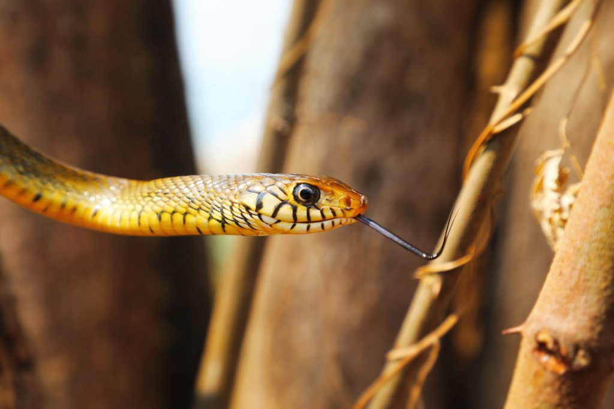
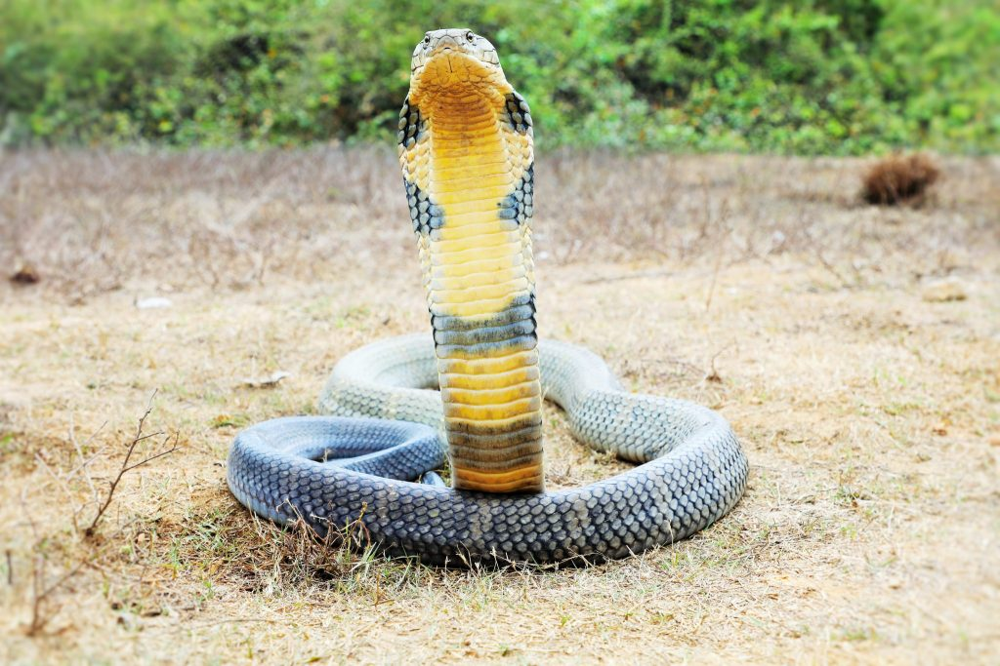
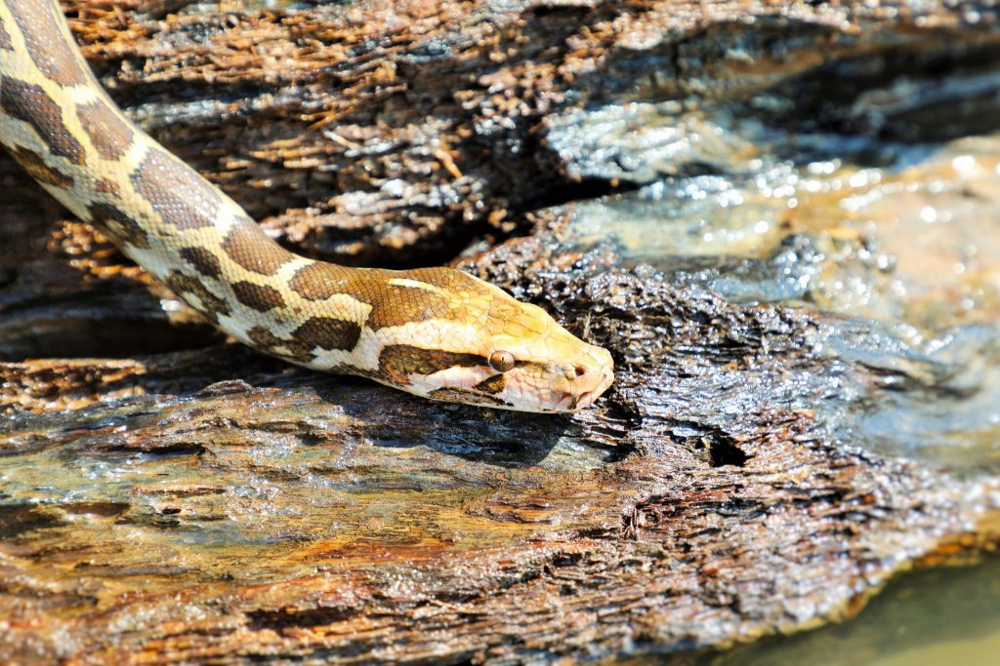

Coffee forests in India are unique because of the multi-tiered shade system and the evergreen canopy provided by a diverse array of shade trees . The floor of the coffee forest is always full of leaf litter keeping the soil temperatures low. This is indeed an ideal habitat for all types of snakes and reptiles.

Among reptiles, snakes are most closely related to monitor lizards and Gila monsters. All these creatures have forked tongues and sense organs on the roofs of their mouth.

All snakes are gifted with five main senses, namely sight, hearing, smell, taste and touch. These senses help the snakes to find a mate, to detect prey as well as ward off danger. Different species of snakes have evolved specific senses that allow them to thrive in vastly different environments, from the floor of the coffee forest to the evergreen canopies. It is important to note that, in each snake species, the sense of sight, hearing, smell, taste and touch is uniquely developed to suit a particular snake species depending on its habitat.

### Touch

The sense of touch is highly developed in Snakes. Since the snakes elongated body is in touch with the ground most of the time, the snake’s body contains many tactile receptors that are highly sensitive to any changes in the environment.

### Smell /Taste

Chemosensory perception in snakes is highly advanced. Most snakes have an excellent sense of smell, in part to make up for their poor eyesight and limited hearing. A snake’s tongue has few taste buds. Snakes use their tongues for collecting chemicals from the atmosphere or ground. The tongue does not have receptors to taste or smell. The tongue is bifid. The tongue gathers scent particles from the surrounding air and while the tongue is withdrawn, transfers them to a structure called Jacobson’s organ for perception.

### Hearing

Even though snakes do not have external ears they do have very powerful internal ears. These inner ears pick up low frequency waves or vibrations. The snakes’ sensitivity to aerial waves is pretty much limited. For example, while human beings are able to hear aerial vibrations between 20 and 20,000 Hz, snakes can only detect vibrations between 50 and 1,000 Hz. Even though they have such limited hearing range, in some species it has been observed that they are able to receive vibrational stimuli with any body part, as these are transmitted through the bodily tissues to the columellas.

### Sight

All snake eyes are covered and protected by a transparent scale called a braille. Snakes do not have keen senses of sight. Some snakes hunt only at nights and some during dawn or dusk. Hence the time of day has a significant bearing on the snake’s vision capability. There is no hard and fast rule but generally speaking nocturnal (Night) and crepuscular snakes usually have vertical pupils. Diurnal species generally have rounded pupils. Snakes do not see colors, but their eyes are equipped with a combination of light receptors: rods that provide low-light but fuzzy vision, and cones that produce clear images. Snakes can see objects clearly at short distances and these snakes belong to the ground dwelling species. However, arboreal snakes has very well developed eyes and most of them have stereoscopic vision. Snakes living in such tree habitats generally have oversized eyes. Many arboreal snakes like this green vine snake (Ahaetulla nasuta) present horizontal pupils which allow them to have a wider range of vision, making it easier to calculate the distance between one branch and another.

Colour vision can be found in a few snake species. Scientific literature states that tropical snakes would be more likely to have colour vision than their desert relatives and their skin generally reflects this.

There are species of snakes that have infrared vision too. This allows them to see the body heat of things around them. They can detect the location and the size.

### Heat Receptors

Snakes detect both the visible light, and the infrared radiation. Certain snakes have special heat sensitive pit organs. Pit vipers and other snakes have heat-sensitive, infra-red-detecting facial pits that allow them to detect prey several meters away. These pits are extremely sensitive and can detect temperature changes of up to 0.001°C. Pit vipers have two pit organs, one on each side of the head between the eye and nostril. They are extremely sensitive to small changes in the temperature and are used to locate warm-blooded prey.  Some sand boas and pythons have many pits along the lip of the upper jaw. Dr.Gareth Evans reports that many of the colubrid snakes possess specialised organs around their vents and lower jaws which play a role in courtship and mate selection, while rattlesnakes and pit vipers have developed infra-red sensors that enable them to sense the body heat of their warm-blooded prey.

Different species of snakes are equipped with varied heat sensing Mechanisms. According to Romulus Whitaker (Leading Herpetologist) the heat sensitive pits between the nostril and the eye in pit vipers can detect temperature change as slight as three thousands of a degree centigrade. He further states that Pits are very helpful in finding warm blooded rodents or birds or even a slightly warm frog or toad on a cool dark night. Pythons have similar infrared receptors along their upper lips. Despite having fewer pits, the pit vipers’ ones are more sensitive that the ones of the pythons.

### Conclusion

Snake senses have evolved over millions of years to help them survive and play a vital role in food chains and food webs. Snakes form a key link in maintaining a perfect balance between predator and prey. They help maintain a healthy ecosystem and environment.

### References

Anand T Pereira and Geeta N Pereira. 2009. Shade Grown Ecofriendly Indian Coffee. Volume-1.

Bopanna, P.T. 2011.The Romance of Indian Coffee. Prism Books ltd.

Harvey B. Lillywhite (2014). How snakes work. Structure, function and behaviour of the world’s snakes. Oxford University Press.

> [Human Snake Conflict Inside Coffee Forests](https://ecofriendlycoffee.org/human-snake-conflict-inside-coffee-forests/)

> [Antivenom: Why it’s so precious](https://ecofriendlycoffee.org/antivenom-why-its-so-precious/)

> [The Big Four Snakes Inside the Coffee Forests of India](https://ecofriendlycoffee.org/coffee-forests-the-big-four/)

[Snake Senses](http://www.robinsonlibrary.com/science/zoology/reptiles/squamata/serpentes/senses.htm)

[Snake Special Senses](https://web.archive.org/web/20150303050921/http://en.wikivet.net:80/Snake_Special_Senses)

[The Sense Organs of Snakes](http://www.reptileexpert.co.uk/sense-organs-snakes.html)

> [The world from the eyes of a snake](https://allyouneedisbiology.wordpress.com/2016/03/06/snake-senses/)

[Facts about Snakes](https://www.snaketype.com/snake-senses/)

[why do snakes flick their tongues?](http://theconversation.com/explainer-why-do-snakes-flick-their-tongues-29935)

[Senses](http://reptilis.net/serpentes/senses.html)

[SNAKES](http://factsanddetails.com/world/cat52/sub333/item1600.html)

[How Snakes Work](https://animals.howstuffworks.com/snakes/snake1.htm)

[AnimalSake](https://animalsake.com/facts-about-snakes)