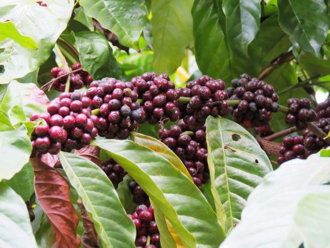

Soil health reflects on many aspects of the Nations well-being and is a key factor in determining the food security of the globe. Yet this very important aspect of soil health is poorly understood.

We have made an honest attempt to think out of the box, being fully aware, of the limitations, inside of the box, and have tried to bring to the Coffee Planters a new vision, a new perspective in understanding Soil Health. We would also like to make it clear, that, the views expressed here are our own personal views and we stand for correction. The idea behind writing this article is to stimulate the imagination of Policymakers in the Ministry of Commerce, Agriculture Scientists, Professors, and Coffee Planters to think and rethink on the state of our Soil and put in place an indicator to measure microbial profile responsible for indicating soil health.

Today, we have many standard practices to check soil health. In general, soil test reports will enable the coffee planter to understand the fertilizer requirement for various crops, especially, the major nutrients like nitrogen, phosphorus, and potassium. The soil test report will also tell the current Ph because nutrient availability is influenced by the Ph of the soil. However, we find many paucities in this existing method because it is not reflective of soil characteristics, Climate, microbial flora of a particular Coffee Agro climatic region. Most field tests include measuring the hydrogen ion concentration or Ph, cation exchange capacity, organic matter content, extractable calcium, magnesium, potassium, and phosphorus, few micronutrients, and total carbon and the carbon to nitrogen ratio (C: N).

A few years back, when the Chairman of the Coffee Board visited our Plantation along with the Director of Research, we had impressed on him to make a comprehensive assessment of the health of the soil, in terms of enumeration of microorganisms on a Petri-plate. The Chairman was quite receptive to the idea and wanted to know more about this concept and why a change in mindset was needed at this stage. We explained to him, that as postgraduate degree holders in Microbiology and Horticulture, Geeta and I have extensively worked on soil microbes and have isolated nitrogen fixers and phosphate solubilizers from our very own coffee Plantation and have also successfully re-inoculated the same to multiple crops. By doing so, we can significantly reduce the dependency on chemical fertilizers which are derived from fossil fuel and make the soil sick over a period of time. Number two, Fertilizer Companies, only try to push their product, creating a chemical bias. Number three, our research findings have clearly established the fact that a few traditional coffee varieties harbor a high degree of nitrogen fixers both in the rhizosphere and endo-rhizosphere and become inactive when fertilizer nitrogen is applied. Also, the soil microflora is rich in phosphate solubilizers and the same becomes dormant or gets killed during the application of synthetic fertilizers. More importantly, testing the soil for biological characteristics will give insights on potential harmful organisms relative to beneficial organisms. Soils that are low in both bacterial and fungal counts are assumed to be biologically deficient and would gain from a variety of organic amendments.

At this point in time, we would like to stress, that Soil testing with the existing methods are definitely useful tools, but lack a vital component in terms of a more comprehensive soil assessment through the inclusion of soil biological and physical indicators, in addition to chemical ones.

In our opinion, apart from the above tests, we need to devise a new affordable kit to enumerate the soil microflora in a defined Agro climatic region. It’s our earnest desire that the Coffee Planter should be empowered with mobile kits, where soil samples are drawn into sterilized pouches and a few grams of soil inoculated with the help of the dilution plate technique, to enumerate nitrogen fixers and phosphate solubilizers. The idea behind this suggestion stems from the fact that the coffee Planter can get immediate results that are not time-consuming. Also, the Planter can enumerate the microflora on a regular basis in the comfort of their homes and it will also result in cost-effectiveness or affordability.

We would like to quote from the paper published by Fred Magdoff (emeritus professor of plant and soil science at the [University of Vermont](http://www.uvm.edu/~pss/)) and Harold van Es (professor of soil science at [Cornell University](http://cals.cornell.edu/) ) on Laboratory Soil Health Testing.

“Sustainable Agriculture Research and Foundation “The relative amounts or activities of each type of microorganism provide insights into the characteristics of the soil ecosystem. Bacterial-dominated soil microbial communities are generally associated with highly disturbed systems with external nutrient additions (organic or inorganic), fast nutrient cycling, and annual plants, while fungal-dominated soils are common in soils with low amounts of disturbance and are characterized by internal, slower nutrient cycling and high and stable organic matter levels. Thus, the systems with more weight of bacteria than fungi are associated with intensive-production agriculture (especially soils that are frequently plowed), while systems with a greater weight of fungi than bacteria are typical of natural and less disturbed systems. The significance of these differences for the purposes of modifying practices is unclear because there is no evidence that one should make changes in order to change the number of bacteria versus the number of fungi. On the other hand, modifying practices causes changes to occur. For example, adding organic matter, reducing tillage, and growing perennial crops all lead to a greater ratio of fungi to bacteria. But we generally want to do these practices for many other reasons—improving soil water infiltration and storage, increasing CEC, using less energy, etc.—that may or may not be related to the ratio of bacteria to fungi.”

### Conclusion

Studies on the effect of soil deterioration have shown that the downfall of many flourishing empires was primarily caused by soil degradation. If soil loss is greater than soil development, due to accelerated soil erosion then the agriculture systems in the world will be seriously threatened. This fact is more relevant to coffee. The survival of the coffee bush depends on the possibility of providing adequate humus and organic matter on a periodic time frame to keep the soil microbial activity at its peak. Thus the important question that comes to mind is finding out ways and means of maximizing the efficiency of soil without depleting the balance of soil nutrients, by increasing the count of beneficial microbes like nitrogen fixers and phosphate solubilizers.

### References

Anand T Pereira and Geeta N Pereira. 2009. Shade Grown Ecofriendly Indian Coffee. Volume-1.

Bopanna, P.T. 2011.The Romance of Indian Coffee. Prism Books ltd.

Anand Titus Pereira & Gowda. T.K.S. 1991. Occurrence and distribution of hydrogen dependent chemolithotrophic nitrogen fixing bacteria in the endorhizosphere of wetland rice varieties grown under different Agro climatic Regions of Karnataka. (Eds. Dutta. S. K. and Charles Sloger. U.S.A.) In Biological Nitrogen Fixation Associated with Rice production. Oxford and I.B.H. Publishing. Co. Pvt. Ltd. India.

Brady.N.C. and Weil. R.R. 2004. The nature and Properties of Soils. Thirteenth Edition. Pearson Education Pte. Ltd., Indian Branch, F.I.E. Patparganj, Delhi 110 092, India.

Samuel L. Tisdale, Werner L Nelson, James D.Beaton and John L. Havlin. 2003. Fifth Edition. Soil Fertility and Fertilizers. Prentice-Hall of India Pvt. Ltd.

Anonymous.2002.Fertilizes and their Use. 2002, A pocket guide for extension officers. Fourth edition. FOOD AND AGRICULTURE ORGANIZATION OF THE UNITED NATIONS. INTERNATIONAL FERTILIZER INDUSTRY ASSOCIATION ROME, 2000.

Alexander, M. 1974. Microbial Ecology. New York. John Wiley and sons.

Alexander, M. 1977. Introduction to soil Microbiology. 2nd edition. New York. John Wiley and sons.

Brady.N.C. and Weil. R.R. 2004. The nature and Properties of Soils. Thirteenth Edition. Pearson Education Pte. Ltd., Indian Branch, F.I.E. Patparganj, Delhi 110 092, India.

[What is Soil Health?](https://www.sare.org/Learning-Center/What-is-Soil-Health)

[Learning Center](https://www.sare.org/Learning-Center)

[Importance of Healthy Coffee Soils](http://ecofriendlycoffee.org/importance-healthy-coffee-soils/)

[Building Soils for Better Crops](https://www.sare.org/Learning-Center/Books/Building-Soils-for-Better-Crops-3rd-Edition)

[Laboratory Soil Health Testing](https://www.sare.org/Learning-Center/Books/Building-Soils-for-Better-Crops-3rd-Edition/Text-Version/How-Good-Are-Your-Soils-Field-and-Laboratory-Evaluation-of-Soil-Health/Laboratory-Soil-Health-Testing)