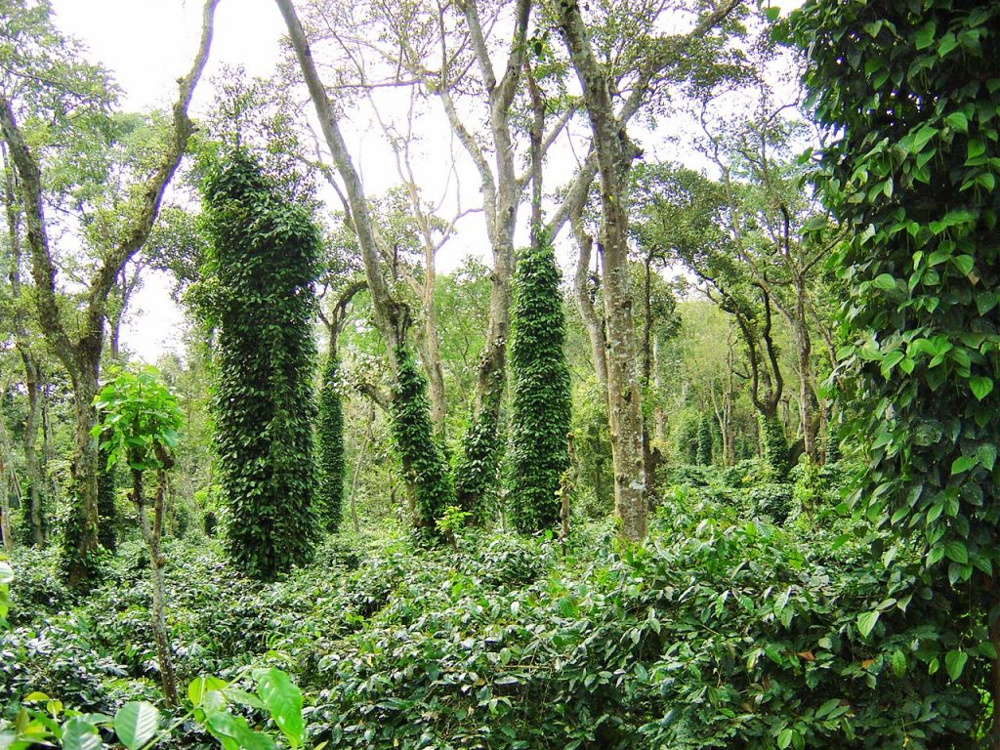

Shade-grown eco-friendly Indian coffee and carbon mitigation are intricately linked to the well-being of coffee Plantations. Soil carbon sequestration is a process in which CO2 is removed from the atmosphere and stored in the soil carbon pool. This process is primarily mediated by plants through photosynthesis, with carbon stored in the form of Soil organic carbon.

The entire process is better understood when one looks at the soil carbon inside coffee forests. In fact the carbon content of soil is one of the key indicators of the health of the coffee ecosystem. A vast majority of coffee Planters are well aware that an optimum amount of soil carbon is a key attribute of soil productivity.

Organic matter makes up just 2–10% of most soil’s mass and has an important role in the physical, chemical and biological function of agricultural soils.

### **The makeup of Soil Organic Carbon (SOM)**

Soil organic carbon (SOC) levels are directly related to the amount of organic matter contained in soil and SOC is often how organic matter is measured in soils. In turn, soil organic matter is composed of soil macro and invisible microorganisms, plant residues, compost, humus, and organic substrates. SOM is made of organic compounds that are highly enriched in carbon.

### **Why Soil Carbon is gaining importance**

It is a well-established fact that Soil organic carbon is a result of complex interactions of several ecosystem processes like photosynthesis, respiration, and decomposition.

The fact of the matter is that the earth’s soils contain about 2,500 gigatons of carbon—that’s more than three times the amount of carbon in the atmosphere and four times the amount stored in all living plants and animals. The carbon stored in soils is far greater than all the carbon in the earth’s biomass and atmosphere combined. Hence, there is now a large and growing interest in knowing the size of soil carbon pool and its sequestration potential.

### **Why Coffee Ecosystems have an advantage of high Carbon sequestration.**

The Bababudangiris, located in Karnataka, the birthplace of Indian Coffee, together with Coorg and Chikmagalur Districts where coffee is widely cultivated and the Nilgiris, located in Tamil Nadu, where coffee is extensively grown has a dense canopy of evergreen forest trees. Agroforestry with the evergreen trees involves multi-storeyed crops like pepper, orange, oil palm, and avocado, grown along with coffee. As such, at any given point of time, the soil system is covered above ground with a three-tier canopy of shade with annual and perennial crops, and down below, the ground is covered with an extensive root mat and a thick layer of mulch. Since Coffee is cultivated in the tropics, due to warm temperatures and abundant rainfall, high rates of both primary productivity and decomposition results in high soil organic carbon levels.

### **Soil Carbon and Soil fertility**

Soil carbon plays an important role in the stability and fertility of soils.

Soils rich in carbon, arrest the leaching, of precious nutrients.

Soils are an important sink for carbon globally.

###  **Benefits of Soil Carbon: Physical, Chemical and Biological**

Greater microbial biodiversity in soils rich in carbon

Soil carbon correlates with soil organic matter levels.

Carbon-rich soils have a characteristic dark color.

Organic matter contributes to nutrient retention

Higher soil organic matter levels cause greater soil nitrogen retention.

Promotes the presence and growth of arbuscular mycorrhizal fungi that penetrate the roots of crops and facilitate the movement of plant nutrients from the soil into the crop plants resulting in better crop growth and yields

Higher soil carbon levels also hold soil particles together so less soil erosion occurs.

Increase in microbial biomass and activity of the soil.

Some organic compounds in the soil also exhibit plant growth-promotion properties, further enhancing plant productivity.

Higher levels of soil organic carbon reduce bulk density, thus providing an improved rooting environment.

Organic matter contributes to availability, degradation of pollutants, carbon sequestration and soil resilience.

The higher soil organic matter levels found in the organic systems cause the soil to retain more water that results in better crop yields during droughts.

Higher soil organic matter decreases soil crusting and increases water infiltration rates which enhances plant productivity and thus the return of plant material to the soil.

Increases plant nutrient retention

Increases biological diversity.

### **Conclusion**

Soil carbon sequestration is one possible way of reducing greenhouse gas emissions in the atmosphere. However, to evaluate the real benefits offered by these methods, large-scale estimations of the carbon stock in the soils are necessary. Soil carbon sequestration potential in Coffee Plantations is difficult to estimate because of sparse data availability. We believe that Coffee Agroforestry has the potential to sequester significant amounts of carbon and earn revenue in terms of carbon credits.

### References

Anand T Pereira and Geeta N Pereira. 2009. Shade Grown Ecofriendly Indian Coffee. Volume-1.

Anand Titus Pereira & Gowda. T.K.S. 1991. Occurrence and distribution of hydrogen dependent chemolithotrophic nitrogen-fixing bacteria in the endorhizosphere of wetland rice varieties grown under different Agro-climatic Regions of Karnataka. (Eds. Dutta. S. K. and Charles Sloger. U.S.A.) In Biological Nitrogen Fixation Associated with Rice production. Oxford and I.B.H. Publishing. Co. Pvt. Ltd. India.

Brady, N.C. and R.R. Weil. 2002. The Nature and Properties of Soils, 13th edition, Prentice Hall.

Martin Alexander. 1978. Introduction to soil microbiology. Second edition. Wiley Easter Limited. New Delhi.

Wright, S. F. 2003. The importance of soil microorganisms in aggregate stability. Proc. North Central Extension-Industry Soil Fertility Conference. 19:93-98.

Ontl, T. A. & Schulte, L. A. (2012) Soil Carbon Storage. *Nature Education Knowledge* 3(10):35

Bopanna, P.T. 2011.The Romance of Indian Coffee. Prism Books ltd.

[Can Soil Help Combat Climate Change?](https://blogs.ei.columbia.edu/2018/02/21/can-soil-help-combat-climate-change/)

[Soil carbon](https://www.agric.wa.gov.au/climate-land-water/soils/managing-soils/soil-carbon)

[What is soil organic carbon?](https://www.agric.wa.gov.au/measuring-and-assessing-soils/what-soil-organic-carbon)

[Carbon Farming](https://www.carboncycle.org/carbon-farming/)

[Carbon sequestration in soil](https://doi.org/10.1016/j.cosust.2015.09.002)

[The Carbon Cycle](http://nmsp.cals.cornell.edu/publications/factsheets/factsheet91.pdf)

[Soil carbon plays](https://www.sciencedirect.com/topics/agricultural-and-biological-sciences/soil-carbon)

[Soil Carbon Storage](https://www.nature.com/scitable/knowledge/library/soil-carbon-storage-84223790/)

[How should we manage our soils to increase soil carbon?](http://www.ccmaknowledgebase.vic.gov.au/brown_book/37_Soil_Carbon.htm)