The Indian Spot billed Duck is one among the three Spot billed Duck species commonly observed as a resident bird in almost all coffee growing regions of India. [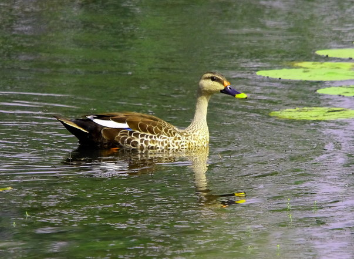](http://ecofriendlycoffee.org/wp-content/uploads/2014/06/1.jpg) The Classification table is as follows.

**Kingdom**

**Animalia**

**Scientific Name**

**Ardeola grayii**

**Class**

**Aves**

**Order**

**Anseriformes**

**Family**

**Anatidae**

**Genus**

**Anas**

**Species**

**Anas Poecilorhyncha**

**Sub species**

**Anas poecilorhyncha poecilorhyncha**

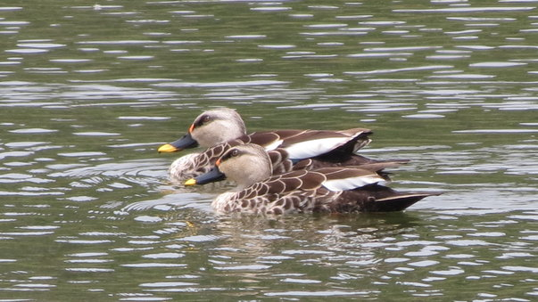

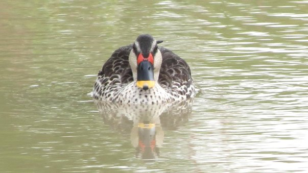

### **Physical Characteristics**

It is very easy to identify these birds because of their distinct colorations. The bill is black with an orange spot on the top of the bill and yellow spots on the base of the bill. 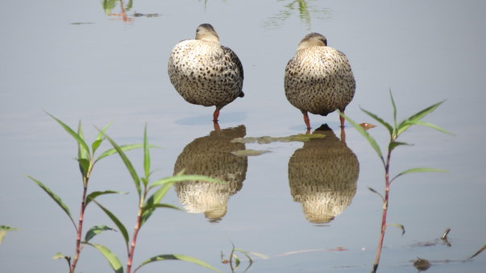

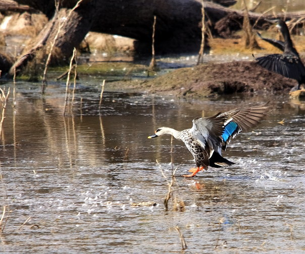 The species measures around 22–25 in (55–63 cm) in length and 33–37 in (83–95 cm) across the wings, with a body weight ranging from 790 to 1,500 g (1.7–3.3 lb). The wingspan ranges from a minimum of 83 cm to a maximum of 95 cm. The incubation period is at a minimum of 24 days to a maximum of 28 days. The fledging period ranges between 50 days and 55 days. The clutch eggs ranges from 6 to 12. 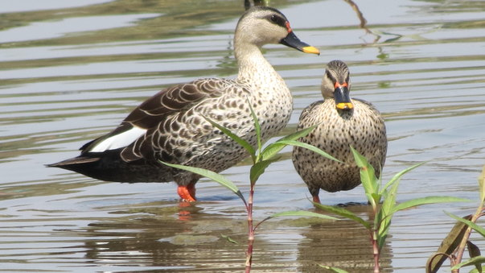

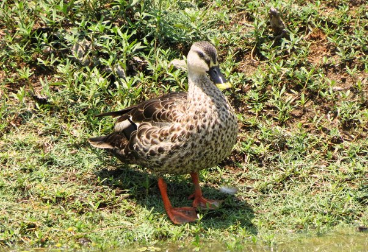

### **Behaviour**

These ducks have adapted well to the presence of humans and can be found in flocks of two to three dozen not only in big lakes but also in small open ponds and at the edge of wetlands. They are gregarious and often fight with one another for territory. When alarmed they make a very loud quacking sound and immediately take off with their powerful wings. During the day they forage in shallow waters for benthic flora. 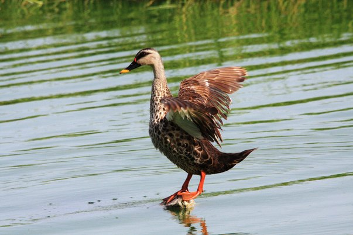

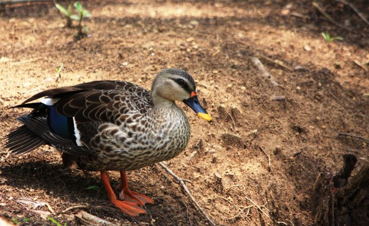

### **Migration**

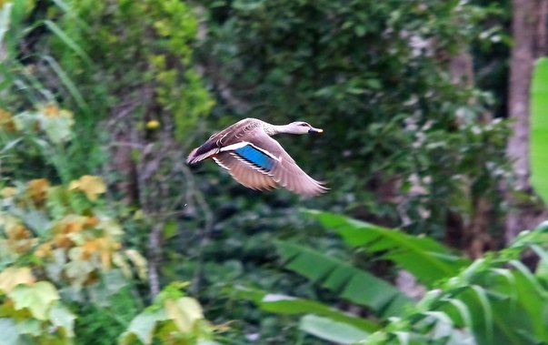 Our observations point out that these ducks are residents year round and occasionally migrate to rivers or lakes during periods of extended drought. During the day, they fly short distances and move from one lake to another and return by dusk.

### **Diet**

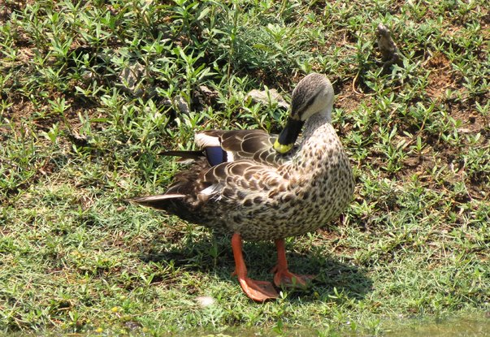 They feed on small insects, Larvae and molluscs and tender shoots of aquatic vegetation.

### **Mating**

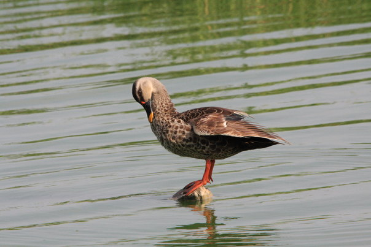 There is no specific breeding season. We have observed that in Karnataka, the ideal breeding season is November-December. Both males and females attain sexual maturity in the first 18 months. During the breeding season they are found in pairs and at times form small colonies. The female lays 7 to 14 eggs which are greenish white or grey in colour. The incubation period is 4 weeks and the fledging takes place between 50 to 55 days. 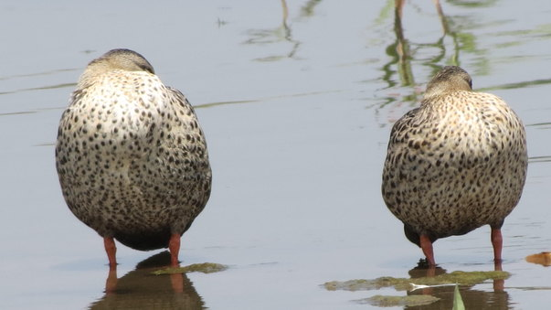

[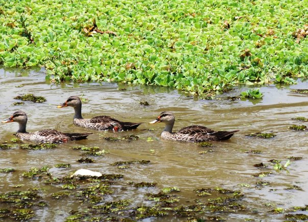](http://ecofriendlycoffee.org/wp-content/uploads/2014/06/13.jpg)

### **Conservation Status**

Indian Spot bill have been categorized as “least concern bird” by IUCN. 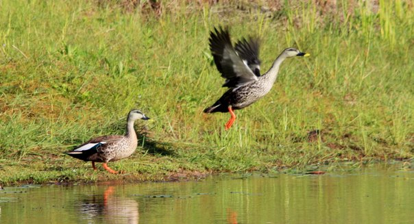

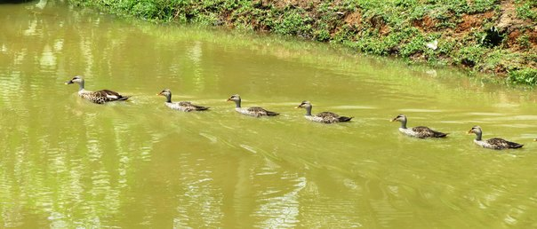 We have studied these birds for over two decades and are of the opinion that their numbers are significantly decreasing on a year to year basis because of one prime factor and that is the loss of wetland habitats. Earlier all coffee belts were surrounded by extensive wetlands. These wetlands acted as the nursery grounds for the proliferation of both macro and micro flora, which in turn acted as feeding grounds for both resident and migratory birds. Today, these wetlands are rapidly disappearing giving way to monoculture oil palm plantations. The message is loud and clear, if we cannot protect the bio diverse birds inside shade grown ecofriendly coffee forests, we are destroying our very own future. 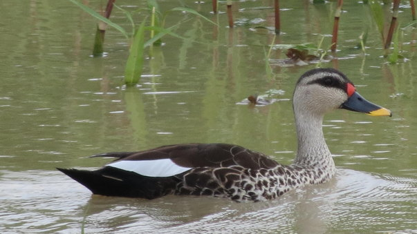

### **References** 

Anand T Pereira and Geeta N Pereira. 2009. Shade Grown Ecofriendly Indian Coffee. Volume-1.

Bopanna, P.T. 2011. The Romance of Indian Coffee. Prism Books ltd.