This article on sprinkler irrigation is specially written to empower and stimulate the imagination of the world’s farming community in helping them realize that “WINNING IS ONLY A STATE OF MIND”. The article provides a glimpse to enable farmers to think globally and provide in house solutions, so that they are competitive worldwide.

The 26th of May, 2011, was a red letter day for the Indian Coffee Plantation Industry, because on this very special day the Chairman of the Coffee Board, Mr. Javid Akthar inaugurated the “First of its kind State of the Art Energy Efficient Sprinkler System at Joe’s Sustainable Coffee Plantation, Kirehully Estate, India.

We were pleased to provide evidence to the Coffee farmers worldwide that this unique and highly energy efficient and labor saving sprinkler system had the capacity to sprinkle an area of ten acres for every shift and sprinkle an area of forty acres in one single day, with the help of only five men workers, inside shade grown ecofriendly coffee forests.

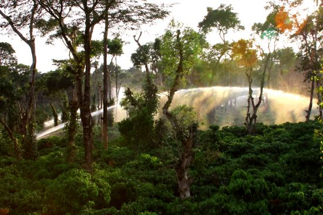

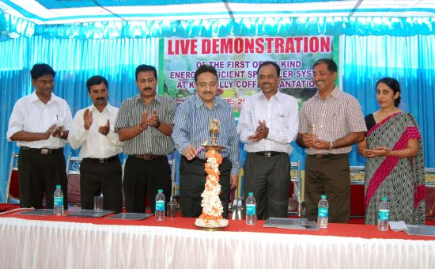

To simplify the matter, we were the first in the entire Country to sprinkle an area of 116 acres in just three days with a workforce of only 15 men. This level of mechanization, both indigenous and foreign was unheard off in India’s coffee Plantation sector. Earlier to this, with the existing technology, planters could cover an area of approximately ten acres per day. The newly installed 254 H.P. Kirloskar turbo charged diesel engine coupled to a custom made high discharge RKP pump, discharging in excess of 7000 liters per minute was capable of operating rain guns covering an area of ten acres per shift. (One acre = 43,560 square feet)

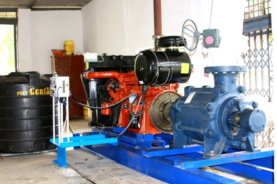

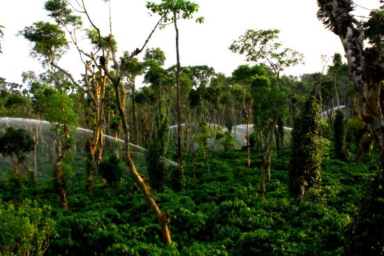

Mechanization is the buzz word in today’s shade grown eco friendly Indian coffee plantations. The Coffee Board has chalked out a long term strategy taking into confidence Coffee associations, and other stake holders in the industry to help the coffee growers in terms of mechanizing their respective farms. This strategy is to overcome the severe shortage of labor in the plantation Industry.

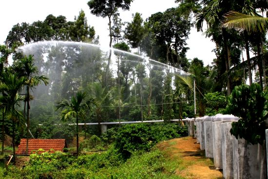

We organized a field demonstration and a technical session with the help of leaders in the sprinkling sector, to enable coffee Planters from India, witness the state of the art sprinkling systems as well as interact with sprinkler specialists like WaterJet Engineers, Chikmagalur, Hallmark Aqua Private Limited, Calcutta, Kirloskar Brothers, Pump division, Pune, and Kirloskar oil engines limited, Pune, to enable the Coffee Plantation Community to learn first hand concerning the latest trends in the sprinkler Industry.

We were pleased to provide evidence to the Coffee farmers world wide that this unique and highly energy efficient and labor saving sprinkler system had the capacity to sprinkle an area of ten acres for every shift and sprinkle an area of forty acres in one single day, with the help of only five men workers, inside shade grown ecofriendly coffee forests.

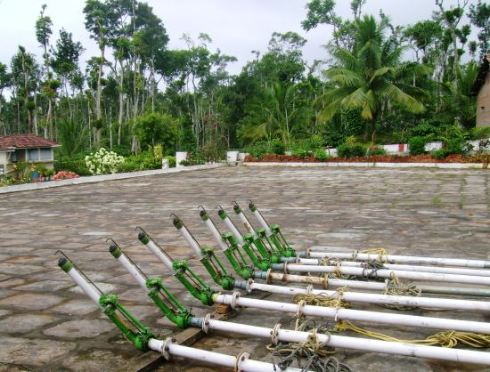

### JOE’S SUSTAINABLE FARM

Joe’s Sustainable Coffee Plantation, has been on the world map for the past two decades, recognized not in the field of sprinkler irrigation, but for adopting functional in house “GREEN “technologies. In a nut shell, we as Microbiologists and Horticulturists have researched, isolated and successfully reintroduced beneficial microorganisms capable of fixing atmospheric nitrogen, enhancing the soil phosphorus availability and potassium intake.

We have also successfully drought proofed a few of our coffee blocks incorporating rain water harvesting systems. Many foreigners and Indians visit our Plantation in the quest for knowledge.

We would like to clearly state that the architects of Joe’s Sustainable Coffee Plantation, Kirehully Estate, are Late Joe S Pereira and Gregory Pereira who with their untiring efforts have developed the plantation into a model one. Today we take this opportunity to salute them for their sacrifice and spirit of enterprise. On our part, we are only taking their dream to the next level.

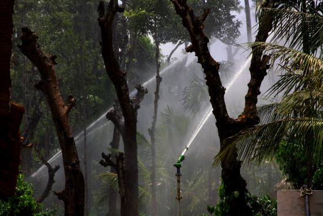

### KNOWLEDGE ECONOMY

Time and again, we remind the coffee Planters that we are living in a knowledge economy, where winning is only a state of mind. To win the race, one needs to constantly upgrade his or her knowledge. The first step in winning the future is by encouraging innovation. Innovation is the key to the future of coffee plantations.

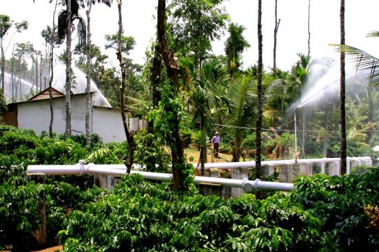

### How then do we innovate?

We at Joe’s Sustainable Coffee Plantation, work with a simple philosophy. We have made it a point not to compete with the coffee planters of the taluk, District or State, for that matter, we are not in competition with the coffee plantation community from India, but what we intend doing is to compete with coffee planters at the global level in setting up the worlds best sprinkler system. E

ven though, we have taken baby steps in this direction, we are hopeful that in the coming years, with the support of the Coffee Board, Coffee Organizations, Banks and manufacturing Industry, we will achieve our goals.

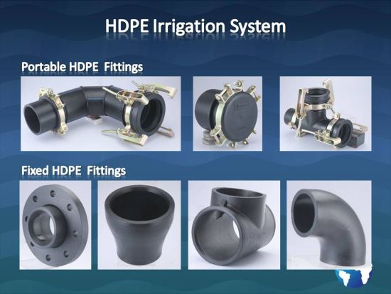

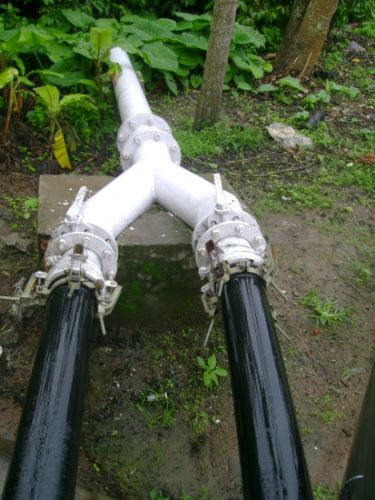

### Facing Challenges?

In our humble opinion, more than 90% of Indians, wake up in the morning and spend their most productive energies in setting right the past. By mid morning their creative energies are exhausted and they have no time to plan for tomorrow or for months and years ahead. We at Kirehully, have taken a slightly different approach. In order to face the coming challenges we have meticulously identified the greatest challenges faced by the coffee planting community.

1.  Decision making
2.  Anticipation

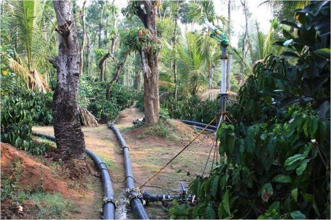

Decision making refers to the thought process occurring within the planters mind as to whether he should buy a diesel engine or a submersible pump, ; whether he should go in for a higher horsepower diesel engine or connect a number of smaller horse power motors in series to achieve the desired horsepower. Whether he should go in for higher density planting or restrict the number of plants to only 400 per acre.

Anticipation in simple terms refers to the expectations of the future. Whether the investment made in plant and machinery, will be met by the incoming crops.

### VISION 2020

In view of these common challenges, we have formulated a vision, normally referred to as VISION 2025, with long term strategies and short term goals. The blue print is programmed for the next 20 years with the help of professionals from manufacturing industry as well as Institutional support.

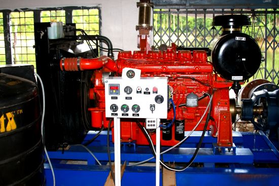

PROFILE OF Joe’s Sustainable Coffee Plantation (JSCP), Kirehully Estate, India.

- JSCP consists of one single block of selection Robusta, variety Selection -274.
- We are third generation coffee planters.
- Both Geeta and Anand involved in running JSCP are post graduates in Agriculture.
- Observed many drawbacks when we first came to the plantation two decades ago.
- Insufficient water for first round of blossom showers.
- Time period for covering a major part of the plantation with first round of blossom showers was approximately 60 days.
- In times of rain failures ( inadequate showers like 20 to 30 cents of rainfall ) the entire years income would we wiped out, because Robusta requires a backup shower within seven days of the first shower.
- Observed four rain failures in our two decades of coffee plantation experience.
- Inefficient sprinkler system.
- We had no technical expertise in planning and designing a efficient sprinkler system.
- Just like human beings, plants can tolerate hunger, but not an extended period of thirst.
- A majority of our coffee blocks had sandy loam soil, with poor water retention capacity.
- During the peak of summer, the soil used to crack destroying the soil microbes.
- Coffee is a surface feeder and high summer temperature was detrimental for the coming year’s crop.
- Took a bold decision to implement farming practices based on scientific temperament and time tested traditional wisdom.

### RAIN WATER HARVESTING and SOIL WATER CONSERVATION

Our first task was to build up the water table as well as set up a mini reservoir for storage of water. Due to scientific rain water harvesting methods, like infiltration pits, scuffle digging, check bunds, and systematic channelizing of water from 60,000 square feet of drying yards has significantly increased the ground water table as well as the storage capacity of water tanks.

We also invested huge sums of money in building up the soil organic matter content with application of different types of farm yard manures. Over the years, the build up of organic matter with help of compost, nitrogen fixing microbes and introduction of leguminous plants, helped in retention of soil moisture.

### Reason Behind Investment on Modern Machinery

JSCP has witnessed four rain failures ranging from 20 cents to 35 cents in just 20 years. During these periods, the crop harvested has been significantly low, and the income generated could not even cover the cost of fertilizer. Robusta is a very sensitive plant and needs adequate blossom showers of at least one inch to put forth a healthy blossom.

However, in times of rain failure, the bud movement advances rapidly within seven days of the first rain and thereafter collapses, due to inadequate moisture, wiping out the entire years income. Unfortunately, the physiology of the bush is such that, robusta does not produce a second round of buds in one single year.

The only way out is to provide artificial rain by way of sprinkling within a time frame of seven days to insure the crop against rain failure. In short; time is the essence of sprinkling.

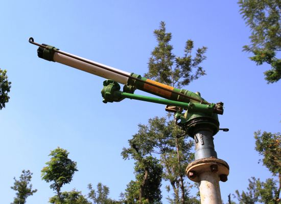

Since JSCP consists of only Robusta, we had to cover the entire area within a time frame of seven days from the day of the initial rain. So we gradually invested in excavating water tanks and setting up pipe lines and setting up machinery starting from 75 HP, & 110HP. However, in spite of installing this machinery, we were not in a position of sprinkling even half of our estate area in seven days during the period of scanty blossom showers.

### WATER CONSERVATION

1.  The earlier generations had no access to both perennial water and storage tanks.
2.  Limited source of water availability.
3.  Sprinkling limited area due to lack of water.
4.  Improvement in storage capacity of water by improved soil water.
5.  Conservation measures in the form of rain Rainwater Harvesting.
6.  At present three water storage tanks with approximate capacity of 83 million liters caters to the sprinkler needs in terms of blossom and backing showers.

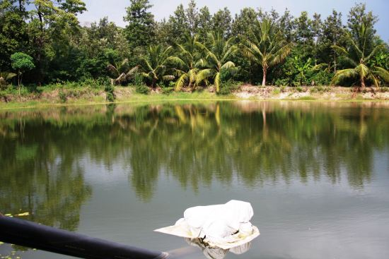

Since their entire plantation consists of Robusta, we had to cover the entire area of 116 acres within a period of one week from the day of rain. So we gradually invested in excavating water tanks and setting up machinery in the form of 75 H.P diesel engine systems. However, in spite of installing this machinery, we were not in a position of sprinkling even half of their estate area in seven days during the period of scanty blossom showers.

### Energy efficient sprinkling system

[Table-A](/files/Table-A.pdf) (PDF) Basic parameters of sprinkler nozzle, jet discharge, precipitation and area covered in acres.

[Table-B](/files/Table-B.pdf) (PDF) Brief Note on 254 HP.innovative Energy saving pump set installed at Joe’s Sustainable Farm, KIREHULLY ESTATE, India.

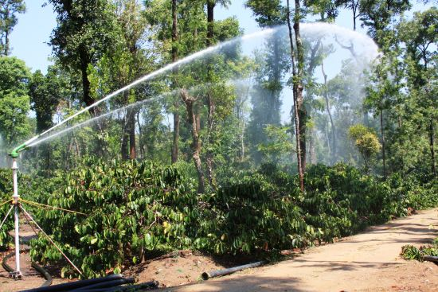

The modern state of the art new generation turbo charged fuel efficient 254 HP engine coupled with high pressure and high discharge sprinkler system with 7 numbers of RAIN GUNS with a precipitation of 8mm per hour the area covered in one day (4 shifts of three hours each with 7 jets per shift was approximately 40 acres.). Each shift covers an area of 10 acres.

Area of a circle = 140, radius x 140, radius x 3.14 =1.41 acres x 7 jets = approx 10 acres. The time cycle to cover 116 acres was 3 days.

Also, observed that to irrigate 40 acres each day, man power required was the same as that of covering just 6 acres per day using the traditional sprinkler system.

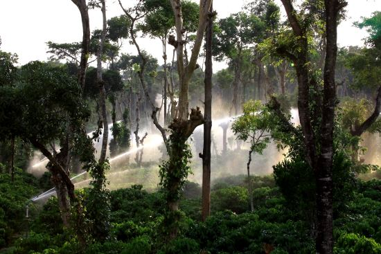

### ADVANTAGES

1.  The installation of the new energy saving Irrigation System has not only insured the crop against rain failure by covering the entire area in less than 3 days, but has also enabled huge cost savings and minimized the labor force required.
2.  Only by the operational cost, net savings in 5 years time is around 9,00,000.00.
3.  Since sprinkling is a very tough job, the labor delegated to fix the jets showed tremendous resistance, however the entire operation of fixing and running the system has been simplified, the workers find it a pleasure to work with this new system.
4.  Also in any emergency situation it is easy to get five men and convince them that the sprinkling work will be over within 3 days. In this situation the labor will show more willingness to work compared to five men working continuously for 20 days.
5.  In our 20 years of experience in plantation we have witnessed 4 rain failures and due to impact of climate change, the future period may hold uncertainties in weather patterns. Just one rain failure, can wipe out more than 60% of the crop yield. This will also severely impact infrastructure investment as well as the biological health of the coffee plantation.
6.  In today’s India’s coffee plantation scenario, the area under Robusta is significantly more compared to Arabica. Hence all coffee planters need to have a sprinkling system where they can cover their irrigation in 7 days to avoid wash out of crop.
7.  The system allows for winter irrigation providing for better productive woods for the coming seasons crop. The savings in extra crop can be boosted by 15%.
8.  Planters can afford to take the risk of sprinkling only half the plantation area and wait for the showers. In case of inadequate showers, they can immediately back up with the energy efficient sprinkling system.

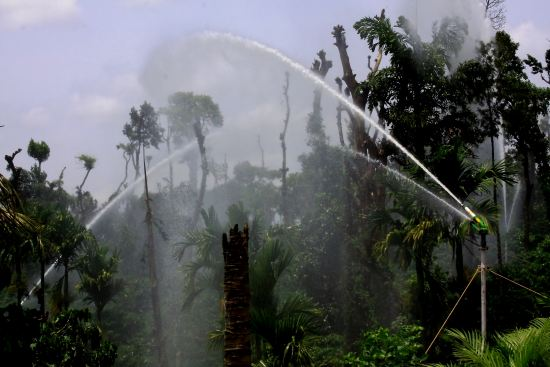

### Suggestions to Coffee Farmers /Planters/Growers

The investment in irrigation shall be yearly part of a planter’s budget as the technology changes very often, and the requirement of quantity of irrigation increases every year. It is desirable that a planter allots 10 to 15% of his yearly gross revenue towards investment in irrigation including machinery. We put forth this proposition based on our personal experience.

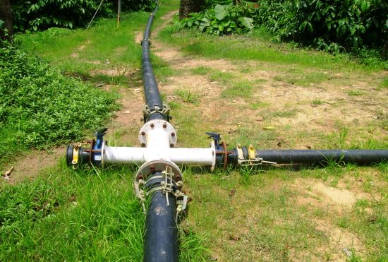

### CONCLUSION

- We have for the very first time in the entire country demonstrated that an coffee area of 116 acres could be covered by sprinkler irrigation in just three days with a labor force of only 15 men.
- The Coffee Board has worked overtime in facilitating mechanization inside coffee plantations with various schemes. This has enabled small medium and large holders to invest in plant and machinery.
- We are of the firm opinion that mechanization must be left to the Private sector and the Governments role should be that of a facilitator.
- Mechanization should not be introduced at the cost of biodiversity loss.
- Mechanization and biodiversity conservation should have the right balance. To this end the Coffee Board should award landscape labeling points to compensate the monetary loss.
- Mechanization should be specially used in operations involving drudgery of farm work like weeding, harvesting and sprinkling.
- The Coffee forest should retain a significant part of its original characteristic in terms of accommodating biodiversity and tree heterogeneity.
- We have requested the coffee Board to provide us with funds at a reasonable interest cost and a time bound repayment schedule, so that we could in a span of 24 months demonstrate to small (Less than 10 ha), medium (Less than 25 Ha) and large (More than 50 ha) of coffee holdings, the scientific way of sprinkler irrigation in a time schedule of one week or less. (Since the mandated Technical Institutions have not delivered, we have put forth this suggestion).

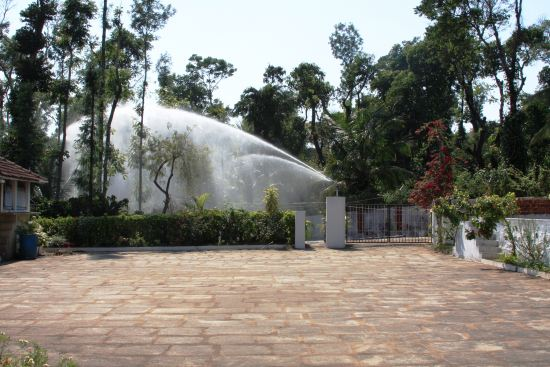

### REFERENCES

[ecofriendlycoffee.org/rainguns-the-future-of-sprinkler-irrigation/](/rainguns-the-future-of-sprinkler-irrigation/)

[ecofriendlycoffee.org/the-fine-art-of-irrigation-in-robusta-coffee-plantations/](/the-fine-art-of-irrigation-in-robusta-coffee-plantations/)

[AMAZING SPRINKLING SYSTEM](http://www.youtube.com/watch?v=P0AdyfEltEM) (Video)

[ecofriendlycoffee.org/physiology-of-coffee-flowering/](/physiology-of-coffee-flowering/)

[www.sime-sprinklers.com](http://www.sime-sprinklers.com)

Anand T Pereira and Geeta N Pereira. 2009. Shade Grown Ecofriendly Indian Coffee. Volume 0ne.

Coffee Guide. 2000. Central Coffee Research Institute, Coffee Research Station. Chikmagalur District. Karnataka. India.

Raghuramulu. Y. 2001. Irrigation Management in Coffee. Head. Division of Agronomy, Central Coffee Research Institute, Coffee Research Station. Chikmagalur District.
