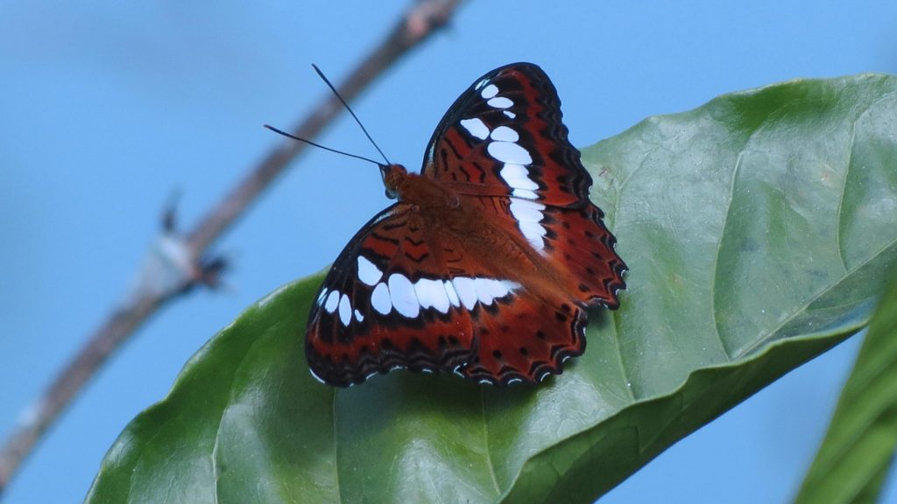
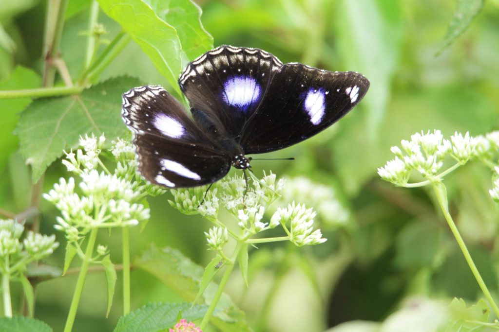
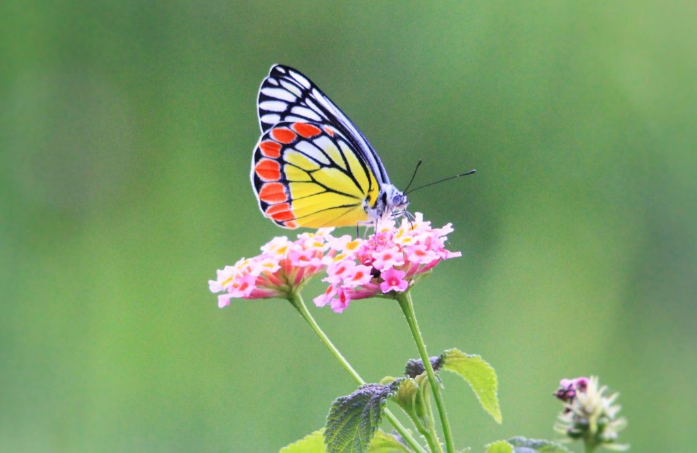
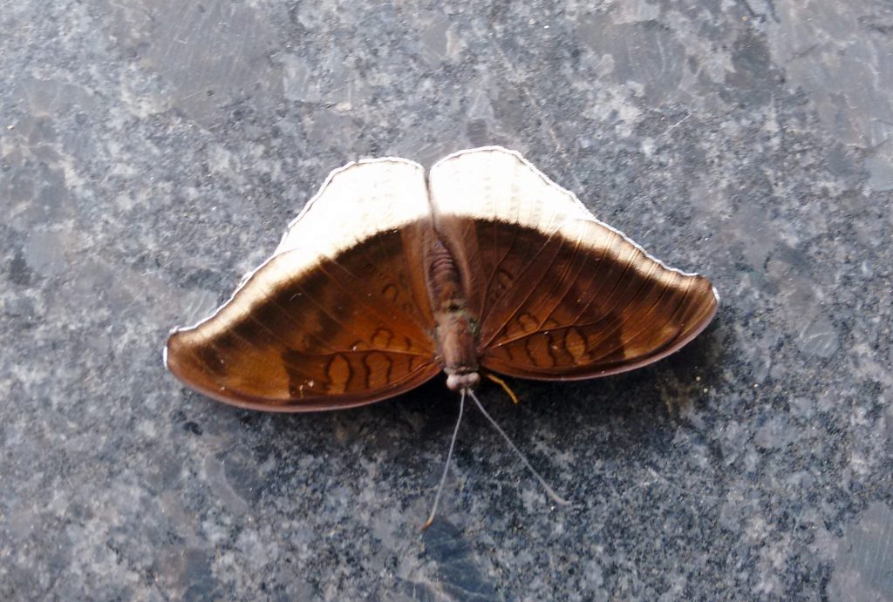

Coffee forests with its varied landscape coupled with multiple fruit and flowering trees, makes it an ideal habitat for butterflies. The advantage of such an ecosystem is that it provides bountiful flowers throughout the year as a rich source of nectar for various pollinating agents, especially butterflies. It is for this very reason that one can observe bright colored butterflies with various hue and colors floating and dancing inside shade coffee throughout the year. Butterflies are important as pollinators for coffee and multiple crops associated with coffee. However, they do not carry as much pollen load as bees, but they are capable of moving pollen over greater distances. Hence the presence of butterflies inside shade coffee is crucial for the coffee ecosystem for better yields and productivity.

This paper dwells on an important aspect of butterflies, namely, the striking color of butterfly wings, despite the fact that they are actually transparent! The question that comes to mind is, what gives these butterflies the brilliant color. Despite significant efforts to unravel the mysteries of butterfly colors in nature, very little is known about how such colors and structures evolved in the first place. Many scientists believe that the colors we see come from a complex chemical and structural system in the butterflies’ wings. In fact entomologists have documented insect wing colors in butterflies (order Lepidoptera) and birds (class Aves) compared to any other life forms. These two groups have an astonishing diversity of colors. The scientific name of its order, Lepidoptera, means “scaly wings” in Latin. This is a correct description since their wings and their bodies are covered with tiny scales. Butterflies and moths are the only insects that have scales.

Many investigations in the past suggest that in butterflies, the diversity of colour-producing, chitin-based structures is partly responsible for imparting colour to wings. The wings are also covered in hundreds of thousands of tiny scales. The colours are determined by the layering and overlapping of the scales.

Latest Scientific Findings

Despite research pertaining to wing coloration of butterflies in the past, scientific literature too is unclear as to why butterfly wings possess such striking colours.

A certain pigment named melanin is responsible in giving a darker color of yellow, brown and black. Melanin is the same coloring pigment present in human skin, which also gives our skin its distinctive color.

The second source of their colour is a fascinating phenomenon known as iridescence. Iridescence is a key attribute where the butterflies get their colour from.

The most interesting aspect of a butterfly’s colour, however, is when the two aspects of pigmentation and iridescence combine to create a unique colour.

Scientific literature points out that scientists have recently tried to understand the mechanism which imparts these beautiful vibrant colours. They have narrowed down their search to two genes that play an outsize role in determining the wings lines and colours. Turning off these crucial genes alters the entire pattern, making the wings go dull or monochromatic.

The studies, published in Proceedings of the National Academy of Sciences, challenge the old paradigm of wing pattern development, says Bob Reed, an evolutionary developmental biologist at Cornell University, USA, and lead author of one of the papers and a co-author on the other. Understanding how wing patterns are controlled gives scientists greater insight into the evolution of traits that help the insects to avoid predation and attract mates. “The two different genes are complementary. They are painting genes specialised, in a way, for making patterns,” says Arnaud Martin, a developmental biologist at George Washington University, USA, and lead author of one of the studies.

Bethany R. Wasik et al are of the opinion that there has been a lack of systematic study and comparison of how different colors from closely related species or within populations of a single species evolve, even though these colors can vary dramatically. By examining how these species/populations evolve different colors, it is possible to identify the minimal amount of morphological change that results in significant color variation. Furthermore, they are of the opinion that this research may serve as an inspiration for future application of similar evolutionary principles to the design of photonic devices for color tuning, light trapping, or beam steering.

Conclusion

Butterfly wings may rank among the most delicate structures in nature, but they have given researchers powerful inspiration for new technology.A new study has revealed that the stunning iridescent wings of the tropical blue Morpho butterfly could expand the range of innovative technologies. Scientific lessons learnt from these butterflies have already inspired designs of new displays, fabrics and cosmetics.

Butterfly-Inspired Design Enables Low-Cost Thermal Imaging. A team of scientists at GE Global Research, the technology development arm for the General Electric Company announced new bio-inspired nano-structured systems that could outperform thermal imaging devices available today, developed through their studies of Morpho butterfly wings.

Butterflies’ are not only excellent pollinating agents but also inspires us in developing low cost cutting edge technologies that has wide implications for mankind.

References

Anand T Pereira and Geeta N Pereira. 2009. Shade Grown Ecofriendly Indian Coffee. Volume-1.

Bopanna, P.T. 2011.The Romance of Indian Coffee. Prism Books Ltd.

[Butterfly-Inspired Design Enables Low-Cost Thermal Imaging](https://web.archive.org/web/20170923015636/http://www.geglobalresearch.com:80/innovation/butterfly-inspired-design-enables-low-cost-thermal-imaging)

[Structural coloration](https://en.wikipedia.org/wiki/Structural_coloration)

[CRISPR reveals genetic master switches behind butterfly wing patterns](https://www.nature.com/news/crispr-reveals-genetic-master-switches-behind-butterfly-wing-patterns-1.22628)

[Macroevolutionary shifts of WntA function potentiate butterfly wing-pattern diversity](http://www.pnas.org/content/114/40/10701)

[Diversification of complex butterfly wing patterns by repeated regulatory evolution of a Wnt ligand](http://www.pnas.org/content/109/31/12632.long)

[Artificial selection for structural color on butterfly wings and comparison with natural evolution](http://www.pnas.org/content/111/33/12109.long)

[A protean palette: colour materials and mixing in birds and butterflies](http://rsif.royalsocietypublishing.org/content/6/Suppl_2/S221?ijkey=e6cd2fe855fbdf3b07adc6c2245ca3ca69d661fb&keytype2=tf_ipsecsha)

[Why are butterflies colored? (Interference) Butterflies](http://www.webexhibits.org/causesofcolor/15A.html)

[What Makes A Butterfly’s Wings So Colorful?](https://www.scienceabc.com/nature/makes-butterflys-wings-colourful.html)

[Information About Butterflies](http://www.gardenswithwings.com/facts-info/a0812ButterflyBody.html)

[Why Do Butterflies Have Such Vibrant Colors and Patterns?](https://news.nationalgeographic.com/news/2015/03/150307-butterflies-caterpillars-colors-predators-prey-animals-science/)

[Butterflies](https://web.archive.org/web/20180327165300/http://discoverykids.com:80/articles/where-do-butterflies-get-their-colors/)

[Why are butterflies so colorful?](https://www.quora.com/Why-are-butterflies-so-colorful)

[Butterflies: the science behind the colour](http://www.nhm.ac.uk/discover/butterfly-wings-science-behind-the-colour.html)

[Where Do Butterflies](https://sensing.konicaminolta.us/blog/where-do-butterflies-get-their-color/)

[Beauty with a purpose](http://www.encyclopedia.com/plants-and-animals/animals/zoology-invertebrates/butterfly)

[Butterfly Behavior](http://dirttime.ws/Butterfly/Behavior.htm)

[Butterfly wings](https://onekindplanet.org/animal/butterfly/)

https://amiracarluccio.com/2016/08/17/the-mystery-of-butterflies/