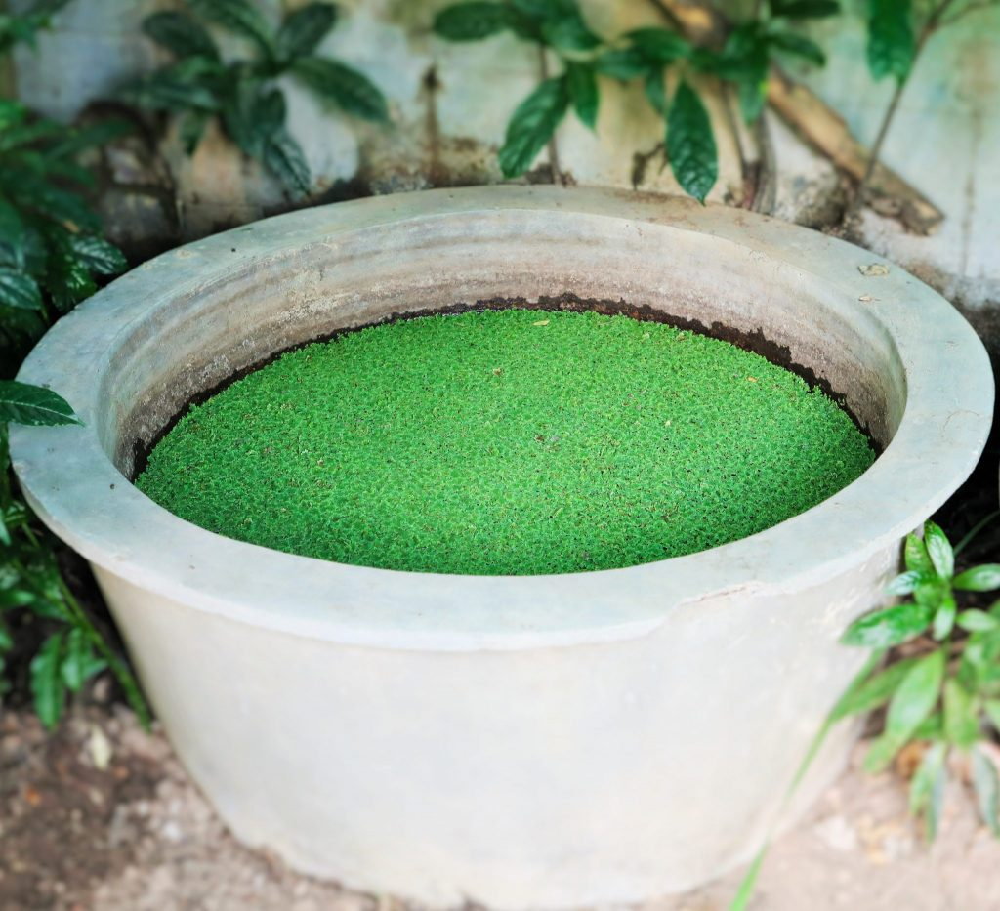
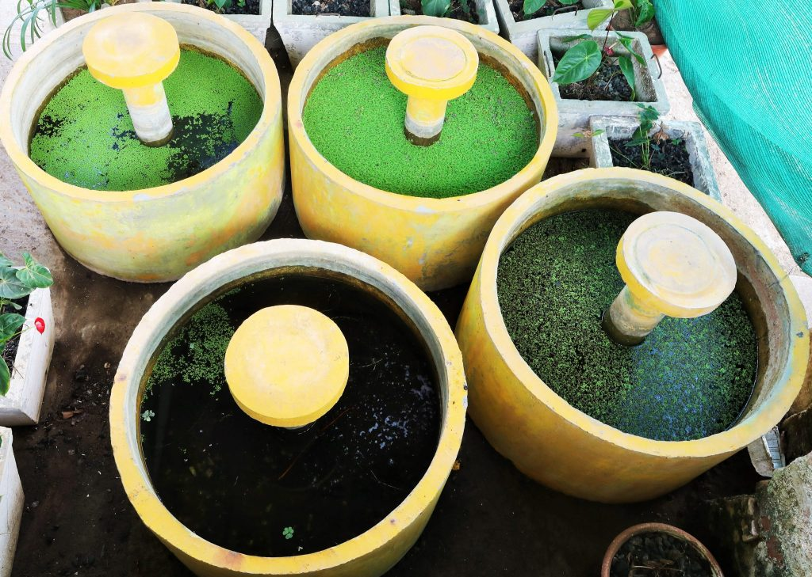
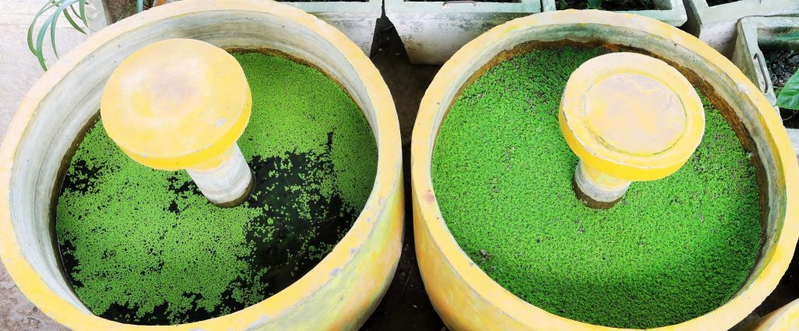
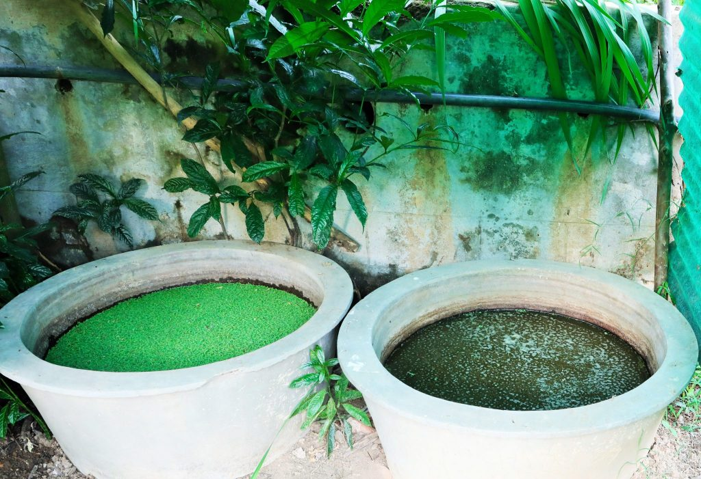

Azolla partners a blue green algae inside its lobes and is capable of harvesting atmospheric nitrogen. Due to this invisible partnership the fern multiplies very fast. The symbiotic association of the algae aids in the creation of a huge amount of biomass on the surface of the water. It is then harvested, dried and used as bio fertilizer to supplement the needs of nitrogen in coffee farms. In the Azolla-anabaena symbiosis, the fern is generally referred to as the macro – symbiont and the blue green algae, namely anabaena is known as the micro- symbiont. The two partners live in a very close relationship with one another. The fern provides the protection to the micro-symbiont from oxygen damage from the external environment and the anabaena in turn provides the nitrogen to the fern for its growth and multiplication.

Both the partners harvest solar energy via photosynthesis and the total nitrogen requirement can be supplied by the assimilation of nitrogen fixed by anabaena, the micro symbiont (Each leaf of azolla has the potential of harbouring 75,000 Anabaena cells containing 3 to 3.5 % nitrogen) . The beauty of this fern is that it is quite hardy and during favourable environmental conditions multiplies in geometric proportions. The algal symbiont is closely associated with all stages of the fern’s development. The symbiont resides in the cavities formed in the dorsal lobe of the fern. Rapid multiplication of the fern takes place in summer months.

We have extensively worked with Azolla for over two decades collecting strains from different coffee growing regions and have analysed the strains for their growth, multiplication and nitrogen fixing efficiency.

Our observations point out to some very interesting facts.

### **Experiment inoculating Azolla to Cement and Concrete Cisterns**

Our earlier experiments on the growth and multiplication of Azolla in cement, and concrete cisterns and rice nurseries had some very interesting results. We were unable to interpret the data that we gathered until we recently came across a scientific paper published by Jeff Gore, a biophysicist at the Massachusetts Institute of Technology, USA, and his colleagues, Christoph Ratzke and Jonas Denk.

We grew Azolla pinnata inoculating each set of replicates with the exact doze of inoculum. The fern grew exponentially and once it covered the entire area of the cement or concrete cistern, the Azolla mat thickened. In order to retain the culture in the existing cisterns without harvesting them, we added extra dose of nutrients to maintain the energy supply needed by the fern.  In spite of further addition of nutrients, the mat remained in the thickened stage for a few weeks and then slowly started thinning out. It took a few weeks for the thinning out process and once it was over, we observed that the Azolla fronds slowly started dying off to a point where none of the original inoculated Azolla inoculum survived.

### Conventions

We were under the impression that once the Azolla covered the entire surface area of the cisterns, with no further scope for growth, we could maintain the thick mat of Azolla with the addition of nutrients. However we observed that once the rapid multiplication of Azolla took place in geometric proportions, a thick matt was formed and after a few weeks, the Azolla went into a death or decline phase. Our Assumption was that some of the inoculum would get into a survival mechanism and evolve rapidly to arrest the death or decay; such that the survival of the species would continue. This sort of evolution is the key for the survival of any species. But this was not to be. Within a few weeks not a single frond of Azolla survived. On the other hand Azolla inoculated in rice field nurseries did not die off after the thickening stage but survived for prolonged period of times with the addition of nutrients, with most of the matt being reddish in color but a few fronds appearing green in color. This was an indication that the continuity of the fern was established. But we were not sure and had no knowledge as to why Azolla behaved the way it did.

We assume that the research findings of Jeff Gore, et al will throw some light on the behaviour of Azolla isolates in our study.

Jeff Gore, a biophysicist at the Massachusetts Institute of Technology, and his colleagues Christoph Ratzke and Jonas Denk, report that when a sample of Paenibacillus sp., a soil bacteria, is fed a diet of glucose and nutrients in the laboratory and allowed to grow at will, the microbes end up polluting their local environment so quickly and completely that the entire population soon kills itself off. In essence, the researchers said, the microbes commit “ecological suicide.” The study was published in April in Nature Ecology and Evolution.

“The effect is so dramatic,” Dr. Gore said. “You have an exponential growth of the population followed by exponential death.” Within 24 hours of the onset of the death spiral, he said, “no viable cells were left in the entire culture.”

It’s not that the microbes had exhausted their resources: Food remained to feed on. But in gorging heedlessly on the glucose bounty, each bacterium had secreted a steady flow of acidic waste into the culture medium, until the ambient pH level had plunged lethally low. “It’s a strong pH change,” Dr. Gore said. “The cells don’t realize what they’re doing in time to stop doing it.”

Nor was Paenibacillus the only microbe found capable of committing eco-suicide. Testing a series of bacterial strains isolated from soil, the researchers found that about a quarter of them, if given the chance, would alter the acidity of their surroundings to the point of mass extinction. In each case, the researchers showed they could block the die-offs by either adding a buffer to the medium to sop up the acid or by slowing the reckless pace of microbial growth through modest applications of antibiotics.

“This is a very important discovery,” said Jo Handelsman, who studies microbial diversity at the University of Wisconsin-Madison, where she directs the Wisconsin Institute of Discovery. “I didn’t think bacteria were so self-destructive, but this is a very simple phenomenon. The pH changes, and the bugs all die. How did we miss it all these years?”

By the standard dogma, she said, inhibitory processes would intervene before an entire bacterial population is wiped out, with at least a scattering of microbes going quiescent, forming spores or otherwise waiting out the catastrophe until prevailing conditions improved.

The new research suggests that extinction is more easily set in motion than previously thought, and that once it gets started, the responsible parties may be helpless to make it stop.

Conclusion

This study points out to many important facts. First and foremost, we cannot assume that, should a situation like the one in our study, occur under field conditions, it will be too late for evolution to play a role in safeguarding the species. Even though, Azolla forms spores under harsh environmental conditions, and germinate under ideal environmental conditions, we are not certain that this mechanism is set in motion for the survival benefit of the species. (More research needs to be carried out).

Secondly Coffee Planters need to be enlightened about the harmful effects on soil microbes in applying indiscriminate dozes of chemicals and fertilizers in the quest to get higher yields. A balanced set of package of practices with the efficient use of farm yard manure and other animal wastes as a source of organic manure to harvest sustainable yields would be the right approach to keep the microbial biodiversity balance inside the Coffee Forests without undermining any species loss.

### References

Anand T Pereira and Geeta N Pereira. 2009. Shade Grown Ecofriendly Indian Coffee. Volume-1.

Bopanna, P.T. 2011.The Romance of Indian Coffee. Prism Books ltd.Anand Titus Pereira. 1984. Multiplication of Azolla isolates in soils of Karnataka. Thesis submitted to the University of Agricultural Sciences, Bangalore for the award of the Degree of Master of Science in Agricultural Microbiology.

Anand Titus Pereira and Shetty. K.S. 1987. Physiological properties and response to different levels of phosphorus by four azolla isolates. Seventh Southern Regional conference on Microbial Inoculants . U.A.S. Bangalore.

Anand Titus Pereira and Shetty. K.S. 1987. Studies on the morphological and physiological characteristics of five azolla isolates \[ Azolla pinnata \]. Seventh Southern Regional conference on Microbial Inoculants . U.A.S. Bangalore.

Anand Titus Pereira and Shetty. K.S. 1987. Effect of pesticides on the growth and nitrogen fixation of Bidadi isolate of Azolla pinnata. Seventh Southern Regional conference on Microbial Inoculants . U.A.S. Bangalore.

Anand Titus Pereira & Gowda. T.K.S. 1987. Hydrogen supported Di Nitrogen fixation in bacteria associated with wetland rice endorhizosphere. International Symposium and workshop on Biological Nitrogen Fixation associated with rice production. Central Rice research Institute, Cuttack, India.

Anand Titus Pereira & Gowda. T.K.S. 1991. Occurrence and distribution of hydrogen dependent chemolithotrophic nitrogen fixing bacteria in the endorhizosphere of wetland rice varieties grown under different Agroclimatic Regions of Karnataka. (Eds. Dutta.S.K. and Charles Sloger.U.S.A.) In Biological Nitrogen Fixation Associated with Rice production. Oxford and I.B.H. Publishing.Co. Pvt. Ltd. India.

Natalie Angier. 2018. A Population That Pollutes Itself Into Extinction (and It’s Not Us)

[Azolla as a Biofertilizer in Coffee Plantations](http://ecofriendlycoffee.org/azolla-as-a-biofertilizer-in-coffee-plantations/)

[A Population That Pollutes Itself Into Extinction](https://www.nytimes.com/2018/04/30/science/microbes-ecological-suicide.html)