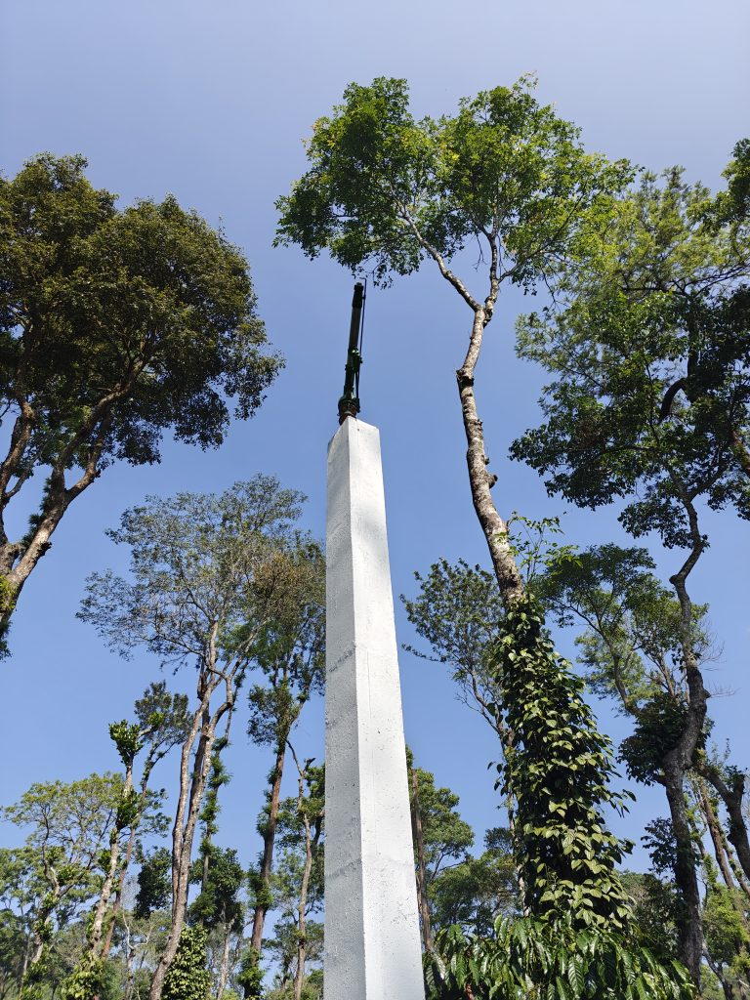
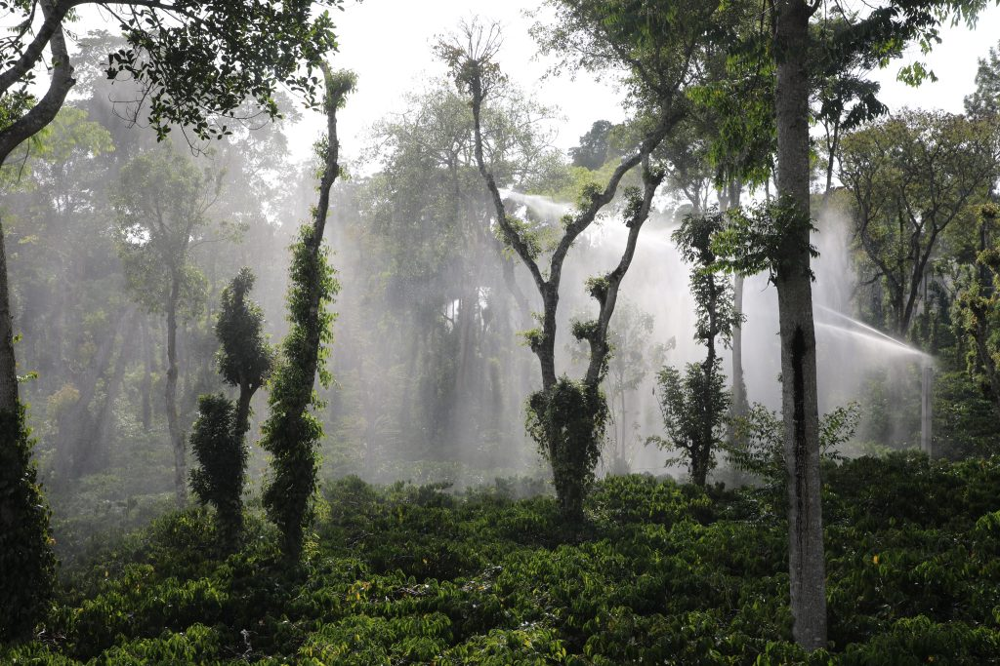

India’s coffee plantation sector has long struggled with labour shortages, particularly in rural areas, where migration to urban canters for better job opportunities has exacerbated the situation. This shortage of labour, compounded by the increasing difficulty of performing manual irrigation tasks, has put pressure on coffee growers to seek more efficient and labour-saving solutions. The mechanization of coffee farming, especially in shade-grown, eco-friendly plantations, has become a vital strategy to overcome these challenges.

The Coffee Board of India, alongside various coffee associations, has developed a long-term strategy to encourage and facilitate the mechanization of Indian coffee farms. This initiative aims to improve the productivity and sustainability of coffee plantations while reducing dependency on labour, which has become increasingly scarce. Joe’s Sustainable Coffee Plantation has been at the forefront of this movement, providing a clear example to the rest of the coffee-growing community worldwide that mechanization—through systems such as the energy-efficient concrete tower sprinklers—can significantly boost productivity and safeguard crops against the unpredictability of climate change.

The use of concrete tower sprinkler systems for coffee cultivation, pioneered by Dr. Anand Pereira at Joe’s Ecofriendly Coffee Plantation, offers numerous advantages. These towers, which support the rain guns for irrigation, are not only practical in terms of irrigation efficiency but also provide long-term sustainability and safety for the plantation. Below are some of the key advantages of using concrete tower sprinkler setups for coffee cultivation.

<figure id="attachment_48526" aria-describedby="caption-attachment-48526" style="width: 768px"><figcaption id="caption-attachment-48526">oplus_3145760</figcaption></figure>

### Ease of Operation

The concrete tower sprinkler system is designed to be user-friendly and easy to operate. With the rain guns permanently fixed to the towers, there is minimal need for constant adjustments. The system can be easily controlled through automated mechanisms, reducing the need for manual intervention. Furthermore, the simplicity of operation ensures that even workers with minimal technical expertise can use the system effectively. The ease of operation increases the overall productivity of the plantation, allowing workers to focus on other essential tasks related to crop management.

### **Uniform Rainfall Distribution**

Rain gun sprinklers are designed to replicate the natural distribution of rainfall by distributing water in an even and uniform manner. The use of concrete towers ensures that the rain guns are positioned at an optimal height, allowing them to cover a large area uniformly. This ensures that the coffee plantation receives consistent moisture, which is crucial for crop growth. Even distribution reduces the risk of over-watering or under-watering specific sections of the plantation, promoting healthy growth throughout the entire field.

### **Height of Sprinklers Covering Above Trees**

A significant advantage of the concrete tower system is the ability to position the rain guns above the height of coffee canopy trees. Coffee plants require consistent and uniform irrigation, especially as they mature and grow taller. If the sprinklers are positioned too low, the canopy of the trees may obstruct the water, leading to uneven watering. The height of the concrete towers allows the rain guns to spray water over the primary shade trees, ensuring that even the taller coffee plants are irrigated properly. This height advantage is especially important in large plantations where trees can grow quite tall.

### **Permanent Structure: Tremendous Saving of Labour**

One of the most significant advantages of using permanent concrete towers for the sprinkler system is the substantial reduction in labour costs and effort. Unlike traditional irrigation systems where rain guns need to be moved or adjusted regularly, the concrete towers hold the rain guns in place year-round. This permanence eliminates the need for labourers to set up, reposition, or dismantle sprinklers after each irrigation cycle. Consequently, workers can focus on other tasks within the plantation, such as crop maintenance, without the added burden of constant equipment management.

### **No Wastage of Labour in Shifting Rain Guns**

Traditional irrigation systems often require workers to move and adjust rain guns or sprinklers manually to ensure all parts of the plantation are watered. This results in a considerable amount of labour being spent on equipment repositioning. In contrast, the concrete tower setup eliminates this need entirely. Once the rain guns are mounted on the permanent towers, they remain stationary, thus saving labour costs and preventing wastage of valuable time and human resources.

### **Safety**

The concrete tower system also offers enhanced safety for both the irrigation equipment and the workers. Rain guns mounted on permanent towers are less prone to damage from accidents, theft, or wildlife interference. Additionally, these towers elevate the sprinklers, reducing the risk of accidental injuries during manual irrigation. With the sprinklers situated at a higher altitude, the system operates safely without requiring workers to physically interact with the rain guns frequently.

### **No Obstruction Even if Shade Lobbying is Not Done**

In many coffee plantations, shade lobbying (the practice of maintaining a canopy of trees to shield coffee plants from excessive sunlight) can sometimes create obstacles for irrigation systems. If shade lobbying is not carried out effectively, it can block the water distribution from low-lying sprinklers. However, with the rain guns mounted on tall concrete towers, the sprinklers are elevated well above the shade canopy. This ensures that even if shade lobbying has not been properly managed, the sprinkler system can still function efficiently and provide uniform coverage of water to the entire plantation.

### **Avoids Labour Dependency**

One of the ongoing challenges for coffee plantations, particularly in regions where labour availability is limited, is the dependency on manual labour for irrigation. Traditional irrigation systems often require large numbers of workers to manage the movement of sprinklers and ensure water distribution. The concrete tower system eliminates this dependency on manual labour. Once the rain guns are mounted on the towers and the system is set up, it requires minimal human intervention, making it a more efficient and reliable solution. This reduces labor shortages and helps maintain irrigation continuity, even during times when labour is scarce.

### **Efficient Gate Valve System**

The gate valve system integrated with the concrete tower sprinklers allows for easy control of water flow and distribution. The system can be activated or deactivated quickly and efficiently, allowing for precise control over the amount of water distributed to the plantation. The gate valve mechanism also helps prevent water wastage by ensuring that only the required amount of water is delivered, reducing excess runoff and evaporation. This efficiency is especially important in regions with water scarcity or during the summer months when every drop of water matters.

### **Sprinkle After Applying Fertilizer**

One of the most significant benefits of using the concrete tower sprinkler system is the ability to irrigate immediately after applying fertilizers. Fertilization is a critical aspect of coffee cultivation, but traditional methods often require waiting for rain or manually irrigating after fertilizing. With the rain gun system in place, farmers can apply fertilizers and then irrigate the plantation without delay, ensuring that the nutrients are absorbed efficiently by the plants. This contributes to better fertilization outcomes and optimal growth conditions for the coffee plants.

### **Eliminating the need to depend on unpredictable rainfall.**

major challenge faced by coffee growers is the dependency on natural rainfall, which is often unpredictable. Traditional irrigation methods can only be effective if there is a consistent water supply, whether through rainfall or manually. With the rain gun system mounted on concrete towers, there is no need to wait for the onset of monsoon. This system ensures that coffee plants receive the necessary moisture regardless of weather patterns, thus providing a reliable source of irrigation throughout the year. This independence from rainfall is particularly beneficial during dry seasons or in areas with erratic rainfall patterns.

### **Provides Effective Moisture During Summer and Major Fertilization Needs**

During the hot summer months, coffee plants require extra moisture to prevent stress and maintain healthy growth. The rain gun sprinkler system ensures that coffee plantations receive consistent and adequate irrigation during these critical periods. The system also meets the fertilization needs of the plants, as it can efficiently water the plantation immediately after fertilizers are applied, ensuring that the nutrients reach the roots and are absorbed effectively. This combination of effective moisture management and fertilization ensures optimal plant health and productivity throughout the year.

### **High Photosynthetic Activity and Fertilizer Uptake**

The combination of consistent irrigation and timely fertilization leads to enhanced photosynthetic activity in coffee plants. With proper moisture levels and an optimal supply of nutrients, the plants can carry out photosynthesis efficiently, which results in healthy growth and improved yields. The rain gun system helps facilitate this process by ensuring that the coffee plants receive the ideal amount of water and nutrients at the right time. This increased photosynthetic activity and nutrient uptake ultimately lead to healthier plants and higher-quality coffee beans.

### **Protection from Elephant and Wildlife Issues**

In many parts of India, particularly in areas with large coffee plantations, wildlife such as elephants pose a significant challenge to farming practices. Elephants, known for their strength and size, can cause significant damage to traditional irrigation systems and crops. Similarly, other wildlife can interfere with manual or temporary irrigation setups. Concrete towers, being permanent and durable, offer a significant advantage in protecting the rain guns from being damaged or displaced by animals. By mounting the rain guns on tall, concrete towers (ranging from 20 to 30 feet), they are safely positioned above the reach of most wildlife, minimizing the risks of interference and damage. This ensures the irrigation system remains intact and continues to function efficiently, even in areas where wildlife is prevalent.

### **Quick Return on Investment**

The concrete tower sprinkler system offers a quick return on investment (ROI) due to its durability, low labor costs, and efficient use of water resources. While the initial investment in setting up the system may be higher than traditional methods, the long-term savings in terms of labor and water usage make it highly cost-effective. Coffee plantations that adopt this system can expect faster growth cycles, better crop yields, and lower operational costs, all of which contribute to a rapid ROI. Additionally, the reduced need for water makes it a more sustainable and cost-effective solution in areas facing water scarcity.

### **Conclusion**

Coffee planters must adapt to climate change to boost crop productivity, as global warming is here to stay. Joe’s Ecofriendly Coffee Farm emphasizes the need for planters to be proactive, particularly from January 1st to June 15th, completing 60% of essential farming practices before the monsoon season arrives. This proactive approach is key to thriving in a changing climate. The use of concrete tower sprinkler systems for coffee cultivation provides numerous advantages in terms of efficiency, safety, and sustainability. By offering protection from wildlife, reducing labour dependency, ensuring uniform water distribution, and providing consistent moisture to coffee plants, this system has become a game-changer for modern coffee farming. The investment in permanent concrete towers is not only a cost-effective solution but also one that ensures long-term benefits in terms of productivity, environmental sustainability, and profitability. Dr. Anand Pereira’s pioneering efforts in implementing this technology have set a new standard in the coffee industry and demonstrate the potential of modern irrigation systems to revolutionize agricultural practices.

### **References**

Anand T Pereira and Geeta N Pereira. 2009. Shade Grown Ecofriendly Indian Coffee. Volume-1.