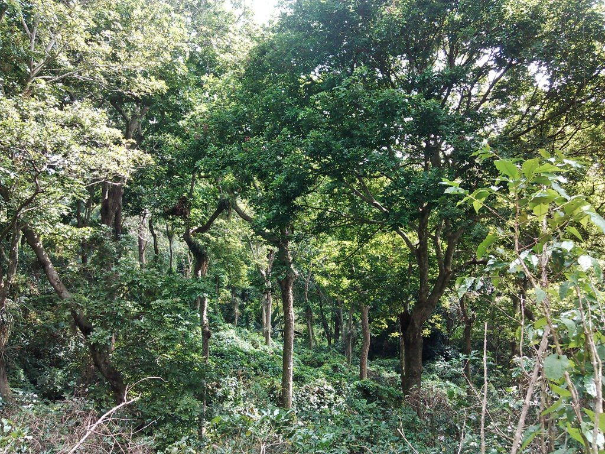
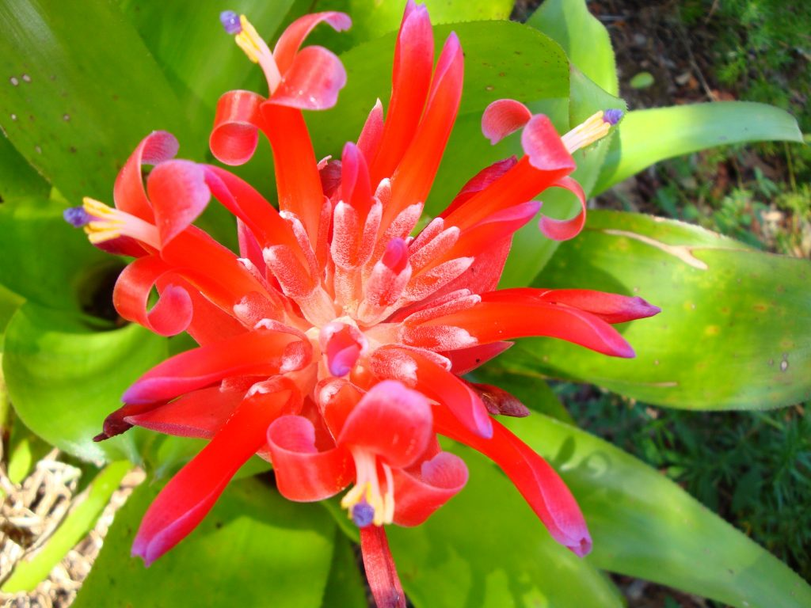
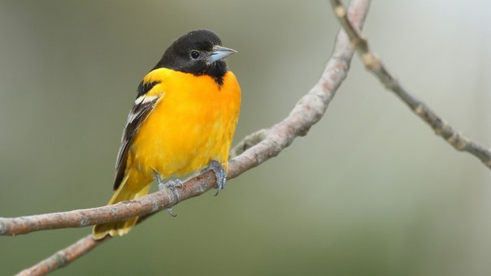
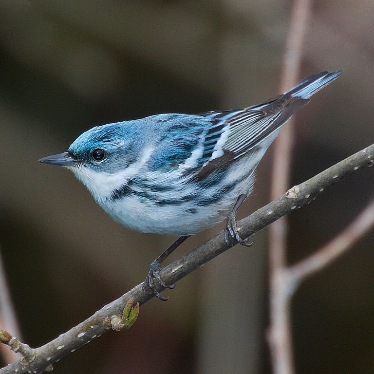
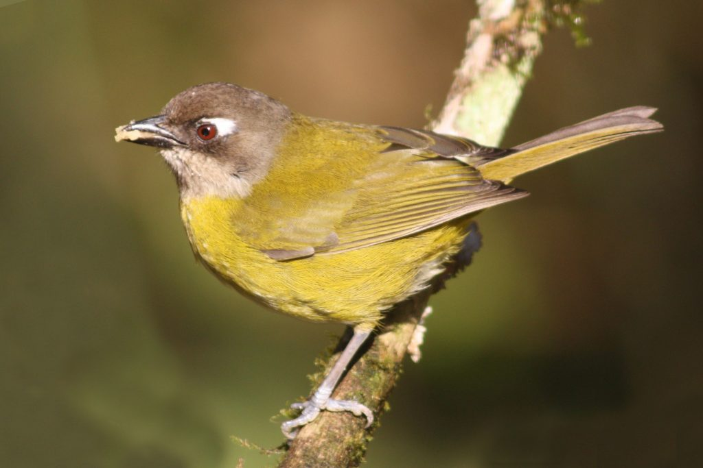
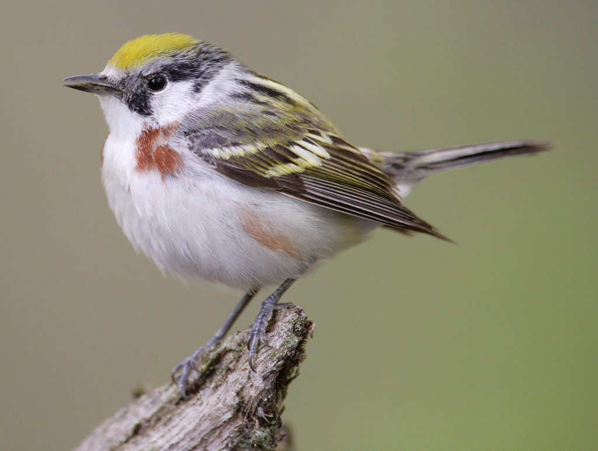
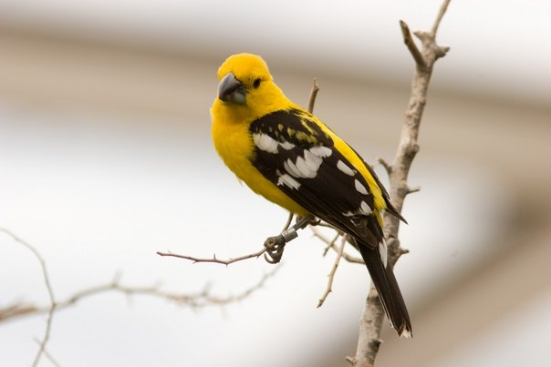
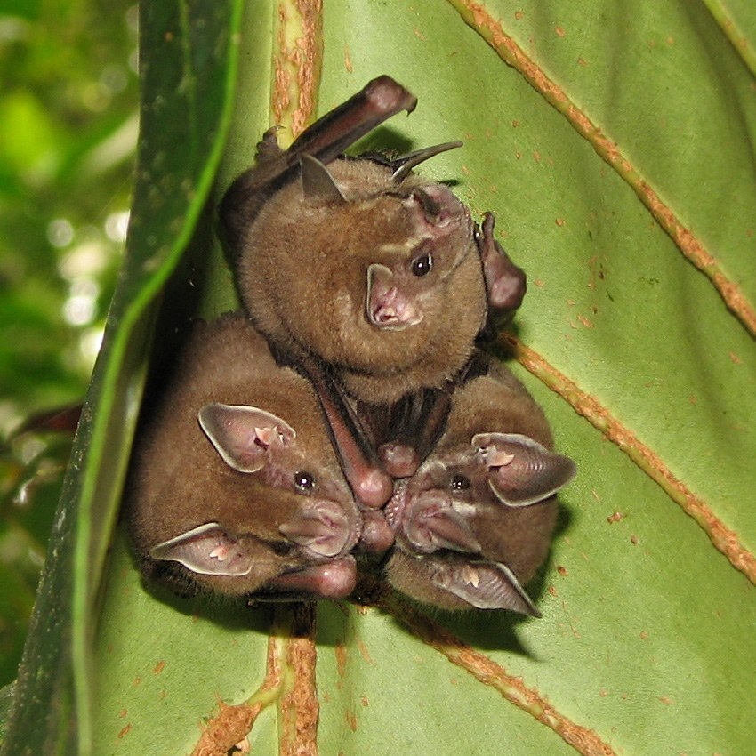

In its wild form, coffee has always grown under a canopy of leaves. Coffee growers would manage the natural forest and produce coffee in a way that was, in terms of biodiversity, second only to prime, untouched rainforest. A couple of decades ago the concept of “shade-grown” coffee didn’t exist, because all coffee was cultivated this way.

*Shade Grown Coffee by [USDAgov](http://commons.wikimedia.org/wiki/File:A_shade-grown_coffee_plot_helps_protect_water_quality,_provides_higher_yields,_reduces_irrigation,_and_even_provides_wildlife_habitat.jpg)*

However, with the introduction of sun-soaking hybrids this was all set to change. When coffee prices crashed in the late 1980s development organisations such as the U.S Agency for International Development encouraged farmers with investment and support to switch to sun-grown methods. Sun-grown coffee produces higher yields and exists in a monoculture vastly different to the traditional coffee farms, but also relies heavily on fertilisers and pesticides that coffee growers could only afford with subsidies.

In shade-grown coffee agriculture the use of these chemicals is rare, partly because the farmers can rarely cover the expense, but also because with this traditional method they aren’t as necessary. The birds, bats and predatory insects that thrive in this environment eat anything that may have its eyes on consuming the coffee crop, and as coffee trees are planted in a way that mimics the naturally diverse rainforest environment, the delicate ecosystem that sustains these trees remains intact.

Sun-grown coffee, by contrast, irrevocably alters the ecosystem and creates an artificial environment that is neither sustainable or diverse. Soil erosion becomes an issue, as does run-off from agricultural chemicals. The land becomes so altered (and often exhausted) that it’s very unlikely that reverting to shade-grown coffee would ever be an option.

*[Bromelaid](http://commons.wikimedia.org/wiki/File:Bromelaid_\(billbergia_pyramidalis\)_DSC00388_Bromeliad_\(11\).JPG) by Planeterry*

Despite this, scientists from the University of Texas have found that proportionally the land used to cultivate shade-grown coffee compared to sun-grown has fallen by a fifth since 1996. This could be down to the increase of intensive coffee production in Asia, but given the issues that are evident in this style of coffee cultivation it’s a worrying trend, and the crashing populations of birds and bats is often, combined with other factors, a direct consequence.

One of the certifications for shade-grown, sustainable coffee is the Bird Friendly tag, 95% of which is sourced from Central and South America. In areas such as Chiapas there are still many farmers who use an agroforestry system where a plethora of trees and plants support the production of coffee and a significant number of other species. While these places can’t match entirely intact forests, they can still fairly be described as a habitat rather than a monoculture desert, and are significantly less disastrous to wildlife than the aggressive clearing methods used to produce sun-grown coffee.

One of the main beneficiaries of shade-grown systems are migratory birds, 150 species of which have declined by 50% of the last twenty five years (funnily enough, around about the same amount of time in which sun-grown coffee has flourished). The small, oasis-like ecosystems of shade-grown coffee farms count up to 95% more visiting birds than the sun-grown equivalents, and these birds contribute greatly to the health of these farms.

One such bird that does so is the Baltimore Oriole, which contributes irreplaceably to its environment by pollinating flowers and dispersing seeds, as well as being rather good looking and singing beautifully. Another bird facing the challenges that come with changes in coffee production is the supremely pretty and delicate Cerulean Warbler. The fastest declining migratory songbird, this warbler relies on shade grown habitats and is facing a double challenge with its winter habitat in the Northern Andes also dwindling.

*[Baltimore Oriole](http://en.wikipedia.org/wiki/Baltimore_oriole#/media/File:Icterus-galbula-002.jpg) by Mdf*

*[Cerluan Warbler](http://commons.wikimedia.org/wiki/File:Dendroica-cerulea-002.jpg) by Mdf*

The Bush Tanager, of which there are many different varieties and subspecies living across Middle America, are supported by the epiphytes (a plant that grows harmlessly on another plant, for example orchids and bromeliads) that prosper in shade-grown coffee environments. These plants can provide nesting material for birds, as well as a home for the insects that they eat. The Chestnut-Sided Warbler, many species of Grosbeak, and a host of other varieties of birds rely on their habitats in Central America being preserved for their survival.

*[Bush Tanager](http://commons.wikimedia.org/wiki/File:Common_bush_tanager.JPG) by Charlesjsharp*

*[Chestnut Sided Warbler](http://commons.wikimedia.org/wiki/File:Dendroica-pensylvanica-003.jpg) by Mdf*

*[Yellow Mexican Grosbeak](http://commons.wikimedia.org/wiki/File:Pheucticus_chrysopeplus_-Burgers_Zoo,_Arnhem,_Netherlands-8a.jpg) by Arjan Haverkamp*

Bats also suffer in a switch to sun-grown coffee. Mexico boasts one of the world’s greatest diversity of bat species and they are vital to the ecosystem across South America, with at least 60% of the seeds of tropical rainforest trees being dispersed by bats. Shade-grown coffee creates a good environment for bats because the lack of pesticides means they have plenty of insects to eat (which is turn acts as a pest control) and the other fruits that can grow in the diverse setting of agroforestry also provide them with food.

*[Leaf Nose Bats](http://commons.wikimedia.org/wiki/File:Artibeus_sp._Tortuguero_National_Park_crop.jpg) by Leyo*

There is an increased abundance of bees in traditional forest-grown coffee plantations, which is vital in a time where we face catastrophe if bee numbers crash as they have been threatening to do. In fact, insects in general are supported, with one study in Chiapas finding 609 species of insects from 258 families in one sample of shaded polyculture. Ants also thrive, which is more good news as they are likely to feed to the pests that would otherwise plague coffee farmers.

Structurally diverse shaded systems allow much more room for wildlife and natural, sustainable processes, which can be a lifeline when rainforests are shrinking. Clearance of whole forests and turning land over to the intensive production of coffee is often an irreversible event that has profound results on the biodiversity of the area. The chain reaction of soil erosion and corruption of surrounding ecosystems from agricultural chemicals has further damaging effects. Shade-grown coffee by comparison can support a myriad of species of flora and fauna, and preserve these delicate and precious ecosystems.