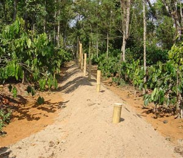
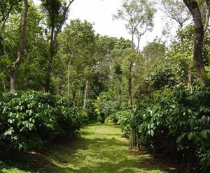
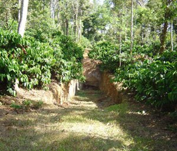
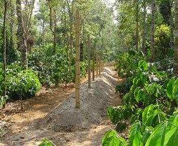
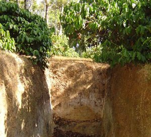
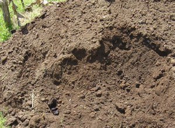
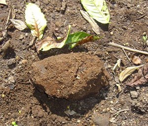
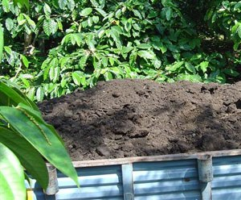

Modern day agriculture is toying with the idea of low external input and sustainable agri systems. It has been proved beyond doubt that continuous use of fertilizer in coffee makes the soil sick and this can result in a significant fall in the production levels. A new way of looking at this problem is by employing split applications of fertilizer coupled with large quantities of compost to give economic returns without damaging the soil and environment. Also, supplementing chemical fertilizers with farm yard manure (FYM) or compost within the coffee plantation has been an age old practice.

Restoration of soil nutrition calls for the right kind of composting. In short, various substrates and techniques are used inside the coffee plantation in the preparation of composts; namely, farm yard manure and compost from agricultural wastes. The entire bio organic complex contains nutrients within the tissues of the microorganisms which are held in abeyance during their lifetime and are not subject to loss by leaching. In fact, they act a reservoirs of nutrients required for plant growth and development.

It is very important to understand the complexities and diversities involved in composting, because the art of composting is purely based on scientific facts and a thorough knowledge of soil microbiology. Composting can be defined as a microbial process in which organic wastes are converted into humus by the activity of microorganisms.

### Farm Yard Manure (FYM):

Every coffee farmer is the owner of a small herd of cattle, primarily for the purpose of preparing FYM or compost. Generally the cattle urine and dung are lead into a pit which is mixed with greens and refuse straw from the cattle shed and made into heaps. The pit where the FYM is prepared is generally ten feet long, six feet deep and six feet wide. The heap is turned every three months and in about a years time digested FYM is available with 0.5% N, 0.2% P and 0.5% K. Even though this is not a very scientific method, it is followed by the majority of the small coffee farmers. Nutrients in FYM are not readily available to crop plants. Very little amounts of nitrogen are readily available but more than 70% of P and K are readily available.

### Kirehully Compost Method:

Most coffee farms are known for the availability of tons of organic raw material needed for preparation of compost. Poultry litter, sheep droppings, piggery waste, cattle dung, any of the above mentioned products (singly or in combination) are added to fresh leaf litter, weeds, succulent stems, coir pith, press mud, coffee husk in layers. At times, an inoculum of beneficial free-living nitrogen-fixing and phosphorus solubilising bacteria along with strains of *Trichoderma* and *Mycorrhizae* are inoculated to the mixture of organic residues so as to hasten the process of decomposition. The entire process of composting is either done by the **Pit** or the **Heap** method.

In the **pit** method, our experiments at Kirehully Estate , Joe’s Sustainable Farm have proved that long pits almost 50 to 75 feet long with a gradual depression on both ends are desired such that the tractor or lorry bringing in the organic wastes can get inside the pit and unload the waste right in the centre of the pit. The tractor comes in the opposite direction bringing in coffee husk and the lorry gets into the pit at the other end with poultry or cattle manure and without any wastage of labor the two components of organic material are mixed inside the pit itself. This method saves costly labor. We have experimented with 6 different sized pits ranging from 100 feet long, 8 feet wide and 10 feet deep to smaller pits of 50 feet long with the other dimensions being the same. The bottom of the pits is generally sprinkled with a handful of urea so as to accelerate the microbial activity and reduce nitrogen immobilization.

These pits were filled with different organic residues with coffee husk being the base material along with cattle dung. The organic waste is shredded into smaller pieces which results in a large surface area, ideal for quick break down by microorganisims. The *carbon* to *nitrogen* ratio was adjusted such that it remained in the narrow range of 10:3 . If the C:N ratio is lower than 15:1 then nitrogen is lost by ammonification. We add a little bit of *phosphorus*, *rock phosphate* and *potassium* to the pit because these two major elements (*phosphorus* and *potassium*) are required during the process of composting. *Phosphorus* is involved in the energy transfer of microbial cells and potassium in regulation of osmotic pressure of cells. We follow a special rule where in the organic matter deposited in the cradle pits or trenches inside the coffee estate is harvested and sprinkled on to the organic wastes. Actually this is a key step in the preparation of the Kirehully Compost method.

Another interesting method we follow is the vertical insertion of long bamboo poles inside the pit at intervals of 5 to 8 feet. The idea of having these poles is (a) for aeration and (b) to add water in case the moisture level declines beyond the threshold level. The organic matter inside the cradle pits has millions of beneficial nitrogen fixers, p solubilisers both symbiotic and free-living and is compatible and well established into the local ecological niche. When these bacteria, fungi, actinomycetes, and invertebrates such as nematodes, earthworms, mites, protozoa, and various other microorganisms like beetles, snails, slugs, roundworms, flatworms get into the compost pit, they activate and accelerate the rate of decomposition at the right phase. We refer to this precious inoculum as **Mother Culture** and it has proved beyond doubt that this inoculum results in well digested compost. As the various farm wastes were stacked up in layers, occasional sprinkling of water was carried out.

One must bear in mind that moisture status of the compost pit is a critical factor in determining the end product. Microorganisms require a high amount of moisture to carry out decomposition but cannot tolerate waterlogged conditions. The proper water content of compost is about 60 to 70 percent damp. If excess water is present it destroys the aerobic micro flora. Another important criterion is the adjustment of hydrogen ion concentration to a scale of six to seven. Since decomposition is associated with the production of organic acids the pH needs to be increased to neutral range by the addition of lime/ eggshells/ bone meal or wood ash. The top most layer of the pit was plastered with a mixture of clay and dung. Once every three months the mixture is turned inside out to provide aerobic decomposition. In about a year’s time, black colored compost which is fully digested is available to be broadcasted to the estate. It’s important to note that we wait for one full year before the compost is broadcasted inside the plantation, simply because it takes that much time for the equilibrium in the compost pit to set in.

We have observed by way of experimentation that the entire Kirehully composting process undergoes six phases before the raw material is converted into energy rich nutrients.  
**Phase 1** Build up of soil microbial population  
**Phase 2** Temperature build up inside the compost pit.  
**Phase 3** Breakdown of lignin, cellulose, hemi cellulose.  
**Phase 4** Temperature reduction phase.  
**Phase 5** Mineralization of organic wastes.  
**Phase 6** Stabilisation phase resulting in the formation of ready to use Brownish black compost

### Caution to Coffee Planters:

Most coffee planters follow the **heap** or **pit** method of composting but unfortunately the biggest mistake they do is introducing *exotic strains* of microorganisms inside the compost pit and these are harvested from crops (sugarcane, wheat, sunflower, rice, etc) totally unrelated to the sensitive coffee ecosystem. We strongly say that commercial inocula are generally *ineffective*if sourced other than coffee plantations. Herein, one has to understand that microorganisms are highly host specific in spite of being ubiquitous. For a short time the introduced exotic flora will try to compete with the natural micro flora; and in the long term, our studies indicate that both the natural and introduced organisms compete with each other resulting in undigested compost. So one has to take proper care to see that the *Starter Inoculum* needs to be harvested from a particular *Agroclimatic Region* which pertains to coffee. Secondly, most planters just wait for 3 to 4 months for microbial degradation and release the digested compost to the farm. This is dangerous because of the instability of the compost and presence of toxic metabolites.

### Advantages and disadvantages:

**Heap Method**

In the heap method of composting , a similar three tier layer of coffee husk, leaf litter and cattle dung or poultry litter are placed one above the other generally on the dead end roads of the estate roads. A thin film of plastic sheet is covered on the ground and after the heap is completed the plastic sheet is again covered at the surface so as to avoid rain and other material from getting in. The heap is also covered with little mud to seal it from the external atmosphere.

The major advantage in this method is that it saves on labor in two ways. First, no labor is involved in excavating the pit. Secondly, once the compost is ready, it is easily accessible to broadcast it inside the plantation. The major disadvantage with this method is that there is a **loss of almost 30% of organic matter and *nitrogen***. Moisture content is rapidly depleted and microbial activity is affected because of the exposure to atmosphere and high temperatures that develop during decomposition. If the composted material is not quickly applied, then there is a further loss of nutrients by microbial agents.

**Pit Method**

Preparation of compost by the pit method has several advantages. The decomposition is mainly anaerobic, except in the top layer. The organic residues are protected against loss of moisture by evaporation as well as excess of water in the rainy season and also loss by leaching is minimum. High temperatures do not develop due to anaerobic nature of decomposition which proceeds gradually. Weed seeds and pathogenic organisms are destroyed. The compost can be stored in the same pit for a longer period without much loss to nutrients due to the restricted decomposition once the compost is ready. The loss of nitrogen and other nutrients is minimized in the pit method and it is easy for the temperature build up for breaking down wastes into various intermediary products.

The only disadvantage is the initial cost in excavating the pit. We strongly recommend the pit method because the difference in the finished product is that of day and night.

### Mechanisms Involved:

In aerobic decomposition, there is an initial build up of mesophillic microorganisms, which are mild-temperature loving microorganisms \[20-35 degrees centigrade\]. This phase is followed by thermophillic microorganisms, which are medium-temperature loving \[45-70 degree centigrade\]. Maximum decomposition takes place in the second phase. Microorganisms derive their energy and carbon requirement from the decomposition of organic residues. For every 10 parts of *carbon*, one part of *nitrogen* is required for building up the cell’s protoplasm. Fungi are highly efficient in carbon assimilation compared to bacteria and actinomycetes. Pathogenic microorganisms get killed. At some stages of decomposition, the population of microorganisms per gram of organic debris can cross 8 billion. So one can imagine the magnitude of the beneficial role these invisible organisms play in cleaning up the environment and converting waste into wealth.

In aerobic decomposition of organic residues, no foul odors are emitted during the production of intermediary compounds. Exothermic energy is released during the oxidation of carbon to carbon dioxide. Due to the sealed nature of the pit, temperature build up takes place and reaches up to 85 degree centigrade. When the centre of the pit reaches a high temperature, some microorganisms migrate to the cooler regions or the periphery of the pit and recolonise once the heating subsides. At this final stage, microbial activity is decreased due to thermal kill. In the final analysis, one gets rich compost which can be immediately applied or further stored without much loss of nutrients due to restricted decomposition by microorganisms. In aerobic decomposition carbon dioxide is released. In anaerobic decomposition, the presence of oxygen is absent. Further, in the microbial succession pattern, acid-producing bacteria degrade organic matter into fatty acids, aldehydes, alcohols etc. Another set of bacteria convert these intermediate products to methane, ammonia carbon dioxide and hydrogen.

### Advantages of Compost:

Compost, in general, has most of the major and minor nutrients required for plant growth in the available form. Also, the nutrients are slowly released and hence avoid the build up of toxic metabolites in the soil, which in turn can cause ground water pollution. Composts aid in water retention inside the plantation. The hydrogen ion concentration of coffee soils is maintained at neutral ph which is ideal for growing coffee.

### Conclusion:

The new buzzword in farming is *organic*, *sustainable*, or *natural* farming. The bedrock of all healthy food is compost. In a world where people only think of quantity, today there is more awareness on the qualitative aspect. The dynamics has changed towards healthy foods. Consumers are prepared to pay a premium for coffee grown with less of chemical inputs. However there seems to be a wide gulf in interpreting what one understands by low external inputs in the U.S. and Europe. Many times, due to negligence, the impending humanitarian disaster is hidden from view. In short, the time is ripe for a hard look to show new-found respect towards an age-old, time-tested practice of using compost towards improving the biodiversity of the soil as well as conserving it above the ground.

One thing is certain: crops grown with compost are healthy and beneficial since they recharge the soil. Billions of microorganisms are activated in healthy soil for the benefit of the farming community. Repeated use of compost in coffee farming, enriches the soil and counters the ill effects of toxic elements in the soil. Compost acts as a good soil conditioner and improves the physical, chemical and biological properties of the soil. Compost also improves soil tilth, productivity and fertility. All of us need to give a helping-hand to nudge the process forward because it is vital for all of us to keep our national resource alive.