*Readers are requested to refer the article [PHYSIOLOGY OF COFFEE FLOWERING](http://ecofriendlycoffee.org/physiology-of-coffee-flowering/) for a better understanding of the present article.*

Coffee is an EVERGREEN perennial plant and has a curious origin in India. In the 17th century, saint Baba Budan, planted seven coffee seeds on the elevated hills of BabaBudan in Chickmagalore District of Karnataka (India). Thus coffee growing took its birth in the enchanting hills of Bababudan. There after Europeans, systematically introduced Plantations in India, in the 18th century.

Mr. Thomas Cannon established in 1830 the first coffee estate in Mysore Raj, at Balur again in chickmagalore. In Munzerabad, (Sakleshpur Taluk) coffee was introduced for the first time in 1843 by Frederic Green in Igoor and there after in 1857 by Mr. Elliot in a place called Barchinahalla – Hanbal. The Plantations of today are indeed the best memorials to such of those Europeans who pioneered the early coffee growing, in spite of many hardships.

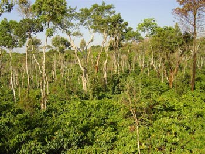

### THE FOREST FACTOR

The British Pioneers in India introduced two main species of coffee, viz, Coffee arabica (ARABICA) and Coffea caneophara (ROBUSTA) in the Western Ghat range, known for its unique biodiversity in terms of both plant and animal life. In the early years, Due to the forest factor, the rainfall pattern inside the coffee mountain was predictable and uniformly spread over a period of 5 to 6 months. In simple terms, the moisture requirement of the coffee farms was adequately met from time to time depending on the needs of the farm.

The early coffee plantations also, enjoyed well defined wet and dry seasons resulting in the luxuriant growth of coffee together with the multiple crops. This could be attributed to a peaceful co existence of various biotic partners within the coffee mountain. Coffee farmers and the surrounding biotic community lived with a close bond respecting each others needs. Today, all that is history. The rain cycle has changed markedly and the coffee farms, exposed to the vagaries of nature.

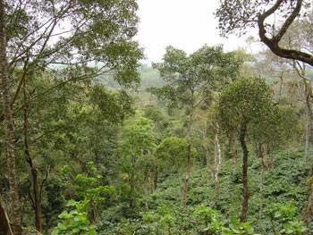

Water plays a critical role in the biochemical and physiological activities of the coffee bush. All life inside the coffee mountain is linked to the cycle of water. In order to better appreciate the importance of water and the functional role it plays we have enumerated some of its functions

### FUNCTIONS OF WATER IN PLANTS (Introductory Plant Physiology, 2 ed. Noggle & Fritz)

-   Water is a major constituent of protoplasm.
-   Is the solvent in which mineral nutrients enter a plant from the soil solution? Also, water is the solvent in which mineral nutrients are transported from one part of a cell to another and from cell to cell, tissue to tissue, and organ to organ.
-   Is the medium in which many metabolic reactions occur?
-   Is a reactant in a number of metabolic reactions?
-   In photosynthesis the hydrogen atom in the water molecule is incorporated into organic compounds and oxygen atoms are released as oxygen.
-   Water imparts turgidity to growing cells and thus maintains their form and structure. In fact water can be regarded as a material that provides mechanical support and rigidity to no lignified plant cells.
-   Gain or loss of water from cells and tissues is responsible for a variety of movements of plant parts.
-   The elongation phase of cell growth depends on absorption of water.
-   Water is a metabolic end product of respiration.
-   More water is absorbed by plants and greater amounts of water are lost as water vapor by plants than any other substance.

In the early years of coffee planting, the area under Arabica cultivation was significantly higher than the robusta’s, accounting for more than 80%. But, in later years due to uncontrollable pest and disease incidence in Arabica plantations, the area drastically reduced.

Today, out of a total area of approximately 3,50,536 hectares, Arabica accounts for 45% and Robusta accounts for 55%. India grows almost 3% of the world’s coffee and more than 80% of the produce is exported, contributing thousands of crores of rupees of foreign exchange. The Coffee board’s post blossom survey indicates that the Country’s 2005-2006 coffee crop is projected to be around 2,94,000 tones. Arabica crop is estimated at 105,600 tones and the Robusta crop is projected at 188,400 tones.

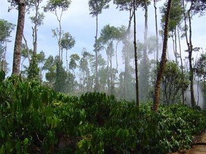

In the past two decades, due to the very high incidence of white stem borer and leaf rust a majority of the coffee farmers converted their Arabica farms into Robusta farms, without taking into account the irrigation requirements of Robusta. Robusta invariably requires pre blossom showers, Blossom showers and Post blossom showers at regular timely intervals and any deviation from the norm will drastically affect the yield and productivity of the farm. Among the Robusta’s and Arabica’s, the Arabica’s are more drought tolerant and can withstand drought up to the end of April. Robusta’s are more sensitive to moisture stress and respond very well to irrigation.

The irrigation requirement for robusta is very high. For irrigating one acre of coffee Up to a depth of one-inch (one acre inch) 22,660 gallons of water is required.

### COFFEE BELTS & RAINFALL PATTERNS

Coffee belts are synonymous with heavy rainfall regions. The coffee belts receive from a modest 30 inches of rainfall per annum to a high of 250 inches each year. This acts as a precursor for the growth of not only coffee but an incredible variety of flora and fauna because of the temperature differentials. The temperatures vary from humid to moderately dry. The inherent nature of coffee is that it is a shade loving shrub and in turn acts as a host and lodge for a number of microscopic forms of life. It is this uniqueness that gives a special taste to Indian coffee.

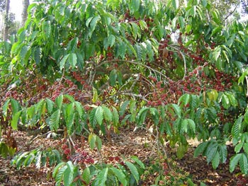

### COFFEE AS A COMMERCIAL CROP

After the British left India, new plantations mushroomed along the length and breadth of the western Ghat habitat, in areas which were dry, barren and open. More over, coffee gained ground as a commercial crop and played a significant role in providing much needed foreign exchange during the early part of this century.

In later years, Due to this commercialization, and overexploitation of forests, forest grown, shade loving Indian coffee took a severe beating because of the unfavorable weather patterns. The coffee farmer was a mute spectator to either excess of rainfall or long periods of drought. Added to the, uncertainty of rains, was the introduction of coffee varieties, which responded to artificial sprinkler irrigation. Steadily, but gradually, coffee farmers began experimenting with sprinkler irrigation and came out with a number of observations.

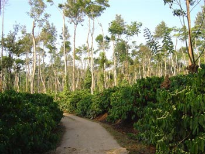

### WHY THE NEED FOR IRRIGATION

Unlike many other coffee producing Nations where rainfall is scattered throughout the year, a few countries including India are governed by a definite rainfall pattern spread over a period of 4 to 6 months. This type of rainfall is commonly referred to as the SINGLE RAINFALL REGIME (SRR). Under the SRR the coffee bush is subjected to a drought period of 4 to 5 months.

Hence, Coffee growing Countries like Vietnam, Africa, and India depend on artificial irrigation to boost productivity. However in Countries like South America and Central America irrigation is not required because the rainfall pattern is distributed through out the year with no specific wet or dry periods.

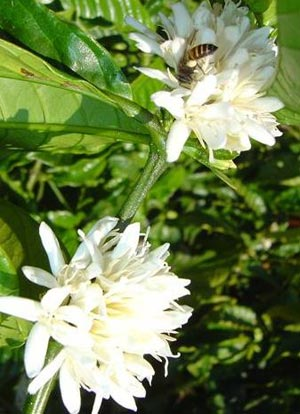

A close look at the coffee bush reveals that it requires adequate soil moisture to carry out its physiological and biochemical functions during dry spells. Just as the coffee bush cannot tolerate water logged conditions, so also the bush cannot tolerate a low moisture regime for an extended period of time. The coffee bush quickly reacts to moisture stress affecting its physical as well as physiological components.

Mitchell, (1988) has carried out extensive work on the critical period for irrigating coffee. They are as follows:

1.  At the time of flowering.
2.  Period of berry expansion (7 to 17 weeks after flowering)
3.  The period of dry matter development when the beans fill and become solid.

### ADVANTAGES OF IRRIGATION

1.  Reduces the drought period in coffee.
2.  Enhances the vegetative woods.
3.  Provides a reliable insurance cover against crop failure for the coming year.
4.  Increases the beneficial microbial content of the soil.
5.  Increases the organic matter decomposition in soil insitu because of the prevailing high temperatures.
6.  Provides the much needed micro climate, enabling the root zone to function effectively.
7.  Enables uniform fruit set and uniform berry size.
8.  Improves the nutrient uptake.

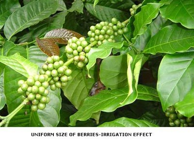

The major coffee growing belts in India are situated in South India and the coffee farmers invariably rely on the South west monsoon for the rainfall. More than 75 % of the total rainfall is received in the months of June, July, August and September. Then the North East monsoon takes over resulting in a few sporadic showers in the months of October and November.

In the technical sense, with predictable rainfall patterns, the coffee farms have adequate moisture up to mid November and thereafter the moisture stress sets in. This moisture stress may be extended up to May end resulting in a prolonged drought period of six months. Delayed showers (Pre, Blossom & Post Blossom) results in partial to complete failure of the crop. Adequate soil moisture is continuously required for the growth, development, and maturity and ripening of the existing crop.

The coming years bearing wood also requires large quantities of soil moisture. Scientific studies conducted by Awatramani, 1973 indicates that the available soil moisture decreases from 100 % during November to 50 % with in 20 to 25 days and if there is no rain, the available soil moisture would drop down to zero percent by first week of January.

This data enables us to understand the water requirements of the bush. More importantly, it throws light on the fact that excess of irrigation is detrimental to the plant. Secondly, providing irrigation, when the bush does not require it, will lead to a physiological imbalance in the flowering of coffee.

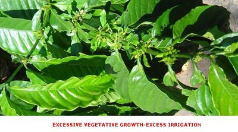

Coffee cultivation to a small extent is also confined to the hilly tracts of the Eastern Ghats. These areas predominantly receive the North East monsoon during the months of October and December. However, most of the coffee grown in these regions are the Arabicas and need no irrigation.

### WINTER IRRIGATION

Coffee farmers with adequate storage tanks, generally commence winter irrigation for Robusta variety in the months of November and December to reduce the period of drought. Winter irrigation is known to boost up the physiological activities of the coffee bush and improve the organic matter decomposition of coffee soils. Winter irrigation also helps the bush to overcome the inadequate natural blossom showers in the month of February and March essential for flowering.

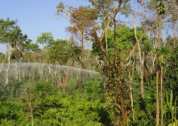

The timing and quantity of winter irrigation is very crucial in realizing the benefits of winter irrigation. The first irrigation should commence within 15 days from the last major rainfall of the North-East monsoon. The first irrigation should consist of at least one acre inch of water and the subsequent irrigations should consist of three fourth acre inch of water and can be repeated every three weeks up to the end of December. It is important to note that the coffee bush requires a moisture stress period for at least 45 days starting from January. This stress has a direct bearing on the biochemical activities of the plant and prepares the flower buds to open up during the subsequent irrigation or natural showers.

The most noticeable difference with winter irrigation is the uniform ripening of berries ensuring good quality of coffee beans. This uniformity in ripening reduces labor costs, since coffee can be hand picked in just one or two rounds compared to three rounds.

### BLOSSOM SHOWERS

Sprinkler irrigation for Robusta blocks is generally carried out during the second week of February for selection Robusta (S-274) and the first week of March for old Robusta. The minimum amount of water to induce healthy blossom is one and a half acre inches of water for S-274 and three fourth acre inches for old Robusta. It is imperative that the coffee farmer completes his ROBUSTA blossom showers before the 15th of March. Any delay after the second week of March results in the bud damage to the tune of 25 to 30 %. Arabica varieties are more tolerant to drought and irrigation need be given in the month of April if natural showers fail.

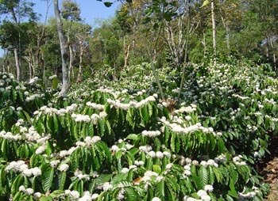

### CARE TO BE TAKEN BEFORE BLOSSOM SHOWERS

1.  The area under the coffee bush should be cleared of all leaf litter up to a radius of two and a half feet.
2.  Coffee blocks receiving sprinkler irrigation (specific day), should be fertilized with 125 grams urea (nitrogen). mixed with 50 grams of neem cake. World wide, research indicates that at the time of flowering, the plant requires a tremendous amount of energy. Hence, to meet this energy demand, application of urea is done. Urea easily dissolves with water and is immediately made available to the plant.
3.  The very next day after irrigation, the leaf litter should be spread out at the base of the plant to conserve moisture.

### BACKING SHOWERS

Water is one of the key elements in determining the fruit set. At times, when the rains fail, backing showers, 21 days after the first blossom showers is very crucial in ensuring proper fruit set. Any delay may cause irreparable damage leading to abortion of the fruit. Backing showers should be repeated every 21 days until the onset of monsoon. Generally, the amount of water required for backing showers is in the range of three fourth to half an acre inch of water.

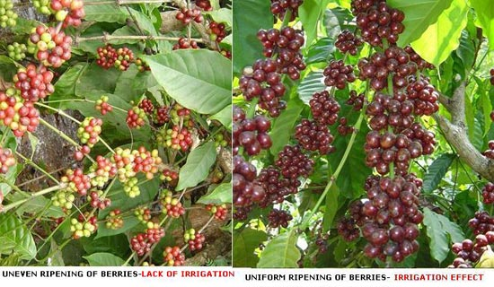

The Central Coffee Research Institute, Coffee Research Station, Balehanoor has done pioneering work with regards to irrigation schedule for Robusta. We quote from their EXTENSION FOLDER 16/98: A SIMPLE METHOD FOR IRRIGATION SCHEDULE OF ROBUSTA COFFEE ( Extension folder16/98 Central Coffee Research Institute, Balehanoor, Chickmagalur District )

### TECHNIQUE DEVELOPED

A simple technique using 10 % cobalt chloride paper discs (20 mm2) has been standardized by taking into consideration the changes in leaf water potential and photosynthetic efficiency due to soil moisture depletion.

### CRITERIA ADOPTED

-   The leaf water potential at which there is a reduction of 50% photosynthetic efficiency of the plants was considered as criteria for identifying the period of irrigation.
-   Depletion of soil moisture content from the field capacity to 10% moisture content (50% of its field capacity).

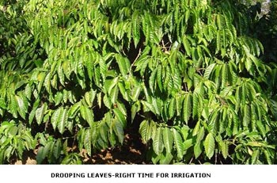

### PRINCIPLES

The cobalt chloride paper disk (CCPD) WILL BE BLUE WHEN IT IS MOISTURE FREE (DRY) and changes into pink color (wet condition) by absorbing the water vapor released during transpiration.

Under optimum soil moisture condition, the rate of transpiration will be normal and the cobalt chloride paper takes one or two minutes for its color change. Where as during moisture stress condition ( drought period ) the time taken for the color change of cobalt chloride paper will be more due to less transpiration rate which is used as a tool for identifying the critical period.

### PROCEDURE TO BE ADOPTED

The assessment should be carried out using third pair of Robusta leaf from the tip of the tertiary branch. No. of plants to be assessed: 5 to 6 random per acre. No. of branch per plant: one. No. of leaves per plant: one.

The cobalt chloride disks which are kept in air tight glass tubes with desiccants ( silica gel ) has to be taken out with the help of a forceps and immediately placed on the lower leaf surface avoiding veins supported with two glass slides and a pair of clips. The time for the color change of the cobalt chloride paper disk has to be recorded.

### ASSESSMENT PERIOD

The assessment of the cobalt chloride paper has to be carried out during summer months (Feb-April) between 12 noon to 2 p.m. on a bright sunny day.

### IRRIGATION SCHEDULE

When the paper takes more than 7.5 minutes for its color change, irrigation should be resorted. The irrigation given at this stage has resulted in single perfect blossom and increased the fruit set, vegetative growth and leaf retention in addition to reducing floral abnormalities. Thus it has enhanced the crop yield.

The Central Coffee Research Institute, Coffee Research Station, Balehanoor has also done extensive work on drought management in both Arabica and Robusta. We quote from the “COFFEE GUIDE 2000”. Attempts have been made to overcome the effect of drought in Robusta coffee through osmotic adjustment.

Field trials conducted for 7 years indicated that foliar application of nutrient mixture in the following combination could result in overcoming the adverse effects of drought and also increase crop yield to an extent of 22%. Suggested concentration and schedule of spray are:

### NUTRIENT MIXTURE PER BARREL OF WATER:

UREA (0.5%)

1kg.

Super phosphate (0.5%)

1kg.

Muriate of Potash (0.375%)

750g.

Zinc Sulphate (0.5%)

1kg.

### SPRAY SCHEDULE

FIRST SPRAY: 45 days after the last rainfall (second fortnight of January)

SECOND SPRAY: 30-45 days after the first spray.

SPRAY SOLUTION: One liter per plant.

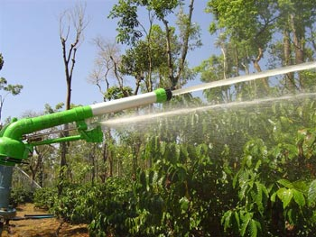

### HANDS DOWN EXPERIENCE AT JOE’S SUSTAINABLE FARM, KIREHULLY ESTATE

The Kirehully Coffee Mountain comprises of one big block of Robusta. The third generation is managing the farm. Down the ages, each generation has passed on very valuable information regarding the coffee plant’s irrigation requirements.

1.  Commence blossom irrigation only after subjecting the bush to drought (January to February first week). This practice results in the translocation of photosynthates towards the bud resulting in a healthy blossom.
2.  The best time to irrigate Robusta Coffee is between February 10 Th and March 15th. Backing showers are a must 21 days after the first irrigation.
3.  Farms comprising of only Selection Robusta, ( S-274) then the blossom showers with one and a half acre inches of water (40mm) should be completed by March 7th.
4.  Farms comprising of only old Robusta, then the blossom showers with one acre inch of water (26mm) should be completed by 15th March.
5.  Due to inadequate unseasonal showers in the month of February, say 25 to 40 cents of rain, then irrigation should immediately commence, with one acre inch for selection Robusta and half an acre inch for old Robusta.
6.  In case of unseasonable showers, substitution with sprinkler Irrigation can continue up to day 6.
7.  Farmers having only Robusta blocks and such of those who irrigate their farms every year should carefully monitor the vigor of the bush. Excess vigor is detrimental towards good blossom and fruit set. In such cases, blocks which receive irrigation first should be irrigated at a later date but within the scheduled irrigation period.
8.  The best time to irrigate is from dusk to dawn to avoid winds and high daytime temperatures.
9.  Flowers which open with just the right amount of blossom showers have a higher survival rate than those irrigated with excess of water. This clearly indicates the sensitiveness of the plant to excess water.
10.  Blossom showers should commence, only after picking the standing crop. Under exceptional circumstances like unseasonal rain, blossom showers can commence on the standing crop.
11.  Over lapping of impact sprinklers is a must during blossom showers. However, during backing showers, sprinkler overlap is not necessary.

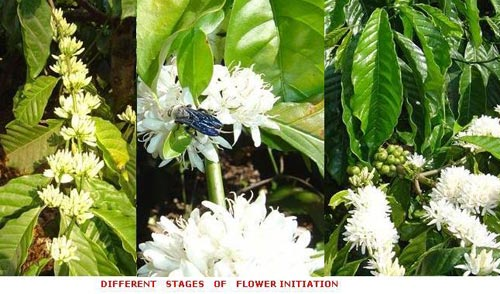

### PERFORMANCE OF ROBUSTA’S AT JOE’S SUSTAINABLE FARM, KIREHULLY ESTATE

One has to bear in mind that the coffee plant originally belonged to the forests and subsequently efforts were made by plant breeders to evolve disease resistant and higher productivity cultivars for commercial cultivation. The early plant breeders noticed that the selection Robusta (S-274) variety was unable to endure long periods of drought in the summer months, resulting in late cropping as well as late stabilization of yields.

However, at Joe’s Sustainable Farm, Kirehully; we have observed that the old robustas (resemble the wild variety) are more resistant to drought and have evolved a set of mechanisms suited to the environment they live in. They can adapt to extremes of drought or excess of moisture. Our research is providing valuable clues, essential for the survival of the coffee mountain during drought periods.

Boosting the plant’s ability to deal with insufficient water might also enhance their ability to overcome other challenges like pest and disease resistance. We have observed that the old Robusta variety or the so called traditional robustas have three in built mechanisms with respect to tackling drought.

### A) DROUGHT TOLERANCE or RESISTANCE:

The old robusta’s have the innate ability to withstand or avoid injury from water stress. Nature has gifted the old robusta’s the in built hardiness which confers drought tolerance. We are of the opinion that the old Robusta variety has evolved a set of features that allow it to carry on a reduced rate of photosynthesis at extremely low levels of water potential. The coffee bush has a set of pores on its leaves.

Coffee plants use these pores to take in carbon dioxide, but lose water through them whenever they are open. The biochemical activities within the plant are stimulated to maximize water uptake but minimize loss so that tissue hydration is maintained. Further, Coffee blocks which receive a heavy input of organic manure over the years are more likely to tackle drought more effectively, when compared to blocks having low organic matter.

### B) DROUGHT AVOIDANCE:

The old robustas are like small miniature trees with a densely matted root system, well spread and also reasonably deep rooted. These roots draw out all available water from the lower depths. Another characteristic feature of the old robusta’s is that the leaves are much smaller than the selection robusta’s.

The smaller leaf size enables the plant to have a lower transpiration rate and conserve water. These leaves orient themselves parallel to the sun’s rays, so that the absorption of solar radiation is minimized and water loss is reduced. This in built genetic mechanism aids the coffee plant in being more economical in the use of water and helping them strike the right balance for the environment they grow in. These combined characteristics aid the plant to avoid drought.

### C) DROUGHT ESCAPE:

The coffee bush stores energy and water in certain tissues during the normal season and during periods of drought are able to escape it by harvesting the water and energy from the stored tissues.

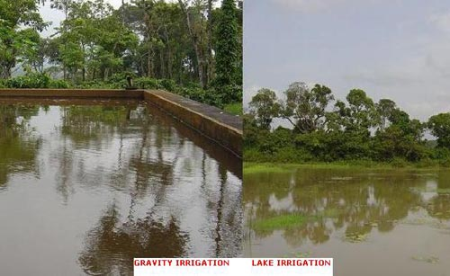

### CONCLUSION

Irrigated coffee has many shapes, sizes and faces. These range from large storage tanks, stream or river fed surface systems, bore wells or tube wells to open wells. Water being a limited resource, its efficient use is critical to the well being of the farm. This point in time, we emphasize the fact that, irrigation plays a pivotal role in the establishment and productiveness of ecofriendly Indian Robustas.

The yield per acre in Robusta farms is twice compared to Arabica farms and this is possible only because of irrigation. Coffee farmers are aware that irrigation can give assured crops, but they need to be enlightened on effective irrigation management practices to maximize yields. For e.g. If excess of irrigation is provided during drought conditions, then the plants become highly susceptible to the very same life giving water.

Another troubling factor affecting the coffee farms is the influence of green house gases on the environment. For the past 10 years due to accelerated global warming the monsoon pattern has been highly erratic and the coffee farms are experiencing long droughts in the summer months. . This is likely to become increasingly important as climate change leads to drier conditions. At this rate the coffee mountains will have to handle weather at its most extreme.

These circumstances have resulted in BEHAVIOURAL variations making it all the more difficult to understand the exact needs of the Robusta plant to increase productivity. In a way, nature prepares us to expect the unexpected. These variations have resulted in the uneven size of coffee berries leading to an unusually high rate of drop in the monsoon season.

Deforestation has also destroyed a vast network of the forests. Unfortunately, it is the human activity that is destroying, the very fabric of the fragile coffee mountain. It is not easy to combat this trend. The absence of the lush green forest cover has modified the climate, advancing the drought. There are important lessons to be learnt from depleting forest cover which has resulted in many undesirable microscopic changes with respect to movement of the flower bud. Unfortunately, we cannot see the unseen danger ahead.

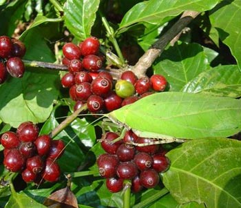

Coffee farmers need to see, how all things are interconnected inside the coffee mountain. Even the minutest of particle has a vital role to play in the larger scheme of things. Inside the coffee mountain myriad of elements connect with each other, often playing a complimentary role. We should prevent nature’s rules from turning upside down. Inevitably, in time, we will recognize the value of the sacred land of our forefathers which has grown both in size and independence.

### REFERENCES

[Eco-Friendly Indian Coffee: A Profile](http://ecofriendlycoffee.org/eco-friendly-indian-coffee-a-profile/)

[Coffee Plantations A Multidisciplinary Approach](http://ecofriendlycoffee.org/coffee-plantations-a-multidisciplinary-approach/)

[Rain Water Harvesting in Coffee Plantations](http://ecofriendlycoffee.org/rain-water-harvesting-in-coffee-plantations/)

[Soil Water Conservation in Coffee Plantations](http://ecofriendlycoffee.org/soil-water-conservation-in-coffee-plantations/)

[Organic Matter Decomposition In Coffee Plantations](http://ecofriendlycoffee.org/organic-matter-decomposition-in-coffee-plantations/)

[Global Warming in Coffee Plantations](http://ecofriendlycoffee.org/global-warming-in-coffee-plantations/)

[Coffee Forest Symbiosis](http://ecofriendlycoffee.org/coffee-forest-symbiosis/)

[Physiology of Coffee Flowering](http://ecofriendlycoffee.org/physiology-of-coffee-flowering/)

Awatramani, N. A. 1973. Sprinkler irrigation for coffee. 1. Studies on rainfall pattern and soil moisture. Journal. Coffee Research. 3 (1): 3-13.

Awatramani, N. A., Mathews Cherian and Mathew, P.K. 1973. Sprinkler irrigation for coffee. 11. Studies on Robusta Coffee. Indian Coffee. 37 (1): 16-20.

Cannel.M.G.R. 1975. Crop physiological aspects of coffee bean yield: A. Review.J.Coffee Res.5 (142): 7-20.

Coffee Guide. 2000. Central Coffee Research Institute, Coffee Research Station. Chikmagalur District. Karnataka. India.

Krug. C. A. and Poenck, R. A. 1968. World Coffee Survey. Published by F.A.O. Rome. 476 pages.

Leopold. C. A. and Kriedemann. P. E. 1975. Plant Growth and Development. 2nd edition. Tata McGraw-Hill Publishing Company LTD. New Delhi.

Mitchell. H.W. 1988. Cultivation and Harvesting of Arabica coffee tree. In Clarke, R.J. and Macnae. R. (Eds). Coffee. Vol.4. Agronomy (pp. 43-90). Elsevier Applied Science. London and New York.

Noggle. R. G. and Fritz. J. G.1986. Introductory Plant Physiology. 2nd edition. Prentice-Hall of India Private Limited. New Delhi.

Naidu. R. Director of Research. Coffee Extension Folder 16/98. A simple method for irrigation schedule of Robusta coffee. Central Coffee Research Institute, Balehanoor, Chickmagalur District

Raghuramulu. Y. 2001. Irrigation Management in Coffee. Head. Division of Agronomy, Central Coffee Research Institute, Coffee Research Station. Chikmagalur District.

Wrigley. C. 1988. Coffee. Longman Scientific and Technical, Essex. England. 639 Pages.