_Readers are requested to refer to [Human Snake Conflict Inside Coffee Forests](/human-snake-conflict-inside-coffee-forests/), [Snake Diversity and Conservation Inside Coffee Forests](/snake-diversity-and-conservation-inside-coffee-forests/) and [Coffee Forests and the Dancing Spectacled Cobra](/coffee-forests-and-the-dancing-spectacled-cobra/) for a better understanding of the present article._

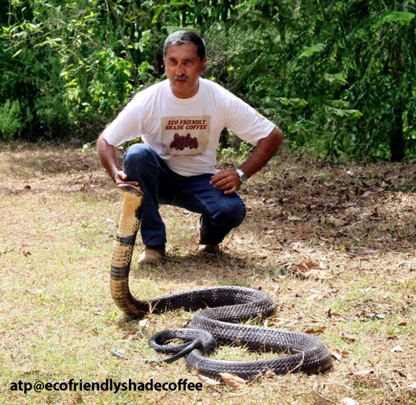

The world is awakening to a brand New Year. This article is especially written at the beginning of this year 2013 so that wildlife preservation gets top priority in your New Year 2013 resolutions. Go ahead! Make an impact; even in a small way that goes a long way in the end.

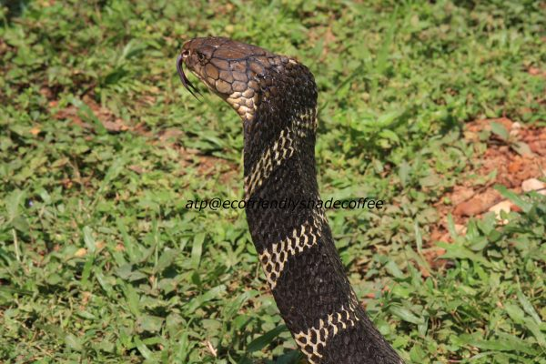

The King Cobra is perhaps the most feared reptile in India. In recent years this magnificent reptile is moving from the core of the western Ghats and seeking refuge inside shade grown ecofriendly coffee forests of Karnataka State. (Karnataka State harbors 60% of the Western Ghats ). No field study has been carried out as to why the King Cobra is taking shelter inside shade grown Ecofriendly coffee forests.

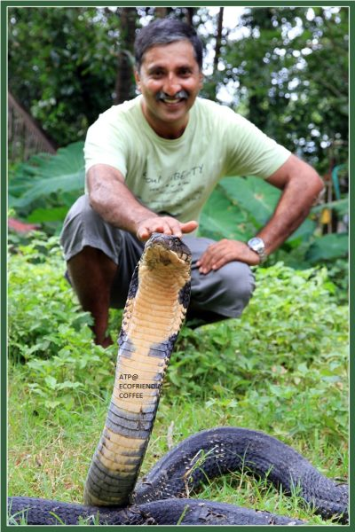

A snake so big as the King has highly specialized habitat requirements. Perhaps, the impact of climate change and Global warming may be one among the several factors associated with this shift. Another reason may reflect the change in the quality of habitats, such as a growing shortage of appropriate ground cover within the natural forest.

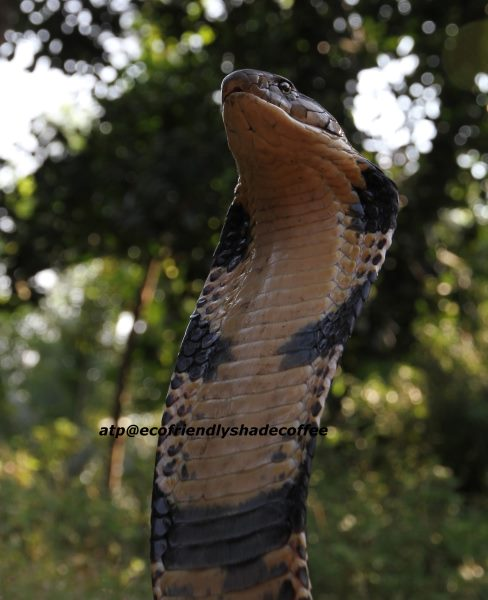

The fact of the matter is that all snakes, whether poisonous or nonpoisonous are paramount to the health of the coffee ecosystem. To simplify this complex statement, snakes play different roles, both that of a predator or prey in balancing the dynamics of the coffee habitat.

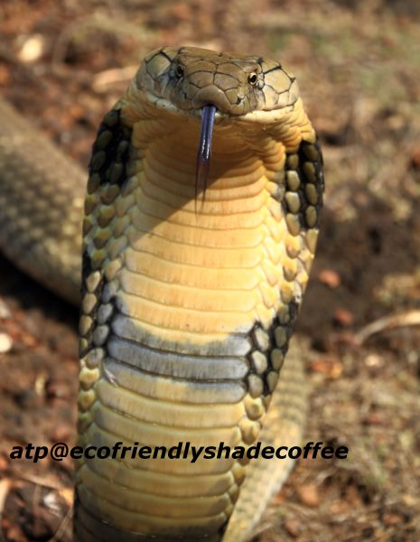

Like all snakes the King Cobra is an ectotherm and regulates its body temperature by basking in the sun. Like all other snakes, the King Cobra is associated with several beneficial aspects. The king not only eats other poisonous snakes but also effectively keeps the balance of nature in check. Venom is also used in the preparation of various therapeutic drugs.

A novel protein called “HADITOXIN” within King Cobra venom discovered by Dr. Manjunatha Kini and his team could lead to better treatment options for certain neurological conditions. The King Cobra is the only snake that can control the amount of venom it injects into its prey unlike other snakes.

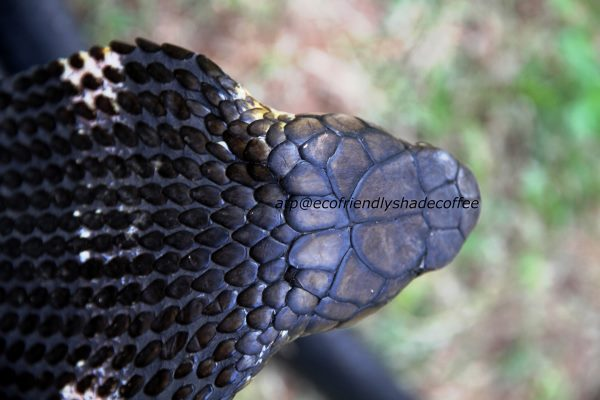

To begin with, we have highlighted a few of the facts with respect to the King Cobra, so that each of you can familiarize and understand its behavior and habitat.

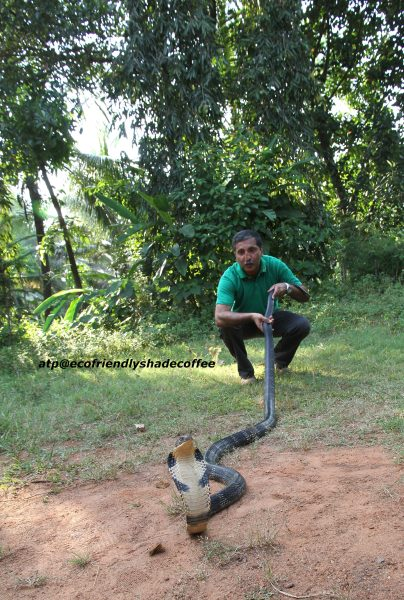

The pictures of the King Cobra that you are about to view is a result of our 25 year work mapping the biodiversity of the Western Ghats and coffee forests. Over the years we have been fortunate to come; face to face with the king on a number of occasions. It is hard to describe the feeling when one encounters the king in the wild. Regal, Majestic and imposing, one can feel ones hair stand up with goose bumps on the undersurface of the skin and then with the passage of time the reptile appears gentle and smooth provided one understands the language of nature.

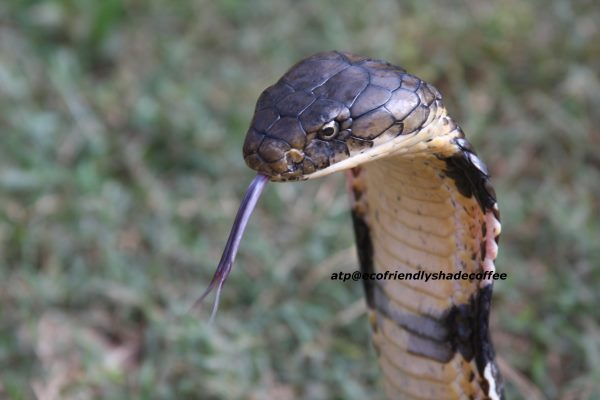

We have provided pictures of both the GREEN and BLACK colored King cobras in every possible angle so that even an amateur can appreciate and identify different types of King cobras. A few of the close ups, will be of great help in identifying the scales and patterns of King Cobras that are present in the Western Ghats. A few rare slides pertain to molting and shedding and one can see the visible imprint of the scale.

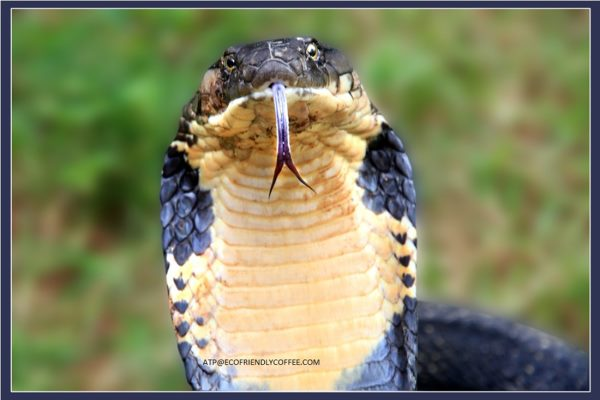

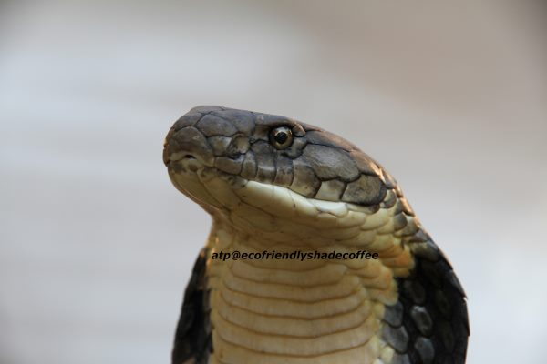

Even though, many pictures look alike, each is different and has a different story to tell. We have encountered many risks photographing these rare and magnificent reptiles and we hope these pictures will inspire you to make conservation of nature as one among your top new year resolutions. We are sure that all of you will agree that , we have received much more from Nature than what we have given back.

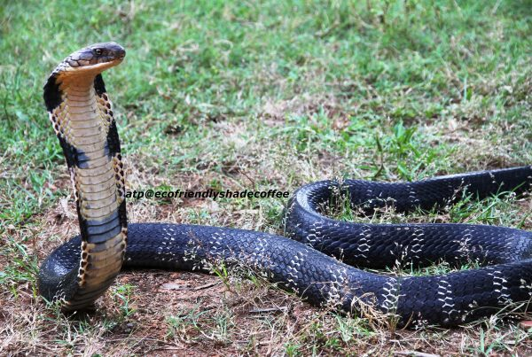

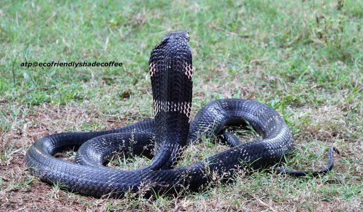

DESCRIPTION : The King Cobra, a religious icon in India and the country’s National reptile, is the world’s longest venomous snake.

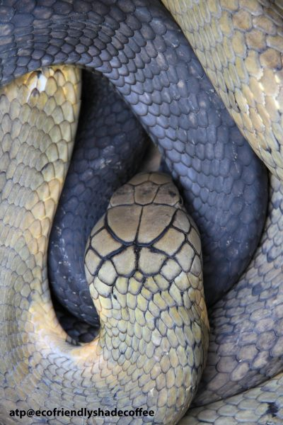

The King cobra, the longest of all living venomous snakes in the wild, is truly a magnificent creature which exudes awe and inspiration. The species is not a true cobra of the genus Naja (spectacled cobra ) instead is categorized into a separate genus whose scientific name derives from the Greek for “Snake-eating”.

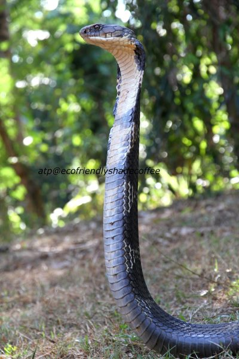

DISTRIBUTION: The King Cobra is found in densely forested areas of Karnataka (Western Ghats ), Tamil Nadu, Kerala, Goa, Andhra Pradesh, Orissa, West Bengal, Sikkim, Assam, Meghalaya, Arunachal Pradesh, Mizoram, Manipur and the Andaman Islands. Indonesia, Southern China and South east Asia ,once had large populations of the ecologically vital snakes, some specimens of which grow to 18 feet in length and weigh up to 12 kg, though the average length of the snake is 3 to 4 meters and its average weight is 6 kg.

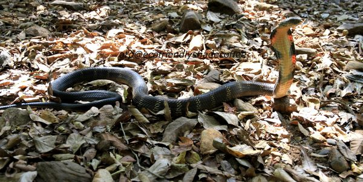

HABITAT: The primary dwelling place of king cobras is the rain forest, grasslands and plains. They prefer thick undergrowth and clusters of bamboo. It is known to occur from sea level to mountainous regions. If you think, king cobras live only in deep jungles, then you are wrong. They also do well in fields and other human dominated landscapes where they hunt other snakes.

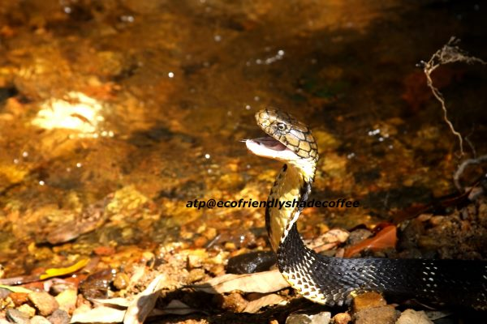

By and large they prefer dense forests, with water bodies in the vicinity. By eating other venomous snakes, the king cobras play an important role in the ecosystem, keeping the balance so that the numbers of other snakes are kept down. The king cobra is not an aggressive snake. They mostly enter the human settlements while chasing their prey. They act as bio-control agents for other venomous snakes which cause thousands of fatalities every year.

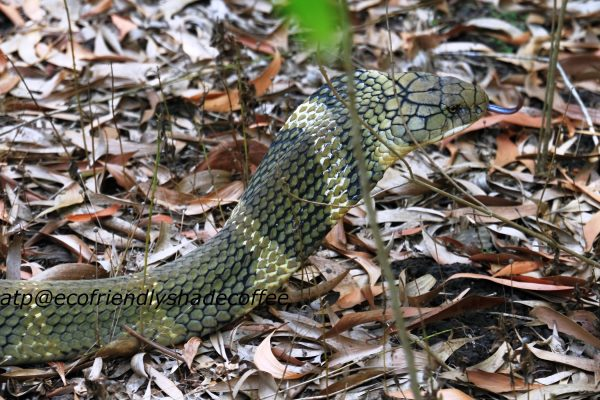

BEHAVIOUR: Many people are scared of the extremely long tongue of the King Cobra. It is longer than any other species of snake. They have the ability to collect smell on their tongue and then use receptors in the mouth to determine if it is food, a threat, or if the surroundings are safe. They are also believed to be able to see up to 300 feet away so even predators not very close to them are at risk. This type of vision is uncommon among snakes and it is believed to be one of the principal attributes that allows the King to thrive.

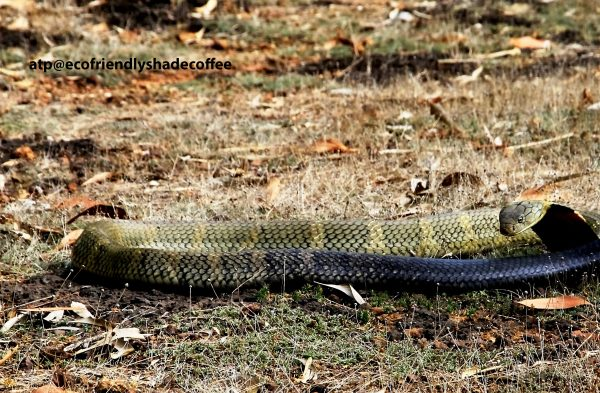

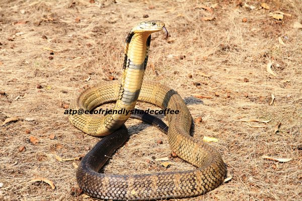

HOOD: King cobras, like other cobras, have distinctive hoods that they can flair out for mating, attack or territorial purposes. When not spreading their hoods, king cobras keep the extra skin limp close to their body. To spread the hood, the cobra flexes its ribs to bring the hood skin out. The hood itself does not have any practical function, but the snake uses it to display aggression and for courting practices.

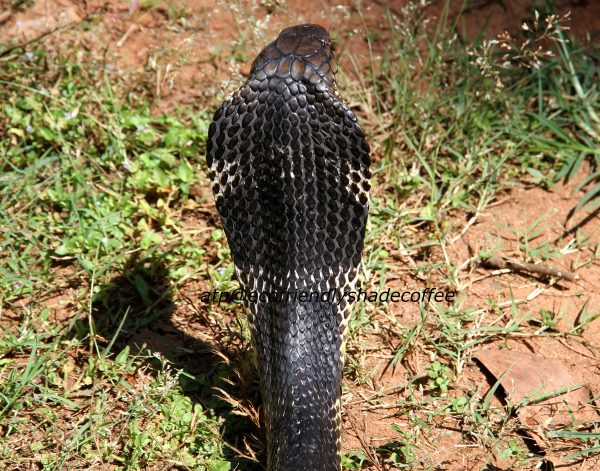

COLORS: Their coloration varies, depending on region and altitude. King cobras come in a wide variety of colors, depending on their region. Their bodies themselves can be light green, black, brown or some combination or mixture of the three. Sometimes they have bands around their bodies in colors like white, yellow or beige. These bands vary in thickness, color and number from snake to snake. King cobras always have yellow bellies, no matter what color the rest of their bodies are. The bellies are either smooth or segmented with bars. Young king cobras are solid black with bright bands on their bodies.

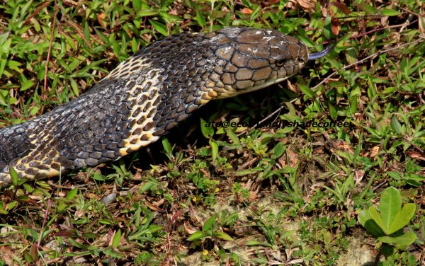

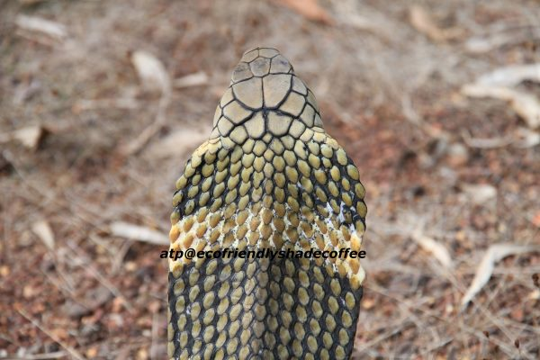

MOVEMENT: King cobras have unique movement patterns due to their size and strength. To strike or assess a threat, king cobras can lift roughly one-third of their body off the ground and still move around. According to National Geographic, a large king cobra can look a full-grown human in the eyes. King cobras climb trees, swim and move quickly across land.

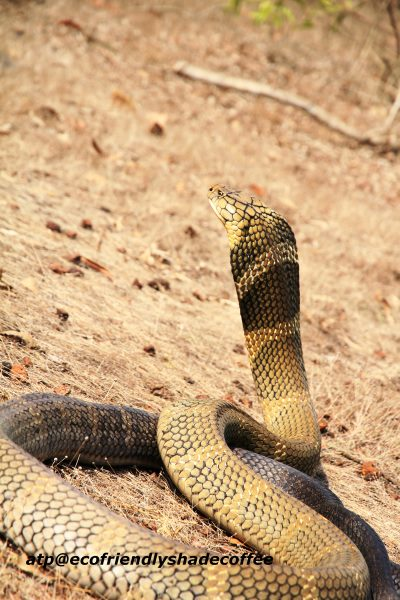

STATUS: According to Romulus Whitaker, herpetologist and founder of Madras Snake Park, the King cobra has been been declared a vulnerable species and placed on the IUCN red list because of massive trade in its skin, meat and body parts for Chinese medicines in Southeast Asia.

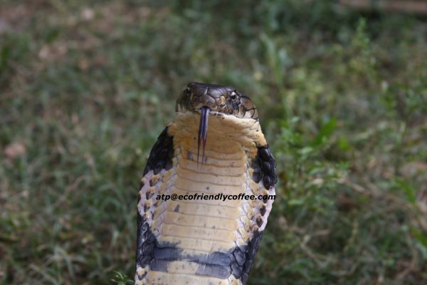

PROTECTION: The King cobra is protected under Schedule II of the Indian Wildlife Protection Act. “Anyone killing the snake could be imprisoned for up to six years,” Whitaker says. “A study using radio telemetry is being carried out at Agumbe Rainforest Research Station (ARS) in Karnataka to learn more about the snake to help in conservation of the species.”

VENOM: Researchers have been studying King Cobra venom for over 75 years and are constantly identifying new compounds. The venom in fact is a cocktail of complex biological ,olecules that seem to change composition depending on the prey as well as the surrounding environment. One single bite contains enough neurotoxins to kill 20 people. Though theirs is not the most poisonous venom in the world, king cobras inject so much venom with one bite that they can paralyze and kill animals as large as elephants.

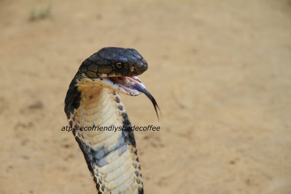

The specific amount of fluid released in one bite is 1 oz. The king cobra’s venom is a neurotoxin that affects the nervous system and can shut down a victim’s heart because it contains traces of cardiotoxic compounds in it. Only the Gaboon viper can inject more venom with its bite. The king cobra produces this venom out of polypeptides and proteins in special glands located behind the eyes. The venom flows through the fangs when the snake attacks, and it gets into the area of the bite, working rapidly to disable its prey.

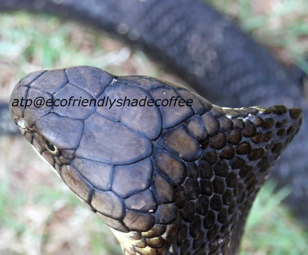

MATING: From January to March male king cobras seek out a mate by following chemical pheromone signals released by the females. Once located, the male employs courtship behaviors such as rubbing the head along the female’s body, which may develop into butting and nudging actions if the female shows reticence to mate.

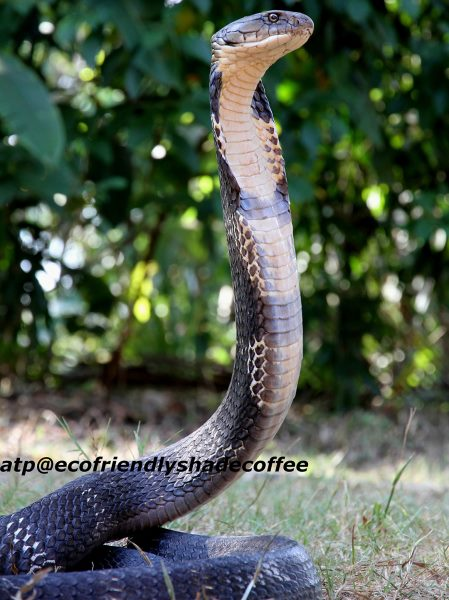

MOLTING: The King Cobra usually gets rid of their old skins 5 to 6 times a year.

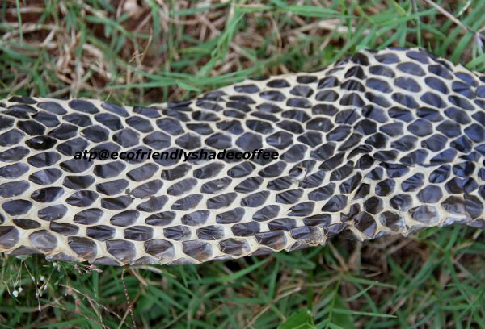

BREEDING HABITS: The only snake that builds a 2-foot high nest of twigs, leaves and other vegetation to lay eggs (20 – 40) that hatch around 110 days. The eggs are incubated at a steady temperature of 28 degree centigrade. The nest comprises a lower chamber for the eggs, which is covered over with leaf-litter, and an upper chamber on top, in which the female resides, guarding the eggs from predators and trampling. Such a complex nest is unique among snakes, and is considered to be a sign that the king cobra may be one of the most intelligent snake species.

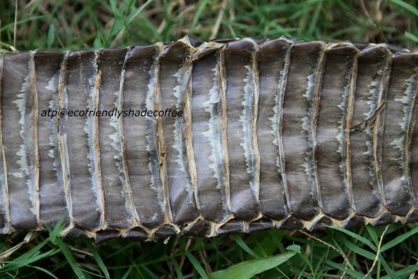

The female king cobra is a very dedicated parent. When the eggs start to hatch, instinct causes the female to leave the nest and find prey to eat so that she does not eat her young. The researchers say they have seen most king cobras out in the morning after the sun rises and the outside temperature is slightly warmer. “Some snakes like the krait are known to be nocturnal but king cobras forage during the day and are mostly in the burrow at night. The male and female cobras take turns guarding the nest and hunting. Baby cobras, or hatchlings, are about 19.7 inches (50cm) at birth and are brightly marked.

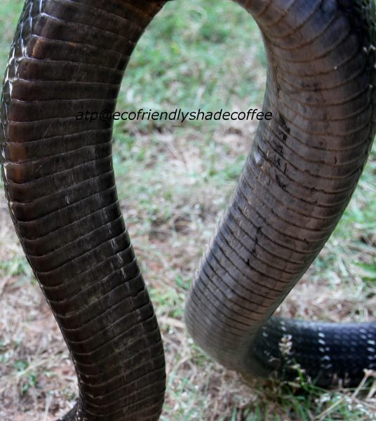

SEXES: Male King Cobras are larger than female King Cobras unlike most other snakes that have females that are larger than the males. King Cobra offspring weight does not vary between sexes.

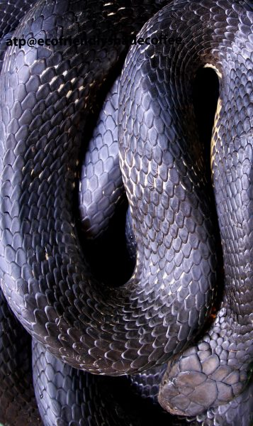

FOOD: Most terrestrial snakes are not known to hunt in water. The ARS has recorded for the first time that king cobras also hunt in water, like streams and ponds where they have chased prey. Scientists have recorded for the first time a king cobra holding another snake under water to drown the other snake. These snakes typically eat other snakes that are both venomous and non venomous. Prey is swallowed whole, headfirst. King Cobras have slow metabolisms and can live off a large meal for months.

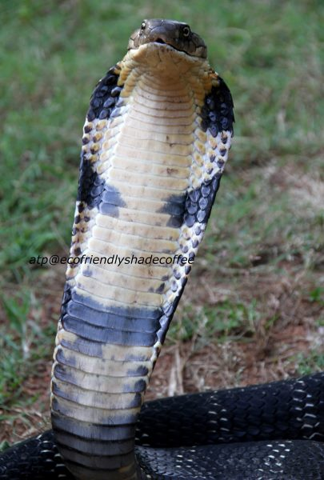

FANGS: King cobras have short fangs and powerful venom, but they rarely attack humans.

ANTIVENOM: There are two types of anti venom made specifically to treat king cobra envenomations. The Red Cross in Thailand manufactures one, and the Central Research Institute in India manufactures the other; however, both are made in small quantities and are not widely available.

CONCLUSION: The overall status of the Planet’s ecosystem is threatened by changing environment, especially due to human influence and this damage has been so extensive within the last 25 years. So many species of our unique wildlife are fast disappearing to various factors out of which most of them relate to the activities of man.

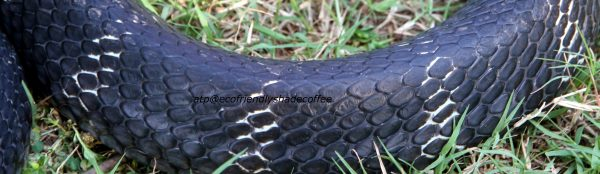

Many species are at the risk of becoming extinct due to the accelerated rate of deforestation and habitat destruction. World over, wildlife population has declined at an alarming rate. There are almost a third fewer animal, bird and aquatic species than three decades ago. The decline comes at a time when humans are consuming far significant amounts of natural resources and are now using 25% more than the planet can regenerate. Human disturbances are putting constant pressure on ecosystems and dramatically impacting species.

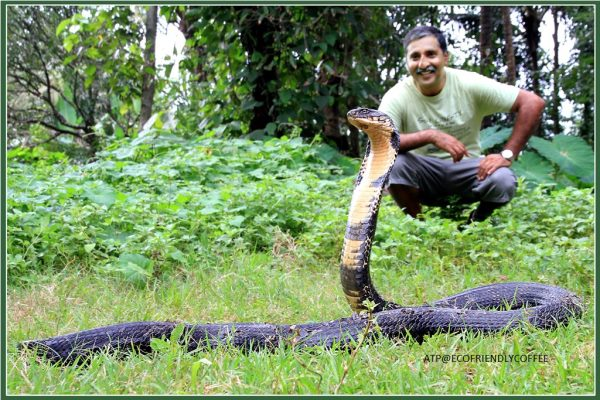

As the new year dawns, we need to embrace nature with a new found vigor and change our attitude towards nature. All that we ask of you is to be guardians of wildlife. In short, protection of the Earths biological riches should be the business of every citizen. One way of going about it, is the way we buy or choose a product which is environment friendly and which will last a long time.

### REFERENCES:

[Coffee Forests and the Dancing Spectacled Cobra](/coffee-forests-and-the-dancing-spectacled-cobra/)

[Human Snake Conflict Inside Coffee Forests](/human-snake-conflict-inside-coffee-forests/)

[Snake Diversity and Conservation Inside Coffee Forests](/snake-diversity-and-conservation-inside-coffee-forests/)

[Coffee Forests – A Gateway To Wildlife](/coffee-forests-a-gateway-to-wildlife/)

[The Impact of Climate Change on Coffee](/the-impact-of-climate-change-on-coffee/)

[Coffee Forest Symbiosis](/coffee-forest-symbiosis/)

[Global Warming in Coffee Plantations](/global-warming-in-coffee-plantations/)

[Coffee Hotspots – An Inventory of Biodiversity](/coffee-hotspots-an-inventory-of-biodiversity/)

[The Ecodynamic Coffee Cube ^3](/the-ecodynamic-coffee-cube-3/)

The Lord of the Jungle…King Cobra

[Studying snake venom for medical cures](http://www.zdnet.com/article/studying-snake-venom-for-medical-cures/)

Anand T Pereira and Geeta N Pereira. 2009. Shade Grown Ecofriendly Indian Coffee. Volume 0ne.

Anil Agarwal (Ed). 1990. The Price of forests. Centre for Science and Environment. New Delhi.

Archie Carr & the editors of Life. 1963. The Reptiles. Life Nature Library.

Bopanna P.T. 2012. Romance of Indian Coffee. Prism Publications.

Chapman. J.L. & M.J. Reiss.1997. Ecology. Principles and applications. Cambridge University Press.

Daniel, J.C.2002. The book of Indian reptiles and Amphibians. Bombay Natural History Society. Oxford University Press, Mumbai. 238 pp.

Das, I. 2002. A photographic Guide to the snakes and other reptiles of India. New Holland Publishers (U.K.) Ltd. 144pp.

Ernst C. and Zug, G. 1996. Snakes in question. Smithsonian Institution.

P.J. Deoras. 1965. Snakes of India. National Book Trust. India.

Chapman. J.L. & M.J. Reiss.1997. Ecology. Principles and applications. Cambridge University Press.

Peter Farb & the editors of Life. 1963. Ecology. Life Nature Library.

Raymond L. Ditmars and Komal. 2000. Snakes of the World

Romulus Whitaker. 2007. Common Indian snakes. A Field Guide. MacMillan India Ltd.

Satish. 2008. Snakes of Coorg. A field guide to the snakes of Kodagu. Coorg Wildlife Society.

Sukanya Datta and Vigyan Prasar. 2008. Snakes

Whitaker, R. and Ashok Captain.2004. Snakes of India. The Field Guide. Draco Books. India

Daniel. J. C. 2000. The book of Indian Reptiles and Amphibians. BNHS/Oxford University Press, Bombay.

Mohanty-Hejmadi. P., S.K. Dutta and D.R. Rath.2002. Reptiles of India with special emphasis on their conservation. In BIODIVERSITY. (Monitoring, Management, Conservation & Enhancement).

Editors. Murthy. T.S.N . 2009. A Pocket Book on Indian Reptiles : Crocodiles, Testudines, Lizards and Snakes : Nature Books India.

Murthy.T.S.N. 2010 The Reptile Fauna of India : A Source Book : B.R. Pub, 2010.
