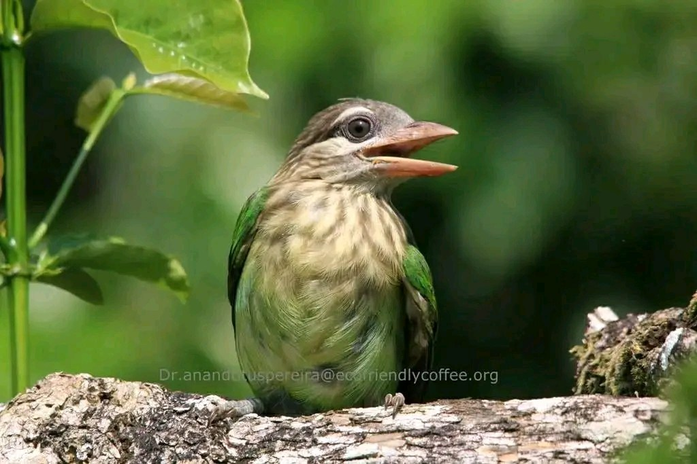

### **Introduction**

The Indian coffee ecosystem harbor’s thousands of species of old diverse and significant species of rare birds, endemic bird species and endangered wildlife living in complete harmony. Coffee planters play a crucial role in protecting birds within their coffee-growing landscapes. Many coffee plantations in India follow the traditional practice of shade-grown coffee, where coffee plants are grown under a canopy of trees. This mimics the natural forest ecosystem and provides habitat for a variety of bird species. The shade trees provide nesting sites, food sources, and shelter for birds, contributing to increased biodiversity.

This article throws light on the White Cheeked Barbet, commonly observed inside Indian Shade coffee.

### **Habitat**

The natural ecosystems and habitats of these white-cheeked barbet species include tropical and subtropical dry forests, tropical and subtropical moist lowland forests, evergreen forests and moist montane forests.

###  **Scientific Classification**

**KINGDOM**     [Animalia](https://animalia.bio/animalia)

**PHYLUM**        [Chordata](https://animalia.bio/chordata)

**CLASS**             [Aves](https://animalia.bio/aves)

**ORDER**           [Piciformes](https://animalia.bio/piciformes)

**FAMILY**          [Megalaimidae](https://animalia.bio/megalaimidae)

**GENUS**           [Psilopogon](https://animalia.bio/psilopogon)

**SPECIES**         Psilopogon viridis

### **Description**

Its characteristic feature is a broad white cheek stripe below the eye and a distinctive supercilium.

### **Appearance**

The white-cheeked barbet also referred to as the small green barbet is 16.5–18.5 cm (6.5–7.3 in) in length. It has a brownish head streaked with white, sometimes giving it a capped appearance. It is easy to identify the bird by its characteristic white patterns on its face: a white patch around the ear-coverts, a white line above the eye, and a white throat.

### **Behavior**

This barbet nests and roosts in excavated tree hollows, and is aggressive and territorial, competing fiercely with other barbets for suitable nest sites. While foraging they are quite aggressive and will attempt to chase other barbets, Koels and other frugivores

### **Beak**

The white-cheeked barbet has a pale pink, stout bill with bristles around it.

### **Feet**

The feet are pale grey.

### **Distribution/Range**

The white-cheeked barbet is mostly observed in the coffee forests of South India, and is endemic especially to the forest areas of the Western Ghats, parts of the Eastern Ghats and adjoining hills.

### **Communication and Perception**

### **Calls / Vocalization**

During the breeding season, their calls are loud and unmistakable. The call, a monotonous ‘*Kot-roo … Kotroo*…’

###  **Courtship**

During the breeding season which begins at the start of summer their calls become loud and constant especially in the mornings.

### **Breeding**

They begin breeding in December and continue to nest until May. They are believed to form a pair bond that lasts for longer than a single breeding season. Courtship feeding of the female by the male is usual prior to copulation.

### **Nesting**

These barbet birds build their nests in holes in trees, bamboo stalks, or sometimes in dead branches. These birds excavate nesting cavities, and both males and females excavate the nest. It carves out holes inside a tree to build its nest. Both sexes excavate the nest and it can take about 20 days to complete the nest. They may reuse the same nest tree each year but often excavate a new entrance hole.

Eggs are laid about 3–5 days after nest excavation. About 3 eggs are laid. The incubation period is 14 to 15 days. During the day both sexes incubate, but at night, only the female sits on the eggs. Both the parents feed and protect the chicks till they fledge by the sixth week. Usually, two broods are raised in a year. They are monogamous and territorial.

The young leave the nest after 36 to 38 days.

### **Diet/Feeding**

Like all other Asian barbets, they are mainly frugivorous (although they may sometimes eat insects), and use their bills to excavate nest cavities in trees.

### **Flight**

White-cheeked barbets have a typical flight pattern that includes strong wingbeats followed by a dipping phase with the wings folded against the body.

### **Migration**

[Not a migrant](https://animalia.bio/not-a-migrant) but they may make local movements for feeding and breeding within their range.

### **Threats**

Habitat loss is thought to pose by far the greatest threat to birds, both directly and indirectly. Destruction and fragmentation of habitat. Pet trade too is a contributing factor for the decline.

### **Conservation Status**

[Least concern (LC)](https://animalia.bio/least-concern-lc)

### **Personal Observations**

Due to the large number of fig trees inside the coffee plantation and these trees fruiting thrice a year, barbets harvest on the berries during the early morning and in the evenings. They are green in colour and sit still, making them difficult to spot.

Barbets regurgitate seeds and indigestible parts of the fruit of wild trees, enabling forests to flourish and grow.

### **Ecosystem Roles**

These barbets play an important role in forests as seed dispersal agents. They also visit the flowers of *Bombax* for nectar and may be involved in pollination.

### **Lifespan/Longevity**

According to birdworld.com, the white-cheeked barbet  has a generation length of 8.5 years.

### **Conclusion**

Birds are often referred to as a barometer for the health of our planet. They are ‘ecosystem engineers’ thanks to their role as seed dispersers and pollinators. However, in the recent past, we have noticed an alarming decline in bird populations in ecofriendly shade coffee plantations due to Habitat loss, climate change and disease. We have observed many of the Ficus trees, as well as other wild fruit bearing trees, not yielding fruit resulting in scarcity of food, especially for frugivorous birds like barbets. It has been seen that some of the birds are very adaptive and change their habits to adapt to new environments. But generally, they are under pressure and deserve much more attention than they get.

### **References**

Anand T Pereira and Geeta N Pereira. 2009. Shade Grown Ecofriendly Indian Coffee. Volume-1.

Bopanna, P.T. 2011.The Romance of Indian Coffee. Prism Books ltd.

[Birds of Prey](https://ecofriendlycoffee.org/birds-of-prey-and-bird-friendly-coffee-plantations/)

[The Barbets Of India](https://www.natureinfocus.in/animals/the-barbets-of-india)

[WHITE-CHEEKED BARBET](https://animalia.bio/white-cheeked-barbet#:~:text=The%20white%2Dcheeked%20barbet%20is,birds%20to%20the%20southern%20ones).

[White-cheeked](https://en.wikipedia.org/wiki/White-cheeked_barbet#:~:text=It%20is%20very%20similar%20to,Eastern%20Ghats%20and%20adjoining%20hills).

[Birdworld](https://www.birdworld.co.uk/)

[Psilopogon viridis](https://birdsoftheworld.org/bow/species/whcbar1/cur/introduction)

[White-cheeked](https://earthlife.net/white-cheeked-barbets/)

[Birds of India](https://indianbirds.thedynamicnature.com/2017/10/white-cheeked-barbet-psilopogon-viridis.html)

[State of birds](https://www.deccanherald.com/opinion/editorial/state-of-birds-in-india-cause-for-worry-2683742#:~:text=the%20Indian%20peafowl.-,Habitat%20loss%2C%20shrinkage%20of%20prey%20base%2C%20climate%20change%20and%20diseases,species%20like%20tigers%20and%20lions) .

[State of birds in India cause](https://www.deccanherald.com/opinion/editorial/state-of-birds-in-india-cause-for-worry-2683742)