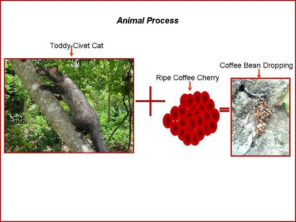
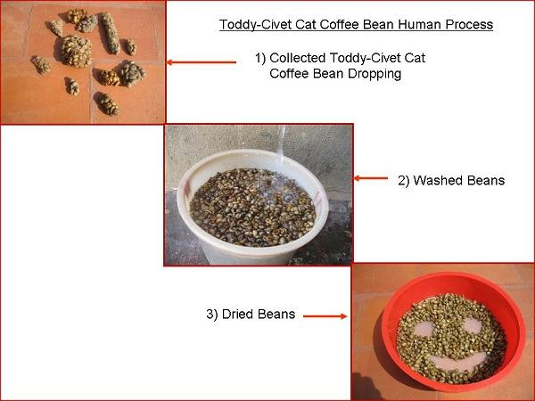
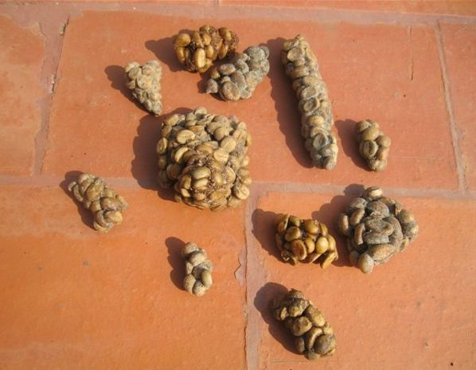
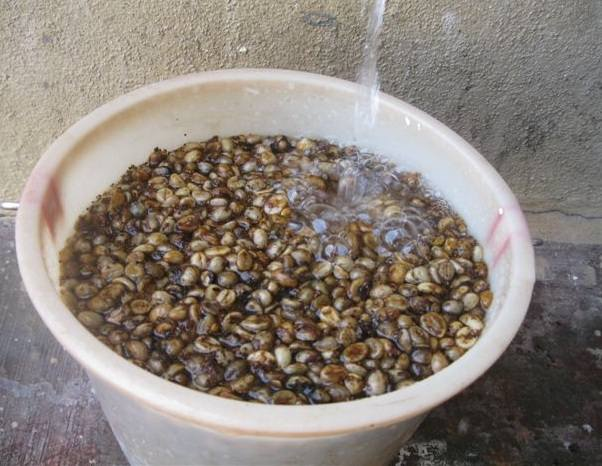
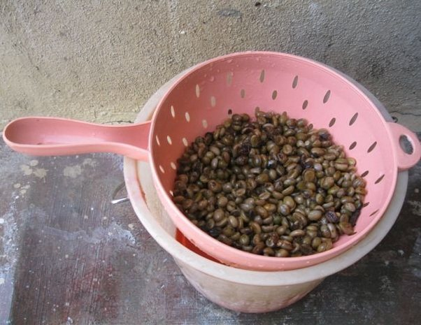
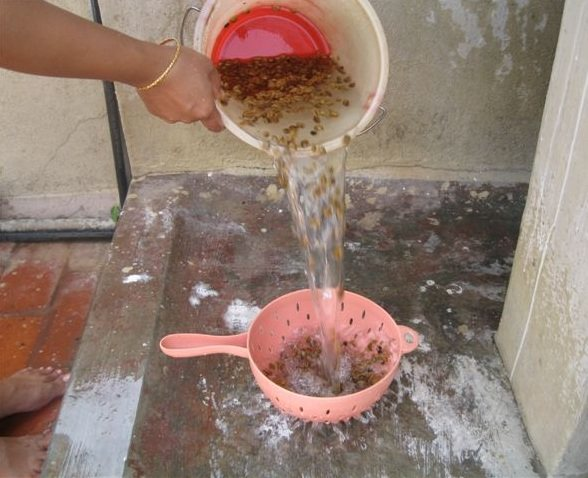
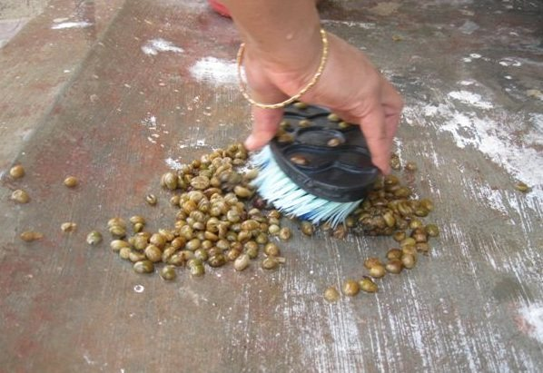
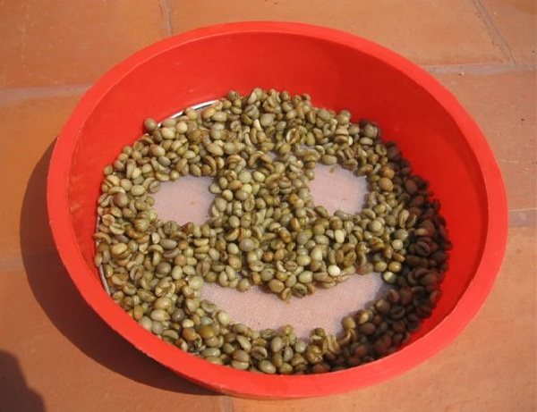

In the process to obtain Toddy Cat-Civet Cat Coffee, there are two participating parts, The Animal and the Human Process.

### Animal Process

The civet selects the ripest berries of the coffee plants from the Old Robusta Coffee plants and eats the whole fruit. As the civet cannot digest the seed of the fruit (actually, it is the coffee bean), it expels them among its feces. This is the Animal process.

### Human Process

We collect the feces and here is when the Human process starts to obtain the final gourmet coffee. Below, there is a description of the whole process to obtain the Toddy cat Civet Cat Coffee. It is totally handmade and the only machine used is a electrical mixer.

  
*Toddy-Civet Cat Coffee bean Human Process*

**Cleaning** – We collect the feces from the coffee plantation and initially dry them.

  
*Cleaning Civet Pieces*

**Selecting** – In the next step, we separate the beans one by one and set aside the bad ones, the small beans and the rare objects such as little stones. In this way we get the premium beans ready to be roasted.

**Washing** – The Civet beans are washed, brushed and are immediately dried with warm air. They are sun dried so that when they are stored they do not ferment with the humidity. After this step, the beans are stored in a dry place until the roasting process takes place.

  
*Civit Bean Rinse*

  
*Filter Civit Coffee*

  
*Continue Rinsing Civit Coffee*

  
*Scrub Civit Beans*

  
*Civit Bean Smile*

### Final Words

I wish to express my thanks to Errol Pais (Coffee Planter) from “Pais Estate” Siddapur on locating the Toddy Cat coffee bean dropping and I also Thank Dr. Anand Titus Pereira on encouraging me to write this article. Special thanks to Leona Gerald Pais who supported and helped during the entire intence process on preparing the coffee powder. If the Toddy Cat Coffee Dropping Process Bean Powder interest’s you, kindly contact me on allenjpais@gmail.com.

I want to dedicate this article to the Indian Cricket Team on winning the 2011 ICC Cricket “World Cup”, They turned the flaky concept of destiny into firm reality and broke the country’s 28-year Cup drought. They are the first team to win the “Cricket World Cup” on home soil.

### References

[Monitoring Soil pH Inside Coffee Plantations](http://ecofriendlycoffee.org/monitoring-soil-ph-inside-coffee-plantations/)

[Monkey Chewed Coffee Beans](http://ecofriendlycoffee.org/monkey-chewed-coffee-beans/)

[Toddy Cat Coffee Beans](http://ecofriendlycoffee.org/toddy-cat-coffee-beans/)