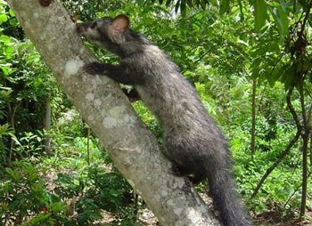
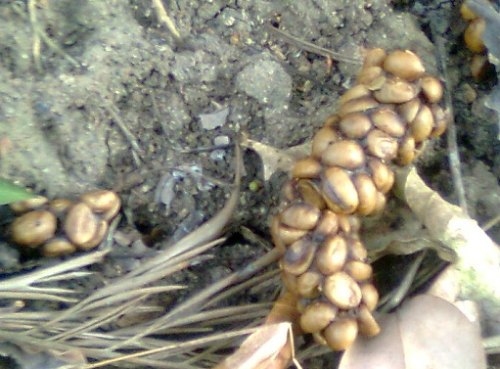
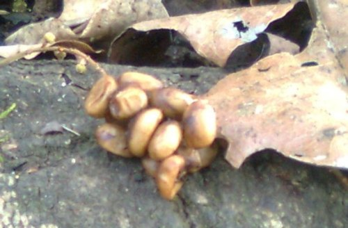
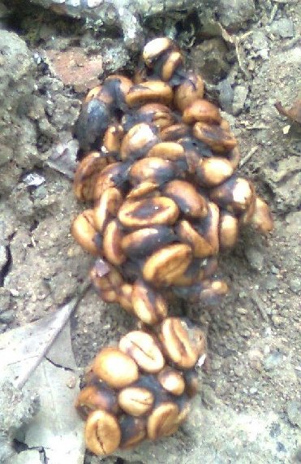

We are located at Siddapur a village in Kodagu district, Karnataka India. It is situated in a coffee growing region near the river Kaveri and Dubare forest reserve. Dubare is known for its elephant camp on the banks of the river Kaveri. The moist deciduous 50,000 Acre Dubare Forest are home to many wild animals and birds.

Sighting of wild Asiatic elephants are regular and so is spotting the sambhar and the spotted deer, tiger, leopard, wild dogs, gaur and bears are also seen in these forests. Crocodiles can be seen in river kaveri. The forests are also home to many reptiles non-venomous snakes. Birdlife in Dubare includes peacock, partridge, kingfisher and woodpeckers topping the list. Located 800 meters above sea level.

Toddy Cat Coffee bean dropping are sighted annually during each Coffee yielding period in December and January each year.

### Common Palm Civet CAT-Toddy Cat

Kingdom

Animalia

Phylum

Chordata

Subphylum

Vertebrata

Class

Mammalia

Order

Carnivora

Family

Viverridae

Subfamily

Paradoxurinae

Genus

Paradoxurus

Species

Paradoxurus hermaphroditus

The Asian Palm Civet Cat generally known as Toddy Cat is a small mottled gray and black vive rid weighing 2 to 5 kg (4.4 to 11 lb). It has a body length of 53 cm (21 in) and a tail length of 48 cm (19 in). Its long, stocky body is covered with coarse hair that is usually grayish in color, with black on its feet, ears and muzzle. It has three rows of black markings on its body. Its tail does not have rings, unlike similar civet species.

Common Palm Civet (or known as Musang) belongs to the viverridae family. Its scientific name is Paradoxurus hermaphroditus and it comes from the carnivora order. Toddy cat reproduce throughout the year, although it has been recorded that kittens are mostly found from October to December. During the brief periods of mating and when the females have their young ones, the civets occupy the resting trees together.

Normally, kittens are born in a litter of 2 to 5 young. They are usually born in a hollow tree, boulder crevices or a space among the rocks. Their eyes are closed at birth. The sexual maturity is attainted at 11 – 12 months. In captivity, the common palm civet can live up to 22 years. Both sexes have scent glands underneath the tail that resemble testicles. Civets spray a noxious secretion from these glands. They are usually active between 6:00 pm and 4:00 am, being less active during nights when the moon is brightest. They are believed to lead solitary lifestyles, except for brief periods during mating. They are both terrestrial and arboreal, showing nocturnal activity patterns with peaks between late evening until after midnight.

  
*Asian Palm Civet*

Asian Palm Civets feed only at night, and it is believed that its fear of predators during daytime is the principal reason for its nocturnal attitudes. They retire to their shelters just before dawn arrives. These civets have the reputation to choose the tallest trees they can find. Their organization and activity habits are determined by the availability, surplus of food and again, the activities of their feared predators The Asian Palm Civet is arboreal, and when feeding in the same area, they use the same trees to rest in.

These civets survive on pulpy fruits, berries and even palms. Eggs, reptiles and insects however, are also on their menu.

The Asian Palm Civet also, every once in a while, feed on the cherries of Coffee trees, and how do they do this?

### Interesting Fact

Coffee seeds make their way (in whole) through the digestive path of this civet, then it is collected, and this is no ordinary coffee. This coffee is in high-demand for its unique flavor and is very expensive.

The (Asian Civet)Toddy Cat eat red coffee berries and beans. In the jungles and plantations in which they live, they find the sweetest, ripest ones and munch on them. But they can’t digest them, so the berries and beans come out through the digestive system without the bean being disturbed. One day, humans discovered that the enzymes in the civets’ tummies break down the coffee’s bitterness, leaving behind an extremely delicious bean. Passing through a civet’s intestine, the beans are then defecated, having kept their shape. After gathering, thorough washing, sun drying, light roasting and brewing, these beans yield an aromatic coffee with much less bitterness, widely noted as the most expensive coffee in the world. Kopi luwak is produced mainly on the islands of Sumatra, Java, Bali and Sulawesi in the Indonesian Archipelago, and also in the Philippines. The bean dropping are washed it lightly, roasted and ground. Tastes like caramel and chocolate! Today, Kopi Luwak-civet coffee in Indonesian – sells for about $30 a cup in selected coffee shops in Japan and the US.

### Habitat Distribution

Asian palm civets are native to India, Nepal, Bangladesh, Bhutan, Myanmar, Sri Lanka, Thailand, Singapore, Peninsular Malaysia, Sabah, Sarawak, Brunei Darussalam, Laos, Cambodia, Vietnam, China, Philippines and the Indonesian islands of Sumatra, Java, Kalimantan, Bawean and Siberut. They were introduced to Irian Jaya, the Lesser Sunda Islands, Maluku, Sulawesi and Japan. In Papua New Guinea, their presence is uncertain.

They normally inhabit primary forests, but also occur at lower densities in secondary and selectively logged forest. They also inhabit parks and suburban gardens with mature fruit trees, fig trees and undisturbed vegetation. Their sharp claws allow them to climb trees and house gutters. In most parts of Sri Lanka, palm civets are considered a nuisance since they litter in ceilings and attics of common households, and make loud noises fighting and moving about at night.

### Diet

Asian palm civets are omnivores utilizing fruits such as berries and pulpy fruits as a major food source, and thus help to maintain tropical forest ecosystems via seed dispersal. They eat chiku, mango, rambutan and coffee, but also small mammals and insects. Ecologically, they fill a similar niche in Asia as Common Raccoons in North America They also feed on palm flower sap, which when fermented becomes toddy, a sweet liquor. Because of this habit they are called Toddy Cat. They play a role in the germination of palm trees.

### Coffee Bean Dropping’s and Evidence at Siddapur (INDIA)

I wish to express my Thanks to Errol Pais from “Pais Estate” Siddapur on locating the Toddy Cat coffee bean dropping and I also Thank Dr Anand Titus Pereira on encouraging me to write this article.

If the Toddy Cat Coffee Dropping Beans interest you, kindly contact me at allenjpais@gmail.com.

### References

[Monitoring Soil pH Inside Coffee Plantations](http://ecofriendlycoffee.org/monitoring-soil-ph-inside-coffee-plantations/)

[Monkey Chewed Coffee Beans](http://ecofriendlycoffee.org/monkey-chewed-coffee-beans/)

[Roasting and Brewing Toddy Cat Coffee](https://ineedcoffee.com/roasting-brewing-toddy-cat-coffee/)

[Toddy Cat Coffee Bean Process](http://ecofriendlycoffee.org/toddy-cat-coffee-bean-process/)