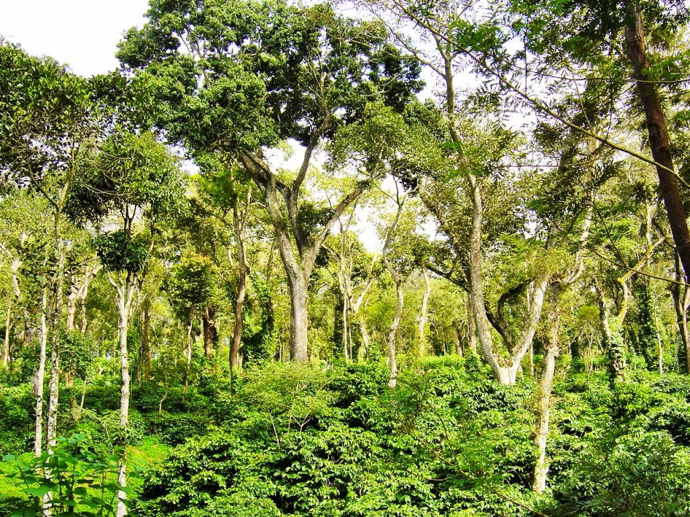
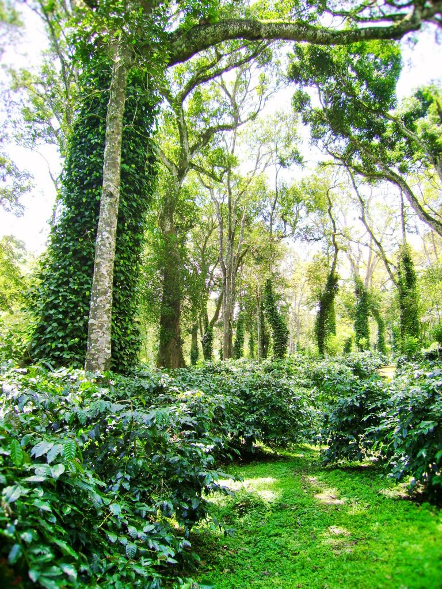

A close look at India’s unique shade grown coffee forest’s reveal’s a very interesting story. These Coffee forests are home to a heterogeneous tree population. A hectare of coffee can easily accommodate around two hundred to two hundred and fifty trees with differential root system. Studying the ecology of the region helps one understand that Coffee Plantations as such are an ecological wonderland, accommodating diverse species of trees. The great physical variations in topography from the high range mountains to the low lying plains and the formation of multiple watersheds is responsible for local variation in species diversity.

Another great aspect about Indian Coffee is the existence of Sacred Forests, protected by the locals, in each village is a testimony to the proactive measures in biodiversity conservation by Coffee Planter’s.

### Man-made Forests

Coffee Planters over the years have converted thousands of hectares of barren lands, grass lands, denuded lands, marginal lands and areas unfit for cultivation into man-made forests by growing millions of trees, which acts as shade for wildlife and birds. Thus a threefold increase in the area of coffee cultivation has also resulted in increased forest cover. Trees planted today will offer social, environmental, and economic benefits for years to come. These man-made forests also serve to harvest rain as well as preserve the sensitive ecology of the region.

Filtered shade is a must for both Arabica and Robusta but Robusta performs well in less shaded environments.

The hardwood species are known to have a very deep root system that penetrates almost six to ten meters deep into the soil. The semi hardwood species make inroads to a few feet into the soil and the other introduced species like silver oak hardly make it to the surface level.

In this article we would like to highlight a crucial aspect which is often overlooked when it comes to introducing shade trees inside coffee forests’. We need to set up important criteria in the selection of trees, based on different Agro climatic conditions that the Coffee growing regions in India come under. The selection of trees to be introduced into the coffee ecosystem should merit ecological conditions prevailing in that zone. As such we need to maintain a healthy balance between and among various types of tree species like evergreen, hard wood, quick growing, and other types of trees such that the coffee ecosystem is resilient and vibrant.

### **Tree Characteristics to be introduced into the coffee ecosystem**

Trees should capture enormous amounts of greenhouse gases and provide for carbon credits. (Carbon mitigation)

The Trees to be introduced should not compete for water and nutrients with coffee and multi crops but on the contrary compliment the growth establishment and productivity of all crops and the biodiversity of shade coffee.

The trees should have a well spread out canopy that provides filtered sunlight for coffee berries to mature and ripen.

A few trees like Nandi, Hebbhalasu, Mitli, Gobbara Neralu, Matti, Kari Basari do not need regular pruning because the lower branches automatically fall out as the tree grows upwards.

A well-established mature tree with extensive canopy will also aid in loosening the top soil during heavy winds. This provides aeration to roots and microbes.

The trees should have high water retention capacity.

Trees should have a rough bark to help pepper and vanilla to climb.

They should produce Berries three times a year to enrich the soil organic matter content and provide food for birds and other wildlife.

Shade-grown coffee should provide important habitat for both native and migratory bird species.

Leaf shedding in winter and profuse growth in summer

Deep rooted in high velocity wind areas.

Ideal C N ratio and leaf surface area, such that leaves and twigs easily decompose

Leaves and berries should produce no alkaloids which results in soil toxicity.

Trees should produce beneficial root exudates that attract beneficial microbes like nitrogen fixers and phosphate solubilizers.

The leaves should have a greater leaf surface area so that they easily decompose by soil microbes.

The height of the trees is also very important because the rainfall drops from tall trees can have a negative impact on the coffee ecosystem.

The impact of rain drops from tall trees is detrimental to the coffee ecosystem because the velocity of raindrops hitting the soil, converts good soil into sandy soil, thereby reducing the water retention capacity of soils.

Trees should have good timber value as they mature.

Trees should form a symbiotic alliance with the Agro-forestry inside coffee forests to provide immunity from pests and diseases. (Trees are known to talk the signal exchange language by constant interaction, keeping the population dynamics of pest and disease incidence under check)

### **Wind Breakers**

Some trees should act as wind breaks. The selected trees should be quick growing with a shallow spreading root system and a long life.

Trees are excellent air filters, removing harmful pollutants in the air and fine particulates.

Trees reduce noise pollution, as they shield homes from nearby roads and industrial areas.

Trees also protect watersheds and prevent flooding as they store water in their branches and soil.

### Conclusion

Tree selection is very important at the nursery state itself because these very saplings will grow into a healthy forest and provide both tangible and intangible benefits to the coffee ecosystem.

Coffee Planters take it for granted when it comes to introducing trees inside the Coffee Forests without knowing their impact on the ecology of coffee and multiple crops. Tre selection requires a careful analysis based on Scientific temperament. Ecological zones depending on altitude, temperature, rainfall, Soil characteristics, topography, and local biodiversity should be made for each Agro-climatic zone for the successful introduction of trees which will last a lifetime.

### References

Anand T Pereira and Geeta N Pereira. 2009. Shade Grown Ecofriendly Indian Coffee. Volume-1.

Bopanna, P.T. 2011.The Romance of Indian Coffee. Prism Books ltd.

[Tree ID & Selection](https://web.archive.org/web/20171206090142/http://www.myminnesotawoods.umn.edu:80/2008/11/recommended-trees-for-minnesota-by-region/)

[Recommended trees](https://web.archive.org/web/20180103144937/http://www.extension.umn.edu:80/garden/yard-garden/trees-shrubs/recommended-trees-for-minnesota/northwest-central/)

[Tree Biology](https://www.extension.iastate.edu/forestry/tree_biology/roots.html)

[How to Choose the Best Shade](https://www.perfectdailygrind.com/2016/12/choose-best-shade-system-coffee-farm/)

[Shade-grown coffee](https://en.wikipedia.org/wiki/Shade-grown_coffee)

[What is shade-grown coffee?](https://www.coffeehabitat.com/2006/02/what_is_shade_g/)

[Research: Shade coffee provides additional income besides the coffee crop](http://www.coffeehabitat.com/2008/11/research-shade-coffee-provides-additional-income/)

[Fruit thinning and shade improve bean](https://onlinelibrary.wiley.com/doi/full/10.1002/jsfa.2338)

[Scientists Peek Into The Hidden World](https://web.archive.org/web/20180720140329/http://kuow.org:80/post/scientists-peek-hidden-world-tree-roots)

[Invisible Communications in Coffee Plantations](http://ecofriendlycoffee.org/invisible-communications-in-coffee-plantations/)