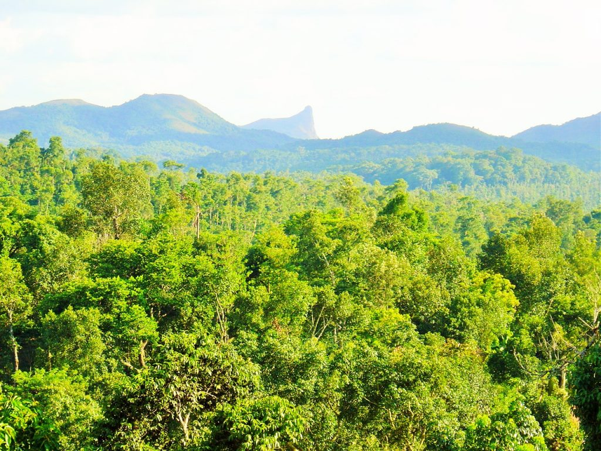
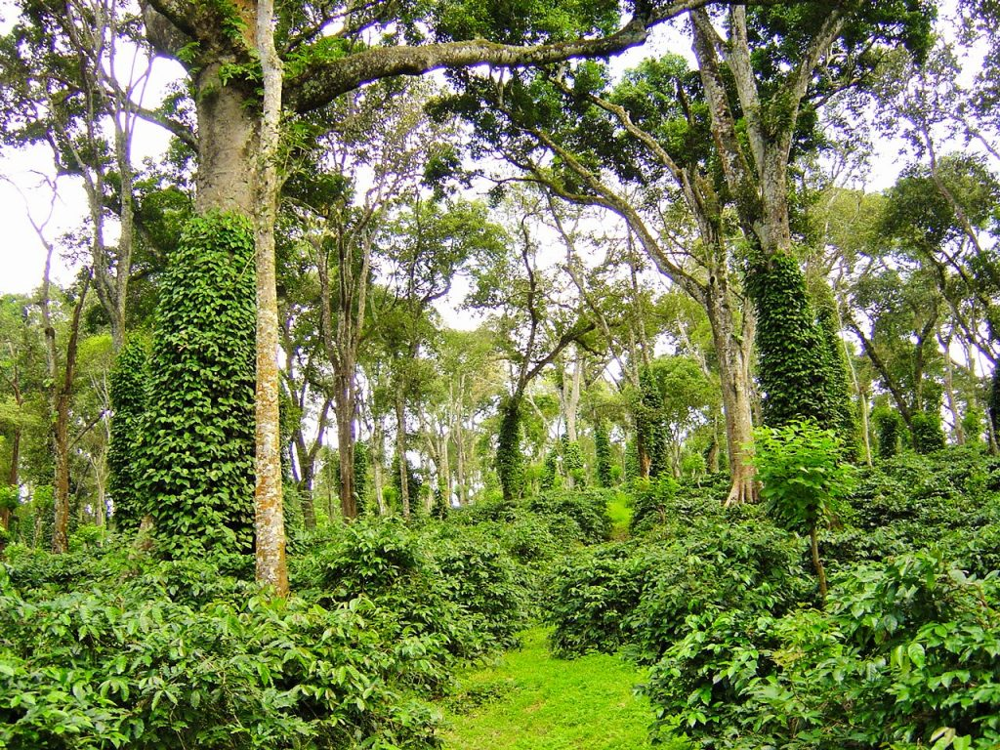
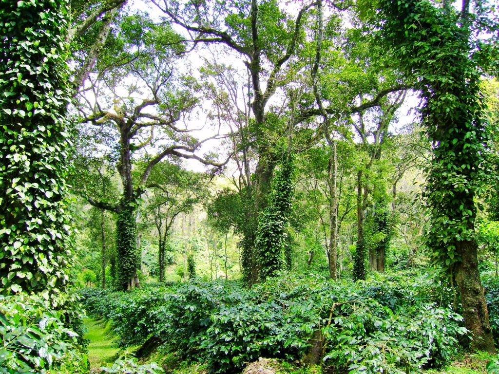
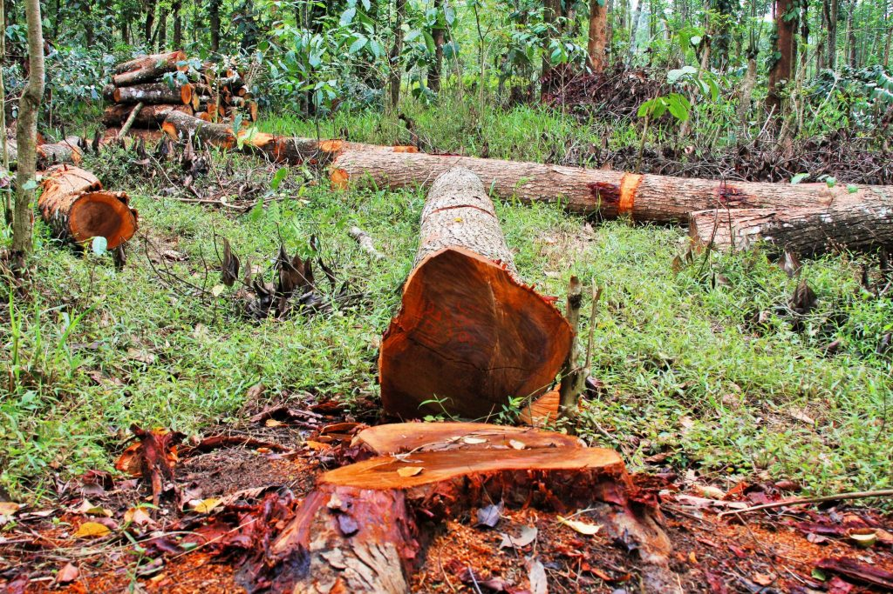

“To be poor and be without trees, is to be the most starved human being in the world. To be poor and have trees, is to be completely rich in ways that money can never buy.” [*Clarissa Pinkola Estés*](https://www.goodreads.com/author/show/901977.Clarissa_Pinkola_Est_s)

Cradled by the verdant Western Ghats, recognized world over as one among the 8 mega hot spots of biodiversity, the bio diverse western Ghats are home to shade grown eco-friendly coffee plantations. One can discover Shade Grown Eco-friendly Coffee Plantations amidst untamed patches of greenery with their enchanting landscape.

### Three Canopy Layers

Indian Coffee Plantations grow shade grown coffee under the canopy of a three-tier shade system. A lot of care is taken in selecting the trees to be introduced. The primary shade or the lower shade is taken care of by nitrogen fixing Erythrina indica or Glyrecedia maculata. These enrich the soil by harvesting atmospheric nitrogen and in turn give it to the coffee plant. The secondary shade is that of trees like silver oak, white and red cedar that shed their leaves in the monsoon season and put forth a rich canopy during the summer. These trees are specifically selected because they act like factories providing tremendous biomass and thereby keeping the soil temperatures low. Lastly, the tertiary shade is of the hardwood species, which attract rain-bearing clouds. Trees release 8-10% more moisture into the atmosphere than the equivalent area of an ocean. One tree can lift 100 gallons of water out of the ground and discharge it into the air in a day. This three tier shade system, aids in filtering the harmful U.V.radiation. Furthermore, the filtered sunlight enables the sugars in the coffee bean to caramelize uniformly and give it a unique taste.Trees provide the ideal micro-climate to help carry out the physiological and biochemical functions of the coffee plant.

### Value of a tree

A single large tree can release up to 400 gallons of water into the atmosphere each day. One acre of trees produces enough oxygen for 18 people every day. One acre of trees absorbs enough carbon dioxide per year to match that emitted by driving a car 26,000 miles. According to the U.S. Department of Agriculture, “One acre of forest absorbs six tons of carbon dioxide and puts out four tons of oxygen. Meanwhile, urban neighborhoods with mature trees can be up to 11 degrees cooler in summer heat than neighborhoods without trees. Furthermore, large trees remove 60-70 times more pollution than small trees. A typical medium sized tree can intercept as much as 2,380 gallons of rainfall per year.

Coffee forests are responsible for the birth of many rivers. E.g. River Cauvery, Hemavathi, Nethravathi, Badra etc. have their origin inside coffee forests. Because of the high density of trees, the widespread roots absorb water and filter it allowing the formation of springs giving birth to many important rivers. Trees carry out many other functions like controlling soil erosion, increasing the water table, purification of water, recycling nutrients, providing micro-climate, climate amelioration, providing wind breaks, attracting rain, absorbing toxic gases like carbon dioxide and carbon monoxide, and other forms of pollution, reducing noise pollution, apart from providing food, medicine and timber value. Trees also have recreational value and serve as a home for wildlife.

### Sacred Bond

Our fore fathers had a deep bond with Mother Earth. Their agriculture system gave equal importance to production, profitability, protection and preservation. They understood that forests, rivers, streams and other natural elements like air, vegetation were sacred. Coffee farmers lived a life of harmony with a kind of renewable atmosphere with all the elements of nature.

The main idea of writing this paper is to highlight the economic importance of trees in the Coffee Ecosystem and try to fix a rational cost (price) to enable policy makers understand the tremendous contribution of the Planting Community in safeguarding forests as well as increasing the green cover in the Country.

Climate change is already affecting coffee Plantations and coffee forests may provide vital clues on how coffee is already interacting with the impact of climate change and how these Plantations will respond to global warming.

The first scientist to attempt estimating the monetary value of a tree was’ Professor T M Das of the University of Calcutta. His paper was published in Indian Biologist, Vol XI, No. 1-2, 1979. He considered that the total weight, quality of timber, fruit or biomass amounted to about 0.3% of the real value of a tree. Prof Das’s system looked at a number of factors, one of which was oxygen production. The net accumulation of one gram of carbon in a tree was compared with the net production’ of 2.66 g of oxygen. This oxygen production was related to the weight of a tree, using a correction factor for the amount of leaf shed every year and the age of the tree. The oxygen was valued at the prevailing Indian market rate.

The other factors he factored in ,: based on “repeated observations and ‘ comparisons with available data from the scientific literature” included controlling soil erosion and soil fertility $30,000; recycling of water and controlling humidity $36,000 sheltering birds, animals, other plants etc. $30,000, and controlling air pollution $60,000. Prof Das assessed that a tree in India could feed livestock and this conversion to animal protein would total’ around $2000 over 50 years. This gives a total for the 50 years of $188,000.

Michael N. Dana from the Department of Horticulture, Purdue University, U.S.A. has also published a paper on Landscape Tree Appraisal. A formula has been developed for appraising the value of large, individual trees. It takes into account the replacement cost of a small tree and extends that cost to a larger specimen. The guidelines for this method are distributed by the Council of Tree and Landscape Appraisers (CTLA) and are accepted by professionals in the landscape and legal professions.

The formula is: Tree Value = Base Value x Cross-sectional Area x Species Class x Condition Class x Location Class Base Value is the dollar amount assigned to 1 square inch of a tree’s trunk cross-sectional area and is typically based on the cost of the largest available replacement plant of the same species.

### Conclusion

Our planet is currently losing over 15 billion trees each year—that’s 56 acres of forest every minute. This trend has to be reversed by going in for reforestation projects.We believe that giving the trees a monetary value is the only way to ensure that decision-makers in government and business consider the environment when they make their decisions. Economic valuation of trees is necessary to help policy makers understand the intrinsic value of trees due to the impact of indiscriminate tree felling. It will also throw light on the selfless work done by many generation of Coffee Planters, responsible for greening the Planet Earth by planting millions of trees and creating forest’s on barren and pasture lands. It will also enable the coffee community to gain precious environmental credits which will support premium prices for our produce.

Similarly cost-benefit analyses used to decide whether government projects should go ahead can include quantified environmental costs and this means that governments will give more weight to environmental considerations when they decide if the project should go ahead. If the profits from the project will be less than the cost of the environmental losses then the project is unlikely to be given approval.

To date, the capital value of a hectare of trees inside coffee forests in terms of its water conservation services has yet to be estimated. In addition shade grown eco-friendly coffee forests have not been included or reflect the vital carbon storage services that trees provide.

Suppose forests are cut then precious top soil will silt the dams reducing the storage capacity of dams which in turn will affect the supply of water to distant towns and cities.

Today, with Global warming and rising temperatures, the value of trees continues to increase. Both Bureaucrat’s as well as Policy makers are now discovering the crucial link between trees and their multiple benefits as their role expands in many diverse ways both environmental and economic.

### References

Anand T Pereira and Geeta N Pereira. 2009. Shade Grown Ecofriendly Indian Coffee. Volume-1.

Bopanna, P.T. 2011.The Romance of Indian Coffee. Prism Books ltd.

Clarissa Pinkola Estés.1995. The Faithful Gardener: A Wise Tale About That Which Can Never Die 

Nancy Beckham, ‘Trees: finding their true value’, Australian Horticulture, August 1991.

Sharon Beder, The Nature of Sustainable Development, 2nd edition, Scribe, Newham, Vic., 1996.

[Air Quality](https://www.citywindsor.ca/residents/parksandforestry/Urban-Forest/Tree-Benefits/Pages/Air-Quality.aspx)

[COFFEE REGIONS – INDIA](https://www.indiacoffee.org/coffee-regions-india.html)

[Coffee production in India](https://en.wikipedia.org/wiki/Coffee_production_in_India)

[FAO Coffee Pocketbook](http://www.fao.org/3/a-i4985e.pdf)

[Cultivation of Coffee](http://www.yourarticlelibrary.com/cultivation/cultivation-of-coffee-in-india-conditions-production-and-distribution/20937)

[Statistics on Coffee](https://www.indiacoffee.org/coffee-statistics.html?page=CoffeeData#pro)

[COFFEE](https://www.teacoffeespiceofindia.com/coffee/coffee-statistics)

[What Is The Value Of A Tree](https://greenearthappeal.org/what-is-the-value-of-a-tree/)

[Trees: finding their true value](https://web.archive.org/web/20170713125640/https://www.uow.edu.au/~sharonb/STS300/valuing/price/pricingarticles.html)

[Formula provides basis for tree appraisal](https://www.noble.org/news/publications/ag-news-and-views/2015/november/formula-provides-basis-for-tree-appraisal/)

[Landscape Tree Appraisal](http://www.docs.dcnr.pa.gov/cs/groups/public/documents/document/dcnr_010078.pdf)

[Valuing the Environment](https://web.archive.org/web/20161101035542/http://www.uow.edu.au:80/~sharonb/STS300/valuing/casefor/econarticle2.html)

[Trees: finding their true value](https://web.archive.org/web/20170713125640/https://www.uow.edu.au/~sharonb/STS300/valuing/price/pricingarticles.html)

[TREES OF STRENGTH](https://web.archive.org/web/20190713082449/https://projects.ncsu.edu/project/treesofstrength/benefits.htm)

[Importance and Value of Trees](https://www.savatree.com/whytrees.html)

https://greenearthappeal.org/what-is-the-value-of-a-tree