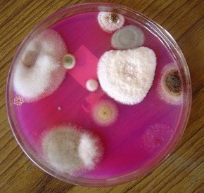
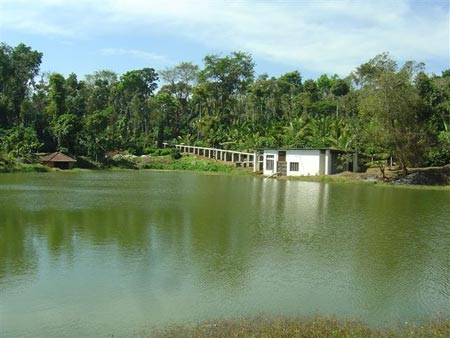

### **Phosphorus as an essential element**

The Coffee Agro Forestry Ecosystem is associated with multiple crops (Coffee, Pepper, Areca, Cardamom, Oil Palm, Citrus, Ginger) and different species of herbs, trees and shrubs. The energy needs of various biotic partners, especially Phosphorus is limiting because of a number of reasons. First and foremost phosphorus is an essential element required for plant growth and development and is involved in various transformations and metabolic activities. Unfortunately, even though coffee soils are blessed with large amounts of phosphorus, Phosphorus is by far the least mobile due to its inherent nature of interacting with various soil constituents. Phosphorus in soil is present in the mineral forms such as apatite, hydroxyapatite and oxyapatite and also in organic forms such as inositol phosphate, phosphoesters, which cannot be directly assimilated by plants.

### Tropical areas where coffee is grown should use Phosphate solubilizers for several reasons

In the tropics, the restricted availability of major nutrients like phosphorus limits plant growth and yield. Meanwhile super-phosphate fertilizer is expensive and in short supply, but phosphate solubilizers can bridge the gap.

Also, in India for example, phosphate-deficient soils can be enriched with phosphate-solubilizing microbes, which are often widespread in other areas.

Most phosphatic fertilizers applied to soils  to reduce phosphorus deficiency, is immobilized and becomes unavailable, to plants until it is acted upon by phosphate solubilizers.

Regular application of phosphatic fertilizers increases the acidity of the soil, which in turn affects the beneficial microbial population.

Isolation and multiplication of phosphate solubilizers is a low-cost technology for coffee plantations, the majority of which are owned by small-time farmers. A low-cost solution that enriches the soil gives a thrust to economic development without disturbing ecological balance.

### **Advantages**

Almost all coffee planters worldwide have understood the importance of phosphate solubilizing microbes because they are environment friendly and cause no pollution. But very few Planters are aware of an very important fact that phosphate solubilizing microbes, release growth promoters, Plant regulators, antibiotics and Bio-control of plant diseases, which are beneficial to the entire coffee ecosystem.

### **Phosphate Water Pollution**

The Coffee Agrosystem constantly interacts with microbes and other biotic partners, either directly or indirectly. Water is a major constituent which facilitates these energy transfers. Whenever excess phosphorus fertilizers is applied to the soil, it gets into water bodies, especially irrigation ponds and lakes. Too much phosphorus can cause increased growth of algae and large aquatic plants, which can result in decreased levels of dissolved oxygen– a process called eutrophication. The water gets polluted with extremely high levels of phosphates. High levels of phosphorus in turn can also lead to algae blooms that produce algal toxins which can be harmful to coffee and allied crops.

### **Conclusion**

Due to the ever increasing demand for coffee as a beverage of International Standing, the coffee producing belt is increasing coffee production significantly. (The major coffee producing regions fall into a band around the equator, an imaginary line named The Coffee Belt.) This increase in coffee production needs huge amounts of phosphatic fertilizers along with other forms of plant nutrients. The supply of P from the environment is often limiting to production. Hence Phosphatic fertilizer needs to be augmented by external sources. Unfortunately much of this fertilizer eventually ends up in rivers, lakes and ponds, where it causes eutrophication. It can also lead to unsustainable package of practices, resulting in nutritional imbalances and plant disorders. So, there is an imperative need for a sustainable phosphorus use in agriculture. Together, these issues highlight the non-sustainable nature of phosphorus use in the coffee Agro production. To achieve P sustainability, farms need to become more efficient in how they use Phosphate solubilizers either through bio fertilizer application or a mixture of rock phosphate and phosphate solubilizing microbes.

### References

Anand T Pereira and Geeta N Pereira. 2009. Shade Grown Ecofriendly Indian Coffee. Volume-1.

Bopanna, P.T. 2011.The Romance of Indian Coffee. Prism Books ltd.

Alexander M. 1977. Introduction to soil microbiology (2nd ed.). NewYork: John Wiley,p 337

Anand Titus Pereira & Gowda. T.K.S. 1991. Occurrence and distribution of hydrogen dependent chemolithotrophic nitrogen fixing bacteria in the endorhizosphere of wetland rice varieties grown under different Agro climatic Regions of Karnataka. (Eds. Dutta. S. K. and Charles Sloger. U.S.A.) In Biological Nitrogen Fixation Associated with Rice production. Oxford and I.B.H. Publishing. Co. Pvt. Ltd. India.

Booker, Karen. 2000. Fertilizers and Soil Amendments: It’s Tricky Business. Erosion Control Feature Article, September/October.

Martin Alexander. 1978. Introduction to soil microbiology. Second edition. Wiley Easter Limited. New Delhi.

Wright, S. F. 2003. The importance of soil microorganisms in aggregate stability. Proc. North Central Extension-Industry Soil Fertility Conference. 19:93-98.

[Role of Bacteria](http://ecofriendlycoffee.org/role-of-bacteria-in-coffee-plantation-ecology/)

[Role of Fungi](http://ecofriendlycoffee.org/role-of-fungi-in-coffee-plantation-ecology/)

[Endomycorrhizae](http://ecofriendlycoffee.org/endomycorrhizae/)

> [Farm Coffee Organic Manures](https://ecofriendlycoffee.org/farm-coffee-organic-manures/)

[Essential Role of Phosphorus](https://www.cropnutrition.com/efu-phosphorus)

[The Coffee Belt](https://seasia.co/2018/01/27/the-coffee-belt-a-world-map-of-the-major-coffee-producers)

[Microbiological transformations](https://www.researchgate.net/publication/275681213_Microbiological_transformations_of_phosphorus_and_sulphur_compounds_in_acid_soils)

[Eutrophication](https://en.wikipedia.org/wiki/Eutrophication)

[Phosphate solubilizing bacteria](https://en.wikipedia.org/wiki/Phosphate_solubilizing_bacteria)