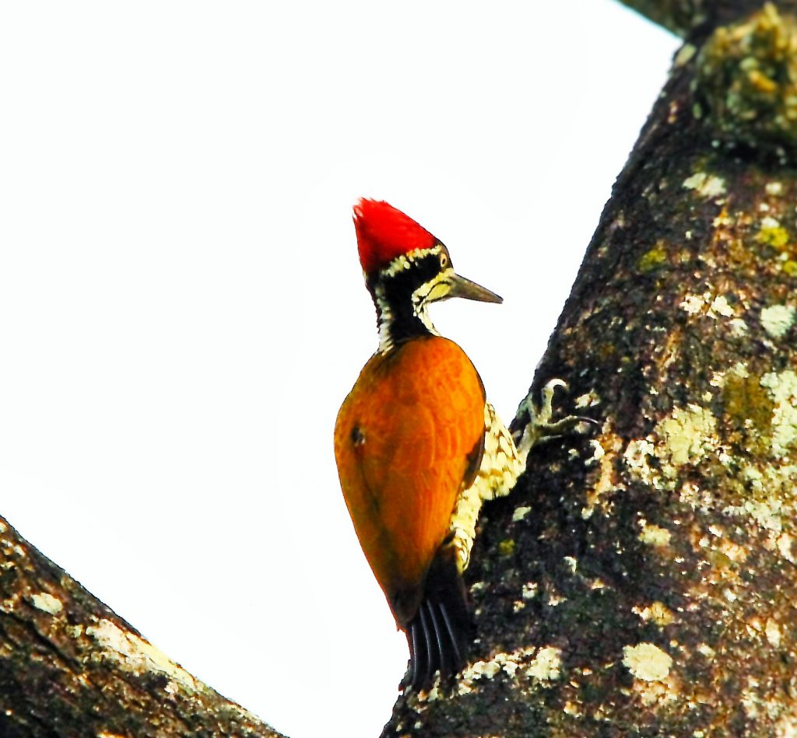
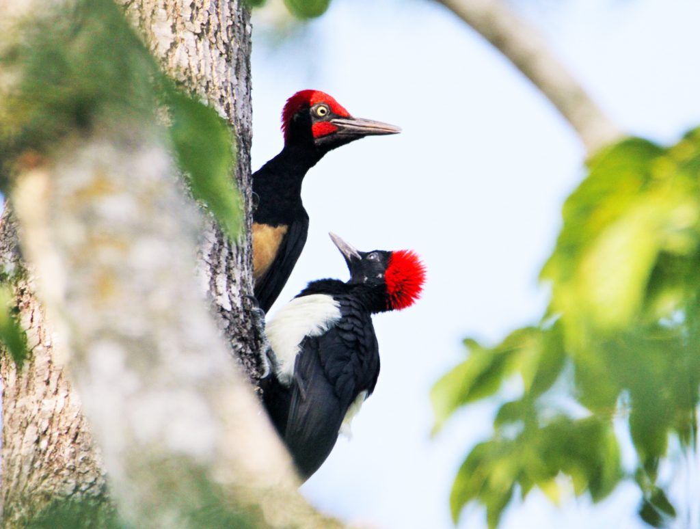

Shade-grown Eco-friendly coffee Plantations in India is a part of the Western Ghats, recognized the world over as a hotspot of biodiversity. Coffee Plantations extending thousands of hectares provide an ideal habitat for a number of wildlife species, both resident and migratory. Birds in general play different roles in any given ecosystem. Birds help maintain sustainable population levels of their prey and predator species and after death, provide food for scavengers and decomposers. Many birds are important in plant reproduction through their services as seed dispersal agents.

In this article, we would like to highlight the beneficial role of woodpeckers as keystone species inside bird-friendly coffee plantations. Birds play important functional roles in ecosystems as seed dispersers, pollinators, or predators and ecosystem engineers, thereby providing a direct link between biodiversity and ecosystem functions and services.

### **Woodpeckers observed in Western Ghats.**

Speckled Piculet *(Picumnus innominatus)*

Greater Flameback *(Chrysocolaptes guttacristatus)*

Black-rumped Flameback *(Dinopium benghalense)*

Common Flameback *(Dinopium javanense)*

Brown-capped Pygmy Woodpecker *(Yungipicus nanus)*

Rufous Woodpecker *(Micropternus brachyurus)*

Yellow-crowned Woodpecker *(Leiopicus mahrattensis)*

White-bellied Woodpecker *(Dryocopus javensis)*

Lesser Yellownape *(Picus chlorolophus)*

Streak-throated Woodpecker *(Picus xanthopygaeus)*

White-naped Woodpecker *(Chrysocolaptes festivus)*

Heart-spotted Woodpecker (Hemicircus canente)

The black-rumped flame back, also known as the lesser golden-backed woodpecker or lesser golden back, is a woodpecker found widely distributed inside coffee forests. It is one of the few woodpeckers that has a characteristic rattling-whinnying call. At first, we were under the impression that the tapping sound made by the woodpecker was a result of the impact of the hammering onto the trees. Only when we spoke to bird experts, did we know that woodpeckers do not have vocal cords. Both the males and females have the ability to peck trees, and none of them has vocal cords, so they use the pecking as a way of communication as well. In fact, Woodpeckers advertise their presence by drumming rapidly on a tree. Different species have different time intervals between knocking.

### **Significance of Keystone species.**

Keystone species are considered as one of the most vital components that shape a given ecosystem. It binds the entire community together. They have an extremely high impact on a particular ecosystem, relative to its population.

The keystone concept is defined by its ecological effects, and these in turn make it important for conservation. In this, it overlaps with several other species conservation concepts such as flagship species, indicator species and umbrella species.

A keystone species is a species that has a disproportionately large effect on its natural environment relative to its abundance. Such species play a critical role in maintaining the structure of an ecological community, affecting many other organisms in an ecosystem, and helping to determine the types and numbers of various other species in the community. Without keystone species, the ecological integrity of the ecosystem gets significantly altered. If the numbers of keystone species start declining due to inadequate conservation measures, even though that species was a small part of the ecosystem by measures of biomass or productivity, the given ecosystem, will start disintegrating. Keystone species are usually noticed when they are removed or they disappear from an ecosystem, resulting in dramatic and adverse changes to the rest of the community. In fact, it will help invasive species to take over and dramatically shift the ecosystem in a new direction. Some wildlife scientists say the concept oversimplifies one animal or plant’s role in complex food webs and habitats. The National Geographic states that calling a particular plant or animal in an ecosystem a keystone species is a way to help the public understand just how important one species can be to the survival of many others.

The prestigious Audubon Society designates woodpeckers as keystone species, for their crucial role in creating habitat suited to other woodland wildlife.

### **Woodpeckers as a keystone species.**

The Coffee ecosystem is gifted with a number of woodpecker species. All species are tree dwellers and live in the hollow cavities of both living and dead trees. Woodpeckers have specialized beaks that serve three main purposes. First, they use it to drill holes in dead or dying trees to make a home and once they migrate, the same is made use of by other species of birds to nest their young ones. More than 60 % percent of all available nesting cavities are created by the handiwork of one or the other species of woodpeckers. The greater the number of these birds, the more cavities in a forest. The more cavities, the more secondary cavity nesters the forest can support. Diversity begets diversity.

Second, their probing bill can detect and consume beetles, borer, and other insects, larvae, and eggs. They help maintain the predator-prey balance. Lastly, they use a particular hammering pattern depending on the tree species to communicate and mark territories. These added benefits significantly add to the role of woodpeckers as a critical keystone species within a forest ecosystem. Their presence and sustainability are therefore essential to successfully maintain adequate forest biodiversity. Grant Brydle (2008) in his research paper titled “Woodpeckers as keystone species”, describes in-depth Woodpecker activities, especially of the larger pileated woodpecker, benefit other species through the provision of foraging opportunities, accelerated forest decay processes, increased nutrient recycling, control of insect populations, and facilitated inoculation by heart–rot fungi (Phellinus tremulae), an ecologically important disturbance agent. His research findings throw light on many important aspects of woodpecker behavior. Woodpecker creates wounds into the heartwood of healthy trees which in turn provide an invasion pathway for the airborne heart–rot fungi spores if the wound is not flushed out and quickly sealed with tree sap. Heartwood decay produces hollow chambers in live trees and the resulting softened wood is essential for nest–cavity excavation by most woodpeckers, chickadees, and nuthatches. Woodpeckers are often classified as keystone habitat modifiers, ecosystem architects, or tree surgeons because of their creation of cavity sites in hard snags and decadent live trees. He further states that Woodpeckers also fill a key role in controlling insect populations through direct consumption as they are well adapted to access insect prey that other avian predators cannot reach. Indirect effects include altering insect microhabitats, increasing parasite densities, and exposing remaining prey to consumption by both vertebrate and invertebrate predators. Woodpeckers are important biological control agents of bark beetles and wood-boring beetles. As most woodpeckers are non–migratory, they are the primary avian insectivores during the winter months.

### **Woodpeckers as seed dispersal agents.**

Most Coffee Planters are unaware that woodpeckers also eat a variety of fruits. Many species of trees depend on their seeds passing through the digestive tracts of woodpeckers, for better germination and survival. More research needs to be carried out to identify the various species of trees that are obligate symbionts with the woodpecker.

### **Future Research.**

In many advanced countries, it is a common practice to use indicator organisms to monitor the health of the ecosystem. The use of birds to monitor environmental conditions continues because birds are highly sensitive to changes in the environment. Since the coffee forests has a number of woodpecker species, research needs to be carried out regarding their role as keystone species inside the coffee ecosystem.

### **Why woodpeckers can be considered as suitable candidates as environmental indicators.**

Since various species of woodpeckers are observed in abundance, in all coffee growing States of India, throughout the year, they can be considered as indicators of overall habitat quality. However, more research needs to be carried out in terms of how various species respond to environmental changes. Environmental sensitivity is a prerequisite in order to serve as an early warning. Another important indicator is, whether the species can respond to changes in a predictable manner.

### **Conclusion.**

The bond between coffee farmers and birds is more complex than anticipated. Coffee farmers have a scared belief that if bird and animal life vanishes, then the pest population will reach its zenith resulting in significant losses of coffee and allied crops. Understanding the key role played by various species of woodpeckers will immensely benefit not only coffee but multiple crops associated with coffee. More importantly, it will help the coffee Planters to be guardians of wildlife.

### **References.**

Anand T Pereira and Geeta N Pereira. 2009. Shade Grown Ecofriendly Indian Coffee. Volume-1.

Bopanna, P.T. 2011.The Romance of Indian Coffee. Prism Books ltd.

[Why do Woodpeckers Peck?](https://ornithology.com/why-do-woodpeckers-peck/)

[Ecological roles of birds](https://www.endangeredspeciesinternational.org/birds4.html)

[Amazing facts about woodpeckers](https://www.outdoorrevival.com/facts/amazing-facts-about-woodpeckers.html)

[Woodpeckers as a keystone species](https://www.naturecalgary.com/wp-content/uploads/2012/06/Woodpeckers-as-keystone-species1.pdf)

[Birds as Environmental Indicators](https://www.environmentalscience.org/birds-environmental-indicators)

[AMERICAN FORESTS](https://www.americanforests.org/magazine/article/woodpeckers-engineers-ecosystems/)

[Keystone species](https://en.wikipedia.org/wiki/Keystone_species)

[Woodpeckers as Keystone Species](https://www.audubon.org/news/woodpeckers-keystone-species)

[Can shade-grown coffee really save endangered migratory birds?](https://thecounter.org/migratory-bird-friendly-shade-grown-coffee-tree-species-study/)